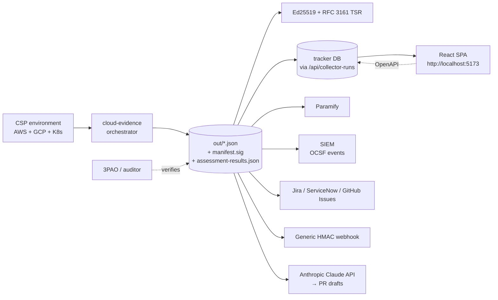

# FedRAMP 20x Tooling Architecture

This document describes the two projects in this repo and how they fit together.

## Repo layout

```
FedRAMP 20x/
├── cloud-evidence/      Read-only AWS+GCP+K8s evidence collector. Outputs signed JSON + OSCAL.
├── tracker/             Local multi-user web tracker over the FRMR JSON catalog.
├── CHANGELOG.md         Version history.
├── ARCHITECTURE.md      This file.
└── GAP-ANALYSIS.md      Strategic gap analysis vs Prowler/ScoutSuite/Wiz/Drata/Vanta/Paramify.
```

## High-level data flow



## cloud-evidence module map

```mermaid
graph TB
  Orchestrator[core/orchestrator.ts] --> KsiMap[core/ksi-map.ts]
  KsiMap --> AWS[providers/aws/*.ts]
  KsiMap --> GCP[providers/gcp/*.ts]
  KsiMap --> K8s[providers/k8s/security.ts]
  KsiMap --> Plugins[plugins/* via plugin-loader.ts]

  AWS --> AwsAuth[core/auth/aws.ts]
  AWS --> Guardrail[core/readonly-guardrail.ts]
  Guardrail --> Retry[core/retry.ts]
  Guardrail --> Log[core/log.ts]

  GCP --> GcpAuth[core/auth/gcp.ts]
  GcpAuth --> GcpGuard[core/readonly-guardrail-gcp.ts]

  K8s --> K8sAuth[core/auth/k8s.ts]

  Orchestrator --> Schema[core/schema.ts]
  Orchestrator --> Sign[core/sign.ts]
  Orchestrator --> Ts[core/timestamp.ts]
  Orchestrator --> Oscal[core/oscal.ts]
  Orchestrator --> Crosswalk[core/crosswalk.ts]
  Orchestrator --> Powerpipe[core/powerpipe-emitter.ts]
  Orchestrator --> Sbom[core/sbom.ts]
  Orchestrator --> Anomaly[core/anomaly.ts]
  Orchestrator --> Coverage[core/coverage-check.ts]
  Orchestrator --> Diff[core/diff-report.ts]
  Orchestrator --> Csv[core/csv-export.ts]
  Orchestrator --> Html[core/html-report.ts]
  Orchestrator --> Fanout[core/aws-org-fanout.ts]

  Orchestrator -.push.-> Paramify[core/paramify-push.ts]
  Orchestrator -.push.-> TrackerPush[core/tracker-push.ts]
  Orchestrator -.push.-> Notify[core/notify.ts<br/>Slack + PagerDuty]
  Orchestrator -.push.-> TicketP[core/ticket-push.ts]
  Orchestrator -.push.-> Siem[core/siem-push.ts]
  Orchestrator -.push.-> Webhook[core/webhook-push.ts]
  Orchestrator -.optional.-> Llm[core/llm-pr-generator.ts]
```



## Read-only invariant

Every cloud API call from cloud-evidence is enforced read-only by TWO independent mechanisms:

1. **IAM**: the runner's principal MUST be bound to viewer-only roles (AWS `ReadOnlyAccess`, GCP `roles/viewer`, K8s `view`). The runbook documents the exact role list. See `RUNBOOK.md`.

2. **Code Proxy**: every SDK client is wrapped at construction by `core/readonly-guardrail.ts` (AWS) or `core/readonly-guardrail-gcp.ts` (GCP). Any `Command` whose verb prefix isn't on the read-only allowlist throws `ReadOnlyViolationError` BEFORE the call leaves the process.

Both layers must be intact for the script to run; a misconfigured IAM role doesn't bypass the code Proxy, and a missing Proxy wrap doesn't bypass the IAM role.

## Tracker module map

```mermaid
graph TB
  Server[server/index.ts] --> Routes
  Routes --> Auth[routes/auth.ts<br/>signup, login, logout, me]
  Routes --> Items[routes/items.ts]
  Routes --> Dash[routes/dashboard.ts]
  Routes --> Export[routes/export.ts]
  Routes --> Tokens[routes/tokens.ts]
  Routes --> Runs[routes/collector_runs.ts]
  Routes --> TwoFa[routes/2fa.ts]
  Routes --> Audit[routes/audit.ts]

  Server --> Csrf[server/csrf.ts]
  Server --> RL[server/rate-limit.ts]

  Auth --> AuthMod[server/auth.ts<br/>scrypt + sessions + tokens]
  TwoFa --> Totp[server/totp.ts<br/>RFC 6238]
  Audit --> Rbac[server/rbac.ts<br/>5 roles + domain assignments]

  Server --> Db[server/db.ts<br/>better-sqlite3 WAL]
  Db --> Migrate[migrate(): ensureColumn, relaxRoleCheck]
  Db --> Schema[schema.sql]

  Server --> OpenApi[server/openapi.yaml<br/>served at /api/openapi.yaml]

  Server --> Spa[client/dist/ SPA<br/>React + TanStack Query]
```

## Evidence pipeline

A single `npm run collect -- --html-report --oscal --crosswalk --sign --anomaly` invocation produces:

1. `out/KSI-*.json` — per-KSI v3-schema evidence (one file per KSI)
2. `out/pva-run-summary.json` — run rollup (impact level + framework + benchmark headline)
2a. `out/family-rollup.json` — per-control-family posture
2b. `out/control-benchmark.json` — NIST 800-53 control benchmark (20x or Rev5, at the chosen level)
2c. `out/run-ledger.jsonl` — append-only audit trail of every action + timing
3. `out/manifest.json` + `out/manifest.sig` — Ed25519-signed file inventory
4. `out/manifest.tsr` (optional) — RFC 3161 timestamp token
5. `out/assessment-results.json` — OSCAL 1.1 Assessment Results
6. `out/crosswalk-report.json` — NIST → SOC2 / ISO27001 / HIPAA mapping
7. `out/coverage-report.json` — silent-failure detection
8. `out/diff-report.{json,html}` — vs previous run
9. `out/report.html` — self-contained HTML
10. `out/findings.csv` — flat findings list
11. `out/anomaly-report.json` — vs rolling 7-run baseline
12. `out/anomaly-history.jsonl` — appended for next run
13. `out/sbom-report.json` (with `--sbom-dir`) — SBOM inventory + CVE correlation
14. `out/powerpipe/` (with `--powerpipe`) — Powerpipe HCL mod

## Integration points

| External system | Mechanism | Module |
|---|---|---|
| Paramify | REST API (OSCAL ingest) | `core/paramify-push.ts` |
| Tracker | Bearer-token POST /api/collector-runs | `core/tracker-push.ts` |
| Slack | Incoming webhook | `core/notify.ts` |
| PagerDuty | Events API v2 | `core/notify.ts` |
| Jira | Atlassian REST API v3 | `core/ticket-push.ts` (jiraDriver) |
| ServiceNow | Now REST API (table endpoints) | `core/ticket-push.ts` (serviceNowDriver) |
| GitHub Issues | GitHub REST API v3 | `core/ticket-push.ts` (gitHubIssuesDriver) |
| SIEM | OCSF events via HTTP intake | `core/siem-push.ts` |
| Anthropic Claude | Messages API | `core/llm-pr-generator.ts` |
| Generic webhook | HMAC-SHA256-signed POST | `core/webhook-push.ts` |
| Google Sheets (subprocessors) | googleapis | `core/subprocessors-sheet.ts` |
| GitHub Actions (collect) | OIDC + scheduled cron | `.github/workflows/cloud-evidence.yml` |
| GitHub Actions (CI) | typecheck + tests on push/PR | `.github/workflows/ci.yml` |

## Test surface

| Project | Test files | Tests | Coverage area |
|---|---|---|---|
| cloud-evidence | 38 | 396 | Schema, retry, log, sign, timestamp, oscal, crosswalk, fanout, gcp-guardrail, powerpipe, sbom, anomaly, llm-pr-generator, ticket-push, siem-push, webhook-push, plugin-loader, coverage-check, iam-mfa, k8s-security, level-coverage, control-benchmark, family-rollup, hardening, nist-r5, requirement-playbooks, scg-mas-ads, vdr, ucm-crypto, ksi-hybrids, orchestrator-phase-f |
| tracker | 11 | 99 | rate-limit, csrf, totp, rbac, backup, audit search, attachments, ingest, … |

Run all tests: `(cd cloud-evidence && npm test) && (cd tracker && npm test)`.
CI runs the same on every push/PR via `.github/workflows/ci.yml` (Node 22 + 24 matrix).
