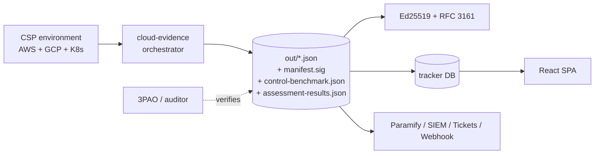

# FedRAMP 20x Compliance Tooling

> Read-only, evidence-grade automation for **FedRAMP 20x** (and Rev5) — collect
> cloud configuration evidence against all **63 Key Security Indicators** and
> **223 requirements**, benchmark your infrastructure against **NIST SP 800-53**
> at Low / Moderate / High, and track implementation across your team.

[](https://github.com/kenithphilip/FedPy/actions/workflows/ci.yml)
[](LICENSE)


This repository contains **two complementary projects** that together cover the
full FedRAMP 20x lifecycle — automated technical evidence on one side, and
human-tracked governance state on the other.

| Project | What it does | Stack |
|---|---|---|
| [`cloud-evidence/`](cloud-evidence/) | A **read-only** collector that captures AWS + GCP + Kubernetes configuration evidence for every FedRAMP 20x KSI, scores it, signs it, maps it to NIST 800-53, and pushes it to your GRC stack. | TypeScript · Node (tsx) or Bun · AWS SDK v3 · googleapis · @kubernetes/client-node |
| [`tracker/`](tracker/) | A local, multi-user web dashboard over the FedRAMP machine-readable (FRMR) catalog for tracking implementation status, ownership, evidence links, and the NIST crosswalk. | TypeScript · Hono · better-sqlite3 · React + Vite |

---

## Table of contents

- [Why this exists](#why-this-exists)
- [What you get](#what-you-get)
- [Repository layout](#repository-layout)
- [Architecture at a glance](#architecture-at-a-glance)
- [Quick start](#quick-start)
- [The cloud-evidence collector](#the-cloud-evidence-collector)
  - [Read-only safety model](#read-only-safety-model)
  - [Impact levels & frameworks](#impact-levels--frameworks)
  - [NIST 800-53 control benchmark](#nist-800-53-control-benchmark)
  - [Output artifacts](#output-artifacts)
  - [Integrations](#integrations)
  - [Production hardening](#production-hardening)
- [The tracker](#the-tracker)
- [Testing](#testing)
- [Documentation index](#documentation-index)
- [Data sources & attribution](#data-sources--attribution)
- [Security](#security)
- [License](#license)

---

## Why this exists

FedRAMP 20x reframes authorization around **machine-readable, continuously
verified evidence** instead of static SSP narratives. The authoritative source
of truth is the [FedRAMP machine-readable (FRMR)](https://github.com/FedRAMP/docs)
data, which defines **Key Security Indicators (KSIs)** and **FedRAMP Requirements
(FRRs)**.

This tooling turns that source of truth into two practical workflows:

1. **Prove it automatically.** `cloud-evidence` logs into your cloud accounts
   *read-only*, evaluates the cloud-testable indicators directly against live
   configuration, and emits signed, schema-valid, OSCAL-mapped evidence — so the
   evidence is reproducible and auditor-verifiable, not hand-assembled.
2. **Track the rest.** Not every requirement is cloud-API-testable (a large share
   are governance/process obligations). The `tracker` gives your team a shared
   surface to record status, owners, evidence links, and last-reviewed dates for
   the full 223-requirement set, with a NIST 800-53 crosswalk for mapping against
   an existing Rev5 baseline.

Everything is **local-first and self-hosted** — your evidence and your tracker
state never leave infrastructure you control unless you explicitly push them.

## What you get

- ✅ **Complete KSI coverage** — all **63 KSIs** and **223 requirements** are
  accounted for: cloud collectors where testable, process-artifact evidence for
  governance requirements, and explicit *awareness-only* tracking for items that
  obligate FedRAMP / an agency / a 3PAO.
- 🔒 **Provably read-only** — every cloud SDK call is enforced read-only by *two*
  independent layers (viewer-only IAM **and** a runtime guardrail Proxy).
- 🎚️ **Low / Moderate / High** — choose your impact tier; the collector scopes
  every requirement to that tier (High applicability is derived from NIST 800-53
  Rev5 and clearly labeled).
- 📊 **NIST 800-53 benchmark** — roll findings up to 800-53 controls and score
  each control, for both the 20x-referenced control set and the full SP 800-53B
  baseline.
- 🖊️ **Tamper-evident** — Ed25519-signed manifests + optional RFC 3161 trusted
  timestamps; an offline `verify` CLI re-checks every hash and signature.
- 🔁 **OSCAL + crosswalks** — OSCAL 1.1 Assessment Results, plus NIST →
  SOC 2 / ISO 27001 / HIPAA crosswalk.
- 🔌 **Push anywhere** — Paramify, the bundled tracker, Slack/PagerDuty,
  Jira/ServiceNow/GitHub Issues, SIEM (OCSF), generic HMAC webhook, and optional
  LLM-drafted remediation PRs.
- 🧰 **Operationally hardened** — retry/backoff, adaptive concurrency under
  throttle, append-only run ledger, and a run lock to prevent overlapping runs.

## Repository layout

```
FedRAMP 20x/
├── cloud-evidence/            Read-only AWS+GCP+K8s evidence collector
│   ├── core/                  Orchestrator, schema, signing, OSCAL, benchmark, hardening
│   ├── providers/             Per-cloud collectors (aws/, gcp/, k8s/)
│   ├── scripts/               Reproducible data extractors (FRMR, NIST r5, baselines)
│   ├── docs/                  Committed generated lookups + IAM permission catalog
│   └── tests/                 Vitest suites (38 files, 396 tests)
├── tracker/                   Local multi-user web tracker over the FRMR catalog
│   ├── server/                Hono API + better-sqlite3 + RBAC/2FA/audit
│   ├── client/                React + Vite SPA
│   └── tests/                 Vitest suites (11 files, 99 tests)
├── ARCHITECTURE.md            How the two projects fit together (with diagrams)
├── RUNBOOK.md                 Operations: setup, IAM, env vars, troubleshooting
├── COST.md                    Cost model for the collector + integrations
├── GAP-ANALYSIS.md            Positioning vs Prowler/ScoutSuite/Wiz/Drata/Vanta/Paramify
├── CHANGELOG.md               Version history
├── LICENSE                    Apache-2.0
└── NOTICE                     Third-party data attribution

# External reference clones (git-ignored, not part of this repo's code):
├── docs/                      Clone of github.com/FedRAMP/docs (FRMR source of truth)
└── nist-r5-data/              NIST 800-53 Rev5 reference data
```

## Architecture at a glance



See [ARCHITECTURE.md](ARCHITECTURE.md) for the full module maps and data flow.

## Quick start

**Prerequisites:** Node 22+ (tested on 22 and 24); optionally
[Bun](https://bun.sh) 1.3+ or [Deno](https://deno.com) 2.8+ for the collector. AWS credentials via
`aws sso login` / `AWS_PROFILE`, and GCP via
`gcloud auth application-default login`.

```bash
git clone git@github.com:kenithphilip/FedPy.git "FedRAMP 20x"
cd "FedRAMP 20x"
```

### Collect evidence

```bash
cd cloud-evidence
npm install

# Plan only — no SDK calls are made
npm run collect -- --dry-run

# Real collection at Moderate, benchmarked against the 20x-referenced controls
npm run collect -- --impact-level moderate --framework 20x

# Full High-tier run benchmarked against the entire NIST SP 800-53B High baseline,
# with all post-run reports, OSCAL, crosswalk, and signing
npm run collect -- --impact-level high --framework rev5 --all-reports --oscal --crosswalk

# Verify a finished run offline (re-hashes every file, checks the signature)
npm run verify -- ./out
```

> Output goes to `./out/` (git-ignored). See [Output artifacts](#output-artifacts).

### Run the tracker

```bash
# from the repo root, get the FRMR source of truth (if you don't have it)
git clone https://github.com/FedRAMP/docs.git

cd tracker
npm install
npm run ingest        # load FRMR.documentation.json into data/tracker.db
npm run dev           # API on :4000, web UI on :5173
# open http://localhost:5173 — the first account you create becomes admin
```

---

## The cloud-evidence collector

A read-only TypeScript collector for the FedRAMP 20x KSIs across **AWS, GCP, and
Kubernetes**. It runs on Node (via `tsx`), Bun, or Deno — Bun is recommended for
production collection (native TS, faster startup/I/O, better concurrency under
throttle); Node + `tsx` is the default and what the test suite runs on. Deno is
also supported via the `collect:deno` / `verify:deno` scripts (it needs explicit
`--allow-*` permission flags; see [RUNBOOK.md](RUNBOOK.md)).

### Read-only safety model

The collector **must never mutate cloud state**, enforced by two independent
mechanisms (either one alone would stop a write; both are required to run):

1. **Viewer-only IAM.** The runner principal is bound to read-only managed
   policies only (AWS `ReadOnlyAccess`, GCP viewer/securityReviewer roles, K8s
   `view`). The exact least-privilege role list is in
   [RUNBOOK.md](RUNBOOK.md) and
   [cloud-evidence/docs/IAM-PERMISSIONS-CATALOG.md](cloud-evidence/docs/IAM-PERMISSIONS-CATALOG.md).
2. **Runtime guardrail Proxy.** Every SDK client is wrapped at construction by
   `core/readonly-guardrail.ts` (AWS) or `core/readonly-guardrail-gcp.ts` (GCP).
   Any command whose verb prefix isn't on the read-only allowlist throws
   `ReadOnlyViolationError` **before the call leaves the process** — so even a
   mis-scoped IAM role or a buggy new collector cannot perform a write.

### Impact levels & frameworks

Pick the tier at setup (`config.yaml` `impact_level:`) or per-run
(`--impact-level low|moderate|high`). The collector then scopes all 223
requirements to that tier:

- **Cloud-testable KSIs** run their collectors against live config.
- **Governance requirements** emit signed *process-artifact* evidence, tracked
  via an attestation register with SLA/deadline monitoring.
- **FedRAMP/agency/3PAO obligations** are recorded as **awareness-only** and
  excluded from your provider pass/fail.

High applicability is **derived from the NIST 800-53 Rev5 baseline** (there is no
separately published 20x High) and always labeled `derived-rev5`.

### NIST 800-53 control benchmark

Every run rolls findings **up to NIST 800-53 controls** and scores each control
at the chosen impact level, so you can benchmark your cloud infrastructure
against the baseline. Two framings via `--framework`:

| `--framework` | In-scope control set | Answers |
|---|---|---|
| `20x` (default) | The controls the evaluated 20x KSIs/FRRs reference | "How covered are the controls 20x cares about, at this level?" |
| `rev5` | The full NIST SP 800-53B baseline for the level (Low **149** / Moderate **287** / High **370**) | "Which baseline controls have automated cloud evidence vs. still need manual assessment?" |

Each control gets a status — `satisfied` (all mapping findings passed),
`partially-satisfied` (mixed), `not-satisfied` (all failed), or `not-assessed`
(no automated evidence). The report (`control-benchmark.json`) gives two rates:
`assessed_pass_rate` (satisfied ÷ controls with evidence) and
`baseline_coverage_rate` (satisfied ÷ whole in-scope set). Awareness-only
attestations are listed under a control but never satisfy it on their own.

Baseline membership ships committed
(`cloud-evidence/docs/nist-r5-baselines.generated.json`, sourced from NIST's
official OSCAL resolved-profile catalogs) so there is **no network at runtime**;
refresh it with `node scripts/extract-nist-baselines.mjs`.

### Output artifacts

A single run writes to `./out/`:

| File | Contents |
|---|---|
| `KSI-*.json` | Per-KSI evidence envelopes (v3 schema, one per requirement) |
| `pva-run-summary.json` | Run roll-up + impact level + framework + benchmark headline |
| `family-rollup.json` | Per-control-family posture |
| `control-benchmark.json` | NIST 800-53 control benchmark (this run's framing/level) |
| `inventory-workbook.{csv,xlsx}` *(`--inventory-workbook`)* | FedRAMP Appendix M Integrated Inventory Workbook (AWS + GCP assets) |
| `manifest.json` + `manifest.sig` | Ed25519-signed inventory of every output file |
| `manifest.tsr` *(optional)* | RFC 3161 trusted timestamp token |
| `assessment-results.json` *(`--oscal`)* | OSCAL 1.1 Assessment Results |
| `crosswalk-report.json` *(`--crosswalk`)* | NIST → SOC 2 / ISO 27001 / HIPAA |
| `coverage-report.json` | Silent-failure / gap detection |
| `report.html`, `findings.csv` *(`--all-reports`)* | Human + spreadsheet views |
| `diff-report.{json,html}` | Change vs. the previous run |
| `anomaly-report.json` *(`--anomaly`)* | Drift vs. the rolling baseline |
| `run-ledger.jsonl` | Append-only audit trail of every action + timing |

### Integrations

All opt-in (require their own env vars; see [RUNBOOK.md](RUNBOOK.md)):

Paramify · the bundled tracker (`--push-tracker`) · Slack / PagerDuty
(`--notify-on-drift`) · Jira / ServiceNow / GitHub Issues (`--ticket-push`) ·
SIEM via OCSF (`--siem-url`) · generic HMAC-signed webhook (`--webhook-url`) ·
Anthropic Claude remediation PR drafts (`--llm-generate-prs`) · Powerpipe mod
(`--powerpipe`) · SBOM ingest (`--sbom-dir`).

### Production hardening

- **Retry/backoff** on every SDK call (configurable attempts/backoff caps).
- **Adaptive concurrency** — a token bucket + AIMD limiter that backs off under
  throttling and recovers, plus in-run TTL memoization.
- **Append-only run ledger** — crash-durable JSONL of every action and outcome.
- **Run lock** — prevents two runs clobbering the same output dir (TTL +
  PID-liveness; auto-released on exit).

## The tracker

A local, multi-user web dashboard that ingests the FRMR catalog and lets your
team track implementation status against every 20x requirement and KSI. It sits
*next to* a clone of the upstream FedRAMP docs and re-ingests on demand,
preserving your status, owner, notes, and evidence (state is keyed by stable
FRMR IDs).

Highlights: dashboard with "next 10 to tackle", gap analysis, requirement & KSI
browsers, full item detail with FRD-term tooltips, a **NIST 800-53 crosswalk**, a
collector-runs view (impact level + benchmark headline), CSV/JSON export, and
multi-user accounts with sessions, **TOTP 2FA**, **role-based access control**,
per-item **audit log**, and online backup/restore.

See [tracker/README.md](tracker/README.md) for the full feature list and API.

## Testing

```bash
# cloud-evidence — 38 files, 396 tests
cd cloud-evidence && npm test && npm run typecheck

# tracker — 11 files, 99 tests
cd tracker && npm test && npm run typecheck
```

Both projects typecheck clean and the full suite (**495 tests**) passes. CI-style
one-liner from the repo root:

```bash
(cd cloud-evidence && npm test) && (cd tracker && npm test)
```

## Documentation index

| Doc | What's in it |
|---|---|
| [ARCHITECTURE.md](ARCHITECTURE.md) | Module maps, data flow, integration points, the read-only invariant |
| [RUNBOOK.md](RUNBOOK.md) | Setup, required IAM, all environment variables, exit codes, troubleshooting |
| [COST.md](COST.md) | Cost model for the collector and optional integrations |
| [GAP-ANALYSIS.md](GAP-ANALYSIS.md) | How this compares to Prowler / ScoutSuite / Wiz / Drata / Vanta / Paramify |
| [CHANGELOG.md](CHANGELOG.md) | Version history |
| [cloud-evidence/README.md](cloud-evidence/README.md) | Collector deep-dive |
| [cloud-evidence/docs/IAM-PERMISSIONS-CATALOG.md](cloud-evidence/docs/IAM-PERMISSIONS-CATALOG.md) | Exact per-collector cloud permissions |
| [tracker/README.md](tracker/README.md) | Tracker features, API, configuration |

## Data sources & attribution

This repo **derives** committed lookup files from public sources (regenerated by
the scripts in `cloud-evidence/scripts/`, not re-licensed):

- **FedRAMP FRMR** — [github.com/FedRAMP/docs](https://github.com/FedRAMP/docs)
  (U.S. Government source of truth for 20x/Rev5 requirements & KSIs).
- **NIST SP 800-53 Rev5 control catalog** — control names/families via
  [GovReady/nist-sp-800-53-r5-data](https://github.com/GovReady/nist-sp-800-53-r5-data).
- **NIST SP 800-53B Rev5 baselines** — Low/Moderate/High membership from
  [usnistgov/oscal-content](https://github.com/usnistgov/oscal-content).

See [NOTICE](NOTICE) for full attribution. These sources remain governed by their
own terms.

## Security

- The collector is **read-only by construction** (see
  [the safety model](#read-only-safety-model)); a `ReadOnlyViolationError` is a
  bug in a collector, never something to work around.
- Evidence is **tamper-evident** (Ed25519 manifest + optional RFC 3161 timestamp)
  and independently verifiable offline via `npm run verify -- ./out`.
- The tracker stores passwords with `scrypt`, uses HttpOnly/SameSite session
  cookies, supports TOTP 2FA and RBAC, and records every mutation in an audit log.

If you discover a security issue, please open a private report rather than a
public issue.

## License

Licensed under the [Apache License 2.0](LICENSE). © 2026 Kenith Philip.
