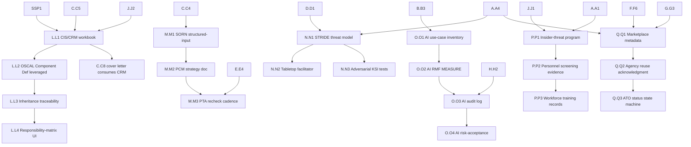

# Dependency Graph — every slice across LOOP-A through LOOP-K

> Single source of truth for slice ordering. Derived from the `depends_on`
> and `blocks` frontmatter in every per-slice doc under `docs/slices/X/X.XN.md`.
> Read this when planning what to work on next, what can be parallelised,
> and what cannot start yet.
>
> **Scope:** 49 enumerated slices (LOOP-A complete; LOOP-B through LOOP-K
> pending). Loops L–Q proposed in `ADDITIONAL-LOOPS-AUDIT.md` are
> graphed separately at the bottom (advisory, not yet adopted).

---

## 1. Mermaid graph — full dependency map

```mermaid
graph TD
  %% =========================================================
  %% Pre-flight (DONE)
  %% =========================================================
  REO0[REO-0 REO standard + CI guardrails]
  R1[R1 AFR family classification]
  R2[R2 Monthly POA&M delta research]
  R3[R3 Phase Two pilot output format]
  R4[R4 Sample selection methodology]

  %% Inventory chain (DONE)
  INVCHAIN[INV-P1..S6 Inventory chain]
  SSP1[SSP-1 OSCAL SSP emitter]
  SCN1[SCN-1 SCN classifier]
  SUBSHEET[subprocessors-sheet]
  IAMAAM[IAM-AAM AWS/GCP/AZ]
  IAMELP[IAM-ELP AWS/GCP/AZ]
  INRRIR[INR-RIR collector]
  RPLCHAIN[RPL-ABO/TRC/RRO/ARP collectors]
  VDRSCAN[VDR-* scanner collectors]
  E2SBOM[E.2 SBOM depth]
  REFARCH[providers/*/reference-arch.ts]
  KSIMAP[ksi-map.ts]
  DOCXPRIM[Pre-slice docx-primitives]

  %% =========================================================
  %% LOOP-A (DONE)
  %% =========================================================
  REO0 --> A.A1[A.A1 OSCAL POA&M emitter]
  A.A1 --> A.A2[A.A2 OSCAL Assessment Plan]
  A.A2 --> A.A3[A.A3 AR import-AP chain]
  A.A3 --> A.A4[A.A4 Submission package bundler]
  A.A4 --> A.A5[A.A5 Rules of Engagement template]

  %% =========================================================
  %% LOOP-B Risk + Remediation Engine
  %% =========================================================
  A.A1 --> B.B1[B.B1 CVSS+EPSS scoring]
  INVCHAIN --> B.B1
  B.B1 --> B.B2[B.B2 Remediation deadline math]
  A.A1 --> B.B2
  B.B1 --> B.B3[B.B3 Risk acceptance workflow]
  B.B2 --> B.B3
  A.A1 --> B.B3
  A.A3 --> B.B3
  B.B3 --> B.B4[B.B4 Compensating-controls registry]
  A.A1 --> B.B4
  B.B1 --> B.B5[B.B5 Central Risk Register RA-3]
  B.B2 --> B.B5
  B.B3 --> B.B5
  B.B4 --> B.B5
  A.A1 --> B.B5
  A.A4 --> B.B5

  %% =========================================================
  %% LOOP-C Document Template Pack
  %% =========================================================
  DOCXPRIM --> C.C1[C.C1 CMP CM-9]
  A.A4 --> C.C1
  INVCHAIN --> C.C1
  SSP1 --> C.C1
  DOCXPRIM --> C.C2[C.C2 ISCP + AAR CP-2]
  RPLCHAIN --> C.C2
  INVCHAIN --> C.C2
  SSP1 --> C.C2
  DOCXPRIM --> C.C3[C.C3 IRP + AAR IR-8]
  INRRIR --> C.C3
  INVCHAIN --> C.C3
  SSP1 --> C.C3
  DOCXPRIM --> C.C4[C.C4 PTA + PIA]
  INVCHAIN --> C.C4
  SSP1 --> C.C4
  DOCXPRIM --> C.C5[C.C5 FIPS 199]
  SSP1 --> C.C5
  DOCXPRIM --> C.C6[C.C6 ConMon Strategy CA-7]
  A.A1 --> C.C6
  INVCHAIN --> C.C6
  VDRSCAN --> C.C6
  KSIMAP --> C.C6
  DOCXPRIM --> C.C7[C.C7 RMS PM-9]
  A.A1 --> C.C7
  B.B3 --> C.C7
  B.B4 --> C.C7
  B.B5 --> C.C7
  J.J1 --> C.C7
  J.J2 --> C.C7
  J.J3 --> C.C7
  I.I4 --> C.C7
  DOCXPRIM --> C.C8[C.C8 Cover letter]
  A.A4 --> C.C8
  A.A2 --> C.C8
  C.C5 --> C.C8
  DOCXPRIM --> C.C9[C.C9 Baseline Config CM-2]
  INVCHAIN --> C.C9
  REFARCH --> C.C9
  D.D1 --> C.C9
  D.D2 --> C.C9
  D.D3 --> C.C9
  I.I4 --> C.C1
  I.I4 --> C.C2
  I.I4 --> C.C3
  I.I4 --> C.C5
  I.I4 --> C.C6
  I.I4 --> C.C8
  I.I4 --> C.C9

  %% =========================================================
  %% LOOP-D Diagrams
  %% =========================================================
  INVCHAIN --> D.D1[D.D1 Boundary diagram]
  A.A4 --> D.D1
  REO0 --> D.D1
  D.D1 --> D.D2[D.D2 Network diagram]
  INVCHAIN --> D.D2
  A.A4 --> D.D2
  D.D2 --> D.D3[D.D3 Data flow diagram]
  D.D1 --> D.D3
  INVCHAIN --> D.D3
  A.A4 --> D.D3

  %% =========================================================
  %% LOOP-E ConMon agent
  %% =========================================================
  A.A1 --> E.E1[E.E1 Monthly ConMon report]
  A.A4 --> E.E1
  B.B1 --> E.E1
  B.B2 --> E.E1
  B.B5 --> E.E1
  E.E5 --> E.E1
  E.E6 --> E.E1
  G.G6 --> E.E1
  I.I3 --> E.E1
  K.K1 --> E.E1
  E.E1 --> E.E2[E.E2 Monthly POA&M delta]
  A.A1 --> E.E2
  B.B2 --> E.E2
  E.E1 --> E.E3[E.E3 Annual assessment package]
  E.E2 --> E.E3
  E.E4 --> E.E3
  E.E5 --> E.E3
  E.E6 --> E.E3
  E.E7 --> E.E3
  A.A2 --> E.E3
  A.A3 --> E.E3
  A.A4 --> E.E3
  A.A1 --> E.E3
  K.K2 --> E.E3
  H.H1 --> E.E3
  H.H2 --> E.E3
  A.A2 --> E.E4[E.E4 Annual SSP review]
  E.E3 --> E.E4
  A.A1 --> E.E5[E.E5 Deviation Request emitter]
  A.A5 --> E.E5
  B.B3 --> E.E5
  A.A5 --> E.E6[E.E6 Formal SCN doc]
  SCN1 --> E.E6
  D.D1 --> E.E6
  D.D2 --> E.E6
  D.D3 --> E.E6
  A.A5 --> E.E7[E.E7 Annual IRP/ISCP test cadence]
  E.E3 --> E.E7
  C.C2 --> E.E7
  C.C3 --> E.E7

  %% =========================================================
  %% LOOP-F 3PAO Assessor UX
  %% =========================================================
  A.A2 --> F.F1[F.F1 3PAO sign-off UI]
  A.A3 --> F.F1
  B.B3 --> F.F1
  B.B4 --> F.F1
  E.E5 --> F.F1
  K.K1 --> F.F1
  K.K2 --> F.F1
  F.F1 --> F.F2[F.F2 Comment threads]
  A.A1 --> F.F2
  A.A2 --> F.F3[F.F3 Sample selection auto-derive]
  R4 --> F.F3
  K.K2 --> F.F3
  A.A3 --> F.F4[F.F4 Evidence walk-through artifacts]
  F.F1 --> F.F4
  D.D1 --> F.F4
  E.E7 --> F.F4
  K.K1 --> F.F4
  G.G1 --> F.F4
  G.G2 --> F.F4
  G.G5 --> F.F4
  G.G6 --> F.F4
  A.A1 --> F.F5[F.F5 3PAO recommendation letter]
  A.A3 --> F.F5
  A.A4 --> F.F5
  A.A5 --> F.F5
  F.F3 --> F.F5
  G.G5 --> F.F5
  I.I1 --> F.F5
  F.F6 --> F.F5
  A.A4 --> F.F6[F.F6 Full ATO workflow]
  F.F1 --> F.F6
  F.F5 --> F.F6
  C.C8 --> F.F6
  A.A1 --> F.F7[F.F7 SAR draft generator]
  A.A2 --> F.F7
  A.A3 --> F.F7
  A.A4 --> F.F7
  A.A5 --> F.F7
  F.F1 --> F.F7
  F.F2 --> F.F7
  F.F3 --> F.F7
  F.F4 --> F.F7
  F.F5 --> F.F7
  F.F6 --> F.F7
  C.C2 --> F.F7
  C.C3 --> F.F7
  C.C5 --> F.F7
  C.C7 --> F.F7
  E.E3 --> F.F7
  E.E4 --> F.F7
  G.G3 --> F.F7
  G.G4 --> F.F7
  J.J3 --> F.F7
  K.K1 --> F.F7
  K.K2 --> F.F7

  %% =========================================================
  %% LOOP-G AFR family
  %% =========================================================
  A.A1 --> G.G1[G.G1 AFR-FSI]
  A.A2 --> G.G1
  A.A3 --> G.G1
  A.A4 --> G.G1
  REO0 --> G.G1
  A.A1 --> G.G2[G.G2 AFR-ICP]
  A.A2 --> G.G2
  A.A3 --> G.G2
  A.A4 --> G.G2
  REO0 --> G.G2
  C.C3 --> G.G2
  A.A1 --> G.G3[G.G3 AFR-ADS]
  A.A2 --> G.G3
  A.A3 --> G.G3
  A.A4 --> G.G3
  REO0 --> G.G3
  I.I1 --> G.G3
  H.H2 --> G.G3
  A.A1 --> G.G4[G.G4 AFR-MAS]
  A.A2 --> G.G4
  A.A4 --> G.G4
  A.A5 --> G.G4
  REO0 --> G.G4
  R1 --> G.G4
  INVCHAIN --> G.G4
  J.J1 --> G.G4
  J.J2 --> G.G4
  D.D3 --> G.G4
  A.A1 --> G.G5[G.G5 AFR-SCG]
  A.A2 --> G.G5
  A.A4 --> G.G5
  A.A5 --> G.G5
  REO0 --> G.G5
  R1 --> G.G5
  REFARCH --> G.G5
  A.A1 --> G.G6[G.G6 AFR-CCM]
  A.A2 --> G.G6
  A.A4 --> G.G6
  REO0 --> G.G6
  R1 --> G.G6
  R2 --> G.G6
  R3 --> G.G6
  E.E1 --> G.G6
  I.I2 --> G.G6
  I.I3 --> G.G6

  %% =========================================================
  %% LOOP-H storage
  %% =========================================================
  A.A4 --> H.H1[H.H1 Immutable evidence archive]
  H.H1 --> H.H2[H.H2 AU-11 retention enforcement]
  H.H2 --> H.H3[H.H3 Multi-CSO support]

  %% =========================================================
  %% LOOP-I dashboards
  %% =========================================================
  A.A1 --> I.I1[I.I1 Executive posture dashboard]
  A.A4 --> I.I1
  B.B1 --> I.I1
  B.B2 --> I.I1
  B.B5 --> I.I1
  F.F1 --> I.I1
  F.F4 --> I.I1
  F.F5 --> I.I1
  F.F6 --> I.I1
  F.F7 --> I.I1
  G.G1 --> I.I1
  G.G2 --> I.I1
  G.G3 --> I.I1
  G.G4 --> I.I1
  G.G5 --> I.I1
  G.G6 --> I.I1
  J.J1 --> I.I1
  J.J3 --> I.I1
  K.K1 --> I.I1
  H.H3 --> I.I1
  A.A1 --> I.I2[I.I2 Finding burndown]
  A.A4 --> I.I2
  B.B2 --> I.I2
  E.E2 --> I.I2
  F.F6 --> I.I2
  H.H3 --> I.I2
  A.A1 --> I.I3[I.I3 Longitudinal trend analysis]
  B.B1 --> I.I3
  H.H3 --> I.I3
  SSP1 --> I.I4[I.I4 SSP narrative library]
  H.H3 --> I.I4

  %% =========================================================
  %% LOOP-J supply chain
  %% =========================================================
  A.A4 --> J.J1[J.J1 Roles & privileges matrix]
  SSP1 --> J.J1
  IAMAAM --> J.J1
  IAMELP --> J.J1
  A.A4 --> J.J2[J.J2 Subprocessor inventory]
  SUBSHEET --> J.J2
  A.A1 --> J.J3[J.J3 Supply chain risk + SBOM]
  A.A4 --> J.J3
  J.J2 --> J.J3
  SSP1 --> J.J3
  E2SBOM --> J.J3
  INVCHAIN --> J.J3

  %% =========================================================
  %% LOOP-K test artifact ingestion
  %% =========================================================
  A.A1 --> K.K1[K.K1 PenTest report ingest]
  A.A3 --> K.K1
  A.A4 --> K.K1
  A.A1 --> K.K2[K.K2 AR test-result-objects]
  A.A2 --> K.K2
  A.A3 --> K.K2
  A.A4 --> K.K2
  K.K1 --> K.K2

  %% =========================================================
  %% Pre-flight wiring
  %% =========================================================
  REO0 --> A.A1
  R1 --> G.G1
  R1 --> G.G2
  R1 --> G.G3
  R1 --> G.G4
  R1 --> G.G5
  R1 --> G.G6
  R2 --> E.E2
  R2 --> G.G6
  R3 --> G.G6
  R4 --> F.F3
```



---

## 2. Tabular dependencies

The canonical `depends_on` / `blocks` lists below are extracted verbatim
from each per-slice doc's frontmatter. "External" deps mean dependencies
on already-shipped LOOP-A slices, pre-flight (REO-0, R1–R4), or
infrastructure chains (INV-P1..S6, SSP-1, SCN-1, IAM collectors, etc.).
Where an external dep is collapsed below (e.g. "INV-chain") the
underlying expansion is documented in the corresponding per-slice doc.

| Slice | Depends on | Blocks |
|---|---|---|
| **A.A1** | REO-0 | A.A2, A.A3, A.A4, A.A5, B.B1, B.B2, B.B3, B.B4, B.B5, C.C6, C.C7, E.E1, E.E2, E.E3, E.E5, F.F2, F.F5, F.F7, G.G1, G.G2, G.G3, G.G4, G.G5, G.G6, I.I1, I.I2, I.I3, J.J3, K.K1, K.K2 |
| **A.A2** | A.A1 | A.A3, C.C8, E.E3, E.E4, F.F1, F.F3, F.F7, G.G1, G.G2, G.G3, G.G4, G.G5, G.G6, K.K2 |
| **A.A3** | A.A2 | A.A4, B.B3, E.E3, F.F1, F.F4, F.F5, F.F7, G.G1, G.G2, G.G3, K.K1, K.K2 |
| **A.A4** | A.A3 | A.A5, B.B5, C.C1, C.C8, D.D1, D.D2, D.D3, E.E1, E.E3, F.F5, F.F6, F.F7, G.G1, G.G2, G.G3, G.G4, G.G5, G.G6, H.H1, I.I1, I.I2, J.J1, J.J2, J.J3, K.K1, K.K2 |
| **A.A5** | A.A4 | E.E5, E.E6, E.E7, F.F5, F.F7, G.G4, G.G5 |
| **B.B1** | A.A1, INV-P1..P5, INV-S1..S6 | B.B2, B.B5, I.I1, I.I3, E.E1, C.C7 |
| **B.B2** | A.A1, B.B1 | B.B3, E.E1, E.E2, I.I1, I.I2 |
| **B.B3** | A.A1, A.A3, B.B1, B.B2 | B.B4, B.B5, E.E5, F.F1, C.C7 |
| **B.B4** | A.A1, B.B3 | B.B5, C.C7, F.F1 |
| **B.B5** | A.A1, A.A4, B.B1, B.B2, B.B3, B.B4 | C.C7, I.I1, E.E1 |
| **C.C1** | docx-prim, A.A4, INV-chain, SSP-1, I.I4 | C.C6, C.C9, E.E2, G.G5 |
| **C.C2** | docx-prim, INV-chain, RPL collectors, SSP-1, I.I4 | E.E7, F.F7 |
| **C.C3** | docx-prim, INR-RIR, INV-chain, SSP-1, I.I4 | E.E7, G.G2, F.F7 |
| **C.C4** | docx-prim, INV-chain (data_classification), SSP-1 | E.E annual, I.I4 narrative library |
| **C.C5** | docx-prim, SSP-1, I.I4 | C.C8, F.F7 |
| **C.C6** | docx-prim, A.A1, INV-S1, VDR collectors, ksi-map, I.I4 | E.E1..E.E7, G.G6 |
| **C.C7** | docx-prim, A.A1, B.B3, B.B4, B.B5, J.J1, J.J2, J.J3, I.I4 | I.I1 ref, F.F7 ref |
| **C.C8** | docx-prim, A.A4, A.A2, C.C5, I.I4 | F.F6 |
| **C.C9** | docx-prim, INV-chain, reference-arch, D.D1, D.D2, D.D3, I.I4 | C.C1, E.E ConMon drift |
| **D.D1** | INV-chain, REO-0, A.A4 | D.D2, D.D3, C.C9, E.E6, G.G4, F.F4 |
| **D.D2** | INV-chain, REO-0, A.A4, D.D1 | D.D3, C.C9, E.E6, G.G4, F.F4 |
| **D.D3** | INV-chain, REO-0, A.A4, D.D1, D.D2 | C.C9, E.E6, G.G4 (AFR-MAS info-flow), F.F4 |
| **E.E1** | A.A1, A.A4, B.B1, B.B2, B.B5, E.E5, E.E6, G.G6, I.I3, K.K1 | E.E2, E.E3, G.G6 |
| **E.E2** | A.A1, E.E1, B.B2, R2 | E.E3, I.I2 |
| **E.E3** | A.A1, A.A2, A.A3, A.A4, E.E1, E.E2, E.E4, E.E7, E.E5, E.E6, K.K2, H.H1, H.H2 | F.F1, F.F7, H.H1 |
| **E.E4** | A.A2, E.E3 | E.E3, F.F7 |
| **E.E5** | A.A1, A.A5, B.B3 | E.E1, E.E3, F.F1 |
| **E.E6** | A.A5, SCN-1, D.D1, D.D2, D.D3 | E.E1, E.E3 |
| **E.E7** | A.A5, E.E3, C.C2, C.C3 | E.E3, F.F4 |
| **F.F1** | A.A2, A.A3, B.B3, B.B4, E.E5, K.K1, K.K2 | F.F2, F.F4, F.F6, F.F7, I.I1, K.K2 |
| **F.F2** | F.F1, A.A1 | F.F4, F.F7 |
| **F.F3** | A.A2, R4, K.K2, INV-P1 | F.F5, F.F7 |
| **F.F4** | A.A3, F.F1, D.D1, E.E7, K.K1, G.G1, G.G2, G.G5, G.G6 | F.F7, K.K1, I.I1 |
| **F.F5** | A.A1, A.A3, A.A4, A.A5, F.F3, G.G5, I.I1, F.F6 | F.F7, I.I1 |
| **F.F6** | A.A4, F.F1, F.F5, C.C8 | F.F5, F.F7, I.I1, I.I2 |
| **F.F7** | A.A1, A.A2, A.A3, A.A4, A.A5, F.F1, F.F2, F.F3, F.F4, F.F5, F.F6, C.C2, C.C3, C.C5, C.C7, E.E3, E.E4, G.G3, G.G4, J.J3, K.K1, K.K2 | I.I1, K.K1 |
| **G.G1** | A.A1, A.A2, A.A3, A.A4, REO-0, R1 | E.E6, F.F4, I.I1 |
| **G.G2** | A.A1, A.A2, A.A3, A.A4, REO-0, R1, C.C3 | F.F4, I.I1 |
| **G.G3** | A.A1, A.A2, A.A3, A.A4, REO-0, R1, I.I1, H.H2 | F.F7, H.H2, I.I1 |
| **G.G4** | A.A1, A.A2, A.A4, A.A5, REO-0, R1, INV-chain, J.J1, J.J2, D.D3 | F.F7, J.J2, I.I1 |
| **G.G5** | A.A1, A.A2, A.A4, A.A5, REO-0, R1, reference-arch | F.F4, F.F5, I.I1 |
| **G.G6** | A.A1, A.A2, A.A4, REO-0, R1, R2, R3, E.E1, I.I2, I.I3 | E.E1, F.F4, I.I1 |
| **H.H1** | A.A4, B.1 (signing), B.2 (TSA) | H.H2, E.E3 |
| **H.H2** | H.H1 | E.E3, G.G3 |
| **H.H3** | D.4 (RBAC), D.5 (backup), B.B3 | I.I1, I.I2, I.I3, I.I4, F.F6 |
| **I.I1** | A.A1, A.A4, B.B1, B.B2, B.B5, F.F1, F.F4, F.F5, F.F6, F.F7, G.G1..G.G6, J.J1, J.J3, K.K1, H.H3 | F.F5, G.G3 |
| **I.I2** | A.A1, A.A4, B.B2, E.E2, F.F6, H.H3 | G.G6 |
| **I.I3** | A.A1, B.B1, H.H3 | E.E1, G.G6 |
| **I.I4** | SSP-1, H.H3 | C.C1, C.C2, C.C3, C.C5, C.C6, C.C7, C.C8, C.C9 |
| **J.J1** | A.A4, SSP-1, IAM-AAM, IAM-ELP | G.G4, B.B5, C.C7, I.I1 |
| **J.J2** | A.A4, subprocessors-sheet, G.G4 | G.G4, H.H3, J.J3, C.C7 |
| **J.J3** | A.A1, A.A4, J.J2, SSP-1, INV-P4, E.2 SBOM | B.B5, C.C7, I.I1, F.F7 |
| **K.K1** | A.A1, A.A3, A.A4, F.F4 | F.F1, F.F4, F.F7, E.E1, K.K2 |
| **K.K2** | A.A1, A.A2, A.A3, A.A4, K.K1, F.F1 | F.F1, F.F3, F.F7, E.E3 |

Cycle notes (self-referential pairs in the table above):
- **E.E3 ↔ E.E4** — E.E4 depends on E.E3 for the annual harness; E.E3
  consumes E.E4's annual-SSP-diff output. Resolve by shipping E.E3 first
  as a single-shot annual harness, then layering E.E4's diff in as an
  optional input.
- **F.F1 ↔ K.K1 ↔ K.K2** — F.F1 needs K.K* sign-off targets; K.K* needs
  F.F1 sign-off UI. Resolve by shipping F.F1 with stub sign-off targets
  (one per LOOP-A artifact) and adding K.K* targets in a follow-up
  commit when K.K* lands.
- **F.F5 ↔ F.F6** — F.F5 depends on F.F6 ATO state machine but blocks
  F.F6's letter rendering. Resolve by shipping F.F6 first with no letter
  step; F.F5 adds the letter step.
- **G.G3 ↔ H.H2** — G.G3 publishes Trust Center artifacts that consume
  H.H2 retention metadata; H.H2 reports on G.G3's published artifacts.
  Resolve by shipping H.H2 first; G.G3 layers on top.
- **I.I1 ↔ G.G3** — I.I1 dashboard surfaces G.G3 Trust Center status;
  G.G3 publishes I.I1 KPIs. Resolve by shipping I.I1 first with placeholder
  Trust Center widgets.

---

## 3. Critical path

End-to-end longest dependency chain (depth from REO-0 to the final
deliverable, counting only enumerated slices — pre-flight nodes
collapsed):

```
REO-0
 └─→ A.A1 (POA&M)
      └─→ A.A2 (AP)
           └─→ A.A3 (AR import-AP)
                └─→ A.A4 (bundler)
                     └─→ A.A5 (RoE)              [LOOP-A: DONE]
                     └─→ B.B1 (risk scoring)
                          └─→ B.B2 (deadline math)
                               └─→ B.B3 (risk acceptance)
                                    └─→ B.B4 (compensating controls)
                                         └─→ B.B5 (RA-3 register)
                                              └─→ C.C7 (RMS doc)
                                                   └─→ F.F7 (SAR draft)
```

**Critical-path length** (from REO-0 through pre-flight + LOOP-A +
LOOP-B + LOOP-C.C7 + LOOP-F.F7): **12 nodes** post-REO-0.

**Effort estimate along critical path:**
- LOOP-A (5 slices) — DONE.
- B.B1 → B.B5 (5 slices × ~4-5 days) ≈ 22 working days.
- C.C7 ≈ 5 working days.
- F.F7 ≈ 6-8 working days (depends on every other F.F* + multiple G/J slices).
- **Total critical path remaining:** ≈ 7-8 working weeks single-thread
  to reach F.F7 (assumes critical-path slices alone; the SAR draft
  itself is gated by 22 distinct precedents per the F.F7 table row).

**Alternate critical paths (each ≈ same length):**

- `A.A1 → C.C6 → E.E1 → E.E3 → F.F7` (ConMon-driven SAR path)
- `A.A4 → D.D1 → D.D2 → D.D3 → C.C9 → F.F7` (diagrams-driven SAR path)
- `A.A1 → B.B1 → I.I3 → E.E1 → G.G6 → F.F4 → F.F7` (longitudinal-trends
  feedback path; 8 hops post-A.A1)

---

## 4. Parallelization opportunities

### 4.1 Independent streams (no cross-stream blocking until merge point)

These streams can be staffed in parallel against the same LOOP-A
baseline:

**Stream 1 — Risk + Dashboards (B + I subset):**
- B.B1 → B.B2 → B.B3 → B.B4 → B.B5
- I.I3 (depends only on B.B1)
- Effort: ~5 weeks single-thread, but I.I3 can shift left once B.B1
  ships.

**Stream 2 — Document Templates (C, except C.C7/C.C8/C.C9):**
- C.C1, C.C2, C.C3, C.C4, C.C5, C.C6 are mutually independent (only
  share the I.I4 narrative-library gate + docx-primitives).
- C.C7 + C.C8 + C.C9 wait for Stream 1 (B.B5) and Stream 3 (D.D*).
- Effort: ~6 weeks if I.I4 + docx-primitives land first; can be
  multi-person.

**Stream 3 — Diagrams (D) + AFR (G) + Storage (H):**
- D.D1 → D.D2 → D.D3 (sequential within stream).
- G.G1, G.G2, G.G3, G.G5 are mutually independent (each depends only
  on LOOP-A + REO-0 + R1; G.G2 additionally on C.C3, G.G3 on I.I1+H.H2,
  G.G5 on reference-arch).
- G.G4 waits for D.D3 + J.J1 + J.J2.
- G.G6 waits for R2 + R3 + E.E1.
- H.H1 → H.H2 → H.H3 (sequential within stream).
- Effort: ~6 weeks; G family parallelisable inside itself.

**Stream 4 — Supply Chain (J):**
- J.J1 + J.J2 mutually independent (different evidence sources).
- J.J3 waits for J.J2.
- Effort: ~3 weeks.

**Stream 5 — Test Ingestion (K):**
- K.K1 → K.K2 (sequential).
- Both gated only by LOOP-A.
- Effort: ~2 weeks.

### 4.2 Strict-sequential gates (no parallelism possible)

- **A.A1 → A.A2 → A.A3 → A.A4 → A.A5** — DONE.
- **B.B1 → B.B2 → B.B3 → B.B4 → B.B5** — strictly sequential because each
  consumes the prior's schema extensions.
- **E.E1 → E.E2 → E.E3** — strictly sequential ConMon stack.
- **D.D1 → D.D2 → D.D3** — strictly sequential diagram stack.
- **H.H1 → H.H2 → H.H3** — strictly sequential storage stack.
- **F.F1 → F.F4 → F.F7** — assessor flow.

### 4.3 Recommended 3-stream parallel plan

If 3 engineers are available concurrently:

| Stream | Path | Estimated weeks |
|---|---|---|
| Stream A | B.B1 → B.B2 → B.B3 → B.B4 → B.B5 → I.I1 → I.I2 → I.I3 | 11 |
| Stream B | C.C1..C.C6 (parallel docs) → C.C7..C.C9 → E.E1..E.E3 → E.E5..E.E7 | 15 |
| Stream C | D.D1 → D.D2 → D.D3 → G.G1..G.G6 → H.H1..H.H3 → J.J1..J.J3 → K.K1 → K.K2 | 14 |
| Merge | F.F1 → F.F2..F.F6 → F.F7 (after all three streams land) | 4 |

**Total parallel-mode estimate:** ~19 weeks vs ~46 weeks single-thread.

Note: F.F7 SAR draft has 22 precedents and must be last across all
streams. Plan its kickoff for after Streams A+B+C have closed.

---

## 5. Proposed loops (LOOP-L through LOOP-Q, advisory)

These are from `ADDITIONAL-LOOPS-AUDIT.md` and are **not yet adopted**.
Their dependencies (if adopted) would be:



Adoption decision documented separately; see ADDITIONAL-LOOPS-AUDIT.md
§2 + §5 (open questions) + §6 (recommended prioritization).

---

## 6. How to regenerate this graph

Each per-slice doc carries `depends_on:` and `blocks:` in its
frontmatter. To keep this graph in sync:

1. Edit only the per-slice doc's frontmatter.
2. Run a future-deferred `scripts/build-dep-graph.mjs` (planned —
   not yet implemented) to regenerate §1 + §2 from the YAML.
3. The §3 critical path is hand-derived. After any frontmatter change,
   re-walk it.
4. The §4 streams are advisory; re-evaluate when slice estimates change.
