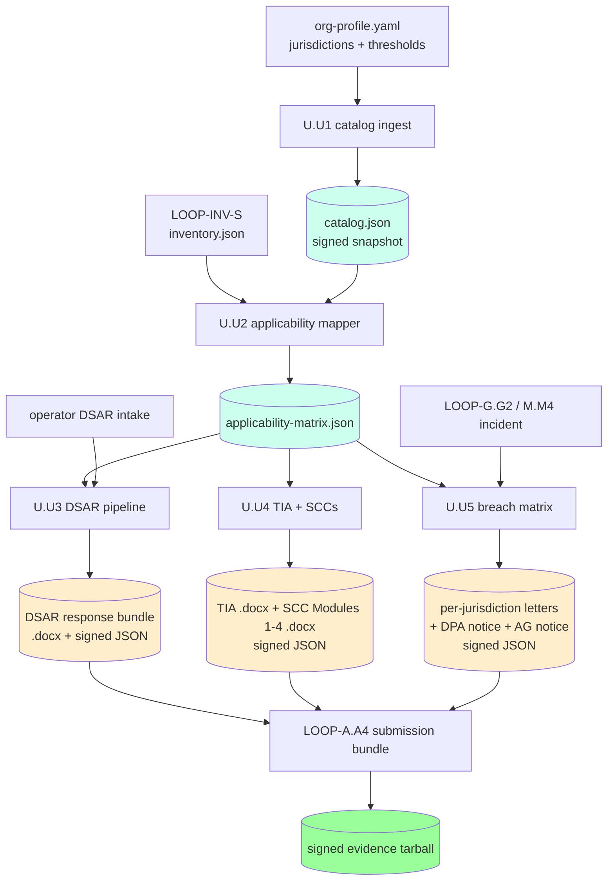

# LOOP-U — Privacy Frameworks Crosswalk + Cross-Border Transfer Assessment + Multi-State Breach-Notification Matrix

> Comprehensive implementation specification for the five slices in LOOP-U.
> Authored as a stand-alone artifact: any future Claude / human session can
> execute LOOP-U end-to-end by reading only this file + the five supporting
> per-slice docs cited in §3. No prior conversation history required.
>
> Authority: `cloud-evidence/CLAUDE.md` (Real-Evidence-Only standard) governs
> every slice below. Every byte emitted must trace back to real evidence
> (a Federal/State/EU bulk data download, a live SDK call against the cloud
> inventory, a tracker-DB intake row, or operator-supplied configuration).
> Slices ship under the Real Slice Contract in CLAUDE.md Rule 2.
>
> LOOP-U is **broadly applicable** but **per-datastore conditional**: the
> per-CSP applicability surface is computed by U.U2 from inventory tags +
> jurisdiction metadata. The `--privacy-frameworks` flag is the master
> orchestrator switch; once on, U.U2 emits the per-datastore matrix and
> each downstream slice (U.U3 DSAR, U.U4 TIA, U.U5 breach matrix) consumes
> the matrix to decide whether and how to act.

## 1. Mission & scope

### 1.1 Why LOOP-U exists (the audit story)

FedRAMP authorization at Moderate or High does not by itself satisfy the
specific statutory privacy obligations that bind a CSP whose tenants
process personal data of students (FERPA), children under 13 (COPPA),
financial customers (GLBA), California / New York / EU / UK residents
(CCPA / CPRA / NY SHIELD / GDPR / UK GDPR), or residents of any of the
50 U.S. states with breach-notification regimes. The FOURTH-PASS-AUDIT.md
surfaced this gap — every prior loop (A through T) treated privacy as an
incidental tag on inventory items or as part of the broader incident
response chain, not as a first-class statutory regime with its own data-
subject rights, cross-border-transfer assessment, and per-jurisdiction
breach-notification matrix.

LOOP-U turns that gap into a concrete pipeline: ingest the canonical
privacy-framework catalog (U.U1), map each cloud datastore to the
frameworks that apply to it (U.U2), implement the data-subject-rights
workflow (U.U3), assess cross-border transfers under the Schrems II
holding (U.U4), and compute the multi-state breach-notification matrix
(U.U5) that fires when G.G2 or M.M4 classifies an incident as a personal-
data breach. All outputs flow through LOOP-A.A4 bundling and LOOP-A.A5
signing; all POA&M items derived from LOOP-U findings flow through
LOOP-A.A1.

### 1.2 What LOOP-U delivers

A FedPy operator who turns on `--privacy-frameworks` and supplies the
per-org configuration (jurisdictions in scope, datastore tags, EU/UK
data-subject populations, signing-officer identities) gets:

1. A canonical privacy-frameworks catalog file
   (`cloud-evidence/data/privacy-frameworks-catalog.json`) signed via the
   LOOP-A.A5 pipeline. Every framework entry includes statutory citations,
   notification windows, data-subject rights, applicability triggers, and
   cross-walks to NIST 800-53 Rev 5 PT control family and the NIST
   Privacy Framework v1.0 functions.

2. A per-datastore applicability matrix
   (`cloud-evidence/data/datastore-applicability-matrix.json`) computed
   from the U.U1 catalog plus inventory tags. Each row says: for datastore
   D, the following frameworks apply, the following rights flow, the
   following notification windows fire on breach, and the following cross-
   border transfer mechanisms are in scope.

3. A DSAR (Data Subject Access Request) intake + fulfillment pipeline
   (U.U3) with operator-facing intake form, identity verification, per-
   right handling (access / delete / correct / portability / opt-out),
   45-day CCPA clock and 1-month GDPR clock, and a signed DSAR-response
   bundle.

4. A Transfer Impact Assessment + EU Standard Contractual Clauses .docx
   emitter (U.U4) per the Court of Justice of the European Union (CJEU)
   ruling in Case C-311/18 (Data Protection Commissioner v. Facebook
   Ireland Ltd and Maximillian Schrems, "Schrems II") and the
   implementing Commission Decision 2021/914.

5. A multi-state and multi-jurisdiction breach-notification matrix +
   per-jurisdiction notification-letter emitter (U.U5), triggered when
   G.G2 or M.M4 classifies an incident as a personal-data breach.

6. POA&M items, OSCAL Component Definition fragments, tracker DB rows,
   submission-bundle catalogue entries, and signed evidence envelopes
   for every output above.

### 1.3 What LOOP-U does NOT do (scope guard)

- LOOP-U does NOT execute the operator's privacy-program decisions. It
  emits the artifacts the operator + general counsel sign off on; it
  does not auto-approve a DSAR, does not auto-transmit a breach letter
  to a state attorney-general, and does not unilaterally invoke a
  cross-border-transfer mechanism without operator confirmation. REO
  Rule 4 (operator-supplied data) governs every signing step.

- LOOP-U does NOT cover HIPAA PHI. HIPAA Security Rule + Breach
  Notification + 800-66 Rev 2 + HITRUST live in LOOP-V. When a single
  datastore carries both state-PII (LOOP-U) and PHI (LOOP-V), both loops
  fire — the per-datastore applicability matrix surfaces the overlap and
  routes the workflows to both pipelines.

- LOOP-U does NOT cover Federal Tax Information (FTI). FTI lives in
  LOOP-Y.Y3 (IRS Pub 1075 catalog) and LOOP-Y.Y4 (SSR emitter).

- LOOP-U does NOT cover Criminal Justice Information (CJI). CJI lives in
  LOOP-Y.Y1 (CJIS Security Policy v5.9.5 catalog) and LOOP-Y.Y2 (CJIS
  Advanced Authentication detector).

- LOOP-U does NOT cover Section 889 / prohibited-vendor screening. That
  is LOOP-W. (LOOP-U and LOOP-W share a "supplier-jurisdiction" data
  primitive but their statutory drivers are wholly distinct.)

- LOOP-U does NOT cover the FTC Health Breach Notification Rule
  (HBN; 16 CFR Part 318) — that is a healthcare-adjacent regime tracked
  in LOOP-V via cross-reference, not in LOOP-U.

### 1.4 How LOOP-U is distinct from neighbour loops

| Neighbour | What it covers | LOOP-U overlap | How LOOP-U is distinct |
|---|---|---|---|
| LOOP-V (HIPAA) | PHI on behalf of a Covered Entity | Both fire on personal-data breaches | LOOP-U covers non-PHI personal data (state PII, EU GDPR, FERPA, COPPA, GLBA); LOOP-V covers PHI |
| LOOP-G.G2 / M.M4 (CIRCIA, DFARS 7012) | Cyber-incident reporting to CISA / DC3 | All three may fire on the same incident | LOOP-U emits the per-jurisdiction *individual* notification letters; G.G2/M.M4 handle the *agency* report |
| LOOP-W (Section 889) | Prohibited-vendor screening | Supplier-jurisdiction primitive | LOOP-W = supplier identity; LOOP-U = data-subject identity |
| LOOP-Z.Z4 (ISO 27018) | PII processor controls in public cloud | 27018 references LOOP-U catalog | LOOP-Z.Z4 is an audit / certification standard; LOOP-U is statutory |

### 1.5 Authoritative scope guard (REO-locked)

Every byte LOOP-U emits is one of:
1. A constant from the canonical privacy-frameworks catalog (U.U1) seeded
   from public statutory text (FERPA 20 USC §1232g, CCPA Cal Civ Code
   §1798.100 et seq, GDPR Reg (EU) 2016/679, etc.). The catalog is
   ingested via `scripts/extract-privacy-frameworks.mjs` from the cited
   public sources; each entry carries a `source_url` and an
   `accessed_at` timestamp.
2. A computed applicability decision based on real cloud-inventory tags
   from LOOP-INV-S (the `assets[].data_classes[]` and `jurisdiction`
   fields the operator tags onto resources in the inventory).
3. Operator-supplied configuration (jurisdictions in scope; in-EU/UK
   data-subject populations; signing-officer identity; CCPA/CPRA business
   thresholds; GLBA "financial institution" determination), gathered via
   the `REQUIRES-OPERATOR-INPUT` ceremony in each slice doc.
4. A real DSAR intake row in tracker DB from a real data-subject
   request (or, for tests, a fixture that mirrors the intake schema).
5. A real incident envelope from G.G2 / M.M4 (or fixture).

No stubs. No placeholder personal-data records. No invented
jurisdiction metadata. No invented framework citations.

### 1.6 Operational defaulting (when LOOP-U fires)

`--privacy-frameworks` is the master orchestrator switch. When set:
- U.U1 always runs (catalog ingest + signed snapshot).
- U.U2 always runs (per-datastore applicability matrix).
- U.U3 runs when U.U2 detects at least one datastore subject to a
  framework with data-subject rights (CCPA / CPRA / GDPR / UK GDPR).
- U.U4 runs when U.U2 detects at least one cross-border data transfer
  (EU/UK -> US, EU -> any third country, UK -> any third country).
- U.U5 runs when (a) U.U2 catalog has at least one breach-notification
  regime in scope AND (b) the orchestrator pipeline includes G.G2 or
  M.M4 (i.e., incident intake is active).

In a steady-state production build (operator has configured all four),
all five slices fire on every collection run. In a CI-only build, the
operator can suppress with `--privacy-frameworks=catalog-only` (U.U1
only) or `--privacy-frameworks=matrix-only` (U.U1 + U.U2).

## 2. Statutory & regulatory drivers (verbatim quotes; pinned URLs)

Every quote in this section is verbatim from the cited public source.
The pinned URL is the canonical Federal / State / EU publisher. Access
date for this spec: **2026-06-08**.

### 2.1 FERPA — 20 USC §1232g + 34 CFR Part 99

**Pin:** https://uscode.house.gov/view.xhtml?req=granuleid:USC-prelim-title20-section1232g
**Pin:** https://www.ecfr.gov/current/title-34/subtitle-A/part-99
**Authority:** Family Educational Rights and Privacy Act of 1974
(Pub. L. 93-380, Title V, §513(a), Aug. 21, 1974), as amended.

> "No funds shall be made available under any applicable program to any
> educational agency or institution which has a policy or practice of
> permitting the release of education records (or personally
> identifiable information contained therein other than directory
> information ...) of students without the written consent of their
> parents to any individual, agency, or organization ..."
> — 20 USC §1232g(b)(1)

> "Section 99.31 — Under what conditions is prior consent not required
> to disclose information? (a) An educational agency or institution may
> disclose personally identifiable information from an education record
> of a student without the consent required by §99.30 if the disclosure
> meets one or more of the following conditions: (1)(i)(A) The
> disclosure is to other school officials, including teachers, within
> the agency or institution whom the agency or institution has
> determined to have legitimate educational interests."
> — 34 CFR §99.31(a)(1)(i)(A)

> "§99.34 What conditions apply to disclosure of information to other
> educational agencies or institutions? (a) An educational agency or
> institution that discloses an education record under §99.31(a)(2)
> shall: (1) Make a reasonable attempt to notify the parent or eligible
> student at the last known address of the parent or eligible student,
> unless: (i) The disclosure is initiated by the parent or eligible
> student; or (ii) The annual notification of the agency or institution
> ... includes a notice that the agency or institution forwards
> education records on request to a school in which a student seeks or
> intends to enroll or is already enrolled ..."
> — 34 CFR §99.34(a)(1)

> "§99.35 What conditions apply to disclosure of information for
> Federal or State program purposes? (a)(1) Authorized representatives
> of the officials or agencies headed by officials listed in
> §99.31(a)(3) may have access to education records in connection with
> an audit, evaluation, or enforcement of Federal legal requirements."
> — 34 CFR §99.35(a)(1)

**Operational consequence for FedPy:** A CSP processing student
education records on behalf of an educational agency or institution
(LEA, IHE, etc.) is a "school official" only if the contract / agreement
satisfies §99.31(a)(1)(i)(B): the CSP must perform a service the LEA
would otherwise perform for itself, must be under the direct control of
the LEA, and must be subject to the §99.33(a) re-disclosure restrictions.
LOOP-U treats the FERPA framework as in-scope whenever the operator's
`org-profile.yaml` declares `processes_student_records: true`.

### 2.2 COPPA — 15 USC §6501-§6506 + 16 CFR Part 312

**Pin:** https://www.ecfr.gov/current/title-16/chapter-I/subchapter-C/part-312
**Authority:** Children's Online Privacy Protection Act of 1998
(Pub. L. 105-277, Div. C, Title XIII), as amended, with the FTC
implementing rule at 16 CFR Part 312 (revised 2013, further amendments
pending as of 2026).

> "§312.4 Notice. (a) General principles of notice. It shall be the
> obligation of the operator to provide notice and obtain verifiable
> parental consent prior to collecting, using, or disclosing personal
> information from children. Such notice must be clearly and
> understandably written, complete, and must contain no unrelated,
> confusing, or contradictory materials."
> — 16 CFR §312.4(a)

> "§312.5 Parental consent. (a) General requirements. (1) An operator
> is required to obtain verifiable parental consent before any
> collection, use, or disclosure of personal information from
> children, including consent to any material change in the collection,
> use, or disclosure practices to which the parent has previously
> consented."
> — 16 CFR §312.5(a)(1)

> "§312.5(b) Methods for verifiable parental consent. (1) An operator
> must make reasonable efforts to obtain verifiable parental consent,
> taking into consideration available technology. Any method to obtain
> verifiable parental consent must be reasonably calculated, in light
> of available technology, to ensure that the person providing consent
> is the child's parent."
> — 16 CFR §312.5(b)(1)

> "§312.10 Data retention and deletion requirements. An operator of a
> Web site or online service shall retain personal information collected
> online from a child for only as long as is reasonably necessary to
> fulfill the purpose for which the information was collected. The
> operator must delete such information using reasonable measures to
> protect against unauthorized access to, or use of, the information in
> connection with its deletion."
> — 16 CFR §312.10

**Operational consequence for FedPy:** A CSP whose tenants knowingly
serve children under 13 (or that operates a child-directed online
service) is a COPPA "operator" or processes data for one. The COPPA
verifiable-parental-consent mechanism is operator-policy territory, not
something FedPy automates. LOOP-U surfaces the COPPA applicability
determination per datastore (when `data_classes[]` contains
`child-under-13`) and writes the COPPA-rights envelope into the U.U2
matrix; U.U3 DSAR intake routes COPPA parental requests through a
distinct identity-verification path.

### 2.3 GLBA Safeguards Rule — 16 CFR Part 314 + 15 USC §6801-§6809

**Pin:** https://www.ecfr.gov/current/title-16/chapter-I/subchapter-C/part-314
**Authority:** Gramm-Leach-Bliley Act of 1999 (Pub. L. 106-102), Title V
Subtitle A; FTC implementing Safeguards Rule revised Dec 9, 2021
(86 FR 70272), with the breach-notification amendment effective
May 13, 2024.

> "§314.4 Elements. In order to develop, implement, and maintain your
> information security program, you shall: (a) Designate a Qualified
> Individual responsible for overseeing and implementing your
> information security program and enforcing your information security
> program ..."
> — 16 CFR §314.4(a)

> "(b) Base your information security program on a risk assessment that
> identifies reasonably foreseeable internal and external risks to the
> security, confidentiality, and integrity of customer information that
> could result in the unauthorized disclosure, misuse, alteration,
> destruction, or other compromise of such information ..."
> — 16 CFR §314.4(b)

> "(c) Design and implement safeguards to control the risks you
> identify through risk assessment, including by: (1) Implementing and
> periodically reviewing access controls ... (2) Identifying and managing
> the data, personnel, devices, systems, and facilities that enable you
> to achieve business purposes ... (3) Protecting by encryption all
> customer information held or transmitted by you both in transit over
> external networks and at rest ..."
> — 16 CFR §314.4(c)

> "§314.5 Effective date. The amendments to this part adopted on
> December 9, 2021 shall become effective as follows: (a) The amendments
> to §314.4 shall become effective on January 10, 2022, with the
> exception of §§314.4(a), 314.4(b)(1), 314.4(c)(1) through (4) and (6)
> through (8), 314.4(d)(2), 314.4(e), 314.4(f)(3), 314.4(h) and (i),
> which shall become effective on June 9, 2023."
> — 16 CFR §314.5

**Operational consequence for FedPy:** A CSP that is itself a GLBA
"financial institution" (the term is defined by FTC interpretation
broadly to include many non-bank financial services) must implement
§314.4 in full. A CSP that processes customer information on behalf of
a GLBA financial institution falls under §314.4(f) (service-provider
oversight). LOOP-U treats GLBA as in-scope when `org-profile.yaml`
declares `is_glba_financial_institution: true` OR `processes_glba_customer_information: true`.

### 2.4 CCPA / CPRA — Cal Civ Code §1798.100 et seq.

**Pin:** https://leginfo.legislature.ca.gov/faces/codes_displayText.xhtml?division=3.&part=4.&lawCode=CIV&title=1.81.5
**Authority:** California Consumer Privacy Act of 2018 (Assembly Bill
375; Stats. 2018, Ch. 55), as amended by the California Privacy Rights
Act of 2020 (Proposition 24), effective January 1, 2023.

> "1798.100. (a) A consumer shall have the right to request that a
> business that collects a consumer's personal information disclose to
> that consumer the following: (1) The categories of personal
> information it has collected about that consumer. (2) The categories
> of sources from which the personal information is collected. (3) The
> business or commercial purpose for collecting, selling, or sharing
> personal information. (4) The categories of third parties to whom the
> business discloses personal information. (5) The specific pieces of
> personal information it has collected about that consumer."
> — Cal Civ Code §1798.100(a)

> "1798.105. (a) A consumer shall have the right to request that a
> business delete any personal information about the consumer which the
> business has collected from the consumer. (c) A business that
> receives a verifiable consumer request from a consumer to delete the
> consumer's personal information pursuant to subdivision (a) of this
> section shall delete the consumer's personal information from its
> records, notify any service providers or contractors to delete the
> consumer's personal information from their records, and notify all
> third parties to whom the business has sold or shared the personal
> information to delete the consumer's personal information unless this
> proves impossible or involves disproportionate effort."
> — Cal Civ Code §1798.105(a), (c)

> "1798.110. (a) A consumer shall have the right to request that a
> business that collects personal information about the consumer
> disclose to the consumer the following: ..."
> — Cal Civ Code §1798.110(a)

> "1798.120. (a) A consumer shall have the right, at any time, to
> direct a business that sells or shares personal information about the
> consumer to third parties not to sell or share the consumer's personal
> information. This right may be referred to as the right to opt-out of
> sale or sharing."
> — Cal Civ Code §1798.120(a)

> "1798.140. For purposes of this title: (d) 'Business' means: (1) A
> sole proprietorship, partnership, limited liability company,
> corporation, association, or other legal entity that is organized or
> operated for the profit or financial benefit of its shareholders or
> other owners, that collects consumers' personal information, or on
> the behalf of which such information is collected and that alone, or
> jointly with others, determines the purposes and means of the
> processing of consumers' personal information, that does business in
> the State of California, and that satisfies one or more of the
> following thresholds: (A) As of January 1 of the calendar year, had
> annual gross revenues in excess of twenty-five million dollars
> ($25,000,000) ..."
> — Cal Civ Code §1798.140(d)(1)(A)

> "1798.150. (a)(1) Any consumer whose nonencrypted and nonredacted
> personal information ... is subject to an unauthorized access and
> exfiltration, theft, or disclosure as a result of the business's
> violation of the duty to implement and maintain reasonable security
> procedures and practices appropriate to the nature of the information
> to protect the personal information may institute a civil action ..."
> — Cal Civ Code §1798.150(a)(1)

**Operational consequence for FedPy:** A CSP that meets any of the
§1798.140(d)(1)(A)-(C) thresholds OR that is a Service Provider /
Contractor to such a Business must implement the CCPA/CPRA rights
chain. LOOP-U treats CCPA/CPRA as in-scope when `org-profile.yaml`
declares `is_california_business: true` OR `is_california_service_provider: true`. U.U3 DSAR pipeline implements the 45-day clock under §1798.130.

### 2.5 GDPR — Regulation (EU) 2016/679

**Pin:** https://eur-lex.europa.eu/legal-content/EN/TXT/?uri=CELEX:32016R0679
**Authority:** Regulation (EU) 2016/679 of the European Parliament and
of the Council of 27 April 2016 on the protection of natural persons
with regard to the processing of personal data and on the free
movement of such data, and repealing Directive 95/46/EC (General Data
Protection Regulation). Application: 25 May 2018.

> "Article 5 — Principles relating to processing of personal data
> 1. Personal data shall be:
> (a) processed lawfully, fairly and in a transparent manner in
>     relation to the data subject ('lawfulness, fairness and
>     transparency');
> (b) collected for specified, explicit and legitimate purposes and not
>     further processed in a manner that is incompatible with those
>     purposes ... ('purpose limitation');
> (c) adequate, relevant and limited to what is necessary in relation
>     to the purposes for which they are processed ('data
>     minimisation'); ..."
> — GDPR Article 5

> "Article 6 — Lawfulness of processing
> 1. Processing shall be lawful only if and to the extent that at least
> one of the following applies:
> (a) the data subject has given consent to the processing of his or
>     her personal data for one or more specific purposes;
> (b) processing is necessary for the performance of a contract to
>     which the data subject is party ...;
> (c) processing is necessary for compliance with a legal obligation
>     to which the controller is subject; ..."
> — GDPR Article 6

> "Article 15 — Right of access by the data subject
> 1. The data subject shall have the right to obtain from the
> controller confirmation as to whether or not personal data concerning
> him or her are being processed, and, where that is the case, access
> to the personal data and the following information: (a) the purposes
> of the processing; (b) the categories of personal data concerned;
> (c) the recipients or categories of recipient to whom the personal
> data have been or will be disclosed ..."
> — GDPR Article 15

> "Article 17 — Right to erasure ('right to be forgotten')
> 1. The data subject shall have the right to obtain from the
> controller the erasure of personal data concerning him or her without
> undue delay and the controller shall have the obligation to erase
> personal data without undue delay where one of the following grounds
> applies: (a) the personal data are no longer necessary in relation to
> the purposes for which they were collected or otherwise processed; ..."
> — GDPR Article 17

> "Article 25 — Data protection by design and by default
> 1. Taking into account the state of the art ... the controller shall,
> both at the time of the determination of the means for processing and
> at the time of the processing itself, implement appropriate technical
> and organisational measures, such as pseudonymisation, which are
> designed to implement data-protection principles, such as data
> minimisation, in an effective manner ..."
> — GDPR Article 25

> "Article 32 — Security of processing
> 1. Taking into account the state of the art ... the controller and
> the processor shall implement appropriate technical and
> organisational measures to ensure a level of security appropriate to
> the risk, including inter alia as appropriate:
> (a) the pseudonymisation and encryption of personal data;
> (b) the ability to ensure the ongoing confidentiality, integrity,
>     availability and resilience of processing systems and services;
> (c) the ability to restore the availability and access to personal
>     data in a timely manner in the event of a physical or technical
>     incident;
> (d) a process for regularly testing, assessing and evaluating the
>     effectiveness of technical and organisational measures for
>     ensuring the security of the processing."
> — GDPR Article 32

> "Article 33 — Notification of a personal data breach to the
> supervisory authority
> 1. In the case of a personal data breach, the controller shall
> without undue delay and, where feasible, not later than 72 hours
> after having become aware of it, notify the personal data breach to
> the supervisory authority competent in accordance with Article 55,
> unless the personal data breach is unlikely to result in a risk to
> the rights and freedoms of natural persons."
> — GDPR Article 33(1)

> "Article 34 — Communication of a personal data breach to the data
> subject
> 1. When the personal data breach is likely to result in a high risk
> to the rights and freedoms of natural persons, the controller shall
> communicate the personal data breach to the data subject without
> undue delay."
> — GDPR Article 34(1)

> "Article 44 — General principle for transfers
> Any transfer of personal data which are undergoing processing or are
> intended for processing after transfer to a third country or to an
> international organisation shall take place only if, subject to the
> other provisions of this Regulation, the conditions laid down in this
> Chapter are complied with by the controller and processor, including
> for onward transfers of personal data from the third country or an
> international organisation to another third country or to another
> international organisation."
> — GDPR Article 44

> "Article 46 — Transfers subject to appropriate safeguards
> 1. In the absence of a decision pursuant to Article 45(3), a
> controller or processor may transfer personal data to a third country
> or an international organisation only if the controller or processor
> has provided appropriate safeguards, and on condition that
> enforceable data subject rights and effective legal remedies for data
> subjects are available."
> — GDPR Article 46(1)

> "Article 83 — General conditions for imposing administrative fines
> 5. Infringements of the following provisions shall, in accordance
> with paragraph 2, be subject to administrative fines up to
> 20 000 000 EUR, or in the case of an undertaking, up to 4 % of the
> total worldwide annual turnover of the preceding financial year,
> whichever is higher: ..."
> — GDPR Article 83(5)

**Operational consequence for FedPy:** Any CSP with EU/EEA data
subjects in scope is a GDPR controller or processor. LOOP-U treats GDPR
as in-scope when `org-profile.yaml` declares `has_eu_data_subjects: true` OR when LOOP-INV-S inventory tags surface `jurisdiction: eu` on any datastore. U.U3 implements the Article 12 1-month clock (extendable by 2 months under Article 12(3)); U.U4 implements the Schrems II TIA + SCC pipeline; U.U5 implements the Article 33 72-hour notification chain (coordinated with G.G2 + M.M4).

### 2.6 UK GDPR + UK Data Protection Act 2018

**Pin:** https://www.legislation.gov.uk/ukpga/2018/12/contents
**Authority:** Data Protection Act 2018 (c. 12), as amended; UK GDPR
(retained EU law version of Regulation (EU) 2016/679 with UK
modifications under the European Union (Withdrawal) Act 2018).

> "Part 2 — General processing
> CHAPTER 1 — Scope and definitions
> 4 Definitions
> (1) Terms used in Chapter 2 of this Part and in the GDPR have the
> same meaning in Chapter 2 as they have in the GDPR."
> — DPA 2018 §4(1)

**Operational consequence:** The UK GDPR mirrors the EU GDPR in nearly
all respects post-Brexit, with the ICO (Information Commissioner's
Office) as supervisory authority. LOOP-U treats UK GDPR as a parallel
in-scope framework whenever `has_uk_data_subjects: true` is declared.
U.U4 includes the UK Information Commissioner's IDTA (International
Data Transfer Agreement) and Addendum to the EU SCCs as alternative
transfer mechanisms.

### 2.7 NY SHIELD Act — NY Gen Bus Law §899-aa, §899-bb

**Pin:** https://www.nysenate.gov/legislation/laws/GBS/899-AA
**Pin:** https://www.nysenate.gov/legislation/laws/GBS/899-BB
**Authority:** Stop Hacks and Improve Electronic Data Security Act
(S5575B / A5635), signed into law July 25, 2019.

> "§899-aa Notification; person without valid authorization has acquired
> private information.
> 2. Any person or business which conducts business in New York state,
> and which owns or licenses computerized data which includes private
> information, shall disclose any breach of the security of the system
> following discovery or notification of the breach in the security of
> the system to any resident of New York state whose private
> information was, or is reasonably believed to have been, accessed or
> acquired by a person without valid authorization."
> — NY Gen Bus Law §899-aa(2)

> "§899-bb Data security protections.
> 2. (a) Reasonable security requirement. (i) Any person or business
> that owns or licenses computerized data which includes private
> information of a resident of New York shall develop, implement and
> maintain reasonable safeguards to protect the security,
> confidentiality and integrity of the private information ..."
> — NY Gen Bus Law §899-bb(2)(a)(i)

**Operational consequence:** LOOP-U treats NY SHIELD as in-scope when
`has_ny_residents: true` is declared. U.U5 includes the per-NY-resident
notification path with the §899-aa(2) "without unreasonable delay"
language and the §899-aa(5) notification-content requirements.

### 2.8 Multi-state breach-notification matrix

**Pin (reference compendium):** IAPP State Privacy Tracker
(https://iapp.org/resources/article/state-data-breach-notification-laws-comprehensive/)
and the National Conference of State Legislatures (NCSL) Security
Breach Notification Laws compendium
(https://www.ncsl.org/technology-and-communication/security-breach-notification-laws).
**Authority:** All 50 U.S. states + DC + Puerto Rico + US Virgin
Islands have statutory breach-notification regimes. Per-state citations
are enumerated in `cloud-evidence/data/state-breach-notification-matrix.json`
(U.U1 + U.U5 input).

The matrix encodes per-jurisdiction:
- `statute_citation` (state code + section)
- `effective_date`
- `applies_when` (residency trigger; type-of-data trigger)
- `notification_window` (days from discovery / determination; some
  states are "without unreasonable delay" with no fixed deadline)
- `attorney_general_notice_threshold` (some require AG notice at any
  size; others trigger at >=N affected residents)
- `consumer_reporting_agency_threshold` (>=N affected residents)
- `media_notice_threshold` (>=N affected residents — paralleling HIPAA
  §164.406 but jurisdiction-specific)
- `safe_harbor` (encryption, redaction, etc.)
- `private_right_of_action_available` (true/false; with statutory damages)

### 2.9 Schrems II — CJEU Case C-311/18

**Pin:** https://curia.europa.eu/juris/document/document.jsf?docid=228677
**Authority:** Court of Justice of the European Union, Grand Chamber,
Judgment of 16 July 2020, Case C-311/18, Data Protection Commissioner
v. Facebook Ireland Ltd, Maximillian Schrems.

> "On those grounds, the Court (Grand Chamber) hereby rules:
> 1. Article 2(1) and (2) of Regulation (EU) 2016/679 ... must be
> interpreted as meaning that that regulation applies to the transfer
> of personal data for commercial purposes by an economic operator
> established in a Member State to another economic operator
> established in a third country, irrespective of whether, at the time
> of that transfer or thereafter, that data is liable to be processed
> by the authorities of the third country in question for the purposes
> of public security, defence and State security.
> 4. Examination of Commission Decision 2010/87/EU ... has disclosed
> nothing to affect the validity of that decision.
> 5. Commission Implementing Decision (EU) 2016/1250 ... on the
> adequacy of the protection provided by the EU-U.S. Privacy Shield is
> invalid."
> — Case C-311/18, Judgment of 16 July 2020, operative parts 1, 4, 5

**Operational consequence for FedPy:** Any EU/UK -> US transfer of
personal data must rely on an Article 46 transfer mechanism (SCCs,
BCRs, derogations under Article 49). Reliance on SCCs requires a
Transfer Impact Assessment (TIA) that evaluates whether the destination
country's law and practice ensure essentially equivalent protection.
U.U4 emits the TIA + the EU SCC Module 1 (controller-to-controller) /
Module 2 (controller-to-processor) / Module 3 (processor-to-processor) /
Module 4 (processor-to-controller) .docx in a signed envelope.

### 2.10 EU Standard Contractual Clauses — Commission Decision 2021/914

**Pin:** https://eur-lex.europa.eu/legal-content/EN/TXT/?uri=CELEX:32021D0914
**Authority:** Commission Implementing Decision (EU) 2021/914 of 4 June
2021 on standard contractual clauses for the transfer of personal data
to third countries pursuant to Regulation (EU) 2016/679.

> "Article 1
> The standard contractual clauses set out in the Annex are considered
> to provide appropriate safeguards within the meaning of Article 46(1)
> and (2)(c) of Regulation (EU) 2016/679 for the transfer by a
> controller or processor of personal data processed subject to that
> Regulation (data exporter) to a controller or (sub-)processor whose
> processing of the data is not subject to that Regulation (data
> importer)."
> — Commission Decision 2021/914, Article 1

**Operational consequence:** U.U4 emits the SCC modules in the
operator-signed .docx + signed JSON envelope; the operator signs the
SCC physically (or via DocuSign / Adobe Sign) before transmission. FedPy
does not auto-sign on behalf of the controller / processor.

### 2.11 NIST Privacy Framework v1.0 (Jan 2020)

**Pin:** https://csrc.nist.gov/Projects/Privacy-Framework
**Authority:** NISTIR 8062 + the Privacy Framework Version 1.0
released January 16, 2020.

The Privacy Framework organizes privacy outcomes into five Functions
(Identify-P, Govern-P, Control-P, Communicate-P, Protect-P), 18
Categories, and 100 Subcategories. LOOP-U's catalog maps each statutory
framework (FERPA, COPPA, GLBA, CCPA, GDPR, etc.) to the Privacy
Framework Subcategories that operationalize its statutory requirements.

### 2.12 NIST SP 800-53 Rev 5 — PT control family

**Pin:** https://csrc.nist.gov/pubs/sp/800/53/r5/upd1/final
**Authority:** NIST SP 800-53 Rev 5 (with Updates 1-3 as of 2026),
PT (Personally Identifiable Information Processing and Transparency)
control family.

Controls in the PT family (PT-1 through PT-8) are the NIST-baseline
privacy-control surface. LOOP-U's catalog cross-walks each statutory
framework to the PT controls that operationalize it (e.g., GDPR
Article 13 -> PT-5 Privacy Notice; GDPR Article 15 -> PT-3 PII
Processing Purposes).

### 2.13 Cross-references not quoted here (cited in catalog)

- Brazil's LGPD (Lei nº 13.709/2018) — referenced for international scope.
- APEC Cross-Border Privacy Rules (CBPR) — referenced for trans-Pacific
  data flows.
- Canada's PIPEDA (S.C. 2000, c. 5) — referenced.
- Japan's APPI — referenced.
- China's PIPL (Personal Information Protection Law, effective Nov 1,
  2021) — referenced.

These appear in the catalog as `not_in_default_scope: true` with
operator-toggleable inclusion via `org-profile.yaml`.

## 3. Slice list

| id   | title                                                                          | status   | commit | dependencies                  | estimated_effort |
|------|--------------------------------------------------------------------------------|----------|--------|-------------------------------|------------------|
| U.U1 | Privacy Frameworks Catalog (FERPA + COPPA + GLBA + CCPA/CPRA + GDPR + UK GDPR + NY SHIELD + state breach matrix + NIST Privacy Framework v1.0) | proposed | TBD    | A.A5                          | ~5 working days  |
| U.U2 | Data-Subject Mapping — per-datastore applicability matrix                      | proposed | TBD    | U.U1, INV-S                   | ~6 working days  |
| U.U3 | DSAR (Data Subject Access Request) Intake + Fulfillment Workflow (CCPA 45-day + GDPR 1-month) | proposed | TBD    | U.U2, A.A4, A.A5, tracker DB  | ~7 working days  |
| U.U4 | Cross-Border Transfer Assessment (Schrems II) — TIA + EU SCC Modules 1-4 .docx emitter | proposed | TBD    | U.U2, A.A5                    | ~6 working days  |
| U.U5 | Multi-State Breach-Notification Matrix + per-jurisdiction notification-letter emitter | proposed | TBD    | U.U2, G.G2, M.M4, A.A5        | ~7 working days  |

Per-slice docs:
- `cloud-evidence/docs/slices/U/U.U1.md` (1250 lines on disk)
- `cloud-evidence/docs/slices/U/U.U2.md` (874 lines on disk)
- `cloud-evidence/docs/slices/U/U.U3.md` (1216 lines on disk)
- `cloud-evidence/docs/slices/U/U.U4.md` (1557 lines on disk)
- `cloud-evidence/docs/slices/U/U.U5.md` (1284 lines on disk)

## 4. Authoritative sources (full list)

| Source                              | Pinned URL                                                                                                                  | Accessed   |
|-------------------------------------|------------------------------------------------------------------------------------------------------------------------------|------------|
| FERPA 20 USC §1232g                 | https://uscode.house.gov/view.xhtml?req=granuleid:USC-prelim-title20-section1232g                                            | 2026-06-08 |
| FERPA Rule 34 CFR Part 99           | https://www.ecfr.gov/current/title-34/subtitle-A/part-99                                                                     | 2026-06-08 |
| COPPA 15 USC §6501-§6506            | https://www.ftc.gov/legal-library/browse/statutes/childrens-online-privacy-protection-act                                    | 2026-06-08 |
| COPPA Rule 16 CFR Part 312          | https://www.ecfr.gov/current/title-16/chapter-I/subchapter-C/part-312                                                        | 2026-06-08 |
| GLBA Safeguards Rule 16 CFR Part 314| https://www.ecfr.gov/current/title-16/chapter-I/subchapter-C/part-314                                                        | 2026-06-08 |
| GLBA Title V Subtitle A             | https://uscode.house.gov/view.xhtml?path=/prelim@title15/chapter94&edition=prelim                                            | 2026-06-08 |
| CCPA / CPRA Cal Civ Code            | https://leginfo.legislature.ca.gov/faces/codes_displayText.xhtml?division=3.&part=4.&lawCode=CIV&title=1.81.5                | 2026-06-08 |
| CCPA Regulations (CCR Title 11)     | https://cppa.ca.gov/regulations/                                                                                             | 2026-06-08 |
| GDPR Reg (EU) 2016/679              | https://eur-lex.europa.eu/legal-content/EN/TXT/?uri=CELEX:32016R0679                                                         | 2026-06-08 |
| UK DPA 2018                         | https://www.legislation.gov.uk/ukpga/2018/12/contents                                                                        | 2026-06-08 |
| UK GDPR (retained EU law)           | https://www.legislation.gov.uk/eur/2016/679/contents                                                                         | 2026-06-08 |
| NY SHIELD Act §899-aa               | https://www.nysenate.gov/legislation/laws/GBS/899-AA                                                                         | 2026-06-08 |
| NY SHIELD Act §899-bb               | https://www.nysenate.gov/legislation/laws/GBS/899-BB                                                                         | 2026-06-08 |
| Schrems II Case C-311/18            | https://curia.europa.eu/juris/document/document.jsf?docid=228677                                                             | 2026-06-08 |
| EU SCCs Commission Decision 2021/914 | https://eur-lex.europa.eu/legal-content/EN/TXT/?uri=CELEX:32021D0914                                                        | 2026-06-08 |
| NIST Privacy Framework v1.0         | https://csrc.nist.gov/Projects/Privacy-Framework                                                                             | 2026-06-08 |
| NISTIR 8062                         | https://csrc.nist.gov/pubs/ir/8062/final                                                                                     | 2026-06-08 |
| NIST SP 800-53 Rev 5 (PT family)    | https://csrc.nist.gov/pubs/sp/800/53/r5/upd1/final                                                                           | 2026-06-08 |
| IAPP State Privacy Tracker          | https://iapp.org/resources/article/state-data-breach-notification-laws-comprehensive/                                        | 2026-06-08 |
| NCSL Security Breach Notification   | https://www.ncsl.org/technology-and-communication/security-breach-notification-laws                                          | 2026-06-08 |
| EDPB Guidelines 03/2019 (Article 33) | https://edpb.europa.eu/our-work-tools/our-documents/guidelines/guidelines-92022-personal-data-breach-notification-under_en | 2026-06-08 |
| ICO breach-notification guidance    | https://ico.org.uk/for-organisations/report-a-breach/                                                                        | 2026-06-08 |

## 5. Reusable primitives

LOOP-U builds on the following existing primitives (no re-implementation):

| Primitive                                    | Source              | LOOP-U usage                                                  |
|----------------------------------------------|---------------------|----------------------------------------------------------------|
| Ed25519 signing + RFC 3161 TST               | LOOP-A.A5           | Every U.U* output envelope                                     |
| Canonical JSON (RFC 8785)                    | LOOP-A.A5           | Catalog snapshots, applicability matrix, DSAR/TIA/breach envs  |
| Submission bundle catalogue                  | LOOP-A.A4           | U.U3/U.U4/U.U5 register their roles in WELL_KNOWN              |
| OSCAL POA&M v1.1.2 emitter                   | LOOP-A.A1           | Privacy-framework gap findings flow to POA&M                   |
| OOXML / zip-store .docx emitter              | core/oscal-ssp-docx | TIA .docx, SCC modules .docx, breach letters .docx             |
| Composite risk scorer (CVSS + EPSS + lens)   | LOOP-B.B1           | Privacy POA&M items pick up composite risk                     |
| Inventory backbone (assets[], jurisdictions) | LOOP-INV-S          | U.U2 reads `assets[].data_classes[]`, `assets[].jurisdiction`  |
| Incident envelope intake                     | LOOP-G.G2 + M.M4    | U.U5 breach matrix triggered by an incoming envelope           |
| Tracker DB schema (migrations)               | tracker             | DSAR intake, TIA tracker, breach status                        |
| Slack + PagerDuty notifications              | core/notify.ts      | DSAR-due-soon, breach-clock alerts                             |
| Federal-holiday calendar (OPM)               | core/section889-clock.ts (LOOP-W) | U.U3 GDPR 1-month + CCPA 45-day clock computation              |

## 6. Data flow diagram

## 7. Test strategy

### 7.1 Per-slice unit tests
Each per-slice doc (U.U1.md through U.U5.md) specifies ≥15 unit tests
in §8 with TABLE form (id | scenario | fixture | expected | acceptance).
Aggregate target across LOOP-U: ≥75 unit tests.

### 7.2 Integration tests
| id | scenario | fixtures | expected |
|----|----------|----------|----------|
| INT-U-01 | catalog -> matrix -> DSAR end-to-end for CCPA right-to-know | privacy-frameworks-catalog.json, sample inventory, sample DSAR intake | DSAR response bundle emitted within 45-day clock |
| INT-U-02 | catalog -> matrix -> TIA -> SCC Module 2 for EU controller -> US processor | sample EU controller setup, sample US-side inventory | TIA .docx valid, SCC Module 2 .docx valid, signed envelope verifies |
| INT-U-03 | catalog -> matrix -> breach matrix for incident affecting CA + NY + EU + UK residents | sample G.G2 incident envelope | 4 distinct notification streams: CA AG + NY AG + EU DPA + UK ICO; per-individual letters per state |
| INT-U-04 | GDPR Art 33 72-hour clock + state-AG clock coordination | sample multi-jurisdiction incident | clocks fire in correct order; submission bundle catalogue includes all 4 streams |
| INT-U-05 | DSAR identity-verification false-positive guard | impersonation attempt fixture | request rejected with audit-log entry |
| INT-U-06 | dedupe of overlapping framework applicability (CCPA + GDPR on same datastore) | inventory with both CA + EU tags | matrix shows both frameworks; DSAR pipeline routes through both clocks |
| INT-U-07 | catalog freshness check + signed-snapshot drift detection | fixture with stale catalog snapshot | guardrail blocks; operator alerted |
| INT-U-08 | LOOP-V.V3 PHI breach + LOOP-U state PII breach coordination | sample healthcare incident affecting CA residents | both V.V3 and U.U5 fire; submission bundle includes both stream sets |

### 7.3 Adversarial / chaos tests
- DSAR clock arithmetic across DST transitions (Mar 8 + Nov 1, 2026)
- TIA mechanism revocation (Schrems II-style invalidation of adequacy
  decision mid-engagement) — operator alerted, transfer halted
- Breach-matrix staleness when a state amends its statute mid-run
- Multi-state notification race when affected-individual count crosses
  attorney-general threshold mid-incident

### 7.4 Regression tests
Per-state breach-statute changes are tracked in
`cloud-evidence/data/state-breach-notification-matrix.json` with
version numbers + checksums; CI guardrail blocks any matrix change
that is not accompanied by an operator-signed Acceptance row.

## 8. Risks summary

Full risk register: `cloud-evidence/docs/loops/LOOP-U-RISKS.md` (1404
lines, 18+ cross-cutting + per-slice risks). High-severity highlights:

| Risk | Severity | Mitigation |
|---|---|---|
| State breach matrix staleness | High | U.U1 catalog snapshot signed + checksummed; CI guardrail; quarterly review |
| DSAR identity-verification false-positive | High | U.U3 multi-factor verification + audit-log; high-risk requests routed to operator |
| Cross-border transfer mechanism invalidation mid-engagement | Critical | U.U4 monitors EU adequacy decision changes; operator alerted; auto-halt |
| GDPR Art 33 72-hour clock missed | High | M.M4 + G.G2 coordination; alarm at T-12h; PagerDuty escalation |
| COPPA verifiable parental consent failure modes | High | U.U3 separates COPPA flow from CCPA/GDPR DSAR flow; operator policy |
| Jurisdiction-resolver false-positive (e.g., GeoIP mis-attribution) | Medium | Operator-supplied jurisdiction tags override; manual review for high-risk |
| GLBA Safeguards Rule annual-update mismatch (FTC amendments) | Medium | Quarterly catalog refresh; CHANGELOG notification |

## 9. Open questions

1. **APEC CBPR scope** — Should LOOP-U include APEC CBPR as a
   first-class framework or as an operator-toggle? Current draft: toggle.
2. **China PIPL** — Cross-border data-export-security-assessment
   (CDESA) under PIPL adds a third regime alongside Schrems II and UK
   IDTA. Should this trigger U.U4 expansion or a dedicated slice?
3. **State AI / automated-decision laws** (CO AI Act, CA AB 2013) —
   In scope for LOOP-U or in a future LOOP-AI?
4. **Texas TDPSA + Connecticut CTDPA + Virginia VCDPA + Colorado CPA +
   Utah UCPA + 18 other comprehensive state privacy laws** — currently
   included as DSAR-rights jurisdictions in U.U1; should each get a
   dedicated catalog entry vs grouped under "comprehensive state
   privacy"?
5. **EU AI Act crosswalk** — Article 10 (data governance for high-risk
   AI) overlaps with GDPR; should LOOP-U mention or defer to a future
   LOOP-AI?

## 10. Glossary deltas (terms added by LOOP-U)

- Adequacy decision (GDPR Article 45)
- BCRs (Binding Corporate Rules)
- COPPA verifiable parental consent
- Cross-border transfer
- Data Subject Access Request (DSAR)
- Education record (FERPA §99.3)
- FERPA "school official"
- GDPR Article 33 72-hour clock
- GLBA "financial institution"
- IDTA (UK International Data Transfer Agreement)
- Personal information (CCPA §1798.140)
- PII Controller / PII Processor
- Schrems II
- Standard Contractual Clauses (SCCs, EU Decision 2021/914)
- Transfer Impact Assessment (TIA)
- Unsecured PHI (HIPAA) — cross-reference to LOOP-V

All terms appear in `cloud-evidence/docs/GLOSSARY.md`.

## 11. Cross-references

- **LOOP-V (HIPAA)** — Overlapping breach-notification: a single
  incident may trigger both V.V3 (HIPAA Breach Notification) and U.U5
  (state PII breach matrix) when PHI is also state PII. Coordinated
  via G.G2 + M.M4 + tracker DB.
- **LOOP-W (Section 889)** — Both reference supplier-jurisdiction
  primitive; no logical overlap.
- **LOOP-G.G2 (Incident reporter)** — U.U5 consumes G.G2's incident
  classification + affected-individual count.
- **LOOP-M.M4 (CIRCIA extension)** — coordination of 72-hour clocks
  (CIRCIA + GDPR Article 33 + DFARS 7012).
- **LOOP-A.A1 (POA&M emitter)** — Privacy-gap findings flow to POA&M.
- **LOOP-A.A4 (submission bundler)** — DSAR + TIA + breach envelopes
  bundle.
- **LOOP-A.A5 (signing)** — All envelopes signed.
- **LOOP-INV-S (inventory)** — U.U2 reads `assets[].data_classes[]`
  and `assets[].jurisdiction`.
- **LOOP-Z.Z4 (ISO 27018)** — references U.U1 catalog for the
  framework-to-control overlay.
- **LOOP-Y.Y3 (IRS Pub 1075)** — FTI is excluded from LOOP-U scope;
  cross-reference for boundary clarity.
- **CIRCIA-WORKFLOW.md §9.1** — Multi-disclosure coordination table.

## 12. Status table

| Slice  | Title                                         | Status   | Commit | Spec                          | Doc                                  | Depends                       | Last updated |
|--------|-----------------------------------------------|----------|--------|-------------------------------|--------------------------------------|-------------------------------|--------------|
| U.U1   | Privacy Frameworks Catalog                    | proposed | TBD    | `docs/loops/LOOP-U-SPEC.md`   | `docs/slices/U/U.U1.md` (1250 lines) | A.A5                          | 2026-06-08   |
| U.U2   | Data-Subject Mapping                          | proposed | TBD    | `docs/loops/LOOP-U-SPEC.md`   | `docs/slices/U/U.U2.md` (874 lines)  | U.U1, INV-S                   | 2026-06-08   |
| U.U3   | DSAR Workflow                                 | proposed | TBD    | `docs/loops/LOOP-U-SPEC.md`   | `docs/slices/U/U.U3.md` (1216 lines) | U.U2, A.A4, A.A5, tracker     | 2026-06-08   |
| U.U4   | Cross-Border Transfer Assessment (Schrems II) | proposed | TBD    | `docs/loops/LOOP-U-SPEC.md`   | `docs/slices/U/U.U4.md` (1557 lines) | U.U2, A.A5                    | 2026-06-08   |
| U.U5   | Multi-State Breach-Notification Matrix        | proposed | TBD    | `docs/loops/LOOP-U-SPEC.md`   | `docs/slices/U/U.U5.md` (1284 lines) | U.U2, G.G2, M.M4, A.A5        | 2026-06-08   |

## 13. Completion + push directive

Each slice in LOOP-U, upon completion of implementation, MUST follow
the 7-step procedure in `cloud-evidence/docs/SLICE-COMPLETION-PROCEDURE.md`:

1. `npm run typecheck` passes
2. `npm test -- <slice>` passes
3. `npm run check:reo` passes
4. Update `cloud-evidence/docs/STATUS.md` (slice row: status -> done,
   commit hash, last_updated)
5. Update this LOOP-U-SPEC.md §3 + §12 status table (commit hash,
   status -> done)
6. Append a `CHANGELOG.md` entry (date, slice ID, summary, commit)
7. Commit with `U.U<N>:` in the subject line + Co-Authored-By trailer
8. **Push to origin/main; verify with `git log --oneline -3` that the
   commit landed; only THEN is the slice closed.**

If a new permanent reference document is created during a U.U* slice
implementation, add it to the reading list in `cloud-evidence/CLAUDE.md`.

Failure to complete steps 1-8 means the slice is NOT closed.

This directive is the LOOP-U-scope amplification of the
`cloud-evidence/CLAUDE.md` "Slice-completion directive" block at line
~230 (added in commit `f0cfed7`, the LOOP-W batch).

---

**END OF LOOP-U-SPEC.md**
