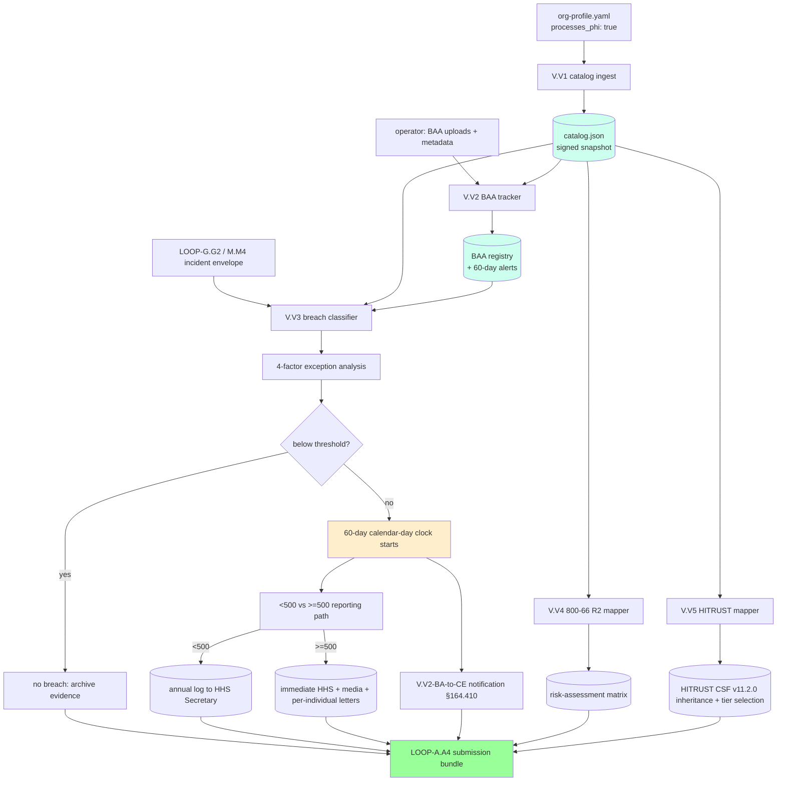

# LOOP-V — HIPAA Security Rule Compliance + BAA Tracker + Breach Notification Workflow + NIST SP 800-66 Rev 2 Crosswalk + HITRUST CSF v11.2.0 Mapping

> Comprehensive implementation specification for the five slices in
> LOOP-V. Authored as a stand-alone artifact: any future Claude / human
> session can execute LOOP-V end-to-end by reading only this file +
> the five supporting per-slice docs cited in §3.
>
> Authority: `cloud-evidence/CLAUDE.md` (REO standard) governs every
> slice. Every byte emitted must trace to real evidence — a public
> regulatory text, a live cloud-inventory query, a tracker-DB intake
> row, or operator-supplied configuration.
>
> LOOP-V is **conditional**: it fires only when the operator declares
> the CSP is a HIPAA Business Associate or Covered Entity. The
> `--hipaa` flag is the master orchestrator switch.

## 1. Mission & scope

### 1.1 Why LOOP-V exists (the audit story)

FedRAMP authorization does not by itself satisfy HIPAA. Any CSP whose
tenants are HIPAA Covered Entities (CEs) — health plans, healthcare
clearinghouses, and healthcare providers that transmit health
information electronically — and that processes Protected Health
Information on behalf of those CEs is a Business Associate (BA) under
45 CFR §164.502(e). The FOURTH-PASS-AUDIT.md surfaced this as a gap:
prior loops treated PHI as one of many `data_classes[]` tags without a
dedicated workflow for the Security Rule's required + addressable
implementation specifications, the Business Associate Agreement
lifecycle, the Breach Notification Rule's 4-factor risk assessment, the
60-calendar-day clock, or the NIST SP 800-66 Rev 2 implementation
guidance.

LOOP-V closes the gap. V.V1 ingests the Security Rule control catalog
(45 CFR §164 Subpart C, §§164.302-318) with the Required vs Addressable
classification + NIST 800-53 Rev 5 cross-walk. V.V2 tracks Business
Associate Agreements with expiration alerts and the canonical BAA
template. V.V3 implements the Breach Notification workflow (45 CFR
§164 Subpart D, §§164.400-414) with the §164.402(2) 4-factor exception
analysis, the §164.404 60-calendar-day individual notification clock,
the §164.406 media-notice threshold for breaches affecting more than
500 residents of a state or jurisdiction, the §164.408 Secretary
notification path (annual log for <500, immediate for >=500), and the
§164.410 Business-Associate-to-Covered-Entity notification chain. V.V4
crosswalks the catalog to NIST SP 800-66 Rev 2 (the Feb 2024 revision
of the HIPAA Security Rule implementation guide). V.V5 maps the
catalog onto HITRUST CSF v11.2.0 with e1 / i1 / r2 assessment-tier
selection.

### 1.2 What LOOP-V delivers

A FedPy operator who turns on `--hipaa` and supplies the per-org
configuration (CE / BA designation, organization-NPI, BAA registry,
signing-officer identities, HITRUST assessor) gets:

1. The HIPAA Security Rule control catalog (V.V1) — canonical JSON of
   every Administrative / Physical / Technical / Organizational /
   Policies-and-Procedures safeguard, each with the Required vs
   Addressable classification, NIST 800-53 Rev 5 cross-walk, and
   FedRAMP Moderate baseline mapping.

2. The BAA Tracker (V.V2) — every BAA in force, expiration dates,
   covered services, signed-BAA file, last-audit date, automatic
   60-day-to-expiration alerts. Canonical BAA template emission per
   the HHS-published sample Business Associate Agreement provisions.

3. The Breach Notification Workflow (V.V3) — 4-factor risk assessment
   per §164.402(2); affected-individual count; <500 vs >=500 reporting
   path; signed per-individual notification letters (.docx); HHS
   Secretary submission; media notice for state/jurisdiction with >500
   affected; BA-to-CE notification per §164.410 within 60 days. Tracker
   DB countdown timers; PagerDuty escalation.

4. The NIST SP 800-66 Rev 2 Crosswalk (V.V4) — the Feb 2024 NIST
   guidance maps each Security Rule standard to NIST SP 800-53 Rev 5
   controls and provides risk-assessment + risk-management guidance.

5. The HITRUST CSF v11.2.0 Inheritance Mapping (V.V5) — maps V.V1 +
   LOOP-B FedRAMP Moderate controls onto HITRUST CSF v11.2.0; e1 /
   i1 / r2 assessment-tier selection per the CSP's risk profile.

6. POA&M items, OSCAL Component Definition fragments, tracker DB
   rows, submission-bundle catalogue entries, and signed evidence
   envelopes for every output above.

### 1.3 What LOOP-V does NOT do

- LOOP-V does NOT execute HIPAA Privacy Rule (45 CFR §164 Subpart E)
  in detail. Privacy Rule cross-references (§164.502 use/disclosure,
  §164.504 BAA contract requirements) appear in the V.V1 catalog
  metadata and inform V.V2 / V.V3 but are not separately operationalized
  beyond what the Security Rule + Breach Rule require.
- LOOP-V does NOT cover state-PII outside PHI. State PII without PHI
  is LOOP-U. When a single record carries both PHI and state PII, both
  loops fire (see Cross-references §11).
- LOOP-V does NOT cover FTC Health Breach Notification Rule (HBN; 16
  CFR Part 318) — that regime applies to non-HIPAA-covered health-app
  entities and is cross-referenced but not separately operationalized.
- LOOP-V does NOT submit on the operator's behalf to HHS OCR. The
  V.V3 submitter emits a signed submission package; the operator (or
  HIPAA Privacy Officer) transmits per §164.408 procedures.
- LOOP-V does NOT cover Substance Use Disorder records (42 CFR Part 2)
  — that is a separate confidentiality regime referenced in V.V1
  metadata but not separately operationalized.

### 1.4 How LOOP-V is distinct from neighbour loops

| Neighbour | Coverage | LOOP-V overlap | Distinction |
|---|---|---|---|
| LOOP-U (Privacy) | State PII + GDPR + FERPA + COPPA + GLBA | Breach notification for records that are both PHI + state PII | LOOP-U covers non-PHI personal data; LOOP-V covers PHI |
| LOOP-G.G2 / M.M4 (CIRCIA / DFARS 7012) | Cyber-incident reporting | All three may fire on the same incident | LOOP-V emits *individual* per-affected notifications; G.G2/M.M4 handle agency reports |
| LOOP-B (control benchmark) | NIST 800-53 catalogs | V.V4 + V.V5 cross-walk to LOOP-B | LOOP-V adds HIPAA + HITRUST overlays on top |
| LOOP-Z.Z4 (ISO 27018) | PII processor controls | 27018 references V.V1 for PHI overlay | LOOP-Z.Z4 is audit/cert standard; LOOP-V is statutory |

### 1.5 Authoritative scope guard (REO-locked)

Every byte LOOP-V emits is one of:
1. A constant from the canonical HIPAA Security Rule catalog (V.V1)
   seeded from 45 CFR §164 Subpart C public regulatory text.
2. A canonical BAA template clause from the HHS-published sample BAA
   (HHS OCR, "Sample Business Associate Agreement Provisions").
3. An operator-uploaded signed BAA file with metadata (covered entity
   name, signed date, expires date, scope of services).
4. A computed Required-vs-Addressable decision from the §164.306(d)
   flexibility framework applied to operator-declared organizational
   factors.
5. An incoming incident envelope from G.G2 / M.M4 (real or fixture).
6. A real DSAR / breach-individual record from tracker DB (real or
   fixture).
7. Operator-supplied configuration via REQUIRES-OPERATOR-INPUT.

No stubs. No placeholder PHI. No invented BAA clauses. No invented
HHS guidance.

### 1.6 Operational defaulting

`--hipaa` is the master orchestrator switch. When set:
- V.V1 always runs (catalog + signed snapshot).
- V.V2 runs when the operator has any BAAs registered (or expects to).
- V.V3 runs when (a) `--hipaa` is on AND (b) G.G2 / M.M4 incident
  intake is active in the orchestrator pipeline.
- V.V4 runs whenever V.V1 runs (cross-walk is informational; cheap).
- V.V5 runs only when operator declares `seeks_hitrust: true`.

## 2. Statutory & regulatory drivers (verbatim quotes; pinned URLs)

Access date for this spec: **2026-06-08**.

### 2.1 HIPAA Security Rule — 45 CFR §164 Subpart C

**Pin:** https://www.ecfr.gov/current/title-45/subtitle-A/subchapter-C/part-164/subpart-C
**Authority:** Standards for the Security of Electronic Protected
Health Information, 45 CFR §§164.302-318, originally promulgated
68 FR 8334 (Feb 20, 2003), as amended by the HITECH-implementing
HIPAA Omnibus Rule, 78 FR 5566 (Jan 25, 2013).

> "§164.306 Security standards: General rules.
> (a) General requirements. Covered entities and business associates
> must do the following:
> (1) Ensure the confidentiality, integrity, and availability of all
> electronic protected health information the covered entity or
> business associate creates, receives, maintains, or transmits.
> (2) Protect against any reasonably anticipated threats or hazards to
> the security or integrity of such information.
> (3) Protect against any reasonably anticipated uses or disclosures of
> such information that are not permitted or required under subpart E
> of this part.
> (4) Ensure compliance with this subpart by its workforce."
> — 45 CFR §164.306(a)

> "(b) Flexibility of approach. (1) Covered entities and business
> associates may use any security measures that allow the covered
> entity or business associate to reasonably and appropriately
> implement the standards and implementation specifications as
> specified in this subpart. (2) In deciding which security measures
> to use, a covered entity or business associate must take into
> account the following factors: (i) The size, complexity, and
> capabilities of the covered entity or business associate. (ii) The
> covered entity's or the business associate's technical
> infrastructure, hardware, and software security capabilities.
> (iii) The costs of security measures. (iv) The probability and
> criticality of potential risks to electronic protected health
> information."
> — 45 CFR §164.306(b)

> "(d) Implementation specifications. In this subpart: (1) Implementation
> specifications are required or addressable. If an implementation
> specification is required, the word 'Required' appears in parentheses
> after the title of the implementation specification. If an
> implementation specification is addressable, the word 'Addressable'
> appears in parentheses after the title of the implementation
> specification."
> — 45 CFR §164.306(d)

> "§164.308 Administrative safeguards.
> (a)(1)(i) Standard: Security management process. Implement policies
> and procedures to prevent, detect, contain, and correct security
> violations.
> (ii) Implementation specifications:
> (A) Risk analysis (Required). Conduct an accurate and thorough
> assessment of the potential risks and vulnerabilities to the
> confidentiality, integrity, and availability of electronic protected
> health information held by the covered entity or business associate.
> (B) Risk management (Required). Implement security measures
> sufficient to reduce risks and vulnerabilities to a reasonable and
> appropriate level to comply with §164.306(a)."
> — 45 CFR §164.308(a)(1)

> "§164.310 Physical safeguards.
> (a)(1) Standard: Facility access controls. Implement policies and
> procedures to limit physical access to its electronic information
> systems and the facility or facilities in which they are housed,
> while ensuring that properly authorized access is allowed."
> — 45 CFR §164.310(a)(1)

> "§164.312 Technical safeguards.
> (a)(1) Standard: Access control. Implement technical policies and
> procedures for electronic information systems that maintain
> electronic protected health information to allow access only to
> those persons or software programs that have been granted access
> rights as specified in §164.308(a)(4)."
> — 45 CFR §164.312(a)(1)

> "(e)(1) Standard: Transmission security. Implement technical
> security measures to guard against unauthorized access to electronic
> protected health information that is being transmitted over an
> electronic communications network.
> (2) Implementation specifications:
> (i) Integrity controls (Addressable). Implement security measures
> to ensure that electronically transmitted electronic protected
> health information is not improperly modified without detection
> until disposed of.
> (ii) Encryption (Addressable). Implement a mechanism to encrypt
> electronic protected health information whenever deemed appropriate."
> — 45 CFR §164.312(e)

> "§164.314 Organizational requirements.
> (a)(1) Standard: Business associate contracts or other arrangements.
> (i) The contract or other arrangement between the covered entity and
> the business associate required by §164.308(b)(3) must meet the
> requirements of paragraph (a)(2)(i) or (a)(2)(ii) of this section,
> as applicable."
> — 45 CFR §164.314(a)(1)

> "§164.316 Policies and procedures and documentation requirements.
> (a) Standard: Policies and procedures. Implement reasonable and
> appropriate policies and procedures to comply with the standards,
> implementation specifications, or other requirements of this subpart
> ..."
> — 45 CFR §164.316(a)

**Operational consequence:** V.V1 catalog ingests all 18 standards
across §§164.308 / 310 / 312 / 314 / 316 with the Required (R) vs
Addressable (A) classification baked in. V.V4 maps each standard to
NIST SP 800-53 Rev 5 controls per the 800-66 Rev 2 appendix.

### 2.2 HIPAA Breach Notification Rule — 45 CFR §164 Subpart D

**Pin:** https://www.ecfr.gov/current/title-45/subtitle-A/subchapter-C/part-164/subpart-D
**Authority:** Notification in the Case of Breach of Unsecured
Protected Health Information, 45 CFR §§164.400-414, promulgated under
HITECH Act §13402 (42 USC §17932), originally 74 FR 42740 (Aug 24,
2009), as amended by the HIPAA Omnibus Rule 78 FR 5566 (Jan 25, 2013).

> "§164.402 Definitions.
> Breach means the acquisition, access, use, or disclosure of
> protected health information in a manner not permitted under subpart
> E of this part which compromises the security or privacy of the
> protected health information.
> (1) Breach excludes:
> (i) Any unintentional acquisition, access, or use of protected
> health information by a workforce member or person acting under the
> authority of a covered entity or a business associate, if such
> acquisition, access, or use was made in good faith and within the
> scope of authority and does not result in further use or disclosure
> in a manner not permitted under subpart E of this part."
> — 45 CFR §164.402

> "(2) Except as provided in paragraph (1) of this definition, an
> acquisition, access, use, or disclosure of protected health
> information in a manner not permitted under subpart E is presumed to
> be a breach unless the covered entity or business associate, as
> applicable, demonstrates that there is a low probability that the
> protected health information has been compromised based on a risk
> assessment of at least the following factors:
> (i) The nature and extent of the protected health information
> involved, including the types of identifiers and the likelihood of
> re-identification;
> (ii) The unauthorized person who used the protected health
> information or to whom the disclosure was made;
> (iii) Whether the protected health information was actually acquired
> or viewed; and
> (iv) The extent to which the risk to the protected health information
> has been mitigated."
> — 45 CFR §164.402(2) (the "4-factor exception" / "4-factor risk
> assessment")

> "§164.404 Notification to individuals.
> (a) Standard.
> (1) General rule. A covered entity shall, following the discovery of
> a breach of unsecured protected health information, notify each
> individual whose unsecured protected health information has been, or
> is reasonably believed by the covered entity to have been, accessed,
> acquired, used, or disclosed as a result of such breach.
> (b) Implementation specifications: Timeliness of notification.
> Except as provided in §164.412, a covered entity shall provide the
> notification required by paragraph (a) of this section without
> unreasonable delay and in no case later than 60 calendar days after
> discovery of a breach."
> — 45 CFR §164.404(a), (b)

> "§164.406 Notification to the media.
> (a) Standard. For a breach of unsecured protected health information
> involving more than 500 residents of a State or jurisdiction, a
> covered entity shall, following the discovery of the breach as
> provided in §164.404(a)(2), notify prominent media outlets serving
> the State or jurisdiction."
> — 45 CFR §164.406(a)

> "§164.408 Notification to the Secretary.
> (a) Standard. A covered entity shall, following the discovery of a
> breach of unsecured protected health information as provided in
> §164.404(a)(2), notify the Secretary.
> (b) Implementation specifications: Breaches involving 500 or more
> individuals. For breaches of unsecured protected health information
> involving 500 or more individuals, a covered entity shall, except as
> provided in §164.412, provide the notification required by
> paragraph (a) of this section contemporaneously with the notice
> required by §164.404(a) and in the manner specified on the HHS Web
> site.
> (c) Implementation specifications: Breaches involving less than 500
> individuals. For breaches of unsecured protected health information
> involving less than 500 individuals, a covered entity shall maintain
> a log or other documentation of such breaches and, not later than 60
> days after the end of each calendar year, provide the notification
> required by paragraph (a) of this section for breaches discovered
> during the preceding calendar year, in the manner specified on the
> HHS Web site."
> — 45 CFR §164.408

> "§164.410 Notification by a business associate.
> (a) Standard.
> (1) General rule. A business associate shall, following the
> discovery of a breach of unsecured protected health information,
> notify the covered entity of such breach.
> (b) Implementation specifications: Timeliness of notification.
> Except as provided in §164.412, a business associate shall provide
> the notification required by paragraph (a) of this section without
> unreasonable delay and in no case later than 60 calendar days after
> discovery of a breach."
> — 45 CFR §164.410(a), (b)

> "§164.412 Law enforcement delay.
> If a law enforcement official states to a covered entity or business
> associate that a notification, notice, or posting required under
> this subpart would impede a criminal investigation or cause damage
> to national security, a covered entity or business associate shall
> (a) If the statement is in writing and specifies the time for which
> a delay is required, delay such notification, notice, or posting for
> the time period specified by the official; or (b) If the statement
> is made orally, document the statement, including the identity of
> the official making the statement, and delay the notification,
> notice, or posting temporarily and no longer than 30 days from the
> date of the oral statement ..."
> — 45 CFR §164.412

**Operational consequence:** V.V3 implements the full §164.400-414
chain. The clock is **calendar days**, not business days — V.V3's
clock arithmetic does NOT use the federal-holiday calendar (unlike
LOOP-W.W3's FAR 52.204-25(d) 1-business-day clock). The 4-factor
exception in §164.402(2) requires operator-judgment input via U.U3-
style intake; V.V3 emits the unsigned classification with the 4-factor
analysis and routes to the operator for sign-off.

### 2.3 HIPAA Privacy Rule cross-references — §164.502, §164.504

**Pin:** https://www.ecfr.gov/current/title-45/subtitle-A/subchapter-C/part-164/subpart-E

> "§164.502 Uses and disclosures of protected health information:
> General rules.
> (e)(1)(i) Standard: Disclosures to business associates. A covered
> entity may disclose protected health information to a business
> associate and may allow a business associate to create, receive,
> maintain, or transmit protected health information on its behalf, if
> the covered entity obtains satisfactory assurances, in accordance
> with §164.504(e), that the business associate will appropriately
> safeguard the information."
> — 45 CFR §164.502(e)(1)(i)

> "§164.504(e) Business associate contracts.
> (1)(i) Standard: Business associate contracts. The contract or other
> arrangement required by §164.502(e)(2) must meet the requirements of
> paragraph (e)(2) or (e)(3) of this section, as applicable."
> — 45 CFR §164.504(e)(1)(i)

**Operational consequence:** V.V2 BAA tracker enforces §164.504(e)(2)
provisions. V.V1 catalog metadata cross-references §164.502 for the
permitted-uses/disclosures backdrop against which §164.402 "Breach"
is defined.

### 2.4 HITECH Act — 42 USC §17931-17954

**Pin:** https://uscode.house.gov/view.xhtml?path=/prelim@title42/chapter156&edition=prelim
**Authority:** Health Information Technology for Economic and Clinical
Health Act (HITECH), Title XIII of the American Recovery and
Reinvestment Act of 2009 (Pub. L. 111-5), Feb 17, 2009.

> "§17932. Notification in the case of breach.
> (a) In general. A covered entity that accesses, maintains, retains,
> modifies, records, stores, destroys, or otherwise holds, uses, or
> discloses unsecured protected health information shall, in the case
> of a breach of such information that is discovered by the covered
> entity, notify each individual whose unsecured protected health
> information has been, or is reasonably believed by the covered entity
> to have been, accessed, acquired, or disclosed as a result of such
> breach."
> — 42 USC §17932(a)

**Operational consequence:** V.V3 traces its statutory authority to
HITECH §13402 (codified at 42 USC §17932). The 45 CFR §164.400-414
regulatory text implements this statute.

### 2.5 NIST SP 800-66 Rev 2 (Feb 2024)

**Pin:** https://csrc.nist.gov/pubs/sp/800/66/r2/final
**Authority:** NIST Special Publication 800-66 Revision 2,
"Implementing the Health Insurance Portability and Accountability Act
(HIPAA) Security Rule: A Cybersecurity Resource Guide," published
February 2024 (supersedes SP 800-66 Rev 1 from 2008).

The Rev 2 guide reorganizes around the NIST Cybersecurity Framework
(Identify, Protect, Detect, Respond, Recover) and provides:
- Risk-assessment methodology (Section 3)
- Risk-management activities (Section 4)
- An appendix mapping each HIPAA Security Rule standard to NIST SP
  800-53 Rev 5 controls
- Implementation guidance for small / large organizations
- Cross-walk to NIST Cybersecurity Framework 2.0 (Feb 2024)

**Operational consequence:** V.V4 ingests the 800-66 Rev 2 mapping
appendix as `cloud-evidence/data/sp-800-66-r2-crosswalk.json` and
emits a per-control satisfaction matrix that the operator uses for
risk-assessment documentation under §164.308(a)(1)(ii)(A).

### 2.6 HITRUST CSF v11.2.0 (Apr 2024)

**Pin:** https://hitrustalliance.net/product-tool/hitrust-csf/
**Authority:** HITRUST Common Security Framework, Version 11.2.0,
released April 2024. Proprietary framework owned by HITRUST Alliance;
operator obtains license to use.

HITRUST CSF v11.2.0 organizes controls into 14 categories and 49
control objectives. The framework supports three assessment tiers:
- **e1** (essentials, 1-year validity) — entry-level baseline
- **i1** (intermediate, 1-year validity) — leading-practice baseline
- **r2** (risk-based, 2-year validity) — comprehensive, adjustable

**Operational consequence:** V.V5 maps V.V1 + LOOP-B (FedRAMP
Moderate) controls onto HITRUST CSF v11.2.0; emits inheritance
evidence + tier-selection rationale. The CSP's HITRUST assessor
consumes the V.V5 envelope as input to MyCSF assessment.

### 2.7 OCR enforcement + Resolution Agreements

**Pin:** https://www.hhs.gov/hipaa/for-professionals/compliance-enforcement/agreements/index.html
**Authority:** HHS Office for Civil Rights publishes Resolution
Agreements and Civil Money Penalties imposed under 45 CFR Part 160
Subpart D.

Recent enforcement themes (2023-2025) include:
- Failure to conduct accurate, thorough risk analysis (§164.308(a)(1)(ii)(A))
- Failure to implement access controls (§164.312(a))
- Failure to encrypt PHI at rest on mobile devices (§164.312(a)(2)(iv))
- Breach Notification Rule violations (untimely §164.404 individual
  notification; failure to notify Secretary per §164.408)
- BAA violations (missing or non-compliant per §164.504(e))

**Operational consequence:** V.V3 + V.V2 are designed to surface the
audit trail evidence that defeats these common enforcement
allegations.

### 2.8 OCR HIPAA Audit Protocol

**Pin:** https://www.hhs.gov/hipaa/for-professionals/compliance-enforcement/audit/protocol/index.html

The OCR Audit Protocol is the structured set of audit inquiries OCR
uses during a HIPAA audit. The protocol enumerates Established
Performance Criteria (EPC) for each Security Rule, Privacy Rule, and
Breach Notification Rule provision.

**Operational consequence:** V.V1 catalog includes the OCR Audit
Protocol EPC for each standard as `evidence_inquiry[]` metadata; V.V2
and V.V3 emit envelopes structured to satisfy those EPC inquiries.

### 2.9 21st Century Cures Act — Information Blocking — 45 CFR Part 171

**Pin:** https://www.ecfr.gov/current/title-45/subtitle-A/subchapter-D/part-171
**Authority:** 21st Century Cures Act (Pub. L. 114-255, Dec 13, 2016);
ONC Cures Act Final Rule, 85 FR 25642 (May 1, 2020).

> "§171.103 Information blocking.
> (a) Information blocking means a practice that — except as required
> by law or covered by an exception set forth in subpart B or subpart
> D of this part — is likely to interfere with access, exchange, or
> use of electronic health information ..."
> — 45 CFR §171.103(a)

**Operational consequence:** Cross-reference only. The Information
Blocking regime applies to health IT developers, HINs / HIEs, and
healthcare providers; a CSP-as-BA is typically not the regulated
actor but may host data subject to the regime. V.V1 metadata flags
Information Blocking applicability for operator awareness.

### 2.10 CMS Interoperability and Patient Access Final Rule

**Pin:** https://www.cms.gov/regulations-guidance/guidance/interoperability
**Authority:** 85 FR 25510 (May 1, 2020); subsequent amendments.

**Operational consequence:** Cross-reference only. The Rule requires
CMS-regulated plans to implement specific APIs for patient access;
CSP-as-BA may host the APIs but is not the regulated payor.

## 3. Slice list

| id   | title                                                                          | status   | commit | dependencies                  | estimated_effort |
|------|--------------------------------------------------------------------------------|----------|--------|-------------------------------|------------------|
| V.V1 | HIPAA Security Rule Control Catalog (§164.308/310/312/314/316) — Required + Addressable + NIST 800-53 R5 cross-walk | proposed | TBD | A.A5 | ~6 working days |
| V.V2 | Business Associate Agreement (BAA) Tracker + canonical BAA template emitter   | proposed | TBD | V.V1, A.A4, A.A5, tracker     | ~5 working days  |
| V.V3 | Breach Notification Workflow (4-factor + 60-day calendar-day clock + <500 vs >=500 reporting paths + BA-to-CE chain) | proposed | TBD | V.V1, V.V2, G.G2, M.M4, A.A5  | ~7 working days  |
| V.V4 | NIST SP 800-66 Rev 2 Crosswalk + risk-assessment matrix                        | proposed | TBD | V.V1, LOOP-B                  | ~5 working days  |
| V.V5 | HITRUST CSF v11.2.0 Inheritance Mapping + e1/i1/r2 tier selector               | proposed | TBD | V.V1, LOOP-B                  | ~6 working days  |

Per-slice docs:
- `cloud-evidence/docs/slices/V/V.V1.md` (1005 lines on disk)
- `cloud-evidence/docs/slices/V/V.V2.md` (1347 lines on disk)
- `cloud-evidence/docs/slices/V/V.V3.md` (1397 lines on disk)
- `cloud-evidence/docs/slices/V/V.V4.md` (849 lines on disk)
- `cloud-evidence/docs/slices/V/V.V5.md` (1382 lines on disk)

## 4. Authoritative sources (full list)

| Source                                | Pinned URL                                                                                                       | Accessed   |
|---------------------------------------|------------------------------------------------------------------------------------------------------------------|------------|
| HIPAA Security Rule 45 CFR §164 Sub C | https://www.ecfr.gov/current/title-45/subtitle-A/subchapter-C/part-164/subpart-C                                 | 2026-06-08 |
| HIPAA Breach Notif. 45 CFR §164 Sub D | https://www.ecfr.gov/current/title-45/subtitle-A/subchapter-C/part-164/subpart-D                                 | 2026-06-08 |
| HIPAA Privacy Rule §164 Sub E         | https://www.ecfr.gov/current/title-45/subtitle-A/subchapter-C/part-164/subpart-E                                 | 2026-06-08 |
| HITECH Act 42 USC §17931-17954        | https://uscode.house.gov/view.xhtml?path=/prelim@title42/chapter156&edition=prelim                               | 2026-06-08 |
| HITECH §13402 (42 USC §17932)         | https://uscode.house.gov/view.xhtml?req=granuleid:USC-prelim-title42-section17932                                | 2026-06-08 |
| NIST SP 800-66 Rev 2 (Feb 2024)       | https://csrc.nist.gov/pubs/sp/800/66/r2/final                                                                    | 2026-06-08 |
| NIST CSF 2.0 (Feb 26, 2024)           | https://csrc.nist.gov/pubs/cswp/29/the-nist-cybersecurity-framework-csf-20/final                                 | 2026-06-08 |
| HITRUST CSF v11.2.0                   | https://hitrustalliance.net/product-tool/hitrust-csf/                                                            | 2026-06-08 |
| OCR Resolution Agreements             | https://www.hhs.gov/hipaa/for-professionals/compliance-enforcement/agreements/index.html                         | 2026-06-08 |
| OCR HIPAA Audit Protocol              | https://www.hhs.gov/hipaa/for-professionals/compliance-enforcement/audit/protocol/index.html                     | 2026-06-08 |
| HHS Sample BAA provisions             | https://www.hhs.gov/hipaa/for-professionals/covered-entities/sample-business-associate-agreement-provisions/index.html | 2026-06-08 |
| 21st Century Cures Information Blocking | https://www.ecfr.gov/current/title-45/subtitle-A/subchapter-D/part-171                                         | 2026-06-08 |
| CMS Interop + Patient Access          | https://www.cms.gov/regulations-guidance/guidance/interoperability                                               | 2026-06-08 |
| HIPAA Omnibus Rule 78 FR 5566         | https://www.federalregister.gov/documents/2013/01/25/2013-01073/                                                 | 2026-06-08 |
| OCR Annual Report (Breaches)          | https://www.hhs.gov/hipaa/for-professionals/breach-notification/breach-reporting/index.html                      | 2026-06-08 |

## 5. Reusable primitives

| Primitive                                    | Source              | LOOP-V usage                                                  |
|----------------------------------------------|---------------------|----------------------------------------------------------------|
| Ed25519 signing + RFC 3161 TST               | LOOP-A.A5           | V.V1 catalog snapshot, V.V2 BAA registry, V.V3 breach env, V.V4/V.V5 crosswalks |
| Canonical JSON (RFC 8785)                    | LOOP-A.A5           | All envelopes                                                  |
| Submission bundle catalogue                  | LOOP-A.A4           | V.V2/V.V3 register WELL_KNOWN roles                            |
| OSCAL POA&M v1.1.2 emitter                   | LOOP-A.A1           | HIPAA-control-gap findings flow to POA&M                       |
| OOXML / zip-store .docx emitter              | core/oscal-ssp-docx | Canonical BAA template, breach letters, HHS Secretary submission |
| Composite risk scorer                        | LOOP-B.B1           | HIPAA POA&M items pick up composite risk                       |
| Control benchmark (NIST 800-53 Rev 5)        | LOOP-B              | V.V4 + V.V5 cross-walk source                                  |
| Inventory backbone                           | LOOP-INV-S          | V.V1 reads `assets[].data_classes[]` for PHI tags              |
| Incident envelope intake                     | LOOP-G.G2 + M.M4    | V.V3 breach trigger                                            |
| Tracker DB schema (migrations)               | tracker             | BAA registry, breach log, attestation status                   |
| Slack + PagerDuty                            | core/notify.ts      | Breach-clock alerts, BAA-expiration alerts                     |

## 6. Data flow diagram

## 7. Test strategy

### 7.1 Per-slice unit tests
Each per-slice doc specifies ≥15 unit tests; aggregate target ≥75
across LOOP-V.

### 7.2 Integration tests
| id | scenario | expected |
|----|----------|----------|
| INT-V-01 | catalog -> BAA registry -> 60-day-to-expiration alert | alert fires; operator notified |
| INT-V-02 | incident -> 4-factor classifier -> >=500 affected -> immediate HHS + media + letters | full notification stream emitted within clock |
| INT-V-03 | incident -> 4-factor classifier -> <500 affected -> annual log | log entry created; year-end submission stub emitted |
| INT-V-04 | BA discovers breach Day 0; BA-to-CE notification within 60 calendar days | §164.410 envelope emitted; CE receives on Day N <= 60 |
| INT-V-05 | encryption Safe Harbor §164.402(1)(i) — encrypted-and-stolen disk | breach exception applies; no notification required |
| INT-V-06 | LE delay invocation per §164.412 (oral statement, max 30 days) | clock paused; resumes |
| INT-V-07 | catalog -> 800-66 R2 crosswalk -> NIST 800-53 R5 control overlay | per-control satisfaction matrix valid |
| INT-V-08 | catalog -> HITRUST v11.2.0 -> r2 tier selection | inheritance matrix valid; operator-supplied tier rationale included |
| INT-V-09 | LOOP-U state PII + LOOP-V PHI overlap on same incident | both U.U5 + V.V3 fire; submission bundle includes both stream sets |
| INT-V-10 | OCR audit protocol EPC retrieval for §164.308(a)(1) | catalog returns full EPC list for the standard |

### 7.3 Adversarial / chaos tests
- Calendar-day clock arithmetic across weekends + federal holidays
  (HIPAA uses calendar days; NO holiday skip)
- DST transitions (Mar 8, Nov 1)
- Multi-state breach with affected-individual count crossing >500
  threshold mid-incident
- BAA expiration on incident-discovery day
- HITRUST CSF tier downgrade mid-engagement
- 4-factor classifier disagreement between operator + 3PAO

### 7.4 Regression tests
HHS regulatory updates tracked in catalog version; CI guardrail blocks
catalog changes that lack operator-signed acceptance.

## 8. Risks summary

Full register: `cloud-evidence/docs/loops/LOOP-V-RISKS.md` (1309 lines,
17+ cross-cutting + per-slice risks). High-severity highlights:

| Risk | Severity | Mitigation |
|---|---|---|
| BAA tracking drift (expired BAA in production) | Critical | V.V2 60-day alerts + PagerDuty escalation |
| Breach 4-factor risk-assessment misclassification | Critical | Operator + 3PAO dual sign-off; OCR Audit Protocol EPC trace |
| 60-day calendar-day clock miss for >=500 individuals | Critical | V.V3 T-14d / T-7d / T-1d PagerDuty alerts |
| 800-66 Rev 2 vs Rev 1 crosswalk drift | Medium | Catalog versioning + checksum |
| HITRUST CSF tier mismatch with assessment scope | Medium | Operator-supplied tier rationale + assessor sign-off |
| OCR Audit Protocol EPC drift | Medium | Quarterly catalog refresh |
| PHI inventory false-negative (untagged PHI store) | High | V.V1 quarterly inventory reconciliation; alarm on untagged sensitive-port |
| BA-to-CE notification delay | High | tracker DB clock + automated reminder to BA Security Officer |
| Breach letter content non-compliance with §164.404(c) | High | template enforces §164.404(c)(1)-(4) sections |
| 21st Century Cures Information Blocking exposure | Medium | Operator awareness; cross-reference in BAA template |

## 9. Open questions

1. **Substance Use Disorder (42 CFR Part 2)** — Should this be a
   dedicated V.V6 slice or remain a cross-reference?
2. **FTC Health Breach Notification Rule (16 CFR Part 318)** — Apply
   if CSP hosts non-HIPAA health-app data? Currently cross-referenced
   only.
3. **HHS OCR proposed HIPAA Security Rule update (2024 NPRM)** — When
   final, will require catalog refresh + V.V4 800-66 R2 update.
4. **State-specific health-data laws** (CA CMIA, MA 940 CMR 28, WA My
   Health My Data Act) — overlap with LOOP-U; need clear routing rule.
5. **Hybrid entity §164.504(b) designations** — Should V.V1 catalog
   track per-component PHI-scope designations?
6. **Right of Access (§164.524) DSAR** — Overlaps with LOOP-U.U3; need
   integration test.

## 10. Glossary deltas (terms added by LOOP-V)

- 4-factor exception (45 CFR §164.402(2))
- Addressable (HIPAA implementation specification)
- BAA — Business Associate Agreement
- Breach (HIPAA, §164.402)
- Business Associate
- Covered Entity
- Designated Record Set
- Discovery (of a breach)
- Electronic Protected Health Information (ePHI)
- Encryption Safe Harbor (§164.402(1)(i))
- HHS OCR — Office for Civil Rights
- HITECH Act §13402
- HITRUST CSF v11.2.0 e1/i1/r2 tiers
- Implementation Specification (Required vs Addressable)
- Law Enforcement Delay (§164.412)
- NIST SP 800-66 Rev 2
- PHI — Protected Health Information
- Resolution Agreement (OCR enforcement)
- Sample BAA (HHS-published)
- Standard (Security Rule)
- Subpart C / D / E (45 CFR §164)
- Unsecured PHI

All terms appear in `cloud-evidence/docs/GLOSSARY.md`.

## 11. Cross-references

- **LOOP-U (Privacy)** — When a record carries both PHI + state PII,
  V.V3 + U.U5 both fire. Coordination via tracker DB + G.G2/M.M4.
- **LOOP-G.G2 (incident reporter)** — V.V3 consumes G.G2 incident
  classification.
- **LOOP-M.M4 (CIRCIA extension)** — multi-disclosure coordination
  (CIRCIA 72h + DFARS 7012 72h + GDPR 33 72h + HIPAA 60 calendar days).
- **LOOP-A.A1 / A.A4 / A.A5** — POA&M + bundling + signing.
- **LOOP-B** — V.V4 + V.V5 cross-walk source.
- **LOOP-INV-S** — PHI-tagged datastore enumeration.
- **LOOP-Z.Z4 (ISO 27018)** — PHI / PII overlap.
- **CIRCIA-WORKFLOW.md §9.1** — Multi-disclosure coordination table.
- **G.G2-CIRCIA-EXTENSION.md / G.G2-SEC-8K-EXTENSION.md** — Coordinate
  cyber-incident + SEC 8-K + state-AG + HIPAA notifications.

## 12. Status table

| Slice | Title                                              | Status   | Commit | Spec                          | Doc                                  | Depends                       | Last updated |
|-------|----------------------------------------------------|----------|--------|-------------------------------|--------------------------------------|-------------------------------|--------------|
| V.V1  | HIPAA Security Rule Control Catalog                | proposed | TBD    | `docs/loops/LOOP-V-SPEC.md`   | `docs/slices/V/V.V1.md` (1005 lines) | A.A5                          | 2026-06-08   |
| V.V2  | Business Associate Agreement Tracker               | proposed | TBD    | `docs/loops/LOOP-V-SPEC.md`   | `docs/slices/V/V.V2.md` (1347 lines) | V.V1, A.A4, A.A5, tracker     | 2026-06-08   |
| V.V3  | Breach Notification Workflow                       | proposed | TBD    | `docs/loops/LOOP-V-SPEC.md`   | `docs/slices/V/V.V3.md` (1397 lines) | V.V1, V.V2, G.G2, M.M4, A.A5  | 2026-06-08   |
| V.V4  | NIST SP 800-66 Rev 2 Crosswalk                     | proposed | TBD    | `docs/loops/LOOP-V-SPEC.md`   | `docs/slices/V/V.V4.md` (849 lines)  | V.V1, LOOP-B                  | 2026-06-08   |
| V.V5  | HITRUST CSF v11.2.0 Inheritance Mapping            | proposed | TBD    | `docs/loops/LOOP-V-SPEC.md`   | `docs/slices/V/V.V5.md` (1382 lines) | V.V1, LOOP-B                  | 2026-06-08   |

## 13. Completion + push directive

Each slice in LOOP-V, upon completion, MUST follow the 7-step
procedure in `cloud-evidence/docs/SLICE-COMPLETION-PROCEDURE.md`:

1. `npm run typecheck` passes
2. `npm test -- <slice>` passes
3. `npm run check:reo` passes
4. Update `cloud-evidence/docs/STATUS.md` (slice row: status -> done,
   commit hash, last_updated)
5. Update this LOOP-V-SPEC.md §3 + §12 status table (commit hash,
   status -> done)
6. Append `CHANGELOG.md` entry
7. Commit with `V.V<N>:` in subject line + Co-Authored-By trailer
8. **Push to origin/main; verify with `git log --oneline -3`; only
   THEN is the slice closed.**

If a new permanent reference document is created during a V.V* slice
implementation, add it to the reading list in `cloud-evidence/CLAUDE.md`.

This directive is the LOOP-V-scope amplification of the `cloud-evidence/CLAUDE.md`
"Slice-completion directive" block at line ~230 (added in commit
`f0cfed7`).

---

**END OF LOOP-V-SPEC.md**
