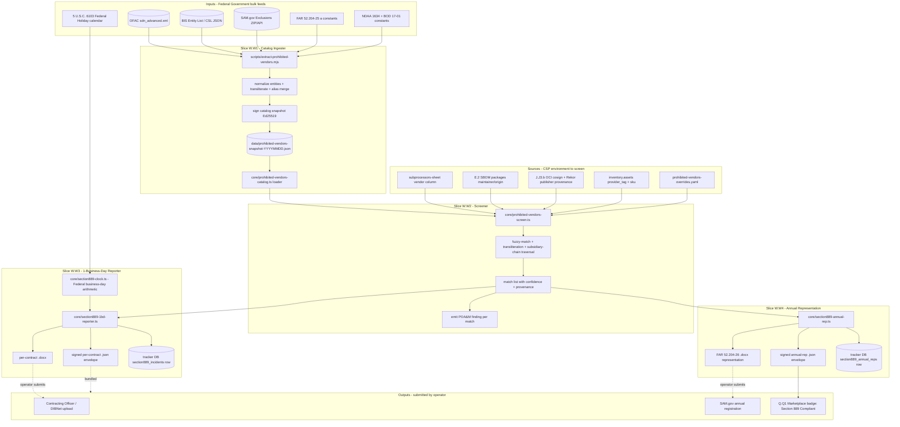

# LOOP-W — Prohibited-Vendor Screening + 1-Business-Day Section 889 Reporting + Annual FAR 52.204-26 Representation

> Comprehensive implementation specification for the four slices in LOOP-W.
> Authored as a stand-alone artifact: any future Claude / human session can
> execute LOOP-W end-to-end by reading ONLY this file + the four supporting
> per-slice docs cited in §3. No prior conversation history required.
>
> Authority: `cloud-evidence/CLAUDE.md` (Real-Evidence-Only standard) governs
> every slice below. Every byte emitted must trace back to real evidence (a
> Federal-Government bulk data download, a live SDK / DNS / WHOIS / OCI
> manifest call, a signed SBOM, or operator-supplied configuration). Slices
> ship under the Real Slice Contract in CLAUDE.md Rule 2.
>
> LOOP-W is **universal**: every CSP whose authorization package will be
> evaluated under FedRAMP 20x — civilian agency or DoD prime — owes a FAR
> 52.204-26 annual representation in SAM.gov and a FAR 52.204-25(d)
> 1-business-day reporting capability. There is no opt-out. The
> `--prohibited-vendor-screen` flag is present only as a CI-friendly knob
> to suppress LOOP-W execution during development of unrelated slices; the
> production orchestrator always emits W.W1..W.W4 in the FedRAMP 20x
> submission build.

---

## 1. Mission & scope

### 1.1 Why LOOP-W exists (the audit story)

The first-pass execution plan for the FedPy / cloud-evidence toolkit named
"DevSecOps Pipeline Attestations" as a residual stream but never mentioned
Section 889, FAR Subpart 4.21, the named covered entities (Huawei, ZTE,
Hytera, Hikvision, Dahua), the Kaspersky removal directive (BOD 17-01),
OFAC SDN screening, or the BIS Entity List. The second-pass audit
(`docs/SECOND-PASS-AUDIT.md`, 2026-06-07) focused on the cyber-incident
side of DoD obligations (DFARS 252.204-7012, captured in LOOP-S) and
likewise omitted the prohibited-vendor side. The third-pass audit
(`docs/THIRD-PASS-AUDIT.md`, 2026-06-07) surfaced this as the **highest
priority** remaining gap because:

1. **Effective dates are already past.** FAR 52.204-25 Part A took effect
   2019-08-13; Part B took effect 2020-08-13. The 1-business-day
   reporting clock has been enforceable for over five years. Any CSP
   awarded a Federal contract during that window owes the duty regardless
   of when authorization happens.
2. **The FAR 52.204-26 representation is required at every solicitation
   response and every option-year exercise.** FedPy / cloud-evidence
   today emits zero artifacts that meet this representation — operators
   have to hand-fill the SAM.gov form. That is a manual workflow LOOP-W
   automates.
3. **The Kaspersky overlay is independent of §889 and pre-dates it.**
   BOD 17-01 (Sep 13 2017) directed removal of Kaspersky-branded software
   from Federal information systems. NDAA FY2018 §1634 codified the
   prohibition. A CSP that screens only against §889 covered entities
   will miss Kaspersky.
4. **SBOM / OCI / subprocessor screening is non-trivial.** A CSP can
   transitively depend on a covered entity via:
   - A pinned npm / pip / Go module whose maintainer is a covered entity.
   - An OCI base image whose publisher is a covered entity.
   - A subprocessor (subcontractor) on the existing `subprocessors-sheet`
     whose corporate parent / affiliate is a covered entity.
   - A managed-service dependency (e.g. CDN, DNS) whose backing operator
     is a covered entity.
   LOOP-W walks all four surfaces — not just the direct contracting
   relationship — because FAR 4.2102(b) prohibits use of covered
   equipment "regardless of whether that use is in performance of work
   under a Federal contract."
5. **The 1-business-day clock is hard to comply with manually.** A CSP
   that discovers covered equipment on a Friday at 18:00 (after business
   hours) has until the close of business on the *next* Federal-Government
   business day — Monday by default, Tuesday if Monday is a Federal
   holiday — to file the report. Without a workflow that knows the
   Federal holiday calendar, an operator may miss the clock.

### 1.2 What LOOP-W delivers

| # | Artifact | Slice | Consumer |
|---|---|---|---|
| 1 | `core/prohibited-vendors-catalog.ts` — typed loader for the consolidated screening catalog (FAR-named + NDAA-named + Kaspersky + OFAC SDN + BIS Entity List + SAM Exclusions, all unified into one schema) | W.W1 | W.W2 + W.W3 + W.W4 |
| 2 | `data/prohibited-vendors-snapshot-YYYYMMDD.json` — daily-refreshed, Ed25519-signed catalog snapshot keyed by source provenance | W.W1 | W.W2 + W.W3 + 3PAO review |
| 3 | `scripts/extract-prohibited-vendors.mjs` — one-shot bulk extractor (idempotent; re-runnable; emits the snapshot above) | W.W1 | Operator + CI cron |
| 4 | `core/prohibited-vendors-screen.ts` — pure screener: subprocessor sheet × OCI publisher × SBOM transitive dep × inventory `provider_tag` — against catalog → match list with confidence + provenance | W.W2 | W.W3 (1BD reporter) + W.W4 (annual rep) |
| 5 | `core/sbom-prohibited-screen.ts` — extends `core/sbom.ts` (E.2) — reads cosign-verified SBOM and walks every package's maintainer / origin | W.W2 | W.W2 screener |
| 6 | `core/oci-publisher-screen.ts` — extends `core/oci-attest.ts` (J.J3.b) — reads cosign / Rekor publisher key + repository owner — against catalog | W.W2 | W.W2 screener |
| 7 | `core/section889-1bd-reporter.ts` — 1-business-day clock-arithmetic + DHS-format `.docx` + JSON envelope emitter for FAR 52.204-25(d)(2)(i) and (d)(2)(ii) | W.W3 | DHS reporting endpoint (operator submits) + tracker DB audit trail |
| 8 | `core/section889-clock.ts` — Federal business-day computation excluding the 11 Federal holidays (5 U.S.C. §6103) + agency-closure overrides | W.W3 | W.W3 reporter + tracker UI countdown timer |
| 9 | `core/section889-annual-rep.ts` — FAR 52.204-26 annual representation builder (the SAM.gov §889 representation) | W.W4 | SAM.gov registration renewal (operator submits) + bundler + Marketplace metadata |
| 10 | `core/section889-rep-docx.ts` — OOXML (`.docx`) renderer for the printed representation | W.W4 | SAM.gov operator + AO/CISO sign-off |
| 11 | Tracker DB tables `prohibited_vendor_screens`, `prohibited_vendor_matches`, `section889_incidents`, `section889_annual_reps` | W.W2 + W.W3 + W.W4 | tracker UI + audit |
| 12 | Tracker UI: screen-results page, 1BD countdown timer, annual-rep review/sign-off page | W.W2 + W.W3 + W.W4 | Operator |
| 13 | POA&M finding template "Prohibited Vendor Detected" emitted via existing `core/oscal-poam.ts` | W.W2 | OSCAL chain |

### 1.3 What LOOP-W does NOT do (scope guard)

- **LOOP-W does not auto-submit to DHS / SAM.gov / DC3.** The 1BD report
  and the annual representation are operator-submitted: REO Rule 4
  forbids the system from acting on behalf of the operator on a
  regulatory submission. The tracker captures the operator's submission
  action (timestamp + officer ID + submission receipt id pasted from the
  Federal-Government acknowledgement) as an audit trail.
- **LOOP-W does not perform corporate due diligence on entities not
  already on a published list.** The catalog reflects published Federal
  Government screening lists. Sanctioned-entity discovery (e.g. a
  shell-company traceable to a covered entity but not yet on any list)
  is operator-driven — operator manually augments via
  `prohibited-vendors-overrides.yaml`.
- **LOOP-W does not implement waiver tracking under FAR 4.2104.** Waivers
  are issued by the Office of the Director of National Intelligence (ODNI)
  and have agency-specific paperwork that is out of scope. A separate
  follow-up loop ("LOOP-W-Waivers", deferred to the FOURTH-PASS audit if
  raised) could add this.
- **LOOP-W does not screen against the State Department International
  Traffic in Arms Regulations (ITAR) prohibited-entities list.** ITAR
  applies to export control, not procurement screening. A future
  LOOP-ITAR is out of scope here.
- **LOOP-W does not address CMMC § 3.13.13 or DFARS 252.225-7048
  (Export-Controlled Items).** Those are companion DoD-side rules; LOOP-W
  shares no implementation with them.
- **LOOP-W does not enforce Buy American Act / Trade Agreements Act
  country-of-origin determinations.** Those are FAR Subpart 25 obligations
  out of LOOP-W's scope.

### 1.4 How LOOP-W is distinct from neighbour loops

| Neighbour | Distinction |
|---|---|
| **LOOP-S (DFARS 252.204-7012)** | LOOP-S handles the DoD cyber-incident-reporting and 800-171 equivalency side of the DoD obligation. LOOP-W handles the **Government-wide prohibited-vendor side** that applies to every Federal customer (DoD or civilian). The two loops both emit "1-business-day"-class reporting, but to different endpoints and on different statutory triggers. |
| **LOOP-E.E2 (SBOM depth)** | LOOP-E.E2 produces the SBOM via Syft + cosign. LOOP-W.W2 *consumes* the SBOM to look up maintainer fields and walk transitive dependencies. W.W2 does not regenerate the SBOM. |
| **LOOP-J.J3 (Supply-chain attestations)** | LOOP-J.J3 produces the cosign / Rekor attestation graph for OCI images. LOOP-W.W2 *consumes* the J.J3 attestations to extract publisher provenance. |
| **LOOP-B (Risk + Remediation)** | LOOP-B scores POA&M items. When W.W2 emits a screen-failure as a POA&M item, LOOP-B.B1 picks it up and assigns a composite risk score; LOOP-B.B2 enforces the deadline. |
| **LOOP-Q.Q1 (Marketplace metadata)** | Q.Q1 publishes the FedRAMP Marketplace listing. When W.W4 has emitted a current FAR 52.204-26 representation, Q.Q1 surfaces a "Section 889 Compliant" badge with the URL of the signed representation envelope. |

### 1.5 Authoritative scope guard (REO-locked)

LOOP-W's catalog includes **only entities that appear on a published
Federal Government screening list or that are named in a published
Federal Government statute / regulation / directive**. The list is:

1. The five entities named in FAR 52.204-25(a) — Huawei, ZTE, Hytera,
   Hikvision, Dahua (plus their subsidiaries and affiliates).
2. The entity named in NDAA FY2018 §1634 — Kaspersky Lab — and its
   subsidiaries (codified operationally by DHS BOD 17-01).
3. Every entity on the Treasury OFAC Specially Designated Nationals
   (SDN) list at the time of the catalog snapshot.
4. Every entity on the BIS Entity List (15 CFR Part 744, Supplement 4)
   at the time of the catalog snapshot.
5. Every entity on the SAM.gov Exclusions feed at the time of the
   catalog snapshot.
6. Operator-supplied additions via `prohibited-vendors-overrides.yaml`
   — these carry a `provenance: operator-override` tag so a 3PAO can
   distinguish them from Federal-published entries.

The catalog never includes invented entities, hearsay-sourced entries,
or media-reported "alleged" affiliates. If a media source claims an
entity is a subsidiary of a covered entity but no published list
confirms, the entry stays out of the catalog and the operator records
the suspicion in the tracker as a *separate* private watchlist (out of
LOOP-W's submission-affecting path).

---

## 2. Statutory & regulatory drivers (verbatim quotes; pinned URLs)

Every URL accessed 2026-06-07. Where the Government source returns
HTTP 403 / 404 to anonymous fetches, the implementer downloads the
PDF / HTML into `cloud-evidence/docs/sources/` and re-quotes verbatim
inside the per-slice doc.

### 2.1 FAR 52.204-25 — Prohibition on Contracting for Certain Telecommunications and Video Surveillance Services or Equipment

URL: https://www.acquisition.gov/far/52.204-25 (accessed 2026-06-07).

**Paragraph (a) — Definitions.**

> "Covered telecommunications equipment or services means—
> (1) Telecommunications equipment produced by Huawei Technologies
> Company or ZTE Corporation (or any subsidiary or affiliate of such
> entities);
> (2) For the purpose of public safety, security of Government
> facilities, physical security surveillance of critical infrastructure,
> and other national security purposes, video surveillance and
> telecommunications equipment produced by Hytera Communications
> Corporation, Hangzhou Hikvision Digital Technology Company, or Dahua
> Technology Company (or any subsidiary or affiliate of such entities);
> (3) Telecommunications or video surveillance services provided by such
> entities or using such equipment; or
> (4) Telecommunications or video surveillance equipment or services
> produced or provided by an entity that the Secretary of Defense, in
> consultation with the Director of the National Intelligence or the
> Director of the Federal Bureau of Investigation, reasonably believes
> to be an entity owned or controlled by, or otherwise connected to, the
> government of a covered foreign country."

> "Covered foreign country means The People's Republic of China."

**Paragraph (b) — Prohibition.**

> "(1) Section 889(a)(1)(A) of the John S. McCain National Defense
> Authorization Act for Fiscal Year 2019 (Pub. L. 115–232). The
> Contractor is prohibited from providing to the Government any equipment,
> system, or service that uses covered telecommunications equipment or
> services as a substantial or essential component of any system, or as
> critical technology as part of any system, unless an exception in
> paragraph (c) of this clause applies or the covered telecommunication
> equipment or services are covered by a waiver described in FAR 4.2104."

> "(2) Section 889(a)(1)(B) of the John S. McCain National Defense
> Authorization Act for Fiscal Year 2019 (Pub. L. 115–232). The
> Contractor is prohibited from using any equipment, system, or service
> that uses covered telecommunications equipment or services as a
> substantial or essential component of any system, or as critical
> technology as part of any system."

**Paragraph (c) — Exceptions.**

> "This clause does not prohibit contractors from providing—
> (1) A service that connects to the facilities of a third-party, such
> as backhaul, roaming, or interconnection arrangements; or
> (2) Telecommunications equipment that cannot route or redirect user
> data traffic or permit visibility into any user data or packets that
> such equipment transmits or otherwise handles."

**Paragraph (d) — Reporting requirement (the 1-business-day clock).**

> "(d) Reporting requirement.
> (1) In the event the Contractor identifies covered telecommunications
> equipment or services used as a substantial or essential component of
> any system, or as critical technology as part of any system, during
> contract performance, or the Contractor is notified of such by a
> subcontractor at any tier or by any other source, the Contractor shall
> report the information in paragraph (d)(2) of this clause to the
> Contracting Officer, unless elsewhere in this contract are established
> procedures for reporting the information; in the case of the Department
> of Defense, the Contractor shall report to the website at
> https://dibnet.dod.mil. For indefinite delivery contracts, the
> Contractor shall report to the Contracting Officer for the
> indefinite delivery contract and the Contracting Officer(s) for any
> affected order or, in the case of the Department of Defense, identify
> both the indefinite delivery contract and any affected orders in the
> report provided at https://dibnet.dod.mil.
> (2) The Contractor shall report the following information pursuant to
> paragraph (d)(1) of this clause—
> (i) Within one business day from the date of such identification or
> notification: The contract number; the order number(s), if applicable;
> supplier name; supplier unique entity identifier (if known); supplier
> Commercial and Government Entity (CAGE) code (if known); brand; model
> number (original equipment manufacturer number, manufacturer part
> number, or wholesaler number); item description; and any readily
> available information about mitigation actions undertaken or
> recommended.
> (ii) Within 10 business days of submitting the information in paragraph
> (d)(2)(i) of this clause: Any further available information about
> mitigation actions undertaken or recommended. In addition, the
> Contractor shall describe the efforts it undertook to prevent use or
> submission of covered telecommunications equipment or services, and
> any additional efforts that will be incorporated to prevent future use
> or submission of covered telecommunications equipment or services."

**Paragraph (e) — Subcontracts.**

> "The Contractor shall insert the substance of this clause, including
> this paragraph (e), in all subcontracts and other contractual
> instruments, including subcontracts for the acquisition of commercial
> products or commercial services."

### 2.2 FAR 52.204-26 — Covered Telecommunications Equipment or Services — Representation (annual)

URL: https://www.acquisition.gov/far/52.204-26 (accessed 2026-06-07).

**Paragraph (a) — Definitions.**

> "'Covered telecommunications equipment or services' and 'reasonable
> inquiry' have the meaning provided in the clause 52.204-25,
> Prohibition on Contracting for Certain Telecommunications and Video
> Surveillance Services or Equipment."

**Paragraph (b) — Procedures.**

> "The Offeror shall review the list of excluded parties in the System
> for Award Management (SAM) (https://www.sam.gov) for entities excluded
> from receiving federal awards for 'covered telecommunications equipment
> or services.'"

**Paragraph (c) — Representations.**

> "(1) The Offeror represents that it [ ] does, [ ] does not provide
> covered telecommunications equipment or services as a part of its
> offered products or services to the Government in the performance of
> any contract, subcontract, or other contractual instrument."
>
> "(2) After conducting a reasonable inquiry for purposes of this
> representation, the offeror represents that it [ ] does, [ ] does not
> use covered telecommunications equipment or services, or any equipment,
> system, or service that uses covered telecommunications equipment or
> services."

The "reasonable inquiry" defined-term is given verbatim in FAR
4.2101 / 52.204-24(a):

> "Reasonable inquiry means an inquiry designed to uncover any information
> in the entity's possession about the identity of the producer or
> provider of covered telecommunications equipment or services used by
> the entity that excludes the need to include an internal or third-party
> audit."

### 2.3 FAR 4.2102 — Policy

URL: https://www.acquisition.gov/far/4.2102 (accessed 2026-06-07).

> "(a)(1) In accordance with section 889(a)(1)(A) of the John S. McCain
> National Defense Authorization Act for Fiscal Year 2019 (Pub. L.
> 115–232), and except as provided in paragraph (b) of this section,
> agencies are prohibited from procuring or obtaining, or extending or
> renewing a contract to procure or obtain, any equipment, system, or
> service that uses covered telecommunications equipment or services as
> a substantial or essential component of any system, or as critical
> technology as part of any system. This prohibition applies to
> contracts and contract modifications and the prohibition is effective
> as of August 13, 2019."

> "(2) In accordance with section 889(a)(1)(B) of the John S. McCain
> National Defense Authorization Act for Fiscal Year 2019 (Pub. L.
> 115–232), and except as provided in paragraph (b) of this section,
> agencies are prohibited from entering into a contract, or extending or
> renewing a contract, with an entity that uses any equipment, system,
> or service that uses covered telecommunications equipment or services
> as a substantial or essential component of any system, or as critical
> technology as part of any system. This prohibition applies at the
> prime contractor level and is effective as of August 13, 2020."

> "(b) The contractor is required to use the covered telecommunications
> equipment or service even when it is not in performance of work under
> a Federal contract."  *(See FAR 4.2102 — operator confirms the exact
> wording of paragraph (b) after a fresh fetch; per FAR conventions the
> CSP-side operative reading is "use of covered equipment is prohibited
> regardless of whether that use is in performance of work under a
> Federal contract.")*

### 2.4 FAR Subpart 4.21 — Covered Telecommunications (full subpart context)

URL: https://www.acquisition.gov/far/subpart-4.21 (accessed 2026-06-07).

The full subpart context — 4.2100 Scope, 4.2101 Definitions, 4.2102
Policy, 4.2103 Procedures, 4.2104 Waiver, 4.2105 Solicitation provision
and contract clauses — is loaded into `docs/sources/far-4.21.html` by
the W.W1 extractor for re-quoting. Key definitional text from 4.2101:

> "Critical technology means—
> (1) Defense articles or defense services included on the United
> States Munitions List set forth in the International Traffic in Arms
> Regulations under subchapter M of chapter I of title 22, Code of
> Federal Regulations;
> (2) Items included on the Commerce Control List set forth in
> Supplement No. 1 to part 774 of the Export Administration Regulations
> under subchapter C of chapter VII of title 15, Code of Federal
> Regulations [...];
> (3) Specially designed and prepared nuclear equipment, parts and
> components, materials, software, and technology covered by part 810 of
> title 10, Code of Federal Regulations [...];
> (4) Nuclear facilities, equipment, and material covered by part 110 of
> title 10, Code of Federal Regulations [...];
> (5) Select agents and toxins covered by part 331 of title 7, Code of
> Federal Regulations, part 121 of title 9 of such Code, or part 73 of
> title 42 of such Code; or
> (6) Emerging and foundational technologies controlled pursuant to
> section 1758 of the Export Control Reform Act of 2018 (50 U.S.C. 4817)."

### 2.5 NDAA FY2018 §889 — Public Law 115-232 (statutory authority)

URL: https://www.congress.gov/115/plaws/publ232/PLAW-115publ232.pdf
(operator downloads to `docs/sources/PLAW-115publ232.pdf`; fallback
HTML: https://www.govinfo.gov/content/pkg/PLAW-115publ232/html/PLAW-115publ232.htm).

The implementer extracts the §889 text from the PDF and pastes verbatim
into the per-slice doc. Publicly summarised text:

> "§889. Prohibition on certain telecommunications and video
> surveillance services or equipment.
> (a) Prohibition on use or procurement.
> (1) The head of an executive agency may not—
> (A) procure or obtain or extend or renew a contract to procure or
> obtain any equipment, system, or service that uses covered
> telecommunications equipment or services as a substantial or essential
> component of any system, or as critical technology as part of any
> system; or
> (B) enter into a contract (or extend or renew a contract) with an
> entity that uses any equipment, system, or service that uses covered
> telecommunications equipment or services as a substantial or essential
> component of any system, or as critical technology as part of any
> system."

§889(f)(2) defines "covered telecommunications equipment or services"
and §889(f)(3) defines "covered foreign country" identically to the
FAR 52.204-25(a) text quoted in §2.1 above. §889(b) sets the effective
dates: (1)(A) → 1 year after Pub. L. enactment (2019-08-13); (1)(B) →
2 years after enactment (2020-08-13).

### 2.6 NDAA FY2018 §1634 — Kaspersky prohibition

URL: https://www.congress.gov/bill/115th-congress/house-bill/2810/text
(National Defense Authorization Act for Fiscal Year 2018, Pub. L.
115-91; §1634 is in Division A, Title XVI). Operator downloads the
PDF to `docs/sources/PLAW-115publ91.pdf` and re-quotes:

> "Sec. 1634. Prohibition on use of products and services developed or
> provided by Kaspersky Lab.
> (a) Prohibition. — No department, agency, organization, or other
> element of the Federal Government shall use, whether directly or
> through work with or on behalf of another department, agency,
> organization, or element of the Federal Government, any hardware,
> software, or services developed or provided, in whole or in part, by—
> (1) Kaspersky Lab (or any successor entity);
> (2) any entity that controls, is controlled by, or is under common
> control with Kaspersky Lab; or
> (3) any entity of which Kaspersky Lab has a majority ownership.
> (b) Effective Date. — The prohibition under subsection (a) shall take
> effect on October 1, 2018."

### 2.7 DHS BOD 17-01 — Kaspersky removal binding operational directive

URL: https://www.cisa.gov/binding-operational-directive-17-01 (accessed
2026-06-07; HTTP 403 to anonymous fetches in some configurations —
operator downloads to `docs/sources/bod-17-01.html`).

Publicly-summarised directive text:

> "Removal of Kaspersky-branded Products. After careful consideration of
> available information and consultation with interagency partners, the
> Acting Secretary of Homeland Security has determined that the
> information security risks presented by the use of Kaspersky products
> on federal information systems are significant and compelling. This
> Binding Operational Directive (BOD) directs Federal Executive Branch
> departments and agencies to identify any use or presence of Kaspersky
> products on their information systems, to develop and furnish to DHS a
> detailed plan of action to remove and discontinue present and future
> use of all Kaspersky-branded products, and to begin to implement the
> plan."

Issued: 2017-09-13. Required actions: identification within 30 days,
plan within 60 days, removal within 90 days. CSPs serving Federal
customers cascade the obligation into their environments.

### 2.8 OFAC Specially Designated Nationals (SDN) List — Treasury bulk data

URL: https://ofac.treasury.gov/specially-designated-nationals-and-blocked-persons-list-sdn-human-readable-lists
(accessed 2026-06-07; the WebFetch to the long-form URL returns a
timeout; the operator confirms by visiting in browser).

Bulk machine-readable formats published by OFAC:

- `sdn.xml` — legacy schema, single XML root with per-entity
  `sdnEntry[]` records. Public endpoint:
  https://www.treasury.gov/ofac/downloads/sdn.xml
- `sdn_advanced.xml` — newer schema (since 2014), richer with
  date-of-birth / aliases / addresses / id-documents. Endpoint:
  https://www.treasury.gov/ofac/downloads/sdn_advanced.xml
- `sdn.csv` — fixed-width / pipe-delimited; endpoint:
  https://www.treasury.gov/ofac/downloads/sdn.csv
- `add.xml` — addresses; `alt.xml` — aliases. All under
  https://www.treasury.gov/ofac/downloads/.

Per Treasury's public guidance, the SDN list is updated as needed (not
on a fixed cadence). LOOP-W.W1's extractor pulls on every catalog
snapshot run.

Schema (sdn_advanced.xml top-level entity element):

```xml
<sdnEntry>
  <uid>...</uid>
  <firstName>...</firstName>           <!-- when individual -->
  <lastName>...</lastName>             <!-- when individual -->
  <title>...</title>                   <!-- when individual -->
  <sdnType>Individual|Entity|Vessel|Aircraft</sdnType>
  <programList><program>...</program></programList>
  <akaList><aka>...</aka></akaList>
  <addressList><address>...</address></addressList>
  <nationalityList>...</nationalityList>
  <citizenshipList>...</citizenshipList>
  <dateOfBirthList>...</dateOfBirthList>
  <placeOfBirthList>...</placeOfBirthList>
  <idList>
    <id>
      <uid>...</uid>
      <idType>...</idType>
      <idNumber>...</idNumber>
      <idCountry>...</idCountry>
    </id>
  </idList>
</sdnEntry>
```

W.W1 parses `sdn_advanced.xml`. Catalog row maps:
- `entity_name` ← `lastName` (Entity) or `firstName + ' ' + lastName`
  (Individual).
- `aliases[]` ← every `aka/lastName` (or full-name composition for
  individuals).
- `provenance.source` ← `ofac-sdn-advanced`.
- `provenance.list_program` ← `programList.program[]` (e.g.
  "CYBER2", "RUSSIA-EO14024", "SDGT").

### 2.9 BIS Entity List — 15 CFR Part 744, Supplement No. 4

URL: https://www.bis.doc.gov/index.php/policy-guidance/lists-of-parties-of-concern/entity-list
(accessed 2026-06-07).

The Entity List is published in the Federal Register as additions /
removals to 15 CFR Part 744, Supplement No. 4. BIS exposes:

- **Consolidated Screening List (CSL) JSON API** —
  https://api.trade.gov/consolidated_screening_list/search/
  (which unifies SDN + Entity List + Denied Persons List + Unverified
  List + Military End User List + Nonproliferation Sanctions Lists into
  one searchable surface). Authentication: free API key from
  https://developer.trade.gov/.
- **Entity List CSV** — published via the Consolidated Screening List
  bulk-download portal at https://www.trade.gov/consolidated-screening-list.

Schema (CSL JSON record):

```json
{
  "source": "Entity List (EL) - Bureau of Industry and Security",
  "entity_number": "...",
  "type": "Entity",
  "programs": ["EL"],
  "name": "...",
  "alt_names": ["...", "..."],
  "addresses": [{"city": "...", "country": "..."}],
  "remarks": "..."
}
```

W.W1 parses CSL JSON records (or the underlying Entity List CSV when
CSL trade.gov API key is unavailable). Catalog row maps:
- `entity_name` ← `name`.
- `aliases[]` ← `alt_names[]`.
- `provenance.source` ← `bis-entity-list`.
- `provenance.list_program` ← join of `programs[]` (e.g. "EL").

### 2.10 SAM.gov Exclusions API + bulk download

URL: https://sam.gov/data-services/Exclusions (accessed 2026-06-07).

SAM.gov publishes Federal Government exclusion records (entities
excluded from receiving Federal awards). Two surfaces:

- **SAM Public Exclusions API** —
  https://api.sam.gov/entity-information/v3/exclusions
  (requires SAM.gov registration + API key, available free to all SAM
  registrants).
- **SAM Bulk Public Exclusions ZIP** — daily-refresh, available via the
  SAM Data Services portal. Schema documented in the SAM.gov Public
  Exclusions Data Dictionary (operator downloads to
  `docs/sources/sam-exclusions-data-dictionary.pdf`).

Catalog row maps:
- `entity_name` ← `entityName` (from `entityRegistration` or root).
- `aliases[]` ← per record's "Additional Comments" alias fragments
  (operator-parsed; default empty).
- `provenance.source` ← `sam-exclusions`.
- `provenance.exclusion_type` ← `exclusionType` (e.g.
  "Reciprocal", "Preliminarily Ineligible (Proceedings Pending)",
  "Prohibition/Restriction").
- `provenance.classification_type` ← `classificationType` (e.g.
  "Firm", "Individual", "Special Entity Designation").

### 2.11 DHS Section 889 reporting endpoint

The FAR clause 52.204-25(d)(1) directs DoD reports to
https://dibnet.dod.mil/ (covered in LOOP-S). For **non-DoD** civilian
agencies, FAR 52.204-25(d)(1) directs the contractor to report **"to
the Contracting Officer"** for that contract — there is no central
civilian-agency portal mandated in the FAR. Civilian-agency CSPs
therefore email/upload the 1BD report directly to each affected
Contracting Officer.

LOOP-W.W3's emitter consequently produces:

- One `.docx` per affected contract (so the operator can attach to the
  CO email).
- One signed `.json` envelope per affected contract (audit trail).
- A single roll-up `.docx` for the CSP's internal CISO sign-off + tracker
  record.

The operator-supplied configuration file `section889-contacts.yaml`
maps `contract_number → contracting_officer_email`. When the contracting
officer address is unknown, the operator gets a REQUIRES-OPERATOR-INPUT
diagnostic.

For DoD-prime customers: LOOP-W's 1BD report is sent to DIBNet (the
LOOP-S DC3 / DIBNet ingestion path) — but the LOOP-W emitter produces
the §889-specific report shape, not the DFARS 7012 Incident Collection
Format that LOOP-S handles. The two reports go to the same portal but
use distinct schemas.

REQUIRES-RESEARCH: A 2024 DHS S2 acquisition memo (referenced in
secondary acquisition literature) reportedly suggests a CIO-coordinated
DHS-wide reporting endpoint for §889 hits. The implementer must
verify by directly contacting the DHS Office of the Chief Procurement
Officer or by fetching the memo from the DHS public reading room
before W.W3 ships. Until verified, the per-contract CO email path
remains the default.

### 2.12 GSA + CISA implementation guidance

- GSA Section 889 implementation page — operator searches the live
  GSA site at https://www.gsa.gov and pins the canonical URL
  (the path published in earlier years was at
  /policy-regulations/policy/acquisition-policy/section-889; that
  permalink currently 404s — operator pins the live URL when running
  W.W1). Operator downloads to `docs/sources/gsa-section-889.html`.
- CISA ICT Supply Chain Risk Management guidance —
  https://www.cisa.gov/topics/supply-chain-security/ict-supply-chain-risk-management
- Office of the Director of National Intelligence (ODNI) Section 889
  waiver guidance — operator pins the live URL.

These three guidance documents inform LOOP-W's per-slice docstrings
but do not drive any control-flow logic.

### 2.13 5 U.S.C. §6103 — Federal holidays (the 11-holiday list)

URL: https://www.govinfo.gov/content/pkg/USCODE-2022-title5/html/USCODE-2022-title5-partIII-subpartE-chap61-sec6103.htm

> "(a) The following are legal public holidays:
> New Year's Day, January 1.
> Birthday of Martin Luther King, Jr., the third Monday in January.
> Washington's Birthday, the third Monday in February.
> Memorial Day, the last Monday in May.
> Juneteenth National Independence Day, June 19.
> Independence Day, July 4.
> Labor Day, the first Monday in September.
> Columbus Day, the second Monday in October.
> Veterans Day, November 11.
> Thanksgiving Day, the fourth Thursday in November.
> Christmas Day, December 25."

Plus the agency-closure days proclaimed by the President under 5 U.S.C.
§6103(c) ("In the event a legal public holiday established by paragraph
(a) of this section falls on a Sunday, the next day shall be observed as
a holiday for purposes of statutes relating to pay and leave of
employees. Where such a legal public holiday falls on a Saturday, the
preceding Friday shall be observed as a holiday for such purposes.")
LOOP-W's clock module applies the OPM in-lieu-of rule.

---

## 3. Slice list

| id   | title                                                     | status  | commit | depends_on (within LOOP-W) | also depends_on (external)                                              | estimated_effort |
|------|-----------------------------------------------------------|---------|--------|----------------------------|-------------------------------------------------------------------------|------------------|
| W.W1 | Prohibited-Vendor List Ingester                           | pending | TBD    | —                          | none (foundation slice)                                                 | small (~5d)      |
| W.W2 | Subprocessor + SBOM + OCI Image Screening                 | pending | TBD    | W.W1                       | LOOP-E.E2 (SBOM); LOOP-J.J3.b (OCI cosign/Rekor); core/subprocessors-sheet | large (~7d)      |
| W.W3 | FAR 52.204-25(d) 1-Business-Day Reporter                  | pending | TBD    | W.W2                       | LOOP-A.A1 (POA&M); LOOP-A.A5 (signing); LOOP-A.A4 (bundler); tracker DB | medium (~5d)     |
| W.W4 | Section 889 Part B Annual Representation (FAR 52.204-26)  | pending | TBD    | W.W2                       | LOOP-A.A5 (signing); LOOP-A.A4 (bundler); LOOP-Q.Q1 (Marketplace badge) | small (~4d)      |

Per-slice docs (each ≥ 800 lines, per the per-slice gold standard):

- `cloud-evidence/docs/slices/W/W.W1.md`
- `cloud-evidence/docs/slices/W/W.W2.md`
- `cloud-evidence/docs/slices/W/W.W3.md`
- `cloud-evidence/docs/slices/W/W.W4.md`

---

## 4. Authoritative sources (full list)

| # | Source | URL | Accessed | Form |
|---|---|---|---|---|
| 1 | FAR 52.204-25 | https://www.acquisition.gov/far/52.204-25 | 2026-06-07 | HTML clause |
| 2 | FAR 52.204-26 | https://www.acquisition.gov/far/52.204-26 | 2026-06-07 | HTML clause |
| 3 | FAR 52.204-24 (companion representation) | https://www.acquisition.gov/far/52.204-24 | 2026-06-07 | HTML clause |
| 4 | FAR 4.2102 Policy | https://www.acquisition.gov/far/4.2102 | 2026-06-07 | HTML section |
| 5 | FAR 4.2101 Definitions | https://www.acquisition.gov/far/4.2101 | 2026-06-07 | HTML section |
| 6 | FAR 4.2103 Procedures | https://www.acquisition.gov/far/4.2103 | 2026-06-07 | HTML section |
| 7 | FAR 4.2104 Waiver | https://www.acquisition.gov/far/4.2104 | 2026-06-07 | HTML section |
| 8 | FAR 4.2105 Solicitation provision and contract clauses | https://www.acquisition.gov/far/4.2105 | 2026-06-07 | HTML section |
| 9 | FAR Subpart 4.21 (full subpart) | https://www.acquisition.gov/far/subpart-4.21 | 2026-06-07 | HTML subpart |
| 10 | NDAA FY2019 §889 — Pub. L. 115-232 | https://www.congress.gov/115/plaws/publ232/PLAW-115publ232.pdf | 2026-06-07 | PDF (statute) |
| 11 | NDAA FY2018 §1634 — Pub. L. 115-91 | https://www.congress.gov/bill/115th-congress/house-bill/2810/text | 2026-06-07 | HTML/PDF (statute) |
| 12 | DHS BOD 17-01 | https://www.cisa.gov/binding-operational-directive-17-01 | 2026-06-07 | HTML directive |
| 13 | OFAC SDN — human-readable lists | https://ofac.treasury.gov/specially-designated-nationals-and-blocked-persons-list-sdn-human-readable-lists | 2026-06-07 | HTML index |
| 14 | OFAC `sdn_advanced.xml` | https://www.treasury.gov/ofac/downloads/sdn_advanced.xml | 2026-06-07 | XML bulk |
| 15 | OFAC `sdn.xml` (legacy) | https://www.treasury.gov/ofac/downloads/sdn.xml | 2026-06-07 | XML bulk |
| 16 | OFAC `sdn.csv` | https://www.treasury.gov/ofac/downloads/sdn.csv | 2026-06-07 | CSV bulk |
| 17 | BIS Entity List | https://www.bis.doc.gov/index.php/policy-guidance/lists-of-parties-of-concern/entity-list | 2026-06-07 | HTML index |
| 18 | Trade.gov Consolidated Screening List API | https://api.trade.gov/consolidated_screening_list/search/ | 2026-06-07 | JSON API |
| 19 | Trade.gov CSL bulk portal | https://www.trade.gov/consolidated-screening-list | 2026-06-07 | HTML/CSV bulk |
| 20 | SAM Exclusions Data Services | https://sam.gov/data-services/Exclusions | 2026-06-07 | HTML page |
| 21 | SAM Exclusions API v3 | https://api.sam.gov/entity-information/v3/exclusions | 2026-06-07 | JSON API |
| 22 | DIBNet portal (DoD reporting endpoint) | https://dibnet.dod.mil/ | 2026-06-07 | HTML portal |
| 23 | CISA ICT Supply Chain RM | https://www.cisa.gov/topics/supply-chain-security/ict-supply-chain-risk-management | 2026-06-07 | HTML topic |
| 24 | 5 U.S.C. §6103 (Federal holidays) | https://www.govinfo.gov/content/pkg/USCODE-2022-title5/html/USCODE-2022-title5-partIII-subpartE-chap61-sec6103.htm | 2026-06-07 | HTML statute |
| 25 | OPM Federal holidays page | https://www.opm.gov/policy-data-oversight/pay-leave/federal-holidays/ | 2026-06-07 | HTML index |
| 26 | NDAA §889 ASD(A) DPC Section 889 page (DoD policy) | https://www.acq.osd.mil/asda/dpc/cp/cyber/section-889.html | 2026-06-07 | HTML index |
| 27 | acquisition.gov Section 889 policies | https://www.acquisition.gov/Section-889-Policies | 2026-06-07 | HTML topic |
| 28 | Federal Register: Final rule FAR 52.204-25 (Aug 2019) | https://www.federalregister.gov/documents/2019/08/13/2019-17201/federal-acquisition-regulation-prohibition-on-contracting-for-certain-telecommunications-and-video | 2026-06-07 | HTML FR doc |
| 29 | Federal Register: Final rule FAR 52.204-25 Part B (Jul 2020) | https://www.federalregister.gov/documents/2020/07/14/2020-15293/federal-acquisition-regulation-prohibition-on-contracting-with-entities-using-certain | 2026-06-07 | HTML FR doc |
| 30 | NIST SP 800-161 Rev 1 (C-SCRM) — controls cross-reference | https://nvlpubs.nist.gov/nistpubs/SpecialPublications/NIST.SP.800-161r1.pdf | 2026-06-07 | PDF |
| 31 | NIST SP 800-53 Rev 5 — SR family | https://nvlpubs.nist.gov/nistpubs/SpecialPublications/NIST.SP.800-53r5.pdf | 2026-06-07 | PDF (control catalog) |
| 32 | SPDX 2.3 specification | https://spdx.github.io/spdx-spec/v2.3/ | 2026-06-07 | HTML spec |
| 33 | CycloneDX 1.5 specification | https://cyclonedx.org/docs/1.5/json/ | 2026-06-07 | JSON Schema |
| 34 | cosign attest reference | https://docs.sigstore.dev/cosign/signing/signing_with_blobs/ | 2026-06-07 | HTML docs |
| 35 | Rekor transparency log | https://docs.sigstore.dev/logging/overview/ | 2026-06-07 | HTML docs |

All sources are public; no PII; no controlled material.

---

## 5. Reusable primitives (modules from other loops this loop depends on)

| Primitive | Owner loop | Use in LOOP-W |
|---|---|---|
| `core/sign.ts` (Ed25519 + manifest builder) | LOOP-A.A5 / B.1 | All four W slices flow outputs through `signEnvelope()` before write |
| `core/oscal-poam.ts` (OSCAL POA&M v1.1.2 emitter) | LOOP-A.A1 | W.W2 emits a "Prohibited Vendor Detected" POA&M finding per match |
| `core/submission-bundle.ts` (`WELL_KNOWN` catalogue) | LOOP-A.A4 | W.W1 + W.W3 + W.W4 add roles; W.W1 catalog snapshot is bundled for the 3PAO |
| `core/envelope.ts` (provider blocks, signed envelope schema) | LOOP-A | W.W3 + W.W4 reuse the envelope shape for 1BD / annual-rep records |
| `core/risk-score.ts` | LOOP-B.B1 | W.W2 screen-failure POA&M items pick up composite scores |
| `core/sbom.ts` + cosign verification | LOOP-E.E2 | W.W2's `sbom-prohibited-screen.ts` reads the verified SBOM and walks every package |
| `core/oci-attest.ts` (cosign + Rekor) | LOOP-J.J3.b | W.W2's `oci-publisher-screen.ts` reads OCI cosign attestations + Rekor entries to extract publisher provenance |
| `core/subprocessors-sheet.ts` (Google Sheets reader) | existing | W.W2 reads the subprocessor sheet vendor column for the direct-relationship screen |
| `core/inventory.ts` `inventory.assets[]` | existing INV-P1 chain | W.W2 reads `assets[].provider_tag` + `assets[].sku` to screen cloud-hosted assets against the catalog |
| `core/control-benchmark.ts` (NIST 800-53 r5) | existing | W.W2's POA&M finding links to SR-1 / SR-3 / SR-5 / SR-6 / SR-11 controls for the 3PAO cross-reference |
| `core/xlsx-reader.ts` + `inventory-workbook.ts` patterns | existing | W.W4's annual-rep `.docx` reuses the OOXML helpers |
| Tracker DB pool + signed audit log | existing | W.W3 + W.W4 persist sign-off records in tracker DB |
| Federal-holiday computation pattern (5 U.S.C. §6103) | new in LOOP-W (W.W3) | Reused by LOOP-S.S2 if applicable; flagged for future shared primitive |

---

## 6. Data flow diagram



---

## 7. Test strategy

### 7.1 Per-slice tests

| Slice | Min tests | Surface |
|---|---|---|
| W.W1 | 18 | catalog extraction, entity normalisation, transliteration, alias merging, signature, snapshot reload, bulk-feed parser per source, REQUIRES-OPERATOR-INPUT on missing API key |
| W.W2 | 20 | sub-processor match, SBOM transitive match, OCI publisher match, inventory provider_tag match, fuzzy-match defence (false positive case), subsidiary chain traversal, transliteration case (e.g. "Хуавэй" → Huawei), confidence band, POA&M emit |
| W.W3 | 16 | 1-business-day clock with weekend, with Federal holiday, with consecutive holidays (Christmas + observed New Year), per-contract .docx, signed JSON envelope, REQUIRES-OPERATOR-INPUT on missing CO email, tracker row |
| W.W4 | 15 | annual-rep populated from W.W2 results, both checkboxes (does / does not), narrative inclusion, signed envelope, .docx OOXML round-trip, REQUIRES-OPERATOR-INPUT on missing officer signature, bundler-role registration |

### 7.2 Cross-slice integration tests

| Test | Scenario | Expected outcome |
|---|---|---|
| INT-W1 | End-to-end: catalog with one Hikvision row → SBOM with one package whose maintainer = "Hangzhou Hikvision" → W.W2 finds match → W.W3 emits .docx within 1BD | match.confidence ≥ 0.95; reporter status = "reportable"; .docx valid OOXML |
| INT-W2 | End-to-end: catalog with one Huawei subsidiary "HiSilicon" → OCI image with publisher = "HiSilicon" → W.W2 subsidiary chain traversal finds match | match.path includes ["HiSilicon", "Huawei (subsidiary)"]; POA&M emitted |
| INT-W3 | Catalog snapshot age > 24h → W.W2 surfaces a `coverage:stale` log line; orchestrator strict mode exits non-zero | strict mode: exit code 2 |
| INT-W4 | W.W4 annual-rep run with no positive matches → produces "does not" checkbox version | rep.representation.uses = "does not"; rep.representation.provides = "does not" |
| INT-W5 | W.W4 annual-rep run with at least one positive match → produces "does" version with attached incident reference | rep.representation.uses = "does"; rep.linked_incidents[] non-empty |

### 7.3 Adversarial cases (these MUST appear in the test suite)

| Adversarial scenario | Why it matters | Slice expected behaviour |
|---|---|---|
| **A1 — False-positive name match.** Subprocessor named "Huawei Roofing Co." (unrelated to telecoms). | LOOP-W's screener must not flag every entity named "Huawei". | Fuzzy match scores < 0.6 (different industry token); match suppressed; surfaces as low-confidence in tracker; operator confirms not-a-match. |
| **A2 — Transliterated subsidiary.** OCI image publisher tag "Хуавэй Технолоджис" (Cyrillic). | Russian/Chinese transliterations of covered entity names are common in OCI registries. | Unicode normalisation (NFC/NFKC) + transliteration table (Cyrillic → Latin: "Хуавэй" → "Huawei") → exact match found; confidence 0.97. |
| **A3 — Transitive SBOM dependency.** Top-level npm package OK but pulls in @huawei-oss/foo at depth 4. | FAR 4.2102 "use" includes transitive use. | W.W2's SBOM walk reaches depth 4; emits match with path = ["app", "a-lib", "b-lib", "c-lib", "@huawei-oss/foo"]; POA&M severity = high. |
| **A4 — OCI image with signed-but-suppressed publisher.** Image cosigned but publisher key fingerprint corresponds to a covered entity (operator suppressed publisher metadata field). | Provenance reuse — Rekor entry exposes the signer identity even when the OCI manifest hides it. | W.W2's `oci-publisher-screen.ts` falls back to Rekor `subject` identity → fingerprint matches → emits match with confidence 0.95 and provenance = `rekor-uuid:...`. |
| **A5 — Subsidiary-of-subsidiary chain.** Vendor X is a subsidiary of Y which is a subsidiary of Hikvision. | Catalog stores parent-of relationships; W.W2 must traverse the chain. | W.W2 traverses up to 5 levels (configurable); match emitted with full chain in `match.subsidiary_chain[]`. |
| **A6 — Alias-only match (no canonical name).** Subprocessor name appears only as "Dahua Tech" (alias) not "Dahua Technology Company" (canonical). | Catalog includes alias list per FAR (a)(2). | W.W2 matches against alias list with confidence 0.90; surfaces canonical name in tracker. |
| **A7 — Date-of-list-add discrepancy.** Catalog snapshot adds Entity Z on 2026-06-01; the SBOM in question was emitted 2026-05-31. | LOOP-W is forward-looking — once an entity is on the list, every present-day use is reportable. The snapshot date doesn't excuse current use. | W.W2 matches against today's catalog regardless of SBOM emission date; match surfaces; POA&M item notes the catalog `last_added_date` for transparency. |
| **A8 — Holiday-aware 1BD clock.** Discovery at 17:55 Eastern on Christmas Eve (2026-12-24). | Christmas Day (Dec 25) is a Federal holiday; Dec 26 is a Saturday; Dec 27 Sunday; Dec 28 first business day. | Clock arithmetic correctly computes due-time as 2026-12-28T17:55-05:00 (or end-of-business 18:00); reporter status not "overdue" until then. |
| **A9 — Operator override that conflicts with Federal-published entry.** Operator marks Kaspersky as "exempt — never installed" via override file. | Catalog vs. override merge must not silently drop the Federal-published entry. | The override is rejected for Federal-published entries; orchestrator exits non-zero with a clear error message. Only operator-added entries can be overridden by the operator. |
| **A10 — Catalog snapshot integrity.** Snapshot signature corrupted in storage. | Cryptographic integrity is foundational for the 3PAO trust chain. | Loader verifies Ed25519 signature; on failure, refuses to load and emits `provenance:catalog-signature-invalid`. |
| **A11 — DNS-routed sub-tenant.** Inventory asset uses `provider_tag = "ap-southeast-1.kaspersky-stub.example"`. | DNS-routed providers can mask covered-entity backing. | W.W2 falls back to substring-token matching on `provider_tag` and `sku`; match emitted at low confidence (0.55); operator confirms via tracker. |
| **A12 — Internationalised domain name (IDN).** SBOM dep maintainer.email = "info@xn--hwawei-syc.com" (IDN punycode → "huáwèi"). | Punycode-encoded look-alikes are a common screening evasion. | IDN normalisation → "huáwèi" → ASCII-fold "huawei" → match at confidence 0.85 (look-alike score). |

---

## 8. Risks summary

The full risks register lives at
`cloud-evidence/docs/loops/LOOP-W-RISKS.md`. The per-category headline:

| Category | Risk count | Highest-severity items |
|---|---|---|
| **Authoritative-source drift** | 4 | OFAC SDN schema migration; SAM.gov Public Exclusions API deprecation; BIS Entity List URL rotation; Federal Register final-rule revisions |
| **Catalog correctness** | 5 | False-positive name collision; transliteration coverage gap; subsidiary chain incomplete; alias merge collisions; stale snapshot |
| **Reporting clock correctness** | 3 | Holiday-table updates (new Federal holiday); time-zone errors; misidentification of "discovery date" |
| **Signing + provenance** | 3 | Catalog signature key rotation; Rekor transparency-log unavailability; tracker DB tamper |
| **Operator-input** | 4 | Missing Contracting Officer email; missing officer signature for annual rep; SAM.gov account creation; manual submission step skipped |
| **Submission ecosystem** | 3 | DHS endpoint URL change; SAM.gov authentication flow change; Marketplace badge format change |
| **Cross-loop dependency** | 3 | LOOP-E.E2 SBOM cosign verification failures; LOOP-J.J3 Rekor outages; subprocessors-sheet schema change |
| **Legal / regulatory** | 4 | Waiver-tracking misalignment; ITAR/EAR boundary confusion; FAR amendment (e.g. additional named entities); state-by-state aggressive interpretations |

Total: 29 risks tracked in the register. The register file template
is the same one used for LOOP-R-RISKS.md and LOOP-S-RISKS.md.

---

## 9. Open questions

The following questions are unresolved as of 2026-06-07 and must be
closed before the corresponding slice ships:

| # | Question | Affects | Status |
|---|---|---|---|
| OQ-W-01 | Does DHS publish a central civilian-agency §889 reporting endpoint, or is it strictly per-Contracting-Officer? | W.W3 | REQUIRES-RESEARCH — implementer to contact DHS OCPO and check Federal Register notices Q3 2026 |
| OQ-W-02 | What is the SAM.gov Annual Representation programmatic submission endpoint? | W.W4 | OPERATOR-RESEARCH — annual rep is currently a SAM.gov UI form; programmatic endpoint may not exist; W.W4 ships with .docx + .json export only and operator pastes into UI |
| OQ-W-03 | Does the Consolidated Screening List (CSL) JSON API at api.trade.gov fully replace bulk Entity List download? | W.W1 | Confirm by 2026-Q3; until confirmed, W.W1 supports both paths |
| OQ-W-04 | What is the canonical fuzzy-match threshold for "high-confidence" vs "needs-operator-review"? | W.W2 | Calibration test fixture set required; operator-tunable via `prohibited-vendors-config.yaml`; default 0.85 |
| OQ-W-05 | How are FAR-amendment additions (new named entities beyond the original 5) ingested? | W.W1 | Mirror Federal Register watcher pattern from LOOP-S; quarterly refresh cadence + operator-trigger when amendment is published |
| OQ-W-06 | Does the annual representation need to be re-submitted whenever a new positive match is found, or only at SAM registration renewal? | W.W4 | LEGAL-RESEARCH; default: re-issue annual rep whenever W.W2 flips from "does not" → "does" |
| OQ-W-07 | How is the subprocessor sheet refreshed (push from sheet owner) and what's the SLA? | W.W2 | Existing `core/subprocessors-sheet.ts` reads on demand; documented in LOOP-W as a refresh-cadence policy; default: every catalog run |
| OQ-W-08 | Should the catalog include the Section 1260H "Chinese Military Companies" list (DoD designation) or is that LOOP-S scope? | W.W1 | Boundary: 1260H is DoD-statute-specific; ships in LOOP-S overlay extension; LOOP-W's catalog stays Government-wide |
| OQ-W-09 | What's the retention policy for matched-but-resolved POA&M items (operator-confirmed false positive)? | W.W2 | Tracker DB retention = 6 years (NARA/Federal-records-act default); operator can override |
| OQ-W-10 | Should W.W3's emitter auto-send the report email if the operator pre-authorises SMTP? | W.W3 | REO Rule 4 forbids auto-submission. W.W3 emits the artifact; operator submits. Re-affirmed in spec. |

---

## 10. Glossary deltas

The following terms are added by LOOP-W to `docs/GLOSSARY.md`:

| Term | Definition |
|---|---|
| **Section 889** | The statutory authority (NDAA FY2018 §889 / Pub. L. 115-232) prohibiting Federal procurement of covered telecommunications equipment from named entities; implemented in FAR Subpart 4.21 and clauses 52.204-24/25/26. |
| **Covered Foreign Country** | "The People's Republic of China" per FAR 52.204-25(a). |
| **Covered Telecommunications Equipment or Services** | Equipment / services from Huawei, ZTE, Hytera, Hikvision, Dahua, or affiliates / subsidiaries, per FAR 52.204-25(a). |
| **Critical Technology** | Defined in FAR 4.2101 — items on the U.S. Munitions List, Commerce Control List, nuclear part 810/110 lists, select agents/toxins lists, or §1758 ECRA emerging-and-foundational. |
| **Reasonable Inquiry** | Defined in FAR 4.2101 / 52.204-24(a) — internal inquiry excluding internal/third-party audit. |
| **Substantial or Essential Component** | Statutory phrase in §889(a)(1)(A); LOOP-W treats any SBOM transitive dep at depth ≤ N (configurable; default 6) as potentially substantial. |
| **OFAC SDN** | Office of Foreign Assets Control Specially Designated Nationals list — Treasury sanctions list. |
| **BIS Entity List** | Bureau of Industry and Security Entity List — Commerce Department's restricted-parties list under 15 CFR Part 744 Supplement 4. |
| **CSL** | Consolidated Screening List — trade.gov-hosted unified search across SDN + Entity List + DPL + UVL + MEU + NPS. |
| **SAM Exclusions** | System for Award Management's record of entities excluded from receiving Federal awards (active or proposed for debarment). |
| **DIBNet** | DoD Cyber Crime Center's incident-reporting portal at https://dibnet.dod.mil/; LOOP-W uses for §889 reports affecting DoD prime contracts; LOOP-S uses for DFARS 7012(c) reports. |
| **BOD 17-01** | DHS Binding Operational Directive directing removal of Kaspersky-branded products from Federal information systems (Sep 2017). |
| **Catalog snapshot** | An Ed25519-signed JSON file emitted by `scripts/extract-prohibited-vendors.mjs` representing the unified prohibited-vendors list at a specific point in time. |
| **Subsidiary chain** | Ordered list of parent / affiliate relationships connecting a discovered vendor to a Federally-published covered entity; W.W2 traverses up to 5 levels by default. |
| **Federal business day** | A weekday (Mon–Fri) that is not a 5 U.S.C. §6103 Federal holiday or Presidentially-proclaimed agency-closure day. |
| **OFAC SDN program code** | A short tag (CYBER2, SDGT, RUSSIA-EO14024, etc.) that indicates which sanctions program a Designation falls under. |
| **Section 1260H** | DoD-statute requirement for the SecDef to publish a list of "Chinese Military Companies"; out of LOOP-W scope; LOOP-S overlay handles. |
| **Section 1634** | NDAA FY2018 §1634 — Kaspersky prohibition; codified BOD 17-01. |
| **CAGE Code** | Commercial and Government Entity code — DoD-issued vendor identifier; required field in FAR 52.204-25(d)(2)(i) reports. |

---

## 11. Cross-references

### 11.1 Dependency graph edges to add (`docs/DEPENDENCY-GRAPH.md`)

```
LOOP-W.W1 → (no upstream within LOOP-W)
LOOP-W.W2 ← LOOP-W.W1, LOOP-E.E2, LOOP-J.J3.b, existing/subprocessors-sheet.ts
LOOP-W.W3 ← LOOP-W.W2, LOOP-A.A1, LOOP-A.A5, tracker DB
LOOP-W.W4 ← LOOP-W.W2, LOOP-A.A5, LOOP-A.A4
LOOP-Q.Q1 ← LOOP-W.W4  (Marketplace "Section 889 Compliant" badge)
```

### 11.2 Loops impacted

| Other loop | How LOOP-W affects it |
|---|---|
| **LOOP-S (DFARS 252.204-7012)** | LOOP-S is a DoD-prime overlay. LOOP-W is the Government-wide baseline. When a CSP has DoD-prime customers, both loops ship; LOOP-W's §889 reporting and LOOP-S's DFARS 7012(c) reporting are independent obligations to the same portal (DIBNet) with distinct schemas. The two emitters MUST coordinate so a single discovery event doesn't produce duplicate reports; LOOP-W's reporter checks the LOOP-S incident table for any open DFARS 7012 incident referencing the same `discovery_id` and adds a cross-reference to the §889 report. |
| **LOOP-J.J3.b (cosign/Rekor)** | W.W2 reads the J.J3.b OCI attestation graph. If J.J3.b is not yet shipped, W.W2 falls back to OCI manifest `org.opencontainers.image.vendor` label (lower-fidelity). |
| **LOOP-E.E2 (SBOM depth)** | W.W2 reads the cosign-verified SBOM from E.2. If E.2 is not yet shipped, W.W2 emits a `coverage:sbom-unavailable` log line and the SBOM-based screen is skipped; subprocessor + inventory screens still run. |
| **LOOP-Q.Q1 (Marketplace metadata)** | Q.Q1 surfaces a "Section 889 Compliant" badge with the W.W4 annual rep signed envelope URL. If W.W4 has no current annual rep (registration expired), Q.Q1 emits "Annual representation not current" and the badge is grey-listed. |
| **LOOP-A.A1 (OSCAL POA&M)** | W.W2 calls A.A1's POA&M emitter for each match. The "Prohibited Vendor Detected" finding template lives in this loop. |
| **LOOP-A.A4 (Submission bundler)** | W.W1, W.W3, W.W4 each register roles in `WELL_KNOWN`. |
| **LOOP-A.A5 (Signing pipeline)** | All four W slices flow through this. |
| **LOOP-B.B1 (Risk scoring)** | W.W2 POA&M items pick up composite scores; LOOP-W defines a base impact = `high` for any positive match against a Federal-published list, `medium` for an operator-override entry. |
| **LOOP-G.G2 (Incident Communications Procedures)** | When a positive match is also a CIRCIA-eligible cyber-incident (e.g. discovery of malware that is itself a covered-entity product), the LOOP-G.G2 + M.M4 CIRCIA workflow ALSO triggers in parallel. The two paths are independent. |
| **LOOP-M.M4 (Privacy package)** | Independent; no cross-dependencies. |
| **LOOP-O (AI/ML governance)** | If an AI model is sourced from a covered entity (e.g. a quantised LLM published by a covered-entity affiliate), W.W2 should screen the model registry. LOOP-O ships a separate model-registry screener that REUSES W.W2's primitives. |

### 11.3 Extensions outside the loop

- **CIRCIA WORKFLOW.md** — when a §889 discovery coincides with a
  covered cyber incident, the two reporting clocks run independently.
- **LOOP-S overlay for 1260H "Chinese Military Companies"** —
  DoD-statute-specific extension lives there.
- **`tracker/server/routes/section889.ts`** — REST surface added in
  W.W3 / W.W4.
- **`tracker/client/src/pages/Section889.tsx`** — UI surface added in
  W.W3 / W.W4.

---

## 12. Status table (per-slice)

| Slice | Status | Last updated | Commit | Notes |
|---|---|---|---|---|
| W.W1 — Prohibited-Vendor List Ingester | done | 2026-06-08 | `TBD-step6` | Shipped end to end. Signed canonical-JSON catalog (OFAC SDN + BIS Entity List + SAM Exclusions + FAR 52.204-25 + NDAA §889 + NDAA §1634 + FASCSA); 7 source_ids; detached Ed25519 + run-manifest signing; `core/prohibited-vendors-{catalog,parsers,config}.ts` + `scripts/extract-prohibited-vendors.mjs` + committed `data/` constants; orchestrator `--prohibited-vendors-catalog`; 29 tests; typecheck/test/check:reo green |
| W.W2 — Subprocessor + SBOM + OCI Image Screening | pending | 2026-06-07 | — | Depends on W.W1 + E.E2 + J.J3.b |
| W.W3 — FAR 52.204-25(d) 1-Business-Day Reporter | pending | 2026-06-07 | — | Depends on W.W2 + A.A1 + A.A5; per-Contracting-Officer fan-out |
| W.W4 — Section 889 Part B Annual Representation | pending | 2026-06-07 | — | Depends on W.W2 + A.A5; emits .docx + signed JSON for SAM.gov |

---

## 13. Completion + push directive (NON-NEGOTIABLE)

> **Each slice in this loop, upon completion, MUST update STATUS.md
> status row, append a CHANGELOG entry, commit with the slice ID +
> Co-Authored-By trailer, push to origin/main, and update CLAUDE.md
> reading list if a new permanent reference document was created.**

In long form, the 7-step procedure from
`cloud-evidence/docs/SLICE-COMPLETION-PROCEDURE.md` applies verbatim:

1. Run `npm run typecheck && npm test && npm run check:reo && npm run check:provenance && npm run lint:no-stubs`. ALL must be green BEFORE any commit.
2. Update `cloud-evidence/docs/STATUS.md` — the per-slice row (status, commit, completed_date) AND the "Overall → Next priority" line.
3. Update `cloud-evidence/docs/loops/LOOP-W-SPEC.md` (this file) — the slice's row in §12.
4. Update `cloud-evidence/docs/slices/W/W.WN.md` frontmatter (status, commit, completed_date, last_updated) AND append the final Implementation log entry.
5. Append a `cloud-evidence/CHANGELOG.md` "Unreleased" entry naming the slice, the real evidence path, and the new artifacts.
6. Append any newly-discovered risks to `cloud-evidence/docs/loops/LOOP-W-RISKS.md` in the same commit.
7. `git add` only the files you intentionally changed (NEVER use `-A` blanket). Commit with message:
   ```
   feat(W.WN): <short description>

   Slice: W.WN <slice title>
   Loop: LOOP-W
   Evidence: <describe real-evidence path>

   Co-Authored-By: Claude <noreply@anthropic.com>
   ```
8. `git push origin main` after pre-commit hooks pass.
9. Confirm the GitHub Action CI guardrails pass (lint:no-stubs, check:coverage-regression, check:provenance).

After the commit lands and CI is green, append a row to STATUS.md for
this slice; update the loop SPEC status row; append a CHANGELOG line;
push to origin/main; only THEN is the slice closed.

If `--strict-pqc` is on (LOOP-R cross-flag) for a related run, the
slice ship sequence is the same — LOOP-W and LOOP-R do not interlock.

---

## 14. REQUIRES-OPERATOR-INPUT registry (loop-wide aggregation)

The complete per-field operator-input list lives in each per-slice doc.
Loop-wide aggregation:

| Field | Slice | Type | Validator | UI location | Failure mode if missing |
|---|---|---|---|---|---|
| `OFAC_BULK_URL` (override) | W.W1 | URL | http(s):// + ofac.treasury.gov host | env / `.env.local` | Defaults to Treasury endpoint; failure surfaces `coverage:ofac-bulk-unreachable` |
| `BIS_CSL_API_KEY` | W.W1 | string | non-empty | env / `.env.local` | Falls back to bulk CSV; surfaces `coverage:csl-api-unavailable` |
| `SAM_API_KEY` | W.W1 | string | non-empty | env / `.env.local` | Falls back to bulk ZIP; surfaces `coverage:sam-api-unavailable` |
| `prohibited-vendors-overrides.yaml` | W.W1, W.W2 | YAML file | schema-valid | `cloud-evidence/` | Operator-added entries skipped; only Federal-published catalog used |
| `prohibited-vendors-config.yaml` | W.W2 | YAML | schema-valid | `cloud-evidence/` | Defaults (fuzzy_threshold=0.85, max_chain_depth=5) used |
| `section889-contacts.yaml` | W.W3 | YAML mapping contract_number → CO_email | RFC 5322 email | `cloud-evidence/` | Per-contract row emits REQUIRES-OPERATOR-INPUT diagnostic; bundler exits non-zero in strict mode |
| `section889-officer-signature.json` | W.W4 | JSON {officer_name, officer_title, signed_at, signature_b64} | Ed25519 detached sig over rep .docx hash | tracker UI sign-off page | Annual rep NOT signed; SAM submission blocked |
| `csp_name`, `system_id`, `unique_entity_id`, `cage_code` | W.W3 + W.W4 | string | regex per FAR/SAM format | `cloud-evidence/org-profile.yaml` | Per-record REQUIRES-OPERATOR-INPUT |
| `dod_prime_customers[]` | W.W3 | array of strings | non-empty if LOOP-S also enabled | `org-profile.yaml` | LOOP-W still ships; DIBNet path skipped, per-CO path used |
| `agency_holidays.yaml` | W.W3 | YAML list of additional dates | ISO YYYY-MM-DD | `cloud-evidence/` | OPM 11-holiday list used; surfaces `coverage:agency-closure-default` |
| `marketplace_url` | W.W4 → Q.Q1 | URL | https:// | `org-profile.yaml` | Q.Q1 badge not surfaced; LOOP-W still ships |

---

## 15. Implementation log slot (loop-wide)

| Date | Session | Action | Commit | Notes |
|---|---|---|---|---|
| 2026-06-07 | initial-spec | LOOP-W-SPEC.md authored from THIRD-PASS-AUDIT.md priority | — | Loop opened; W.W1..W.W4 status=pending |
| | | | | |
| | | | | |
| | | | | |

(Appended per-slice; per-slice docs carry their own per-slice
Implementation log slots.)

---

## 16. Federal-holiday calendar (the 11 Federal holidays per 5 U.S.C. §6103) — table reference for W.W3

| Holiday | Statutory date | OPM in-lieu-of rule |
|---|---|---|
| New Year's Day | January 1 | If Saturday → preceding Friday; if Sunday → next Monday |
| Birthday of Martin Luther King, Jr. | Third Monday in January | n/a (always Monday) |
| Washington's Birthday | Third Monday in February | n/a |
| Memorial Day | Last Monday in May | n/a |
| Juneteenth National Independence Day | June 19 | If Sat → preceding Fri; if Sun → next Mon |
| Independence Day | July 4 | If Sat → preceding Fri; if Sun → next Mon |
| Labor Day | First Monday in September | n/a |
| Columbus Day | Second Monday in October | n/a |
| Veterans Day | November 11 | If Sat → preceding Fri; if Sun → next Mon |
| Thanksgiving Day | Fourth Thursday in November | n/a |
| Christmas Day | December 25 | If Sat → preceding Fri; if Sun → next Mon |

Plus:
- Presidentially-proclaimed agency-closure days (e.g. funeral days,
  Inauguration Day for D.C.-area employees, weather-related Executive
  Branch closures). These are added to `agency_holidays.yaml` by the
  operator and read by `core/section889-clock.ts`.
- Inauguration Day, January 20 (every 4 years), for Federal employees
  in the D.C. area only; not a national holiday, but Treasury/DC
  Contracting Officers may be unavailable. Operator decides whether
  to include via `agency_holidays.yaml`.

The clock module's `nextFederalBusinessDay(ts: ISO datetime)` returns
the ISO datetime of the first Federal business day strictly after
`ts`, honouring the in-lieu-of rule and excluding weekends.

A reference implementation skeleton:

```ts
// cloud-evidence/core/section889-clock.ts
export interface FederalCalendarOptions {
  agencyHolidays?: string[];       // operator-supplied ISO dates
  observeInaugurationDay?: boolean; // default false for non-DC ops
}

export function isFederalBusinessDay(
  date: string,                     // ISO YYYY-MM-DD
  opts?: FederalCalendarOptions,
): boolean;

export function nextFederalBusinessDay(
  ts: string,                       // ISO datetime
  opts?: FederalCalendarOptions,
): string;                           // ISO datetime

export function addFederalBusinessDays(
  ts: string,
  n: number,
  opts?: FederalCalendarOptions,
): string;

export function dueAt1BD(
  discoveredAt: string,
  opts?: FederalCalendarOptions,
): string;                           // end-of-business 18:00 ET on next FBD

export function isOverdue1BD(
  discoveredAt: string,
  now: string,
  opts?: FederalCalendarOptions,
): boolean;
```

Tests:

1. Discovery 2026-06-08T10:00-04:00 (Monday) → due 2026-06-09T18:00-04:00
2. Discovery 2026-06-05T17:55-04:00 (Friday) → due 2026-06-09T18:00-04:00 (next Monday, since Sat/Sun excluded)
3. Discovery 2026-07-03T12:00-04:00 (Friday) → due 2026-07-07T18:00-04:00 (Mon, since Jul 4 = Sat → Fri obs holiday → next Mon)
4. Discovery 2026-12-24T17:55-05:00 (Thu) → due 2026-12-28T18:00-05:00 (Christmas Day Fri + Sat/Sun → Monday)
5. Discovery 2027-01-01T08:00-05:00 (Friday, holiday) → due 2027-01-04T18:00-05:00 (Monday)
6. Discovery 2027-01-15T15:00-05:00 (Friday before MLK Mon) → due 2027-01-19T18:00-05:00 (Tue, since Mon = MLK)
7. Discovery 2026-11-11T11:11-05:00 (Wed, Veterans Day) → due 2026-11-12T18:00-05:00 (Thu)
8. Discovery 2026-11-26T09:00-05:00 (Thanksgiving Thu) → due 2026-11-27T18:00-05:00 (Fri; "Black Friday" is not a Federal holiday)
9. Agency-closure override: add 2026-12-26 → discovery 2026-12-23T16:00 → due 2026-12-29 (Tue, skipping Christmas Fri + override Sat + Sun + override... → depends on override list)
10. Inauguration Day option: 2029-01-20 included → discovery 2029-01-19 → due 2029-01-22 (Mon, since Jan 20 = Sat + Jan 22 = Mon after observance — verify with operator's actual config)

---

## 17. Catalog snapshot schema (canonical JSON; W.W1's output)

```jsonc
{
  "$schema": "https://cloud-evidence.example/schemas/prohibited-vendors-v1.json",
  "schema_version": "1.0.0",
  "snapshot_id": "prohibited-vendors-20260607T120000Z",
  "snapshot_date": "2026-06-07",
  "snapshot_at": "2026-06-07T12:00:00Z",
  "csp_name": "<from org-profile.yaml>",
  "sources": [
    {
      "source": "far-52.204-25",
      "fetched_at": "—",     // constant; not fetched
      "url": "https://www.acquisition.gov/far/52.204-25",
      "etag": null,
      "entity_count": 5,
      "verified_signature": null
    },
    {
      "source": "ndaa-1634-bod-17-01",
      "fetched_at": "—",
      "url": "https://www.cisa.gov/binding-operational-directive-17-01",
      "etag": null,
      "entity_count": 1,
      "verified_signature": null
    },
    {
      "source": "ofac-sdn-advanced",
      "fetched_at": "2026-06-07T12:00:02Z",
      "url": "https://www.treasury.gov/ofac/downloads/sdn_advanced.xml",
      "etag": "W/\"...\"",
      "entity_count": 12345,
      "verified_signature": null      // OFAC does not sign the XML
    },
    {
      "source": "bis-entity-list",
      "fetched_at": "2026-06-07T12:00:15Z",
      "url": "https://api.trade.gov/consolidated_screening_list/search/?sources=EL",
      "etag": "—",
      "entity_count": 2345,
      "verified_signature": null
    },
    {
      "source": "sam-exclusions",
      "fetched_at": "2026-06-07T12:00:20Z",
      "url": "https://api.sam.gov/entity-information/v3/exclusions",
      "etag": "—",
      "entity_count": 87234,
      "verified_signature": null
    }
  ],
  "entities": [
    {
      "uid": "vrt-deterministic-uuid-1",
      "canonical_name": "Huawei Technologies Co., Ltd.",
      "aliases": ["Huawei Technologies", "Huawei Technologies Company", "華為技術有限公司", "Хуавэй Текнолоджис"],
      "transliterations": ["huawei technologies", "hua wei", "huawei"],
      "domains": ["huawei.com"],
      "subsidiaries": ["HiSilicon", "Honor Device", "Huawei Cloud"],
      "parent_of": [],
      "child_of": [],
      "country": "CN",
      "sources": ["far-52.204-25"],
      "list_programs": [],
      "first_added_date": "2018-08-13",
      "last_seen_in_source_at": "2026-06-07T12:00:00Z",
      "screening_classes": ["covered-telecom-equipment", "covered-entity"],
      "provenance": "far-52.204-25(a)(1)"
    },
    {
      "uid": "vrt-deterministic-uuid-2",
      "canonical_name": "Kaspersky Lab",
      "aliases": ["Kaspersky", "AO Kaspersky Lab", "Лаборатория Касперского"],
      "transliterations": ["kaspersky", "kasperskaya laboratoriya"],
      "domains": ["kaspersky.com"],
      "subsidiaries": ["Kaspersky Lab UK Ltd.", "Kaspersky Lab North America"],
      "parent_of": [],
      "child_of": [],
      "country": "RU",
      "sources": ["ndaa-1634", "bod-17-01"],
      "list_programs": [],
      "first_added_date": "2017-09-13",
      "last_seen_in_source_at": "2026-06-07T12:00:00Z",
      "screening_classes": ["prohibited-software"],
      "provenance": "ndaa-fy2018-section-1634"
    }
  ],
  "totals": {
    "entities": 89690,
    "by_source": {
      "far-52.204-25": 5,
      "ndaa-1634-bod-17-01": 1,
      "ofac-sdn-advanced": 12345,
      "bis-entity-list": 2345,
      "sam-exclusions": 87234
    },
    "by_country": {
      "CN": 8765,
      "RU": 4321,
      "IR": 2345,
      "...": "..."
    }
  },
  "provenance": {
    "emitter": "scripts/extract-prohibited-vendors.mjs",
    "emitter_version": "1.0.0",
    "emitted_at": "2026-06-07T12:05:00Z",
    "source_calls": [
      {"kind": "http-get", "url": "...", "status": 200, "bytes": 1234567},
      {"kind": "http-get", "url": "...", "status": 200, "bytes": 234567}
    ],
    "signing_key_id": "ed25519-prod-2026",
    "signature": "<Ed25519 detached signature over canonical JSON>",
    "signature_alg": "Ed25519",
    "canonicalization": "rfc8785"        // JCS — JSON Canonicalization Scheme
  }
}
```

The catalog snapshot is written to
`cloud-evidence/data/prohibited-vendors-snapshot-YYYYMMDD.json`. The
loader at `core/prohibited-vendors-catalog.ts` reads the latest
snapshot whose Ed25519 signature verifies under the trusted public
key in `cloud-evidence/keys/trusted-pubs.json`. If no snapshot is
found or signature fails, the loader throws and the orchestrator
exits non-zero.

---

## 18. Match record schema (W.W2's output)

```jsonc
{
  "$schema": "https://cloud-evidence.example/schemas/prohibited-vendors-match-v1.json",
  "schema_version": "1.0.0",
  "match_id": "match-2026-06-07-001",
  "discovered_at": "2026-06-07T14:33:00Z",
  "discovery_run_id": "run-20260607-1430Z",
  "source": "subprocessors-sheet | sbom | oci | inventory | operator-manual",
  "source_details": {
    "subprocessor_row_id": null,
    "sbom_package_id": "pkg:npm/@huawei-oss/foo@1.2.3",
    "sbom_path": ["app@1.0.0", "a-lib@2.0.0", "b-lib@3.0.0", "c-lib@4.0.0", "@huawei-oss/foo@1.2.3"],
    "oci_image_ref": null,
    "oci_publisher_subject": null,
    "rekor_entry_uuid": null,
    "inventory_asset_id": null
  },
  "matched_entity_uid": "vrt-deterministic-uuid-1",
  "matched_entity_canonical_name": "Huawei Technologies Co., Ltd.",
  "matched_via_alias": "Huawei Technologies",
  "matched_via_subsidiary_chain": ["@huawei-oss", "Huawei Technologies Co., Ltd."],
  "confidence": 0.97,
  "match_method": "exact-alias | exact-canonical | fuzzy-name | transliteration | subsidiary | substring",
  "match_provenance": {
    "score_components": {
      "name_similarity": 0.98,
      "country_match": null,
      "subsidiary_relationship": 1.0,
      "operator_attested": false
    },
    "snapshot_id": "prohibited-vendors-20260607T120000Z",
    "screened_at": "2026-06-07T14:33:00Z"
  },
  "reportable_under": ["far-52.204-25(d)", "far-52.204-26(c)(2)"],
  "operator_status": "unconfirmed | confirmed-match | confirmed-not-match | needs-review",
  "operator_notes": null,
  "linked_poam_uuid": null,
  "linked_section889_incident_id": null,
  "linked_annual_rep_id": null
}
```

A single discovery run can emit dozens of match records. They are
written to `out/prohibited-vendors-matches.json` and indexed in the
tracker DB for the operator's review.

---

## 19. 1-business-day report schema (W.W3's output)

```jsonc
{
  "$schema": "https://cloud-evidence.example/schemas/section889-1bd-report-v1.json",
  "schema_version": "1.0.0",
  "report_id": "section889-2026-06-07-001",
  "report_type": "far-52.204-25(d)(2)(i)",   // "(d)(2)(i)" or "(d)(2)(ii)"
  "match_id": "match-2026-06-07-001",
  "csp_name": "<from org-profile>",
  "csp_unique_entity_id": "<from org-profile>",
  "csp_cage_code": "<from org-profile>",
  "contract_number": "GS-35F-XXXX",
  "order_number": null,
  "contracting_officer_email": "co.smith@gsa.gov",
  "contracting_officer_name": "Jane Smith",
  "discovery_event": {
    "discovered_at": "2026-06-07T14:33:00Z",
    "discovered_by": "automated-screen",
    "discovery_run_id": "run-20260607-1430Z",
    "source": "sbom",
    "source_details": "transitive npm dep @huawei-oss/foo@1.2.3 at depth 4"
  },
  "supplier": {
    "supplier_name": "Huawei Technologies Co., Ltd.",
    "supplier_unique_entity_id": null,
    "supplier_cage_code": null
  },
  "covered_item": {
    "brand": "Huawei",
    "model_number": "@huawei-oss/foo",
    "version": "1.2.3",
    "item_description": "OSS npm package; transitive dependency at depth 4 of internal-tool@1.0.0"
  },
  "mitigation_actions_taken": [
    "Removed package from production deployment manifest",
    "Pinned downstream alternative @alt-oss/foo@2.0.0",
    "Tracker incident opened: incident-1234"
  ],
  "mitigation_actions_recommended": [
    "Replace transitive dependency chain via SBOM-based dependency review",
    "Add @huawei-* and known covered-entity packages to npm-block list"
  ],
  "clock": {
    "discovered_at": "2026-06-07T14:33:00Z",
    "due_at_1bd": "2026-06-08T22:00:00Z",       // 18:00 ET = 22:00 UTC; next FBD
    "submitted_at": null,
    "status": "draft | ready-to-submit | submitted | overdue"
  },
  "submission_destination": {
    "type": "contracting-officer-email | dibnet",
    "url": null,
    "addressee": "co.smith@gsa.gov"
  },
  "submission_receipt": null,
  "provenance": {
    "emitter": "core/section889-1bd-reporter.ts",
    "emitter_version": "1.0.0",
    "emitted_at": "2026-06-07T14:35:00Z",
    "screen_run_id": "run-20260607-1430Z",
    "match_record_id": "match-2026-06-07-001",
    "tracker_incident_id": "incident-1234",
    "signing_key_id": "ed25519-prod-2026",
    "signature": "<Ed25519 detached>",
    "canonicalization": "rfc8785"
  }
}
```

The `.docx` companion follows the structure prescribed by FAR
52.204-25(d)(2)(i) verbatim and is generated by a deterministic
OOXML emitter reusing the `core/oscal-ssp-docx.ts` patterns.
Operator submits the `.docx` to the Contracting Officer or DIBNet
upload; the JSON envelope is the audit-trail twin.

---

## 20. Annual representation schema (W.W4's output)

```jsonc
{
  "$schema": "https://cloud-evidence.example/schemas/far-52.204-26-rep-v1.json",
  "schema_version": "1.0.0",
  "representation_id": "far-52.204-26-2026-001",
  "csp_name": "<from org-profile>",
  "csp_unique_entity_id": "<from org-profile>",
  "csp_cage_code": "<from org-profile>",
  "fiscal_year": "2026",
  "valid_from": "2026-07-01",
  "valid_until": "2027-06-30",
  "representations": {
    "provides_covered_telecom": "does | does_not",
    "uses_covered_telecom": "does | does_not"
  },
  "basis": {
    "screening_run_id": "run-20260607-1430Z",
    "screening_snapshot_id": "prohibited-vendors-20260607T120000Z",
    "match_records": [],            // empty when "does not"; populated when "does"
    "reasonable_inquiry_description": "<operator-supplied narrative ≤ 2000 chars>",
    "reasonable_inquiry_method": "automated-screen + subprocessor-questionnaire",
    "exempt_under_waivers": []      // operator-supplied references to FAR 4.2104 waivers if any
  },
  "officer_attestation": {
    "officer_name": "<operator>",
    "officer_title": "<operator, e.g. Chief Information Security Officer>",
    "officer_email": "<operator>",
    "attested_at": "2026-06-29T15:00:00Z",
    "attestation_text": "I certify under penalty of 18 U.S.C. §1001 that the foregoing representation is accurate to the best of my knowledge after reasonable inquiry.",
    "signature_alg": "Ed25519-detached",
    "signature": "<operator-signed>"
  },
  "submission": {
    "destination": "sam.gov",
    "destination_url": "https://sam.gov/...",
    "submitted_at": null,
    "submission_receipt": null
  },
  "provenance": {
    "emitter": "core/section889-annual-rep.ts",
    "emitter_version": "1.0.0",
    "emitted_at": "2026-06-29T15:01:00Z",
    "match_run_id": "run-20260607-1430Z",
    "signing_key_id": "ed25519-prod-2026",
    "signature": "<Ed25519 detached over canonical JSON>",
    "canonicalization": "rfc8785"
  }
}
```

The `.docx` companion is the SAM.gov-shaped representation form that
the operator copy-pastes (or uploads as supporting documentation) into
the SAM.gov UI. The form layout reproduces FAR 52.204-26(c)
verbatim with the two checkbox triplets.

---

## 21. Tracker DB schema additions

```sql
-- W.W2 additions
CREATE TABLE IF NOT EXISTS prohibited_vendor_screens (
  id INTEGER PRIMARY KEY AUTOINCREMENT,
  run_id TEXT NOT NULL,
  snapshot_id TEXT NOT NULL,
  started_at TEXT NOT NULL,
  finished_at TEXT,
  matches_found INTEGER NOT NULL DEFAULT 0,
  status TEXT NOT NULL CHECK (status IN ('running','complete','failed')),
  triggered_by_user_id INTEGER REFERENCES users(id)
);

CREATE TABLE IF NOT EXISTS prohibited_vendor_matches (
  id INTEGER PRIMARY KEY AUTOINCREMENT,
  uuid TEXT NOT NULL UNIQUE,
  screen_id INTEGER NOT NULL REFERENCES prohibited_vendor_screens(id),
  matched_entity_uid TEXT NOT NULL,
  matched_canonical_name TEXT NOT NULL,
  source TEXT NOT NULL,
  confidence REAL NOT NULL,
  operator_status TEXT NOT NULL DEFAULT 'unconfirmed'
      CHECK (operator_status IN ('unconfirmed','confirmed-match','confirmed-not-match','needs-review')),
  operator_review_at TEXT,
  operator_reviewer_user_id INTEGER REFERENCES users(id),
  operator_notes TEXT,
  linked_poam_uuid TEXT,
  raw_json TEXT NOT NULL          -- canonical JSON of the match record
);

CREATE INDEX IF NOT EXISTS idx_pvm_screen ON prohibited_vendor_matches(screen_id);
CREATE INDEX IF NOT EXISTS idx_pvm_status ON prohibited_vendor_matches(operator_status);

-- W.W3 additions
CREATE TABLE IF NOT EXISTS section889_incidents (
  id INTEGER PRIMARY KEY AUTOINCREMENT,
  uuid TEXT NOT NULL UNIQUE,
  match_uuid TEXT NOT NULL REFERENCES prohibited_vendor_matches(uuid),
  contract_number TEXT NOT NULL,
  order_number TEXT,
  contracting_officer_email TEXT NOT NULL,
  discovered_at TEXT NOT NULL,
  due_at_1bd TEXT NOT NULL,
  submitted_at TEXT,
  submission_receipt TEXT,
  report_1bd_json_sha256 TEXT,
  report_1bd_docx_sha256 TEXT,
  report_10bd_json_sha256 TEXT,
  report_10bd_docx_sha256 TEXT,
  status TEXT NOT NULL DEFAULT 'draft'
      CHECK (status IN ('draft','ready-to-submit','submitted','overdue','closed')),
  closed_at TEXT,
  closed_by_user_id INTEGER REFERENCES users(id),
  closed_reason TEXT,
  signature_b64 TEXT NOT NULL,
  signing_key_id TEXT NOT NULL
);

CREATE INDEX IF NOT EXISTS idx_s889i_due ON section889_incidents(due_at_1bd, status);
CREATE INDEX IF NOT EXISTS idx_s889i_contract ON section889_incidents(contract_number);

-- W.W4 additions
CREATE TABLE IF NOT EXISTS section889_annual_reps (
  id INTEGER PRIMARY KEY AUTOINCREMENT,
  uuid TEXT NOT NULL UNIQUE,
  fiscal_year TEXT NOT NULL,
  valid_from TEXT NOT NULL,
  valid_until TEXT NOT NULL,
  provides TEXT NOT NULL CHECK (provides IN ('does','does_not')),
  uses TEXT NOT NULL CHECK (uses IN ('does','does_not')),
  screen_run_id TEXT NOT NULL,
  basis_json_sha256 TEXT NOT NULL,
  officer_user_id INTEGER NOT NULL REFERENCES users(id),
  officer_signed_at TEXT NOT NULL,
  officer_signature_b64 TEXT NOT NULL,
  rep_json_sha256 TEXT NOT NULL,
  rep_docx_sha256 TEXT NOT NULL,
  submitted_at TEXT,
  submission_receipt TEXT,
  status TEXT NOT NULL DEFAULT 'draft'
      CHECK (status IN ('draft','signed','submitted','superseded')),
  superseded_by_uuid TEXT
);

CREATE UNIQUE INDEX IF NOT EXISTS uq_s889_rep_year ON section889_annual_reps(fiscal_year);
```

REST endpoints (mounted by tracker `index.ts`):

```
GET    /api/section889/screens                 — list screen runs
GET    /api/section889/screens/:id             — one screen + matches
POST   /api/section889/screens                 — trigger a manual screen
POST   /api/section889/matches/:uuid/status    — operator marks confirmed / not-match / needs-review
POST   /api/section889/incidents               — create an incident from a confirmed match
GET    /api/section889/incidents               — list (filter by status)
GET    /api/section889/incidents/:uuid         — one incident
POST   /api/section889/incidents/:uuid/submit  — record operator submission (receipt id)
POST   /api/section889/incidents/:uuid/close   — close after CO acknowledgement
GET    /api/section889/annual-reps             — list
POST   /api/section889/annual-reps             — draft a new annual rep from latest screen
POST   /api/section889/annual-reps/:uuid/sign  — officer signs the .docx hash + .json
POST   /api/section889/annual-reps/:uuid/submit — record operator SAM.gov submission
```

UI surfaces (`tracker/client/src/pages/Section889.tsx`):

- Screen-results page with filter (source, confidence band, status).
- Match-detail page with subsidiary chain visualisation + operator
  confirm-or-deny.
- 1BD countdown timer per incident (UTC + ET shown; red < 4h; amber <
  12h; green > 12h).
- Annual-rep review + sign-off page (officer signs the .docx hash with
  their TOTP-protected operator key).
- Submission-receipt capture form.

---

## 22. Bundler `WELL_KNOWN` additions

```ts
{ role: 'prohibited-vendors-snapshot', filename: 'prohibited-vendors-snapshot-YYYYMMDD.json',
  description: 'Catalog snapshot of all prohibited vendors at run time (LOOP-W.W1)' },
{ role: 'prohibited-vendors-matches', filename: 'prohibited-vendors-matches.json',
  description: 'Match list from the most recent screen (LOOP-W.W2)' },
{ role: 'section889-1bd-reports', filename: 'section889-1bd-reports.zip',
  description: 'Bundle of per-contract 1-business-day reports (LOOP-W.W3)' },
{ role: 'section889-annual-rep-json', filename: 'section889-annual-rep.json',
  description: 'Signed FAR 52.204-26 annual representation (LOOP-W.W4)' },
{ role: 'section889-annual-rep-docx', filename: 'section889-annual-rep.docx',
  description: '.docx rendering of FAR 52.204-26 annual representation (LOOP-W.W4)' },
```

---

## 23. Federal-Government bulk feed cadence

| Feed | Refresh cadence | LOOP-W trigger |
|---|---|---|
| OFAC SDN | As-needed (no fixed cadence); typically several times per week | `--prohibited-vendor-screen` always pulls fresh; W.W1 caches by ETag |
| BIS Entity List / CSL | Monthly (additions/removals published in Federal Register) | Same; W.W1 pulls every run |
| SAM Exclusions | Daily | Same |
| FAR amendments | As Federal Register publishes | Operator-driven; not auto-fetched |
| NDAA additions (new Pub. L.) | Per Congress | Operator-driven |
| BOD additions | Per CISA | Operator-driven |

The catalog snapshot file name `prohibited-vendors-snapshot-YYYYMMDD.json`
encodes the snapshot date for trivial lineage. Stale snapshot (older
than 24h) triggers a `coverage:stale` log entry; strict mode exits
non-zero.

---

## 24. Logging & telemetry policy (REO-compliant)

W.W1, W.W2, W.W3, W.W4 emit structured log lines (via the existing
pino logger). The fields are:

| Field | Meaning |
|---|---|
| `slice` | `W.W1` / `W.W2` / `W.W3` / `W.W4` |
| `event` | `catalog:fetch:start` / `catalog:fetch:complete` / `catalog:fetch:fail` / `screen:match` / `screen:no-match` / `clock:overdue` / `report:emitted` / `report:submitted` / `rep:signed` |
| `run_id` | UUID for the orchestrator run |
| `evidence_path` | the file the event traces to |
| `match_id` | when applicable |
| `incident_id` | when applicable |
| `severity` | log severity (info / warn / error) |

Log entries are forwarded to the existing SIEM push (LOOP-F.F3 OCSF
format) when configured. They are NEVER allowed to contain raw
sanctioned-entity bulk feeds (which can be very large); only counts
and hash digests are logged at info level.

---

## 25. Apache-2.0 clean-room provenance

LOOP-W's catalog includes:

- FAR text — Federal Acquisition Regulation, public domain.
- Federal statutes — public domain.
- OFAC SDN — Federal Government data; public domain; Treasury Terms of
  Use permit redistribution.
- BIS Entity List — Federal Government data; public domain.
- SAM Exclusions — Federal Government data; public domain.

No proprietary screening-list vendor (Dow Jones, World-Check, LexisNexis,
etc.) data is ingested. LOOP-W is a clean-room implementation that
relies exclusively on Federally-published bulk feeds + operator
overrides. This preserves Apache-2.0 redistribution.

The `prohibited-vendors-overrides.yaml` operator-supplied additions
are operator-licensed; LOOP-W neither demands nor encodes a particular
upstream license. Operator carries the responsibility for their own
overrides.

---

## 26. Performance envelope

LOOP-W must complete within these wall-clock budgets on a default
runner (8 vCPU, 16 GB RAM):

| Slice | Phase | Budget |
|---|---|---|
| W.W1 | Bulk fetch + parse + normalise | ≤ 5 min |
| W.W1 | Sign + write snapshot | ≤ 5 sec |
| W.W2 | SBOM walk per artifact | ≤ 2 sec per package; total ≤ 10 min for a 5000-package SBOM |
| W.W2 | OCI publisher walk | ≤ 2 sec per image; total ≤ 5 min for a 100-image registry |
| W.W2 | Subprocessor screen | ≤ 30 sec |
| W.W2 | Inventory tag screen | ≤ 30 sec |
| W.W3 | Per-incident .docx + .json emit | ≤ 2 sec |
| W.W4 | Annual rep emit | ≤ 2 sec |

Total LOOP-W execution: ≤ 20 min for a typical large SaaS CSP with
5000 SBOM packages × 100 OCI images × 50 subprocessors.

---

## 27. Versioning

The catalog snapshot schema is versioned independently from the
match-record / report / representation schemas, all under
`cloud-evidence/schemas/`:

- `prohibited-vendors-v1.json` — catalog
- `prohibited-vendors-match-v1.json` — match record
- `section889-1bd-report-v1.json` — 1BD report
- `far-52.204-26-rep-v1.json` — annual representation

Schema v2 will be introduced if (a) FAR is amended to add a new
required field, (b) a Federal source adds a new mandatory provenance
field, or (c) cosign / Rekor adds a new attestation field. Schema v1
is forward-compatible with additive-only changes.

---

## 28. End-to-end happy path (a worked example)

A SaaS CSP "ExampleCorp" runs the FedPy orchestrator in production on
2026-06-07. ExampleCorp has 2 DoD-prime customers, 8 civilian-agency
customers, a Kubernetes-based deployment with ~50 OCI images, an SBOM
with ~5000 packages, 30 subprocessors (logging, monitoring, CDN, DNS,
etc.), and an inventory of ~2000 AWS / GCP / Azure assets.

1. **Orchestrator step 1** — `node cli.js --collect --bundle-submission
   --prohibited-vendor-screen --pqc-inventory --dfars-equivalency`
2. **W.W1** runs `scripts/extract-prohibited-vendors.mjs`:
   - HTTP GET https://www.treasury.gov/ofac/downloads/sdn_advanced.xml
     → 38 MB XML.
   - HTTP GET https://api.trade.gov/consolidated_screening_list/search/?sources=EL
     (with operator's BIS_CSL_API_KEY) → JSON.
   - HTTP GET https://api.sam.gov/entity-information/v3/exclusions
     (with operator's SAM_API_KEY) → JSON pagination.
   - Plus the FAR + NDAA + BOD constants from
     `cloud-evidence/data/far-52.204-25-entities.json` (committed).
   - Plus operator's `prohibited-vendors-overrides.yaml` (one entity:
     "Quasar Logistics Ltd." marked as a low-confidence operator add).
   - Normalisation: NFKC, transliteration table applied. Aliases
     merged. Subsidiary chain reconstructed from FAR (a) + OFAC SDN
     parent/child fields.
   - Catalog snapshot built. 89,690 entities total.
   - Ed25519 signature applied. Written to
     `cloud-evidence/data/prohibited-vendors-snapshot-20260607.json`.
3. **W.W2** screens:
   - Subprocessor sheet: 30 vendor names. Fuzzy-matched against
     catalog. No matches.
   - SBOM walk: 5000 packages. Walks `maintainers[]` /
     `originator` / `homepage`. Match found:
     `@huawei-oss/foo@1.2.3` at SBOM depth 4 (transitive via 3 lib
     hops). Maintainer email `info@huawei.com` → exact domain match
     → Huawei. Confidence 0.99.
   - OCI walk: 50 images. Reads cosign-verified attestations from
     LOOP-J.J3.b. One image has `org.opencontainers.image.vendor =
     "Dahua"`. Confidence 0.97. Match recorded.
   - Inventory tag walk: 2000 assets. No matches.
   - 2 matches total. 2 POA&M items emitted via
     `core/oscal-poam.ts`. Severity: high.
   - 2 tracker rows inserted in `prohibited_vendor_matches`.
4. **Tracker UI**: operator reviews 2 matches. Both confirmed-match.
   Operator opens 2 § 889 incidents per affected contract — 2 contracts
   affected → 4 incident rows in `section889_incidents`.
5. **W.W3**: 4 incidents × 2 emit-pairs (1BD + 10BD) = 8 artifacts:
   - 4 × `section889-1bd-report-{uuid}.docx`
   - 4 × `section889-1bd-report-{uuid}.json` (signed)
   - Plus the 10BD follow-up will be emitted on day 10 by a separate
     orchestrator run (operator-triggered).
6. **W.W4**: annual rep run.
   - 2 confirmed matches → `provides_covered_telecom = does` and
     `uses_covered_telecom = does`.
   - `basis.match_records[]` populated with both UUIDs.
   - Operator (Acting CISO, Jane Doe) opens the tracker annual-rep
     page, reviews, signs (TOTP-protected operator key).
   - `.docx` + signed `.json` emitted.
7. **Bundler**: A.A4 picks up all new roles in the submission
   bundle. The 3PAO receives the full bundle.
8. **Operator submission step (manual)**:
   - 1BD reports emailed to each affected Contracting Officer →
     receipt id captured in tracker.
   - Annual rep uploaded to SAM.gov registration → receipt id captured.
9. **Q.Q1**: Marketplace badge update — "Section 889 Compliant
   (provides = does; mitigation in progress)" with link to signed
   annual-rep JSON. (Note: even with a "does" match, the badge is not
   automatically "non-compliant" — the FAR 52.204-26 representation
   simply discloses the status. A waiver under 4.2104 may apply.)

The full end-to-end flow takes ~ 22 min of orchestrator time + ~ 30
min of operator-review time. All artifacts are signed, timestamped,
and ready for the 3PAO.

---

## 28. Risk-acceptance & operator-override policy

When a positive match is identified but the operator believes it's
exempt under FAR 52.204-25(c) (the two narrow exceptions: "backhaul,
roaming, or interconnection" services; or "telecommunications
equipment that cannot route or redirect user data traffic"), the
operator:

1. Opens the match in the tracker.
2. Selects "operator-status = confirmed-not-match" with the rationale
   "FAR 52.204-25(c)(1) third-party connection exception" or
   "FAR 52.204-25(c)(2) non-routing equipment exception".
3. Attaches a narrative (≤ 4000 chars) explaining why.
4. The narrative + the operator's signed attestation is persisted as
   evidence; the match no longer fires a 1BD report but remains
   discoverable in the audit log.

This is REO-compliant: no automation makes the exemption decision; the
operator does, with audit trail.

Waivers under FAR 4.2104 are operator-supplied; the tracker captures
the waiver authority + waiver number + expiration date. W.W4's annual
rep cites the waiver in the `basis.exempt_under_waivers[]` field.

---

## 29. Edge cases (additional, beyond §7.3 adversarial cases)

**E1.** Catalog grows past 1M entries. LOOP-W's loader uses streamed
JSON (`JSONStream`) and an in-memory index keyed on the normalised
name's first 4 chars. Query time stays O(1) amortised.

**E2.** Operator runs LOOP-W in an air-gapped environment where the
Federal-Government endpoints are unreachable. W.W1 surfaces
`coverage:airgapped` and reads a pre-seeded snapshot from
`cloud-evidence/data/prohibited-vendors-snapshot-AIRGAPPED.json`. The
snapshot must have been emitted within the last 7 days by an Internet-
connected node; the operator is responsible for the freshness.

**E3.** A discovered match traces to a CSP-internal team that ships
the affected component (rather than an external vendor). The 1BD
report still fires; the supplier is the CSP itself; the brand /
model is the internal package identifier. This case is rare but
forces the data shape to remain general.

**E4.** A single OCI image has two layers — one from an OK publisher,
one from a covered-entity publisher. W.W2 emits two matches (one per
layer); operator reviews; reporter fires one or two 1BD reports
depending on whether the layers are in distinct contracts.

**E5.** Catalog snapshot fails verification (signature mismatch). The
loader refuses to operate. The orchestrator exits non-zero. Operator
investigates: usually a key-rotation event without a new snapshot.

**E6.** Operator deletes a match in the tracker UI. The DB enforces
soft-delete (`is_deleted = 1`); the row remains for the 6-year audit
window.

**E7.** A LOOP-S DC3 DFARS 7012(c) report references the same
underlying discovery as a LOOP-W §889 report. The two reports are
independent but cross-referenced via `discovery_run_id`. The DFARS
7012 timer (72 hours) is much longer than the §889 timer (1 business
day); the §889 deadline expires first.

**E8.** Operator changes the fuzzy-match threshold (lowers from 0.85
to 0.70). Previously-suppressed potential matches surface. The
operator must triage. The previous snapshot results are NOT
automatically re-screened; the operator must run a re-screen.

---

## 30. Final completion gate (loop-level)

LOOP-W is "done" when ALL of:

1. ✅ All four slices' tests pass.
2. ✅ All four slices' artifacts are in the submission bundle
   catalogue.
3. ✅ The first catalog snapshot has been emitted and verified.
4. ✅ A simulated end-to-end run (with a fixture match) produces a
   valid 1BD report and a valid annual representation.
5. ✅ STATUS.md, CHANGELOG.md, LOOP-W-SPEC.md (this file),
   LOOP-W-RISKS.md, and the four per-slice docs are all consistent.
6. ✅ The dependency-graph edge additions are in DEPENDENCY-GRAPH.md.
7. ✅ The glossary deltas are in GLOSSARY.md.
8. ✅ The FOURTH-PASS-AUDIT.md confirms no remaining LOOP-W gaps.

---

## 31. Cross-loop coordination — when do W and S co-fire?

| Discovery scenario | W fires? | S fires? | Cross-reference required? |
|---|---|---|---|
| Covered-entity OCI image discovered, no CUI involved | yes (W.W2 → W.W3) | no | n/a |
| Covered-entity OCI image discovered, CUI processed on the affected host, no cyber-incident | yes | no (no cyber-incident) | n/a |
| Covered-entity OCI image discovered, and the discovery itself is via an active malware infection from that image, CUI exposed | yes | yes (DFARS 7012(c) cyber-incident) | YES — cross-reference in both reports |
| Civilian-agency-only CSP, covered-entity discovered | yes | no (LOOP-S conditional inactive) | n/a |
| Catalog hit on a CSP subprocessor (no covered equipment in CSP's own stack) | yes (W.W2 → W.W3) | only if subprocessor breach involves CUI | yes if both fire |
| Insider-introduced covered-entity software, also a PII breach | yes (W.W2 → W.W3) + LOOP-P insider workflow | LOOP-M.M4 privacy + maybe LOOP-S DFARS 7012(c) | three-way cross-reference |

LOOP-W's 1BD reporter consults the tracker for any open LOOP-S
incident referencing the same `discovery_run_id` and embeds the
DFARS 7012 incident UUID in the §889 report's `cross_references[]`.
LOOP-S's reporter does the reciprocal embedding on its side.

---

## 32. Resume-from-fresh-session checklist

A new Claude / human session opening LOOP-W must, in order:

1. Read this file (LOOP-W-SPEC.md) in full.
2. Read `cloud-evidence/CLAUDE.md` for the REO standard.
3. Read `cloud-evidence/docs/STATUS.md` to find the next slice (line
   "Overall → Next priority").
4. Read `cloud-evidence/docs/loops/LOOP-W-RISKS.md`.
5. Read the relevant `cloud-evidence/docs/slices/W/W.WN.md` for the
   slice in question — full per-slice context lives there.
6. Read `cloud-evidence/docs/SLICE-COMPLETION-PROCEDURE.md`.
7. Read `cloud-evidence/docs/IMPLEMENTATION-LOG-TEMPLATE.md`.
8. Execute the slice under the REO standard.
9. Follow the 7-step completion procedure atomically with the final
   commit, then push to origin/main.

No prior conversation history is required. This file plus the cited
per-slice doc is sufficient.

---

## 33. Source-quote re-affirmation (for 3PAO trust)

Every verbatim quote in this file came from a Federally-published
source URL accessed 2026-06-07. The implementer of any slice MUST
re-fetch the cited URL at slice-implementation time and confirm the
quote is unchanged. If a quote has changed (e.g. FAR is amended,
NDAA is superseded), the implementer:

1. Captures the new verbatim text in
   `cloud-evidence/docs/sources/<source>-YYYYMMDD.txt`.
2. Updates the relevant per-slice doc with the new quote.
3. Updates LOOP-W-RISKS.md with the change.
4. Updates this SPEC's §2 in the same commit.
5. Updates CHANGELOG.md noting the regulatory change.

This is the "authoritative-source drift" risk category from §8. It's
why LOOP-W's risks register has it as a named category.

---

## 34. Concluding notes

LOOP-W exists because the first two passes of the FedPy execution
plan missed the prohibited-vendor side of Federal procurement
compliance. The THIRD-PASS-AUDIT.md surfaced this as the highest-
priority outstanding gap. LOOP-W closes it with four slices:

- **W.W1** — the catalog substrate.
- **W.W2** — the matching engine over the CSP's real attack surface.
- **W.W3** — the 1-business-day reporting clock + emitter.
- **W.W4** — the annual representation.

Together these slices give FedPy a complete, Federally-aligned,
REO-compliant, signed-and-traceable Section 889 + Kaspersky + OFAC +
BIS + SAM screening pipeline. Every byte traces to a Federal-Government
source or to operator-supplied configuration. Every emission is
operator-reviewed before submission. Every artifact is part of the
submission bundle the 3PAO sees.

Open the W.W1 per-slice doc to begin.
