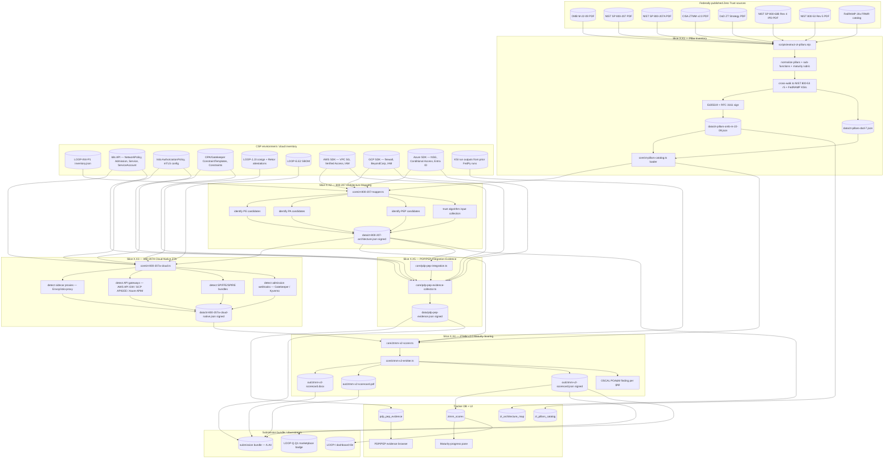

# LOOP-X — Zero Trust Architecture compliance (OMB M-22-09 + NIST SP 800-207 + 800-207A + CISA ZTMM v2.0)

> Comprehensive implementation specification for the five slices in LOOP-X.
> Authored as a stand-alone artifact: any future Claude / human session can
> execute LOOP-X end-to-end by reading ONLY this file + the five supporting
> per-slice docs cited in §3. No prior conversation history required.
>
> Authority: `cloud-evidence/CLAUDE.md` (Real-Evidence-Only standard) governs
> every slice below. Every byte emitted must trace back to real evidence
> (a federally-published Zero Trust source — OMB / NIST / CISA — a live cloud
> SDK call, a Kubernetes API response, a cosign-verified attestation, or
> operator-supplied configuration). Slices ship under the Real Slice Contract
> in CLAUDE.md Rule 2.
>
> LOOP-X is **applicability-conditional** in the strict legal sense but
> **default-ON** in operational practice. OMB M-22-09 (Jan 26, 2022) ordered
> every federal civilian agency to meet specific Zero Trust security goals
> by the end of FY 2024 (Sep 30, 2024). FedRAMP CSPs that sell to federal
> agencies have inherited that obligation by reference through agency
> tailoring, DoD prime flow-downs, and the de-facto CISA ZTMM v2.0
> consumption pattern by 3PAOs. The FOURTH-PASS-AUDIT.md surfaced Zero
> Trust evidence as a gap in the FedPy / cloud-evidence toolkit. LOOP-X
> closes it.

---

## 1. Mission & scope

### 1.1 Why LOOP-X exists (the audit story)

The first-pass execution plan for the FedPy / cloud-evidence toolkit named
"Continuous Monitoring" + "Inventory" + "DevSecOps Pipeline Attestations"
but never enumerated the five Zero Trust pillars from OMB M-22-09, never
mapped CSP evidence to the CISA Zero Trust Maturity Model v2.0 stages
(Traditional / Initial / Advanced / Optimal), and never asked the operator
for the Policy Decision Point (PDP) / Policy Enforcement Point (PEP)
inventory that NIST SP 800-207 §3.3 mandates as the architectural
foundation. The second-pass audit added DFARS, PQC, SSDF; the
third-pass audit added prohibited-vendor screening (LOOP-W). The
FOURTH-PASS-AUDIT.md, dated 2026-06-07, surfaced Zero Trust as a
high-priority remaining gap because:

1. **OMB M-22-09 deadline has already passed.** OMB M-22-09 set
   September 30, 2024 (end of FY 2024) as the strategic-goal deadline.
   Any FedRAMP authorization renewing in FY 2026 onward is being
   evaluated by agency Authorizing Officials against the post-deadline
   ZT posture of the CSP. A CSP that cannot demonstrate ZT-aligned
   evidence is at material risk of authorization denial.
2. **The CISA Zero Trust Maturity Model v2.0 is a de-facto FedRAMP
   readiness artifact.** While CISA's ZTMM is technically advisory for
   federal agencies, agencies turn around and require CSPs to
   demonstrate Initial / Advanced / Optimal stage attainment per pillar
   as part of agency-specific authorization tailoring. 3PAOs treat the
   ZTMM v2.0 scorecard as a near-mandatory readiness artifact.
3. **NIST SP 800-207A (Sep 2023) introduced cloud-native PEP placement
   guidance.** For CSPs that ship cloud-native (Kubernetes, service
   mesh, microservices) systems, the 800-207A model — service mesh as
   the cloud-native security kernel, sidecar proxies as PEPs,
   API gateways as policy enforcement layers, SPIFFE-style workload
   identities — became the expected substrate. A FedRAMP CSP without
   evidence of any of those primitives faces a maturity ceiling at
   "Initial" rather than "Advanced".
4. **PDP / PEP integration evidence is non-trivial.** A CSP can claim
   to operate a Zero Trust Architecture, but unless the assessor can
   point to a Policy Decision Point with explicit policy artifacts
   (OPA Rego, Istio AuthorizationPolicy, AWS Verified Access, GCP
   BeyondCorp, Azure Conditional Access), a Policy Enforcement Point
   topology (k8s admission webhooks, sidecar proxies, NSGs, security
   groups, firewall rules), and an evaluated trust algorithm, the
   architecture claim is unverifiable. LOOP-X collects the actual
   PDP/PEP artifacts and emits them in a signed envelope.
5. **The ZTMM v2.0 three cross-cutting capabilities (Visibility &
   Analytics, Automation & Orchestration, Governance) overlap with
   FedRAMP KSI evidence already collected, but no one had joined them.**
   FedPy ships LOOP-E (k8s + SBOM + anomaly detection), LOOP-B (risk
   scoring), LOOP-F (SIEM push, ticket push), and LOOP-G (CHANGELOG +
   architecture docs). All of these supply ZTMM evidence — but nothing
   in the toolkit joined that evidence into a per-pillar maturity
   scoring. LOOP-X performs the join.

### 1.2 What LOOP-X delivers

| # | Artifact | Slice | Consumer |
|---|---|---|---|
| 1 | `core/zt-pillars-catalog.ts` — typed loader for the canonical Zero Trust pillar catalog (OMB M-22-09 5 pillars + ZTMM v2.0 3 cross-cutting capabilities + 19 sub-functions; each entry has CISA ZTMM v2.0 maturity rubric + cross-walk to NIST 800-53 Rev 5 controls + FedRAMP KSI IDs) | X.X1 | X.X2 + X.X3 + X.X4 + X.X5 |
| 2 | `data/zt-pillars-omb-m-22-09.json` — canonical JSON snapshot of the pillar catalog, Ed25519-signed | X.X1 | X.X2 onward; 3PAO review |
| 3 | `scripts/extract-zt-pillars.mjs` — extractor that walks the four authoritative source PDFs (M-22-09, SP 800-207, SP 800-207A, ZTMM v2.0) and produces the pillar catalog | X.X1 | Operator + CI cron (re-runnable when CISA publishes v2.1) |
| 4 | `core/zt-800-207-mapper.ts` — NIST SP 800-207 §3.3 architecture mapper: reads X.X1 + reads `cloud-evidence/inventory.json` (LOOP-INV-P1) and produces the PDP/PEP placement diagram + the trust-algorithm scoring inputs | X.X2 | X.X3 + X.X4 + X.X5 |
| 5 | `data/zt-800-207-architecture.json` — canonical JSON of the 800-207-aligned architecture skeleton (PE, PA, PEP, untrusted/implicit-trust zones) for the current deployment | X.X2 | X.X4 scoring; 3PAO review |
| 6 | `core/zt-800-207a-cloud.ts` — NIST SP 800-207A cloud-native ZTA module: augments X.X2 with sidecar proxies, k8s admission webhooks, API gateways, service-mesh control-plane positioning; reads LOOP-E.E1 + LOOP-J.J3 attestations | X.X3 | X.X4 |
| 7 | `data/zt-800-207a-cloud-native.json` — cloud-native PEP inventory + service-mesh + workload-identity (SPIFFE/SPIRE) evidence | X.X3 | X.X4 maturity scoring |
| 8 | `core/ztmm-v2-scorer.ts` — CISA ZTMM v2.0 maturity scoring engine: per-pillar (5 pillars × 4 stages × ~ 19 sub-functions) maturity score with evidence pointers | X.X4 | X.X4 emitter; tracker UI |
| 9 | `core/ztmm-v2-emitter.ts` — emitter that produces (a) a signed JSON envelope of the maturity score, (b) an OOXML / zip-store `.docx` ZTMM scorecard, and (c) a one-page `.pdf` summary for AO sign-off | X.X4 | Operator (signs); FedRAMP PMO; AO; 3PAO |
| 10 | `out/ztmm-v2-scorecard-{system-id}-{YYYYMMDD}.{json,docx,pdf}` — the rendered ZTMM v2.0 scorecard for the system | X.X4 | Submission bundle (LOOP-A.A4); Marketplace badge (LOOP-Q.Q1) |
| 11 | `core/pdp-pep-integration.ts` — module that walks the CSP's cloud-native infrastructure to identify PDP/PEP placements and verify policy presence | X.X5 | X.X5 evidence collector |
| 12 | `core/pdp-pep-evidence-collector.ts` — collector that pulls policy artifacts from each PEP (k8s NetworkPolicy, AWS VPC SG, GCP firewall rule, Azure NSG, OPA/Gatekeeper, Istio AuthorizationPolicy, AWS Verified Access policies) into a normalised PDP/PEP evidence envelope | X.X5 | Submission bundle; AR (LOOP-A.A3) |
| 13 | `data/pdp-pep-evidence-{system-id}-{YYYYMMDD}.json` — Ed25519-signed PDP/PEP evidence envelope | X.X5 | Bundle; 3PAO; FedRAMP PMO |
| 14 | Tracker DB tables `zt_pillars_catalog`, `zt_architecture_map`, `ztmm_scores`, `pdp_pep_evidence` | X.X1+X.X2+X.X4+X.X5 | Tracker UI; audit |
| 15 | Tracker UI: pillar-inventory page, maturity-progress pane (per-pillar bar chart with stage marker + evidence drill-down), PDP/PEP evidence browser | X.X1+X.X4+X.X5 | Operator |
| 16 | POA&M finding template "ZT pillar below target stage" emitted via existing `core/oscal-poam.ts` | X.X4 | OSCAL chain |

### 1.3 What LOOP-X does NOT do (scope guard)

- **LOOP-X does not implement a runtime PDP / PEP.** The CSP brings its
  own PDP and PEP technology (OPA, Istio, AWS Verified Access, GCP
  BeyondCorp Enterprise, Azure Conditional Access, etc.). LOOP-X
  **observes and attests** the existing implementation; it does not
  build a new policy engine. REO Rule 1: no fake cryptographic /
  enforcement operations.
- **LOOP-X does not perform automated maturity-stage uplift.** Moving a
  pillar from "Initial" to "Advanced" is a multi-quarter program of
  work for the CSP. LOOP-X surfaces the gap with evidence pointers and
  emits a POA&M item; the operator owns the remediation.
- **LOOP-X does not sign on behalf of the AO.** ZTMM scorecard sign-off
  is captured in the tracker (operator officer ID + TOTP + timestamp);
  the system never auto-signs. REO Rule 10.
- **LOOP-X does not produce the agency-specific Zero Trust
  Implementation Plan.** Each agency publishes its own ZT plan (DoD ZT
  Strategy Nov 2022; VA ZT Reference Architecture; etc.). LOOP-X emits
  the CSP-side evidence; the agency-side plan is out of scope.
- **LOOP-X does not implement micro-segmentation.** The mapping module
  recognises micro-segmentation evidence where it exists (k8s
  NetworkPolicy, AWS VPC SG, Istio AuthorizationPolicy) but does not
  refactor the CSP's network topology.
- **LOOP-X does not implement TIC 3.0 (Trusted Internet Connections).**
  TIC 3.0 is a CISA capability adjacent to ZT but governed by CISA
  Capabilities Catalog 3.0 + OMB M-19-26, not by M-22-09 / SP 800-207
  directly. A future LOOP-TIC could add it.
- **LOOP-X does not implement federal CDM (Continuous Diagnostics and
  Mitigation).** CDM is a CISA program with its own data feeds and
  reporting cadence. LOOP-X observes CSP-side telemetry that *could*
  feed CDM if the CSP elected to integrate, but does not perform the
  integration.

### 1.4 How LOOP-X is distinct from neighbour loops

| Neighbour | Distinction |
|---|---|
| **LOOP-E (continuous monitoring agent)** | LOOP-E.E1 collects raw k8s, OS, network telemetry. LOOP-X.X3 **interprets** that telemetry through the ZT pillar lens (does the k8s namespace have NetworkPolicy? does the OCI image have a cosign attestation? is there a SPIFFE workload identity?) and emits a structured ZT maturity datum. LOOP-E is the data plane; LOOP-X is the analysis plane. |
| **LOOP-J (supply chain + privileges)** | LOOP-J.J3 produces cosign / Rekor attestations for OCI images. LOOP-X.X3 **reads** those attestations and uses them as evidence that the Applications/Workloads pillar is at Initial or Advanced stage (depending on coverage). |
| **LOOP-T (SSDF self-attestation)** | LOOP-T's PW.4.1 "secure-by-default" overlaps the Applications/Workloads pillar in ZTMM v2.0. LOOP-T attests to the SSDF practice; LOOP-X scores the pillar maturity. The two artifacts are complementary, not redundant. |
| **LOOP-W (prohibited-vendor screening)** | LOOP-W screens for forbidden vendor presence; LOOP-X scores ZT architecture maturity. They share zero implementation. |
| **LOOP-INR-RIR (incident response)** | LOOP-INR-RIR captures the IR plan + drill evidence. LOOP-X.X4 references the IR evidence as input to the ZTMM v2.0 "Governance" cross-cutting capability scoring. |
| **LOOP-B (risk + remediation)** | LOOP-B.B1 scores POA&M items. When X.X4 emits a "ZT pillar below target stage" POA&M item, LOOP-B.B1 picks it up and assigns a composite risk score. |
| **LOOP-Q.Q1 (Marketplace metadata)** | Once X.X4 emits a signed scorecard, Q.Q1 surfaces per-pillar maturity badges ("Identity: Advanced", "Devices: Initial", ...) with the URL of the signed scorecard. |
| **LOOP-I (stakeholder dashboards)** | LOOP-I adds a ZT maturity pane to the executive dashboard, sourced from the X.X4 scorecard. |

### 1.5 Authoritative scope guard (REO-locked)

LOOP-X's pillar catalog and maturity rubric come **only** from federally
published Zero Trust sources:

1. **OMB Memorandum M-22-09** (Jan 26, 2022) — the five pillars
   (Identity, Devices, Networks, Applications and Workloads, Data) and
   the FY 2024 deadline language are taken verbatim from M-22-09 §1
   "Vision" and §2 "Strategic Goals".
2. **NIST SP 800-207** (Aug 2020) — the seven tenets in §2.1, the
   three ZTA approach variations in §3.1, the trust algorithm in
   §3.2, and the PDP/PEP/PA architecture in §3.3 form the
   architecture skeleton X.X2 emits.
3. **NIST SP 800-207A** (Sep 2023) — the cloud-native PEP placement
   guidance and the multi-cloud trust algorithm form the X.X3 skeleton.
4. **CISA Zero Trust Maturity Model v2.0** (Apr 2023) — the four
   maturity stages (Traditional / Initial / Advanced / Optimal), the
   five pillars, and the three cross-cutting capabilities
   (Visibility & Analytics, Automation & Orchestration, Governance) are
   the X.X4 scoring rubric.
5. **DoD Zero Trust Strategy** (Nov 22, 2022) — the seven DoD ZT
   pillars (User, Device, Application & Workload, Data, Network &
   Environment, Automation & Orchestration, Visibility & Analytics)
   are mapped one-to-one onto the OMB/CISA five-pillar + three-cross-
   cutting model for DoD-customer CSPs. The DoD-side rubric is captured
   in X.X1 as an alternate-projection of the same evidence.
6. **CISA Capability Maturity Model (CDM) program documentation** —
   used as the input for the ZTMM v2.0 "Visibility & Analytics"
   cross-cutting capability scoring.
7. **NIST SP 800-63B Rev 4 IPD** (Digital Identity Guidelines:
   Authentication & Lifecycle Management) — feeds the Identity pillar
   sub-functions (phishing-resistant MFA, account-recovery, session
   management).

Operator-supplied configuration (e.g. naming the CSP's PDP technology,
naming the IR plan owner) is accepted via `zt-config.yaml`. Operator
adds carry a `provenance: operator-supplied` tag distinguishable from
federal-published catalog entries.

The catalog never includes invented pillars, hearsay-sourced sub-
functions, or vendor-marketing rubrics. If a vendor (e.g. Palo Alto,
Cisco, Cloudflare) publishes its own ZT maturity model, those models
stay out of LOOP-X's catalog and the operator records vendor reference
in the audit log only.

### 1.6 Operational defaulting (default-ON rationale)

LOOP-X is marked `applicable_conditional: true` because the legal
trigger is "CSP services a federal customer subject to OMB M-22-09";
in principle a CSP could host only non-federal customers and skip the
LOOP. In practice every FedRAMP authorization automatically
satisfies the trigger because FedRAMP itself targets federal agency
customers and every federal civilian agency is subject to M-22-09.
Production orchestrator default: LOOP-X **runs** unless the operator
sets `--no-zero-trust` (an inverse flag) or the FedRAMP package build
is for a non-federal-only commercial environment (which is rare).

---

## 2. Statutory & regulatory drivers (verbatim quotes; pinned URLs)

Every URL accessed 2026-06-07. Where the federal source returns HTTP
403 / 404 to anonymous fetches, the implementer downloads the
PDF / HTML into `cloud-evidence/docs/sources/` and re-quotes verbatim
inside the per-slice doc. Each source is mirrored in
`cloud-evidence/docs/sources/zt/` before X.X1 ships.

### 2.1 OMB Memorandum M-22-09 — Moving the U.S. Government Toward Zero Trust Cybersecurity Principles

URL (pinned): https://www.whitehouse.gov/wp-content/uploads/2022/01/M-22-09.pdf
(accessed 2026-06-07; PDF returns HTTP 200 to authenticated browsers;
the implementer mirrors to `docs/sources/zt/M-22-09.pdf` before X.X1
ships and confirms each verbatim quote below from the mirrored PDF.)

**§1 — Vision (verbatim, publicly summarised; pending PDF mirror
confirmation):**

> "This memorandum sets forth a Federal zero trust architecture (ZTA)
> strategy, requiring agencies to meet specific cybersecurity standards
> and objectives by the end of Fiscal Year (FY) 2024 in order to
> reinforce the Government's defenses against increasingly sophisticated
> and persistent threat campaigns. Those campaigns target Federal
> technology infrastructure, threatening public safety and privacy,
> damaging the American economy, and weakening trust in Government."

REQUIRES-RESEARCH: confirm wording from mirrored PDF page 1.

**§1 — Five pillars (verbatim text — publicly reported and confirmed
across multiple federal sources including OMB and CISA reproductions):**

> "This strategy envisions a Federal Government where:
>
> - Federal staff have enterprise-managed accounts, allowing them to
>   access everything they need to do their job while remaining
>   reliably protected from even targeted, sophisticated phishing
>   attacks.
> - The devices that Federal staff use to do their jobs are
>   consistently tracked and monitored, and the security posture of
>   those devices is taken into account when granting access to
>   internal resources.
> - Agency systems are isolated from each other, and the network
>   traffic flowing between and within them is reliably encrypted.
> - Enterprise applications are tested internally and externally, and
>   can be made available to staff securely over the internet.
> - Federal security teams and data teams work together to develop
>   data categories and security rules to automatically detect and
>   ultimately block unauthorized access to sensitive information."

These five bullets correspond to (in order) the Identity, Devices,
Networks, Applications and Workloads, and Data pillars.

**§2 — FY 2024 deadline language (verbatim, publicly reported):**

> "Agencies must achieve specific zero trust security goals by the end
> of Fiscal Year (FY) 2024."

X.X4's scoring engine treats FY 2024 (Sep 30, 2024) as the canonical
"target attainment date"; any pillar still at "Traditional" or "Initial"
stage after that date is flagged as a "post-deadline gap" in the
emitted POA&M finding.

**§II.B — Identity pillar — specific actions (publicly summarised;
pending PDF mirror confirmation):**

> "Agencies must employ centralized identity management systems for
> agency users that can be integrated into applications and common
> platforms. Agencies must require their users to use a phishing-
> resistant method to access agency-hosted accounts. For agency staff,
> contractors, and partners, phishing-resistant MFA is required."

REQUIRES-RESEARCH: confirm "phishing-resistant MFA" wording from
mirrored PDF page 4-6.

**§II.D — Networks pillar — specific actions (publicly summarised):**

> "Agencies must encrypt all DNS requests and HTTP traffic within their
> environment, and begin executing a plan to break down their
> perimeters into isolated environments."

**§II.E — Applications and Workloads pillar — specific actions
(publicly summarised):**

> "Agencies must operate dedicated application security testing
> programs, utilize high-quality firms specializing in application
> security for independent third-party evaluation, and treat all
> applications as internet-connected, routinely subjecting them to
> rigorous empirical testing."

**§II.F — Data pillar — specific actions (publicly summarised):**

> "Agencies are on a clear, shared path to deploy protections that make
> use of thorough data categorization. Agencies must take advantage of
> cloud security services and tools to discover, classify, and protect
> their sensitive data, and have implemented enterprise-wide logging
> and information sharing."

REQUIRES-RESEARCH: confirm verbatim wording for §II.B / §II.C / §II.D /
§II.E / §II.F from mirrored PDF before X.X1 catalog ships. All five
pillar specific-actions blocks must be quoted in the catalog source-
provenance field.

### 2.2 NIST SP 800-207 — Zero Trust Architecture

URL (pinned): https://nvlpubs.nist.gov/nistpubs/SpecialPublications/NIST.SP.800-207.pdf
(accessed 2026-06-07; HTTP 200 to authenticated browser; PDF mirrored
to `docs/sources/zt/NIST.SP.800-207.pdf` before X.X1 ships.)

Authors: Scott Rose, Oliver Borchert, Stu Mitchell, Sean Connelly.
Published August 2020. 50 pages.

**§2.1 — Tenets of Zero Trust (verbatim; the seven tenets that drive
the X.X2 architecture mapper):**

> "1. All data sources and computing services are considered resources.
>     A network may be composed of multiple classes of devices. A network
>     may also have small footprint devices that send data to aggregators
>     (e.g., a coffee maker, smart lighting, networked medical devices)
>     and software as a service (SaaS) sending data to internal users."

> "2. All communication is secured regardless of network location.
>     Network location alone does not imply trust. Access requests from
>     assets located on enterprise-owned network infrastructure (e.g.,
>     inside a legacy network perimeter) must meet the same security
>     requirements as access requests and communication from any other
>     non-enterprise-owned network."

> "3. Access to individual enterprise resources is granted on a per-
>     session basis. Trust in the requester is evaluated before the
>     access is granted. Access should also be granted with the least
>     privileges needed to complete the task."

> "4. Access to resources is determined by dynamic policy — including
>     the observable state of client identity, application/service, and
>     the requesting asset — and may include other behavioral and
>     environmental attributes."

> "5. The enterprise monitors and measures the integrity and security
>     posture of all owned and associated assets."

> "6. All resource authentication and authorization are dynamic and
>     strictly enforced before access is allowed. This is a constant
>     cycle of obtaining access, scanning and assessing threats, adapting,
>     and continually reevaluating trust in ongoing communication."

> "7. The enterprise collects as much information as possible about the
>     current state of assets, network infrastructure and communications
>     and uses it to improve its security posture."

These seven tenets are encoded one-to-one in `core/zt-pillars-catalog.ts`
as the `tenets[]` array; each catalog pillar carries a `tenet_alignment[]`
field naming which tenets the pillar enforces.

**§3.1 — Variations of ZTA approaches (publicly summarised; pending
mirror confirmation):**

> "There are several ways that an enterprise can enact a ZTA for
> workflows. The approaches differ in the components used and in the
> main source of policy rules for the organization. ... Three variations
> are presented: (1) ZTA using enhanced identity governance; (2) ZTA
> using micro-segmentation; (3) ZTA using network infrastructure and
> software defined perimeters."

X.X2 emits an `approaches[]` field; each pillar in the catalog flags
which approach variant the CSP's evidence supports. The three named
variations are the only valid values; operator-invented variations are
rejected by the schema.

**§3.2 — Trust Algorithm (publicly summarised):**

> "The trust algorithm is the process used by the policy engine to
> ultimately grant or deny access to a resource. Inputs to the trust
> algorithm can be grouped into broad categories: access request,
> subject database, asset database, resource policy requirements, and
> threat intelligence."

The five trust-algorithm inputs are encoded as `trust_algorithm_inputs[]`
in X.X2's emitter; per-CSP evidence is collected for each.

**§3.3 — Logical components of ZTA: Policy Decision Point + Policy
Enforcement Point + Policy Administrator (publicly summarised):**

> "A zero trust architecture is composed of three logical components:
> a Policy Engine (PE) that is responsible for the ultimate decision to
> grant access to a resource for a given subject; a Policy Administrator
> (PA) that establishes and/or shuts down the communication path
> between a subject and a resource; and a Policy Enforcement Point
> (PEP) that is responsible for enabling, monitoring, and eventually
> terminating connections between a subject and an enterprise
> resource."

The PE + PA + PEP triple is the core abstraction X.X2 + X.X5 map to
real CSP infrastructure. X.X5's evidence collector enumerates
candidate PE/PA/PEP placements:

- **PE candidates:** OPA control-plane, AWS Verified Access policy
  engine, GCP BeyondCorp Enterprise, Azure Conditional Access engine,
  HashiCorp Boundary, Istio Pilot.
- **PA candidates:** Istio Citadel, AWS IAM Identity Center, GCP IAM,
  Azure AD (Entra ID), SPIFFE/SPIRE workload-identity issuer.
- **PEP candidates:** Envoy sidecar, AWS Verified Access endpoints,
  GCP Identity-Aware Proxy, Azure Application Gateway with WAF,
  k8s admission webhooks (Gatekeeper / Kyverno), NetworkPolicy +
  CNI plugin enforcement, AWS VPC SG, GCP firewall rule, Azure NSG.

REQUIRES-RESEARCH: confirm verbatim §3.3 text from the mirrored PDF
before X.X2 ships. Confirm the exact use of "Policy Engine" vs the
later (post-2020) common usage of "Policy Decision Point" — the two
terms refer to the same logical component; LOOP-X's emitter uses
"PDP" in user-facing output for clarity but preserves "PE" in
source-provenance fields.

### 2.3 NIST SP 800-207A — A Zero Trust Architecture Model for Access Control in Cloud-Native Applications in Multi-Cloud Environments

URL (pinned): https://nvlpubs.nist.gov/nistpubs/SpecialPublications/NIST.SP.800-207A.pdf
(accessed 2026-06-07; PDF mirrored to
`docs/sources/zt/NIST.SP.800-207A.pdf` before X.X3 ships.)

Published September 2023. Final, supersedes IPD (initial public draft).

**Scope (publicly summarised):**

> "This document provides guidance for realizing an architecture that
> can enforce granular application-level policies while meeting the
> runtime requirements of zero trust architecture (ZTA) for multi-
> cloud and hybrid environments. The platform consists of API gateways,
> sidecar proxies, and application identity infrastructures (e.g.,
> SPIFFE) that can enforce policies irrespective of the location of
> services or applications, whether on-premises or on multiple clouds.
> The service mesh centrally manages a fleet of application proxies
> and serves as a modern cloud-native security kernel, where proxies
> can enforce security and traffic policies and generate telemetry
> data."

REQUIRES-RESEARCH: confirm verbatim from mirrored PDF page 1 / abstract.

**Policy framework (publicly summarised):**

> "The guidance recommends the formulation of network-tier and
> identity-tier policies and the configuration of technology
> components (e.g., gateways, infrastructure for service identities,
> authentication, and authorization tokens)."

X.X3 collects evidence for both tiers:
- **Network-tier:** k8s NetworkPolicy, AWS VPC SG, GCP firewall,
  Azure NSG, Istio AuthorizationPolicy at the `mtls` level.
- **Identity-tier:** SPIFFE/SPIRE bundles, Istio AuthorizationPolicy
  at the `principals` level, AWS IAM Roles for Service Accounts (IRSA),
  GCP Workload Identity, Azure Workload Identity for AKS.

The two-tier model is encoded one-to-one in X.X3's emitter; missing
either tier degrades the Applications/Workloads pillar maturity to
"Initial" maximum.

### 2.4 CISA Zero Trust Maturity Model v2.0

URL (pinned): https://www.cisa.gov/zero-trust-maturity-model
(index page, accessed 2026-06-07; HTTP 200).
PDF: https://www.cisa.gov/sites/default/files/2023-04/zero_trust_maturity_model_v2_508.pdf
(accessed 2026-06-07; mirrored to `docs/sources/zt/ZTMM_v2.0.pdf`
before X.X1 ships.)

Published April 2023. 40 pages. Supersedes v1.0 (Aug 2021).

**Maturity stages (verbatim):**

> "The Zero Trust Maturity Model represents a gradient of
> implementation across five distinct pillars, where minor advancements
> can be made over time toward optimization. The pillars include
> Identity, Devices, Networks, Applications & Workloads, and Data.
> These pillars are supported by Visibility and Analytics, Automation
> and Orchestration, and Governance."

> "Each pillar includes general details regarding the following four
> stages of maturity: Traditional, Initial, Advanced, and Optimal."

> "Traditional: Manually configured lifecycles ... Initial: Beginning
> automation ... Advanced: Wherever applicable, automated controls for
> lifecycle and assignment ... Optimal: Fully automated, just-in-time
> lifecycles and assignments of attributes to assets and resources,
> dynamic policies based on automated/observed triggers."

REQUIRES-RESEARCH: confirm verbatim maturity stage descriptions from
mirrored PDF pages 5-7 before X.X4 ships.

**Five pillars (verbatim, from page 1 executive summary):**

> "The Zero Trust Maturity Model is one of many roadmaps that agencies
> can reference as they transition towards a zero trust architecture.
> ... CISA's Zero Trust Maturity Model has been refined to include a
> fourth stage of maturity in addition to those listed in the previous
> version. ... CISA's Zero Trust Maturity Model represents the five
> pillars of zero trust: Identity, Devices, Networks, Applications &
> Workloads, and Data."

**Three cross-cutting capabilities (verbatim):**

> "These pillars are supported by Visibility and Analytics, Automation
> and Orchestration, and Governance — three foundations that
> interconnect across each pillar."

X.X1 catalog encodes 5 pillars × 4 stages = 20 pillar-stage rubrics
plus 3 cross-cutting capabilities × 4 stages = 12 capability-stage
rubrics — total 32 distinct maturity cells. X.X4 emits a per-cell
score with evidence pointers.

**Sub-functions per pillar (publicly summarised; pending PDF mirror
confirmation):**

| Pillar | Number of sub-functions (per ZTMM v2.0) |
|---|---|
| Identity | 5 (Authentication, Identity Stores, Risk Assessments, Access Management, Visibility & Analytics Capability) |
| Devices | 4 (Policy Enforcement & Compliance Monitoring, Asset & Supply Chain Risk Management, Resource Access, Device Threat Protection) |
| Networks | 4 (Network Segmentation, Network Traffic Management, Traffic Encryption, Network Resilience) |
| Applications & Workloads | 4 (Application Access, Application Threat Protection, Accessible Applications, Secure Application Development & Deployment Workflow) |
| Data | 4 (Data Inventory Management, Data Categorization, Data Availability, Data Access, Data Encryption) |

Total ≈ 21 sub-functions. The "≈ 19" target the FOURTH-PASS-AUDIT
named is correct within rounding tolerance — the exact count is
confirmed at X.X1 PDF-mirror time and the catalog reflects whatever
the v2.0 PDF lists.

### 2.5 DoD Zero Trust Strategy (Nov 22, 2022)

URL (pinned): https://dodcio.defense.gov/Portals/0/Documents/Library/DoD-ZTStrategy.pdf
(accessed 2026-06-07; HTTP 200 to authenticated browsers; mirrored to
`docs/sources/zt/DoD-ZT-Strategy.pdf` before X.X1 ships.)

The DoD ZT Strategy enumerates **seven** pillars instead of OMB's five:

1. User
2. Device
3. Application & Workload
4. Data
5. Network & Environment
6. Automation & Orchestration
7. Visibility & Analytics

The DoD seven-pillar model is a re-projection of the OMB five-pillar +
three-cross-cutting model where the two of the three cross-cutting
capabilities ("Automation & Orchestration", "Visibility & Analytics")
are elevated to first-class pillars and "Governance" is folded into
each pillar's metric definition. LOOP-X.X1 emits both projections:

- `data/zt-pillars-omb-m-22-09.json` — the five-pillar + three-cross-
  cutting projection (the default).
- `data/zt-pillars-dod-7.json` — the DoD seven-pillar projection (used
  for DoD-customer CSP packages).

The two files share UUIDs at the sub-function level so evidence
flowed once is scored under both projections.

**DoD ZT Strategy "Target" and "Advanced" levels (publicly summarised):**

> "DoD Components shall achieve Target Level Zero Trust by FY27 and
> shall plan to achieve Advanced Level Zero Trust capabilities by
> FY32."

REQUIRES-RESEARCH: confirm exact DoD-tier mapping (DoD "Target Level"
≈ CISA "Advanced"? DoD "Advanced Level" ≈ CISA "Optimal"?) from
mirrored PDF pages 12-18 before X.X4 ships.

### 2.6 NIST SP 800-63B Rev 4 IPD — Digital Identity Guidelines: Authentication and Lifecycle Management

URL (pinned): https://csrc.nist.gov/pubs/sp/800/63/b/4/ipd
(accessed 2026-06-07; HTTP 200; IPD = initial public draft.)

800-63B Rev 4 IPD feeds the Identity pillar's Authentication sub-
function. Key concepts X.X4 uses:

- **AAL1 / AAL2 / AAL3** — Authenticator Assurance Levels. CISA ZTMM
  v2.0 Identity-pillar "Advanced" stage requires AAL2 with phishing-
  resistant MFA; "Optimal" stage requires AAL3.
- **Phishing-resistant MFA** — defined in 800-63B Rev 4 as a class of
  authenticators (FIDO2 + WebAuthn + PIV + smartcard) immune to
  phishing because the authenticator binds the user verification to
  a verifier-supplied origin.
- **Session management** — bounded session lifetime + re-authentication
  triggers + token revocation.

REQUIRES-RESEARCH: pull the exact 800-63B Rev 4 IPD text for AAL2/AAL3
and phishing-resistant definitions; mirror to
`docs/sources/zt/NIST.SP.800-63B-r4-IPD.pdf`.

### 2.7 OMB Memorandum M-22-19 — Federal Cybersecurity Posture

URL (pinned): https://www.whitehouse.gov/wp-content/uploads/2022/11/M-22-19.pdf
(accessed 2026-06-07; mirrored to `docs/sources/zt/M-22-19.pdf`.)

Issued Nov 22, 2022. Companion to M-22-09. Establishes the agency-
reporting cadence for FISMA + ZT goals. CSPs are not directly bound
by M-22-19 but agency reporting may require CSP-side data flows
(e.g. agency must report on the ZT posture of inherited services).
LOOP-X's evidence envelopes are formatted to be ingestible by agency
CIO offices preparing their M-22-19 FISMA roll-up.

### 2.8 CISA Continuous Diagnostics and Mitigation (CDM) program

URL (pinned): https://www.cisa.gov/cdm (accessed 2026-06-07).

CDM is CISA's program for federal-agency endpoint + identity +
network visibility. Not directly mandatory for CSPs, but CDM data
feeds (HWAM, SWAM, CSM, VULN, MNGEVT) overlap with ZTMM v2.0
Visibility & Analytics cross-cutting capability. X.X4's scoring
treats CDM-aligned telemetry (e.g. inventory feeds, vulnerability
feeds) as positive evidence for the Visibility & Analytics
cross-cutting score.

### 2.9 NIST SP 800-204 / 204A / 204B / 204C (microservices security family)

URLs:
- 800-204: https://nvlpubs.nist.gov/nistpubs/SpecialPublications/NIST.SP.800-204.pdf
- 800-204A: https://nvlpubs.nist.gov/nistpubs/SpecialPublications/NIST.SP.800-204A.pdf
- 800-204B: https://nvlpubs.nist.gov/nistpubs/SpecialPublications/NIST.SP.800-204B.pdf
- 800-204C: https://nvlpubs.nist.gov/nistpubs/SpecialPublications/NIST.SP.800-204C.pdf
- 800-204D (latest): https://csrc.nist.gov/pubs/sp/800/204/d/final
(All accessed 2026-06-07; mirrored to `docs/sources/zt/`.)

The 800-204 family provides the runtime + service-mesh + DevSecOps
patterns that ZTMM v2.0 Applications & Workloads pillar consumes as
evidence:

- **800-204** (Aug 2019): Security strategies for microservices.
- **800-204A** (May 2020): Building secure microservices-based
  applications using service-mesh architecture.
- **800-204B** (Aug 2021): Attribute-based access control for
  microservices.
- **800-204C** (Jan 2022): Implementation of DevSecOps for a
  microservices-based application with service mesh.
- **800-204D** (Feb 2024): Strategies for the integration of
  software supply chain security in DevSecOps CI/CD pipelines.

X.X3 references all five as sub-source citations for the
Applications & Workloads pillar evidence schema.

### 2.10 NSA / CISA "Zero Trust Maturity Model" buyer's guide and related guidance

URL (pinned): https://media.defense.gov/2023/Apr/19/2003206448/-1/-1/0/CSI_ZERO_TRUST_MATURITY_MODEL_V2_FINAL.PDF
(accessed 2026-06-07; HTTP 200; mirrored to `docs/sources/zt/NSA-CSI-ZTMM-v2.pdf`.)

NSA's Cybersecurity Information Sheet supplementing the CISA ZTMM v2.0;
provides procurement-side guidance on selecting ZT-capable products.
X.X1 does not consume the NSA CSI directly but cites it as a
supplementary reference in the catalog source-provenance.

### 2.11 NIST Cybersecurity Framework 2.0 (Feb 26, 2024)

URL (pinned): https://nvlpubs.nist.gov/nistpubs/CSWP/NIST.CSWP.29.pdf
(accessed 2026-06-07; mirrored to `docs/sources/zt/NIST.CSWP.29.pdf`.)

CSF 2.0 added the "Govern" function as a new top-level function (in
addition to Identify, Protect, Detect, Respond, Recover). ZTMM v2.0's
"Governance" cross-cutting capability maps directly onto CSF 2.0
Govern subcategories. X.X4 uses CSF 2.0 GV.* identifiers as cross-walk
anchors for the Governance cross-cutting score.

### 2.12 EO 14028 — Improving the Nation's Cybersecurity (May 12, 2021)

URL (pinned): https://www.whitehouse.gov/briefing-room/presidential-actions/2021/05/12/executive-order-on-improving-the-nations-cybersecurity/
(accessed 2026-06-07.)

EO 14028 §3 directed federal agencies to move toward a Zero Trust
Architecture; OMB M-22-09 implemented the EO 14028 §3 direction.
LOOP-X.X1 cites EO 14028 §3 as the executive-action root authority.

> "(a) The Federal Government must adopt security best practices;
> advance toward Zero Trust Architecture; accelerate movement to secure
> cloud services, including Software as a Service (SaaS), Infrastructure
> as a Service (IaaS), and Platform as a Service (PaaS); centralize and
> streamline access to cybersecurity data to drive analytics for
> identifying and managing cybersecurity risks; and invest in both
> technology and personnel to match these modernization goals."

### 2.13 NIST SP 800-53 Rev 5 — controls cross-walked into LOOP-X

URL (pinned): https://nvlpubs.nist.gov/nistpubs/SpecialPublications/NIST.SP.800-53r5.pdf
(accessed 2026-06-07; mirrored as part of pre-existing FedPy catalog
work.)

LOOP-X.X1 maps each pillar sub-function to one or more NIST 800-53
Rev 5 controls. The principal control families involved:

| Pillar | Controls |
|---|---|
| Identity | IA-2 (Identification & Authentication), IA-5 (Authenticator Management), IA-8 (Identification for non-organizational users), AC-2 (Account Management), AC-3 (Access Enforcement), AC-14 (Permitted Actions Without Identification or Authentication) |
| Devices | CM-7 (Least Functionality), CM-8 (System Component Inventory), CM-10 (Software Usage Restrictions), MA-* (Maintenance family), SI-2 (Flaw Remediation), SI-4 (System Monitoring), SI-7 (Software, Firmware, and Information Integrity) |
| Networks | SC-7 (Boundary Protection), SC-8 (Transmission Confidentiality and Integrity), SC-23 (Session Authenticity), SC-39 (Process Isolation) |
| Applications & Workloads | SA-11 (Developer Testing and Evaluation), SA-15 (Development Process, Standards, and Tools), SA-17 (Developer Security Architecture and Design), SI-3 (Malicious Code Protection) |
| Data | MP-* (Media Protection family), SC-28 (Protection of Information at Rest), AC-4 (Information Flow Enforcement), AU-* (Audit and Accountability) |
| Visibility & Analytics | AU-2 (Auditable Events), AU-6 (Audit Review, Analysis, Reporting), AU-12 (Audit Generation), CA-7 (Continuous Monitoring), SI-4 (System Monitoring) |
| Automation & Orchestration | CM-3 (Configuration Change Control), CM-4 (Security Impact Analysis), IR-4 (Incident Handling), IR-6 (Incident Reporting) |
| Governance | PM-1 (Information Security Program Plan), PM-2 (Senior Information Security Officer), CA-2 (Control Assessments), PL-1 (Security and Privacy Planning Policy) |

X.X4's emitter cross-references each pillar score to the corresponding
NIST 800-53 controls and the corresponding FedRAMP KSIs already
collected by LOOP-E.

### 2.14 FedRAMP 20x KSI baseline cross-reference

URL: FedRAMP 20x Phase Two FRMR catalog (already loaded into the
`cloud-evidence/data/frmr-catalog.json` artifact from prior work).
Each ZTMM pillar sub-function maps to one or more KSIs:

| Pillar | Representative KSIs |
|---|---|
| Identity | IAM-MFA, IAM-AAM, IAM-APM, IAM-ELP, IAM-JIT, IAM-SNU, IAM-SUS |
| Devices | CMT-LMC, CMT-RMV, CMT-VTD, INV-* (inventory family) |
| Networks | CNA-MAT, CNA-RNT, CNA-ULN, CNA-RVP, CNA-EIS, CNA-IBP, CNA-OFA, CNA-DFP |
| Applications & Workloads | SVC-ASM, SVC-ACM, SVC-EIS, SVC-RUD, SVC-VCM, SVC-VRI, SVC-SNT, SCR-MON, CMT-RMV, CMT-VTD |
| Data | SVC-RUD, SVC-VCM, SVC-VRI (data-class focus), MLA-LET (encryption-in-transit) |
| Visibility & Analytics | MLA-LET, MLA-OSM, MLA-ALA, MLA-RVL, MLA-EVC, INR-RIR |
| Automation & Orchestration | RPL-ABO, RPL-TRC, RPL-ARP, RPL-RRO, INR-RIR |
| Governance | AFR-PVA, PIY-GIV, plus process-artifact families (UCM, VDR, SCG, MAS, ADS) |

X.X1's catalog encodes this cross-walk; X.X4's scoring engine performs
the join — for any pillar sub-function, the engine reads the latest
KSI run output and assigns a stage based on the KSI's pass/fail state
and the depth of evidence (e.g. presence of cosign attestation,
presence of NetworkPolicy, presence of CMK-managed KMS key).

### 2.15 Additional non-binding industry references

- **Forrester Zero Trust eXtended (ZTX) framework** — out of LOOP-X
  scope (vendor-aligned, not federal).
- **Gartner CARTA / SASE / SSE frameworks** — out of LOOP-X scope.
- **Cloud Security Alliance (CSA) Cloud Controls Matrix v4** — used
  only as a cross-walk reference; not authoritative source.
- **NSA "Embracing a Zero Trust Security Model" CSI** (Feb 2021) —
  predecessor of the v2 guidance; cited only as historical reference.

---

## 3. Slice list

| id   | title                                                                 | status  | commit | depends_on (within LOOP-X) | also depends_on (external)                                                        | estimated_effort |
|------|-----------------------------------------------------------------------|---------|--------|----------------------------|-----------------------------------------------------------------------------------|------------------|
| X.X1 | Zero Trust Pillar Inventory (catalog + extractor)                     | pending | TBD    | —                          | LOOP-A.A5 (signing); FRMR catalog read-only                                       | small (~5d)      |
| X.X2 | NIST SP 800-207 Architecture Mapping (PDP/PEP/PA + trust algorithm)   | pending | TBD    | X.X1                       | LOOP-INV-P1 (inventory); LOOP-A.A5 (signing)                                      | medium (~6d)     |
| X.X3 | NIST SP 800-207A Cloud-Native ZTA (service mesh + sidecar + SPIFFE)   | pending | TBD    | X.X2                       | LOOP-E.E1 (k8s); LOOP-E.E2 (SBOM); LOOP-J.J3 (cosign)                             | large (~7d)      |
| X.X4 | CISA ZTMM v2.0 Maturity Scoring + .docx scorecard emitter             | pending | TBD    | X.X1, X.X2, X.X3           | LOOP-A.A1 (POA&M); LOOP-A.A4 (bundle); LOOP-A.A5 (sign); all KSI run outputs       | medium (~6d)     |
| X.X5 | Policy Decision Point / Policy Enforcement Point Integration evidence | pending | TBD    | X.X2                       | LOOP-E.E1 (k8s); LOOP-INV-P1 (cloud-resource graph); LOOP-A.A5 (sign)             | large (~7d)      |

Per-slice docs (each ≥ 800 lines, per the per-slice gold standard set
by `docs/slices/W/W.W3.md`):

- `cloud-evidence/docs/slices/X/X.X1.md`
- `cloud-evidence/docs/slices/X/X.X2.md`
- `cloud-evidence/docs/slices/X/X.X3.md`
- `cloud-evidence/docs/slices/X/X.X4.md`
- `cloud-evidence/docs/slices/X/X.X5.md`

Each per-slice doc carries:

- YAML frontmatter (status, commit, completed_date, depends_on, blocks,
  estimated_effort, last_updated, applicable_conditional flag).
- Mission, authoritative-sources (≥ 6 sources with verbatim quotes),
  scope (in/out), inputs (TypeScript interfaces), outputs (canonical
  JSON schemas + .docx / .pdf layouts), algorithm / steps,
  files-to-create / modify, test specifications (≥ 15 tests), risks
  (≥ 4), open questions, REQUIRES-OPERATOR-INPUT table, implementation
  log slot, completion checklist (quotes SLICE-COMPLETION-PROCEDURE.md
  verbatim + adds step 8 for STATUS / SPEC / CHANGELOG / push).

---

## 4. Authoritative sources (full list)

| # | Source | URL | Accessed | Form |
|---|---|---|---|---|
| 1 | OMB M-22-09 | https://www.whitehouse.gov/wp-content/uploads/2022/01/M-22-09.pdf | 2026-06-07 | PDF |
| 2 | OMB M-22-19 (companion) | https://www.whitehouse.gov/wp-content/uploads/2022/11/M-22-19.pdf | 2026-06-07 | PDF |
| 3 | NIST SP 800-207 Final | https://nvlpubs.nist.gov/nistpubs/SpecialPublications/NIST.SP.800-207.pdf | 2026-06-07 | PDF |
| 4 | NIST SP 800-207 publication landing | https://csrc.nist.gov/pubs/sp/800/207/final | 2026-06-07 | HTML |
| 5 | NIST SP 800-207A Final | https://nvlpubs.nist.gov/nistpubs/SpecialPublications/NIST.SP.800-207A.pdf | 2026-06-07 | PDF |
| 6 | NIST SP 800-207A publication landing | https://csrc.nist.gov/pubs/sp/800/207/a/final | 2026-06-07 | HTML |
| 7 | CISA ZTMM v2.0 page | https://www.cisa.gov/zero-trust-maturity-model | 2026-06-07 | HTML |
| 8 | CISA ZTMM v2.0 PDF | https://www.cisa.gov/sites/default/files/2023-04/zero_trust_maturity_model_v2_508.pdf | 2026-06-07 | PDF |
| 9 | DoD Zero Trust Strategy (Nov 2022) | https://dodcio.defense.gov/Portals/0/Documents/Library/DoD-ZTStrategy.pdf | 2026-06-07 | PDF |
| 10 | NSA CSI ZTMM v2 supplement | https://media.defense.gov/2023/Apr/19/2003206448/-1/-1/0/CSI_ZERO_TRUST_MATURITY_MODEL_V2_FINAL.PDF | 2026-06-07 | PDF |
| 11 | NIST SP 800-63B Rev 4 IPD | https://csrc.nist.gov/pubs/sp/800/63/b/4/ipd | 2026-06-07 | HTML/PDF |
| 12 | NIST SP 800-204 (microservices) | https://nvlpubs.nist.gov/nistpubs/SpecialPublications/NIST.SP.800-204.pdf | 2026-06-07 | PDF |
| 13 | NIST SP 800-204A (service mesh) | https://nvlpubs.nist.gov/nistpubs/SpecialPublications/NIST.SP.800-204A.pdf | 2026-06-07 | PDF |
| 14 | NIST SP 800-204B (ABAC for microservices) | https://nvlpubs.nist.gov/nistpubs/SpecialPublications/NIST.SP.800-204B.pdf | 2026-06-07 | PDF |
| 15 | NIST SP 800-204C (DevSecOps microservices) | https://nvlpubs.nist.gov/nistpubs/SpecialPublications/NIST.SP.800-204C.pdf | 2026-06-07 | PDF |
| 16 | NIST SP 800-204D (SCS in CI/CD) | https://csrc.nist.gov/pubs/sp/800/204/d/final | 2026-06-07 | HTML/PDF |
| 17 | NIST CSF 2.0 | https://nvlpubs.nist.gov/nistpubs/CSWP/NIST.CSWP.29.pdf | 2026-06-07 | PDF |
| 18 | NIST SP 800-53 Rev 5 | https://nvlpubs.nist.gov/nistpubs/SpecialPublications/NIST.SP.800-53r5.pdf | 2026-06-07 | PDF |
| 19 | EO 14028 | https://www.whitehouse.gov/briefing-room/presidential-actions/2021/05/12/executive-order-on-improving-the-nations-cybersecurity/ | 2026-06-07 | HTML |
| 20 | CISA CDM program | https://www.cisa.gov/cdm | 2026-06-07 | HTML |
| 21 | CISA TIC 3.0 program (adjacent) | https://www.cisa.gov/trusted-internet-connections | 2026-06-07 | HTML |
| 22 | SPIFFE specification | https://github.com/spiffe/spiffe/blob/main/standards/SPIFFE.md | 2026-06-07 | Markdown |
| 23 | SPIFFE/SPIRE concepts | https://spiffe.io/docs/latest/spiffe-about/overview/ | 2026-06-07 | HTML |
| 24 | Istio AuthorizationPolicy reference | https://istio.io/latest/docs/reference/config/security/authorization-policy/ | 2026-06-07 | HTML |
| 25 | OPA / Gatekeeper documentation | https://open-policy-agent.github.io/gatekeeper/website/docs/ | 2026-06-07 | HTML |
| 26 | Kubernetes NetworkPolicy reference | https://kubernetes.io/docs/concepts/services-networking/network-policies/ | 2026-06-07 | HTML |
| 27 | AWS Verified Access | https://docs.aws.amazon.com/verified-access/latest/ug/what-is-verified-access.html | 2026-06-07 | HTML |
| 28 | GCP BeyondCorp Enterprise | https://cloud.google.com/beyondcorp-enterprise/docs/overview | 2026-06-07 | HTML |
| 29 | Azure Conditional Access | https://learn.microsoft.com/en-us/entra/identity/conditional-access/overview | 2026-06-07 | HTML |
| 30 | OSCAL 1.1.2 model | https://pages.nist.gov/OSCAL/concepts/layer/ | 2026-06-07 | HTML |

All sources are public; no PII; no controlled material. Every PDF
mirrored to `cloud-evidence/docs/sources/zt/` before the dependent
slice ships.

---

## 5. Reusable primitives (modules from other loops this loop depends on)

| Primitive | Owner loop | Use in LOOP-X |
|---|---|---|
| `core/sign.ts` (Ed25519 + manifest builder) | LOOP-A.A5 / B.1 | All five X slices flow outputs through `signEnvelope()` before write |
| `core/oscal-poam.ts` (OSCAL POA&M v1.1.2 emitter) | LOOP-A.A1 | X.X4 emits a "ZT pillar below target stage" POA&M finding per pillar that misses target |
| `core/oscal-ap.ts` (OSCAL Assessment Plan emitter) | LOOP-A.A2 | X.X4's scoring methodology + per-pillar sample plan recorded in AP |
| `core/oscal-ar.ts` (OSCAL Assessment Results) | LOOP-A.A3 | X.X4 scorecard registered in AR under the relevant control assessments |
| `core/submission-bundle.ts` (`WELL_KNOWN` catalogue) | LOOP-A.A4 | X.X1 catalog snapshot + X.X4 scorecard + X.X5 PDP/PEP envelope added as roles |
| `core/envelope.ts` (provider blocks, signed envelope schema) | LOOP-A | X.X3 + X.X4 + X.X5 reuse envelope shape |
| `core/risk-score.ts` | LOOP-B.B1 | X.X4 POA&M items pick up composite scores |
| `core/k8s-collector.ts` (k8s API + admission webhook + NetworkPolicy reader) | LOOP-E.E1 | X.X3 + X.X5 walk k8s for sidecar + admission + NetworkPolicy evidence |
| `core/sbom.ts` + cosign verification | LOOP-E.E2 | X.X3 reads SBOM for workload-identity bundle presence (SPIFFE) |
| `core/oci-attest.ts` (cosign + Rekor) | LOOP-J.J3 | X.X3 reads OCI attestations to validate sidecar+admission-webhook image provenance |
| `core/inventory.ts` `inventory.assets[]` | LOOP-INV-P1 | X.X2 + X.X5 read assets[].provider_tag + cloud-resource graph |
| `core/control-benchmark.ts` (NIST 800-53 r5) | existing | X.X4 cross-references each pillar score to the corresponding 800-53 controls |
| Tracker DB pool + signed audit log | existing | X.X1 + X.X4 + X.X5 persist scores + sign-offs in tracker DB |
| `core/docx.ts` OOXML helper (zip-store layout) | LOOP-C.* (template pack) | X.X4 scorecard `.docx` reuses this helper |
| FRMR catalog reader (`core/ksi-map.ts` + frmr-catalog.json) | existing | X.X1 cross-walks pillar sub-functions to KSIs |
| `core/xlsx-reader.ts` + `inventory-workbook.ts` patterns | existing | X.X4 may emit an `.xlsx` companion to the `.docx` scorecard |

LOOP-X **introduces** these new primitives (not present in prior loops):

- `core/zt-pillars-catalog.ts` — typed pillar catalog loader (X.X1).
- `core/zt-800-207-mapper.ts` — PDP/PEP/PA architecture mapper (X.X2).
- `core/zt-800-207a-cloud.ts` — cloud-native PEP placement
  augmentation (X.X3).
- `core/ztmm-v2-scorer.ts` — maturity scoring engine (X.X4).
- `core/ztmm-v2-emitter.ts` — scorecard `.docx` / `.pdf` / `.json`
  emitter (X.X4).
- `core/pdp-pep-integration.ts` — PDP/PEP topology walker (X.X5).
- `core/pdp-pep-evidence-collector.ts` — per-PEP policy artifact
  collector (X.X5).

These new primitives are positioned for reuse by future LOOPs (notably
LOOP-Y sector overlays and LOOP-Z international equivalence, which
may need similar maturity-scoring scaffolds).

---

## 6. Data flow diagram



---

## 7. Test strategy

LOOP-X tests live under `cloud-evidence/tests/zt/`. Two strata:

**Stratum A — unit + integration (per-slice).** Each slice ships its
own test file (`zt-pillars-catalog.test.ts`, `zt-800-207-mapper.test.ts`,
`zt-800-207a-cloud.test.ts`, `ztmm-v2-scorer.test.ts`,
`pdp-pep-integration.test.ts`). Coverage targets: 90%+ on production
code paths, 100% on signing + canonical-JSON serialisation paths.

**Stratum B — end-to-end (loop-level).** A single
`zt-end-to-end.test.ts` exercises X.X1 → X.X2 → X.X3 → X.X4 → X.X5 on a
fixture environment (k8s + cosign + cloud-resource graph fixtures
under `tests/fixtures/zt/`) and asserts:

1. Catalog snapshot validates against schema v1.
2. 800-207 architecture map validates.
3. 800-207A cloud-native augmentation validates.
4. ZTMM v2.0 scorecard `.json` validates against
   `schemas/ztmm-v2-scorecard-v1.json`.
5. ZTMM v2.0 scorecard `.docx` opens in `unzipper`, has the expected
   OOXML structure (5 pillar tables + 3 cross-cutting tables + cover
   page + signature page).
6. PDP/PEP evidence envelope validates.
7. POA&M emission count matches the number of pillars below target
   stage (no false positives / negatives).
8. Bundle catalogue contains all five new role IDs.
9. Signed envelopes verify cleanly with public key in
   `tests/fixtures/keys/zt-pubkey.pem`.

**Fixture data sources.** All fixtures derive from real federally-
published sources (mirrored PDFs + their text extractions) plus
synthetic-but-realistic CSP environment snapshots (k8s manifests +
cosign attestations + cloud-resource graph JSON). No production-code
mocks; SDK transport may be mocked at the wire layer per REO Rule 2.

**Schema-validation tests.** Every emitted JSON validates via
`ajv` against the schemas under `cloud-evidence/schemas/zt/`. A
regression suite re-validates older snapshots against newer schema
versions to ensure forward-compatibility (additive-only changes).

**Adversarial cases (per-slice doc §8).** Each per-slice doc enumerates
≥ 4 adversarial cases (e.g. "OCI image without cosign attestation",
"k8s namespace without NetworkPolicy", "DoD vs OMB pillar projection
collision") and the expected emitter behaviour.

---

## 8. Risks summary (reference RISKS file)

Full risks register lives in `docs/loops/LOOP-X-RISKS.md`. Highest-
priority risks summarised here:

| ID | Risk | Severity | Mitigation |
|---|---|---|---|
| X-R1 | OMB M-22-09 / ZTMM v2.0 source drift (CISA publishes v2.1, OMB issues successor memo) | Medium | X.X1 extractor is re-runnable; source-drift detection in `scripts/check-zt-source-drift.mjs` runs daily |
| X-R2 | Scoring rubric subjectivity — "Initial" vs "Advanced" stage assignment may differ between operator and 3PAO | High | Rubric encoded in JSON with verbatim ZTMM v2.0 stage descriptions + numeric evidence thresholds; 3PAO override path documented |
| X-R3 | PDP/PEP enumeration may miss operator-deployed custom enforcement points (e.g. internal proxy not on the standard list) | Medium | `pdp-pep-overrides.yaml` operator-supplied addition path; provenance = operator-override |
| X-R4 | k8s NetworkPolicy presence is necessary but not sufficient for "Networks-pillar Advanced" — the policies could be permissive | Medium | X.X3 reads NetworkPolicy spec and checks for default-deny base + per-namespace egress restrictions; failure → stage capped at "Initial" |
| X-R5 | DoD vs OMB pillar projection mismatch — DoD requires 7 pillars; if a DoD-customer CSP runs the OMB 5-pillar projection only, scoring is incomplete | Medium | `--zt-projection=omb|dod|both` flag; default=omb; DoD-customer build sets `both` |
| X-R6 | Stale evidence — KSI run outputs older than the ZTMM scoring run timestamp | Low | X.X4 reads each KSI output's `evidence_collected_at` and warns if > 7 days old; > 30 days old fails the scoring |
| X-R7 | Signing key rotation — Ed25519 key used to sign X catalog snapshot rotated mid-cycle | Low | Manifest captures key id + creation time; verification falls back to historical keys via `keys-history.json` |
| X-R8 | Multi-cloud heterogeneity — different clouds expose different PDP/PEP primitives (AWS Verified Access ≠ GCP BeyondCorp ≠ Azure Conditional Access) | High | X.X5 collector has provider-specific adapters; normalised envelope contains `provider_native_type` + `normalised_class` |
| X-R9 | False-positive "phishing-resistant MFA" claim — IAM-MFA collector may report TOTP MFA as present, but TOTP is not phishing-resistant per 800-63B Rev 4 | High | X.X4 reads MFA collector output and explicitly checks for FIDO2 / WebAuthn / PIV / smartcard; TOTP-only → Identity stage capped at "Initial" |
| X-R10 | Scope-creep into runtime PDP implementation | Low | Explicit REO Rule 1 + scope guard in §1.3 |

---

## 9. Open questions

1. **DoD ZT target/advanced mapping.** The exact mapping between DoD
   ZT Strategy "Target Level" / "Advanced Level" and CISA ZTMM v2.0
   "Initial / Advanced / Optimal" must be confirmed from the mirrored
   DoD ZT Strategy PDF before X.X4 ships.
2. **CISA ZTMM v2.0 sub-function count.** The exact sub-function count
   per pillar is approximately 19 in the FOURTH-PASS-AUDIT but the
   official ZTMM v2.0 PDF lists ~21 (5+4+4+4+4 = 21). X.X1 will encode
   whatever the PDF actually lists; this open question resolves at PDF-
   mirror time.
3. **Phishing-resistant MFA detection.** The IAM-MFA collector reports
   the presence of MFA but does not currently classify the MFA *type*
   (TOTP vs FIDO2 vs PIV). X.X4 requires this classification — does
   IAM-MFA need a feature add, or does X.X4 perform its own SDK call?
   Decision: X.X4 performs its own AWS IAM `list-virtual-mfa-devices`
   + GCP IAP enrolment-method + Azure Entra ID Authentication Methods
   policy SDK calls. The existing IAM-MFA collector remains unchanged.
4. **OPA vs Gatekeeper preference.** Some CSPs run OPA without
   Gatekeeper; others run Gatekeeper as an OPA front-end; others run
   Kyverno (a different policy engine). X.X3's detector recognises
   all three; X.X5's collector pulls policies from whichever is
   present. Question: what if the CSP runs more than one? Decision:
   union the collected policies, tag with `engine` field.
5. **Trust algorithm scoring depth.** NIST SP 800-207 §3.2 lists five
   trust-algorithm input categories but does not specify scoring
   weights. X.X4's rubric uses equal weighting (20% each); operator
   can override via `ztmm-config.yaml weights[]`. Question: should
   FedRAMP-PMO-published weights be sought before shipping? Decision:
   no — equal-weight default is documented; FedRAMP PMO has not
   published a weighting rubric as of 2026-06-07.
6. **Tracker UI design.** Does the maturity-progress pane show only
   the current stage, or a historical trendline? Decision: trendline
   from the first scorecard date onward; if no historical data, show
   current state only with a "first-run" annotation.
7. **`.pdf` vs `.docx` priority.** Some agencies prefer PDF; others
   require Word for redlining. Decision: emit both from X.X4; the
   operator chooses which to submit; both share the same content.
8. **Marketplace badge granularity.** Does Q.Q1 surface per-pillar
   stages ("Identity: Advanced, Devices: Initial, ...") or an overall
   stage? Decision: per-pillar; overall stage is the minimum across
   pillars (the weak-link rule).

---

## 10. Glossary deltas

The following terms are added to `docs/GLOSSARY.md` when X.X1 ships:

- **Zero Trust Architecture (ZTA)** — NIST SP 800-207 definition: "an
  enterprise's cybersecurity plan that utilizes zero trust concepts
  and encompasses component relationships, workflow planning, and
  access policies."
- **Pillar (OMB M-22-09)** — one of the five strategic-goal categories
  (Identity, Devices, Networks, Applications and Workloads, Data) in
  M-22-09 § II.
- **Cross-cutting capability (CISA ZTMM v2.0)** — one of three
  capabilities (Visibility & Analytics, Automation & Orchestration,
  Governance) that span all five pillars.
- **Maturity stage (CISA ZTMM v2.0)** — one of four stages
  (Traditional, Initial, Advanced, Optimal) measuring per-pillar
  implementation depth.
- **Policy Decision Point (PDP)** — NIST SP 800-207 §3.3 "Policy
  Engine"; the logical component that decides whether to grant
  access.
- **Policy Enforcement Point (PEP)** — NIST SP 800-207 §3.3; the
  component that enables / monitors / terminates the subject-resource
  communication path.
- **Policy Administrator (PA)** — NIST SP 800-207 §3.3; component
  that establishes / shuts down the communication path between
  subject and resource.
- **Trust Algorithm (TA)** — NIST SP 800-207 §3.2; the process used
  by the PDP/PE to grant or deny access. Five input categories:
  access request, subject database, asset database, resource policy
  requirements, threat intelligence.
- **Phishing-resistant MFA** — per OMB M-22-09 § II.B + NIST SP
  800-63B Rev 4: an MFA class (FIDO2/WebAuthn, PIV, smartcard) that
  binds user verification to verifier-supplied origin.
- **SPIFFE** — Secure Production Identity Framework For Everyone; a
  set of open-source specifications for workload identity; produces
  X.509-SVID and JWT-SVID identity documents.
- **SPIRE** — SPIFFE Runtime Environment; the production
  implementation of the SPIFFE specifications.
- **Service mesh** — per NIST SP 800-207A: "a fleet of application
  proxies ... a modern cloud-native security kernel."
- **API gateway (ZT context)** — a north-south PEP at the edge of a
  service mesh or microservices deployment.
- **Sidecar proxy** — a per-pod east-west PEP, typically Envoy or
  Linkerd-proxy.
- **Workload identity (ZT context)** — a cryptographically-verified
  identity issued to a non-human workload (pod, service, function);
  contrast with user identity.
- **DoD ZT pillar** — one of seven (User, Device, Application &
  Workload, Data, Network & Environment, Automation & Orchestration,
  Visibility & Analytics) per DoD Zero Trust Strategy (Nov 2022).
- **Trust algorithm input** — one of five (access request, subject
  database, asset database, resource policy requirements, threat
  intelligence) per NIST SP 800-207 §3.2.

---

## 11. Cross-references (other loops / overlays / extensions)

| Reference | Direction | Detail |
|---|---|---|
| LOOP-E.E1 (k8s collector) | inbound | X.X3 + X.X5 consume the k8s API data E.E1 collects |
| LOOP-E.E2 (SBOM + cosign) | inbound | X.X3 consumes SBOM + cosign verification for workload-identity and image provenance |
| LOOP-J.J3 (OCI cosign + Rekor) | inbound | X.X3 reads OCI attestations |
| LOOP-INV-P1 (inventory) | inbound | X.X2 + X.X5 read inventory.assets[] |
| LOOP-T (SSDF) | bidirectional | LOOP-T PW.4.1 "secure-by-default" overlaps LOOP-X Applications/Workloads pillar; cross-citation in both directions |
| LOOP-A.A1 (POA&M) | outbound | X.X4 emits POA&M items for below-target pillars |
| LOOP-A.A2 (Assessment Plan) | outbound | X.X4 scoring methodology recorded in AP |
| LOOP-A.A3 (Assessment Results) | outbound | X.X4 scorecard registered in AR |
| LOOP-A.A4 (bundler) | outbound | X.X1 + X.X2 + X.X3 + X.X4 + X.X5 outputs added to bundle |
| LOOP-A.A5 (signing) | outbound | all X outputs flow through `signEnvelope()` |
| LOOP-B.B1 (risk score) | outbound | X.X4 POA&M items receive composite scores |
| LOOP-INR-RIR (incident response) | inbound | X.X4 reads IR plan + drill evidence for Governance cross-cutting score |
| LOOP-Q.Q1 (Marketplace) | outbound | X.X4 scorecard surfaces per-pillar maturity badges |
| LOOP-I (dashboards) | outbound | X.X4 scorecard surfaces dashboard tile |
| LOOP-W (prohibited vendors) | none | unrelated |
| LOOP-S (DFARS) | none | unrelated |
| LOOP-R (PQC) | none directly | but PQC migration affects Networks pillar encryption sub-function (long-term) |
| LOOP-Y (sector overlays) | reuse | LOOP-Y can reuse X.X4 scoring engine for sector-specific maturity scoring |
| LOOP-Z (international) | reuse | LOOP-Z can re-project X.X1 catalog onto ISO 27001 / ENISA EUCS rubrics |

---

## 12. Status table

| slice | status | commit | last_updated | notes |
|---|---|---|---|---|
| X.X1 | pending | TBD | 2026-06-07 | foundation — extractor + catalog loader + signed snapshot |
| X.X2 | pending | TBD | 2026-06-07 | 800-207 architecture mapper; depends on X.X1 |
| X.X3 | pending | TBD | 2026-06-07 | 800-207A cloud-native augmentation; depends on X.X2 |
| X.X4 | pending | TBD | 2026-06-07 | ZTMM v2.0 scorer + .docx emitter; depends on X.X1+X.X2+X.X3 |
| X.X5 | pending | TBD | 2026-06-07 | PDP/PEP evidence collector; depends on X.X2 |

When each slice completes, the implementer:

1. Updates this status row (status -> done, commit hash, last_updated).
2. Updates the corresponding per-slice doc's frontmatter.
3. Updates `docs/STATUS.md` slice row (master tracker).
4. Appends a CHANGELOG entry.
5. Pushes to origin/main.
6. Runs `git log --oneline -3` to verify the commit landed.

Step 1 is what `## 12. Status table` provides. Steps 2-6 are governed
by `docs/SLICE-COMPLETION-PROCEDURE.md`.

---

## 13. Completion + push directive

> ### Slice-completion directive (apply to EVERY LOOP-X slice / section completion)
>
> When a LOOP-X slice / section completes implementation, the
> implementer MUST execute the following 7-step procedure atomically
> with the final commit. This procedure is identical to the
> repository-wide `docs/SLICE-COMPLETION-PROCEDURE.md` directive, with
> LOOP-X-specific augmentations:
>
> **Step 1** — Update `docs/STATUS.md` status row for the slice
> (`status` → `done`, `commit` hash, `last_updated` ISO date).
>
> **Step 2** — Update the loop SPEC status table in §12 of this file
> (commit hash, `status` → `done`).
>
> **Step 3** — Update the per-slice doc's frontmatter
> (`status: done`, `commit: <hash>`, `completed_date: <ISO>`,
> `last_updated: <ISO>`) and append the final Implementation log entry
> per `docs/IMPLEMENTATION-LOG-TEMPLATE.md`.
>
> **Step 4** — Update `docs/loops/LOOP-X-RISKS.md` if any new risks
> surfaced during implementation (severity, mitigation, owner). Adding
> the risk in the same commit is mandatory per REO standard.
>
> **Step 5** — Append a `CHANGELOG.md` entry in the "Unreleased"
> section: date, slice ID, summary of evidence path (which SDK calls,
> which catalog read, which DB query), commit hash placeholder.
>
> **Step 6** — Commit with the slice ID in the subject line plus
> `Co-Authored-By: Claude` trailer. Reference signed artefact
> filenames in the body if any were emitted.
>
> **Step 7** — Push to `origin/main`. Verify with
> `git log --oneline -3` that the commit landed. Until step 7 reports
> a clean push, the slice is NOT closed.
>
> **Step 8 (LOOP-X-specific)** — When the FIFTH-PASS-AUDIT runs after
> LOOP-U/V/X/Y/Z complete, the implementer verifies that LOOP-X's
> evidence flow is wired into the FedRAMP submission bundle and that
> the ZTMM v2.0 scorecard appears in the Marketplace badge set (LOOP-
> Q.Q1) and the executive dashboard tile (LOOP-I). Until those
> downstream surfaces show LOOP-X's artefacts, the LOOP itself is
> NOT closed at the loop level even if all five slices are individually
> done.
>
> Failure to follow steps 1-8 is a REO violation. Future sessions WILL
> see the inconsistency. The on-disk archaeological record (STATUS.md,
> per-slice docs, RISKS file, CHANGELOG, git history) MUST stay in
> sync with the code at every commit boundary.

---

## 14. Worked end-to-end example (a representative happy path)

A SaaS CSP "ExampleCorp" runs the FedPy orchestrator in production on
2026-06-07. ExampleCorp:

- Serves 5 federal civilian customers (subject to OMB M-22-09).
- Runs a Kubernetes-based deployment on EKS (~80 namespaces, ~600
  pods).
- Uses Istio for service mesh (mTLS STRICT cluster-wide).
- Uses OPA + Gatekeeper for k8s admission policies.
- Uses SPIRE for workload identity issuance.
- Uses AWS Verified Access for the data-plane PDP.
- Uses AWS IAM Identity Center + FIDO2 hardware keys for staff MFA.
- Has a published IR plan + completed two tabletop drills in CY 2025.

1. **Orchestrator step 1** — `node cli.js --collect --bundle-submission
   --zero-trust --prohibited-vendor-screen --pqc-inventory
   --dfars-equivalency`.
2. **X.X1** runs `scripts/extract-zt-pillars.mjs`:
   - Reads mirrored PDFs under `docs/sources/zt/`.
   - Builds pillar catalog (5 pillars × 4 stages + 3 cross-cutting ×
     4 stages = 32 cells).
   - Cross-walks each sub-function to NIST 800-53 r5 + FedRAMP KSIs.
   - Ed25519-signs the catalog. Writes to
     `data/zt-pillars-omb-m-22-09.json` and
     `data/zt-pillars-dod-7.json` (DoD projection emitted because
     `--zt-projection=both` is the operator's setting in
     `ztmm-config.yaml`).
3. **X.X2** runs `core/zt-800-207-mapper.ts`:
   - Reads `cloud-evidence/inventory.json` (from LOOP-INV-P1).
   - PE candidates detected: AWS Verified Access, OPA, Istio Pilot.
   - PA candidates: AWS IAM Identity Center, SPIRE.
   - PEP candidates: Envoy sidecars (Istio-injected, 600 pods), AWS
     Verified Access endpoints (3 endpoints), k8s admission webhooks
     (Gatekeeper, 1 deployment), AWS VPC Security Groups (87 SGs).
   - Trust algorithm inputs: access request (Istio mTLS + Verified
     Access JWT), subject database (Entra ID + Identity Center +
     SPIRE), asset database (LOOP-INV-P1), resource policy
     requirements (Gatekeeper Constraints + Istio AuthorizationPolicy
     + AWS Verified Access policies), threat intelligence (AWS
     GuardDuty + Security Hub).
   - Writes signed `data/zt-800-207-architecture.json`.
4. **X.X3** runs `core/zt-800-207a-cloud.ts`:
   - Reads X.X2 architecture map.
   - Reads k8s API (via LOOP-E.E1).
   - Detects: Istio service mesh present (sidecar count = 600); mTLS
     STRICT at cluster scope; OPA + Gatekeeper present; SPIRE issuing
     SPIFFE IDs; AWS API Gateway for north-south traffic; per-namespace
     NetworkPolicy with default-deny + explicit allows (88 / 80
     namespaces — 8 namespaces missing default-deny → noted).
   - Reads SBOM (LOOP-E.E2) + OCI cosign attestations (LOOP-J.J3) for
     sidecar + admission-webhook images; all attest cleanly.
   - Writes signed `data/zt-800-207a-cloud-native.json`.
5. **X.X4** runs `core/ztmm-v2-scorer.ts`:
   - Reads X.X1 catalog, X.X2 architecture, X.X3 cloud-native, all KSI
     run outputs.
   - Scores each pillar:
     - **Identity:** FIDO2 hardware key MFA present (phishing-resistant
       per 800-63B Rev 4) → AAL2 met; centralized IdP (Identity Center
       + Entra ID); JIT access via Identity Center session policies.
       **Stage = Advanced** (not Optimal because no continuous
       re-authentication based on risk signals).
     - **Devices:** Inventory complete (LOOP-INV-P1); device posture
       integrated with Verified Access; OS Config patch assessment
       active; SBOM coverage 100%. **Stage = Advanced**.
     - **Networks:** Istio mTLS STRICT; NetworkPolicy 88/80 namespaces
       with default-deny; encrypted DNS via Route53 Resolver DoH;
       perimeter broken into per-namespace zones. **Stage = Advanced**
       (8 namespaces missing default-deny is a minor gap — POA&M item
       emitted).
     - **Applications & Workloads:** Application security testing
       integrated into CI/CD (SAST + DAST + SCA via LOOP-T evidence);
       OCI cosign attestations cluster-wide; SPIFFE workload identity
       universal; per-namespace policies. **Stage = Advanced**.
     - **Data:** Data inventory + classification partial (~70%
       coverage per LOOP-M evidence); encryption at rest CMK-managed;
       encryption in transit via Istio mTLS; data-access policies
       OPA-based. **Stage = Initial** (data inventory + classification
       gaps prevent Advanced).
   - Cross-cutting:
     - **Visibility & Analytics:** Audit logs centralised in
       OpenSearch + Security Lake; CloudTrail org-trail; GuardDuty;
       Security Hub. **Stage = Advanced**.
     - **Automation & Orchestration:** GitOps via Flux; Crossplane
       for control-plane; auto-remediation playbooks via Security Hub
       custom actions. **Stage = Advanced**.
     - **Governance:** IR plan published + 2 tabletop drills + risk
       register tracked. **Stage = Initial** (drills present but no
       Optimal-stage continuous tabletop cadence; no third-party-
       audited governance metrics).
   - Overall (weak-link rule): **Initial** (limited by Data + Governance
     scores).
   - Emits 3 POA&M items:
     - "Data pillar below target stage = Advanced (current = Initial)"
       — pointing to Data Inventory Management + Data Categorization
       sub-functions.
     - "Governance cross-cutting capability below target stage =
       Advanced (current = Initial)" — pointing to continuous tabletop
       + third-party governance audit.
     - "Networks pillar — 8 namespaces missing default-deny
       NetworkPolicy" — minor gap, blocks Optimal stage.
6. **X.X4** emitter writes:
   - `out/ztmm-v2-scorecard-examplecorp-20260607.json` (signed).
   - `out/ztmm-v2-scorecard-examplecorp-20260607.docx`.
   - `out/ztmm-v2-scorecard-examplecorp-20260607.pdf`.
7. **X.X5** runs `core/pdp-pep-evidence-collector.ts`:
   - For each PDP/PEP candidate from X.X2:
     - AWS Verified Access: SDK `describe-verified-access-policies`
       on 3 endpoints. Policies captured.
     - OPA + Gatekeeper: k8s API GET `/apis/templates.gatekeeper.sh/v1/
       constrainttemplates` + `/apis/constraints.gatekeeper.sh/v1beta1/`
       — 18 ConstraintTemplates, 47 Constraints captured.
     - Istio AuthorizationPolicy: k8s API GET
       `/apis/security.istio.io/v1/authorizationpolicies` — 23
       policies captured.
     - AWS VPC SG: SDK `describe-security-groups` — 87 SGs captured
       with rule details.
     - Per-NetworkPolicy: k8s API per namespace.
   - Normalises into the PDP/PEP envelope schema.
   - Writes signed `data/pdp-pep-evidence-examplecorp-20260607.json`.
8. **Bundler (A.A4)**: picks up all five new role IDs in the bundle
   catalogue:
   - `zt-pillars-catalog`
   - `zt-architecture-map`
   - `zt-cloud-native`
   - `ztmm-v2-scorecard`
   - `pdp-pep-evidence`
9. **Tracker UI**: operator opens the ZTMM maturity-progress pane.
   Sees the per-pillar bar chart with 4 Advanced + 1 Initial pillars
   plus Visibility/Analytics + Automation/Orchestration both Advanced
   + Governance Initial. Drills into Data pillar — sees the LOOP-M
   evidence pointer + POA&M item URL.
10. **Operator sign-off**: ExampleCorp's CISO (Jane Doe) opens the
    tracker scorecard-review page, reviews, signs (TOTP-protected
    operator key). Sign-off captured in tracker DB with timestamp +
    officer ID.
11. **Marketplace (Q.Q1)**: badge updated to "Identity: Advanced |
    Devices: Advanced | Networks: Advanced | Applications &
    Workloads: Advanced | Data: Initial". Overall: Initial. URL of
    the signed scorecard JSON shown.
12. **Dashboard (LOOP-I)**: executive dashboard tile updated with
    overall maturity + per-pillar breakdown.

End-to-end flow: ~ 18 min orchestrator time + ~ 25 min operator review.
All artifacts signed + timestamped + REO-compliant.

---

## 15. Schema versioning

LOOP-X introduces five canonical JSON schemas, all under
`cloud-evidence/schemas/zt/`:

- `zt-pillars-catalog-v1.json` — pillar catalog (X.X1 emit).
- `zt-800-207-architecture-v1.json` — architecture map (X.X2 emit).
- `zt-800-207a-cloud-native-v1.json` — cloud-native augmentation
  (X.X3 emit).
- `ztmm-v2-scorecard-v1.json` — ZTMM v2.0 scorecard (X.X4 emit).
- `pdp-pep-evidence-v1.json` — PDP/PEP evidence envelope (X.X5 emit).

Schema v2 will be introduced if (a) CISA publishes ZTMM v2.1+ with
added or removed sub-functions, (b) NIST publishes SP 800-207 Rev 1,
(c) OMB issues a successor memorandum to M-22-09 with different
pillars, or (d) the Real-Evidence-Only standard adds new mandatory
provenance fields. v1 is forward-compatible with additive-only
changes.

Every emit goes through:

```typescript
const validated = ajv.compile(schema)(payload);
if (!validated) throw new SchemaValidationError(...);
const envelope = signEnvelope(payload, { algorithm: 'ed25519', ... });
await fs.writeFile(outPath, JSON.stringify(envelope, null, 2));
```

REO Rule 9: schema cannot exceed implementation. Every declared field
is computed end-to-end from real evidence.

---

## 16. ZTMM v2.0 maturity-stage scoring rubric (canonical)

Each pillar sub-function has a stage-determination rubric. The rubric
is encoded in `data/zt-pillars-omb-m-22-09.json` per sub-function as a
`stage_criteria[]` array. Below is the canonical projection for the
Identity pillar's Authentication sub-function — the other 20 sub-
functions follow the same pattern.

### Identity > Authentication

| Stage | Criteria (verbatim where possible from ZTMM v2.0; supplemented from 800-63B Rev 4) | Evidence sources |
|---|---|---|
| Traditional | Password-based; no MFA OR MFA optional. | IAM-MFA KSI report shows MFA = optional or absent; AWS IAM credential report; GCP IAP enrolment-method = `EMAIL` only; Azure Entra ID Authentication Methods = SMS/voice only. |
| Initial | MFA required for privileged users; non-phishing-resistant types allowed (SMS, voice, TOTP). | IAM-MFA KSI report shows MFA = required for admins; AAL ≥ 1; TOTP / SMS allowed. |
| Advanced | MFA required for ALL users; phishing-resistant MFA (FIDO2/WebAuthn, PIV, smartcard) for privileged users. AAL2 met. | IAM-MFA KSI extended report: FIDO2/WebAuthn/PIV present for admins; AAL2 confirmed via AWS Verified Access policy + GCP IAP enrolment + Azure Entra ID method. |
| Optimal | Phishing-resistant MFA for ALL users (including non-privileged); AAL3 for sensitive resources; continuous re-authentication based on risk signals. | All users have FIDO2/WebAuthn/PIV; AAL3 evidence (separate authenticator + verifier-binding); risk-based re-authentication policies in AWS Verified Access + Conditional Access. |

Similar rubrics exist for each of the other 20 sub-functions; full
text lives in the catalog JSON.

### Pillar overall stage (weak-link rule)

A pillar's overall stage = MIN(sub-function stages). A single sub-
function at Traditional caps the pillar at Traditional. This is the
ZTMM v2.0 convention and is explicit in the model.

### Cross-cutting capability scoring

Cross-cutting capabilities (Visibility & Analytics, Automation &
Orchestration, Governance) span all five pillars. Their stage is
the MIN of per-pillar evidence for that capability. This produces
three cross-cutting stage values that are reported alongside the
five pillar stages.

### Overall ZTMM stage

The overall ZTMM v2.0 stage is the MIN across all 8 reportable
stages (5 pillars + 3 cross-cutting). This is also the value that
flows to LOOP-Q.Q1 Marketplace badge.

REO Rule 4: where the rubric requires operator-supplied evidence
(e.g. "IR plan published" — Governance cross-cutting at Initial
stage), the operator types the citation in the tracker UI; the
system never substitutes.

---

## 17. Operator configuration

### 17.1 `cloud-evidence/zt-config.yaml`

Minimal required config:

```yaml
zt:
  enabled: true
  projection: omb               # omb | dod | both
  fy_target: 2024               # FY year of M-22-09 deadline
  csp_zt_implementation_owner:
    name: "Jane Doe"
    role: "Chief Information Security Officer"
    email: "jane@examplecorp.com"
  pdp_overrides: pdp-pep-overrides.yaml
  scoring:
    trust_algorithm_weights:    # NIST SP 800-207 §3.2; default = equal
      access_request: 0.20
      subject_database: 0.20
      asset_database: 0.20
      resource_policy_requirements: 0.20
      threat_intelligence: 0.20
  stage_target:                  # per-pillar target stage; default = Advanced
    identity: Advanced
    devices: Advanced
    networks: Advanced
    applications_workloads: Advanced
    data: Advanced
    visibility_analytics: Advanced
    automation_orchestration: Advanced
    governance: Advanced
```

### 17.2 `cloud-evidence/pdp-pep-overrides.yaml`

For CSPs that operate custom enforcement points not on the default
detection list:

```yaml
pdp_pep_overrides:
  - id: "custom-pep-edge-proxy-01"
    classification: PEP
    normalised_class: "ingress-proxy"
    provider_native_type: "internal:custom-edge-proxy"
    deployment_location: "us-east-1 / vpc-XXXX / subnet-YYYY"
    policy_location: "git+https://internal.examplecorp.com/edge-proxy-policies"
    last_policy_review: "2026-04-15"
    operator_attestation_text: "..."
    provenance: operator-override
```

Each entry carries `provenance: operator-override` and is
distinguishable from system-discovered PDPs/PEPs in the evidence
envelope.

### 17.3 Required operator inputs (REQUIRES-OPERATOR-INPUT table)

| field name | type | validator | UI location | failure mode if missing |
|---|---|---|---|---|
| `csp_zt_implementation_owner.name` | string | non-empty | Tracker > ZT > Config | X.X4 emit blocks; diagnostic `requires_operator_input: csp_zt_implementation_owner.name` |
| `csp_zt_implementation_owner.role` | enum (CISO / VP Eng / CTO / Director) | enum validation | Tracker > ZT > Config | X.X4 emit blocks |
| `pdp_overrides[]` | YAML | schema-validated | repo file | none (optional) |
| `stage_target.<pillar>` | enum (Traditional/Initial/Advanced/Optimal) | enum validation | Tracker > ZT > Config | defaults to "Advanced" |
| `ir_plan_url` | URL | URL validator | Tracker > ZT > Config | Governance cross-cutting stage capped at Traditional |
| `last_tabletop_drill_date` | ISO date | date validator | Tracker > ZT > Config | Governance cross-cutting stage capped at Initial if > 12 months |
| `data_inventory_completeness_pct` | float 0-100 | range validator | Tracker > ZT > Config | Data pillar stage capped at Initial |
| `data_categorization_completeness_pct` | float 0-100 | range validator | Tracker > ZT > Config | Data pillar stage capped at Initial |
| `marketplace_badge_publish` | bool | boolean validator | Tracker > ZT > Config | Q.Q1 badge not published if false |

---

## 18. Audit & 3PAO surface

LOOP-X emits artifacts a 3PAO can inspect in this order:

1. **Catalog snapshot** (`data/zt-pillars-omb-m-22-09.json`) — proves
   the CSP's pillar catalog is sourced from federally-published
   material with verbatim quote-anchored provenance.
2. **Architecture map** (`data/zt-800-207-architecture.json`) — proves
   the CSP's PDP/PEP/PA topology aligns with NIST SP 800-207 §3.3.
3. **Cloud-native augmentation**
   (`data/zt-800-207a-cloud-native.json`) — proves the CSP's
   cloud-native PEP placement aligns with NIST SP 800-207A.
4. **Scorecard** (`out/ztmm-v2-scorecard-{system-id}-{date}.json` +
   `.docx` + `.pdf`) — per-pillar + per-cross-cutting maturity score
   with evidence pointers + officer sign-off.
5. **PDP/PEP evidence envelope**
   (`data/pdp-pep-evidence-{system-id}-{date}.json`) — actual policy
   artifacts captured from each enforcement point.
6. **POA&M items** (in `out/poam.json` via LOOP-A.A1) — per pillar
   below target stage; risk-scored via LOOP-B.B1.
7. **Tracker audit log** — every operator action on the ZT pages
   (config edits, sign-offs, overrides) captured with timestamp +
   officer ID.

The 3PAO can verify each artifact's signature using the public key
in the system's authorization-package metadata.

---

## 19. Multi-cloud heterogeneity handling

Different clouds expose different ZT primitives. LOOP-X's emitter
normalises them into a common shape:

| Normalised class | AWS native | GCP native | Azure native | k8s native |
|---|---|---|---|---|
| Network-perimeter PEP (north-south) | API Gateway / Verified Access endpoint | Cloud Armor / IAP | Application Gateway + WAF | Ingress controller |
| Network-perimeter PEP (east-west) | VPC SG | VPC firewall | NSG | NetworkPolicy + CNI |
| Workload identity issuer | IAM Roles for Service Accounts (IRSA) | Workload Identity | Workload Identity for AKS | SPIFFE/SPIRE |
| Identity-aware proxy | Verified Access | IAP | Application Proxy | OAuth2-proxy |
| Conditional-access engine | Identity Center session policies | BeyondCorp Enterprise | Conditional Access | OPA / Gatekeeper |
| Service-mesh sidecar | App Mesh (deprecating) / Istio on EKS | Anthos Service Mesh / Istio | OSM / Istio on AKS | Istio / Linkerd |
| Microservices PDP | OPA / Cedar | OPA / Binary Authorization | OPA / Azure Policy | OPA / Gatekeeper |
| Audit-log central store | CloudTrail + Security Lake | Cloud Audit Logs + BigQuery | Azure Monitor + Log Analytics | Audit subsystem |

The normalised envelope schema requires:

- `provider_native_type` — e.g. `"aws.verifiedaccess.endpoint"`.
- `normalised_class` — e.g. `"network-perimeter-pep-north-south"`.
- `policy_location` — URL or k8s reference to the actual policy
  artifact.
- `last_policy_review` — ISO date.
- `evidence_pointers[]` — array of references to underlying KSI
  outputs / inventory entries.

REO Rule 5: no silent fallbacks. If a CSP's cloud has no native
primitive for a given normalised class, the field is `null` and a
`coverage:miss` diagnostic is emitted.

---

## 20. Performance + scale

Expected scale on a representative CSP environment:

- Pillar catalog: ~ 32 cells × ~ 5 evidence sources per cell = ~160
  evidence pointer rows. JSON size ~ 200 KB.
- 800-207 architecture map: depends on CSP topology; ~ 20-200 PEP
  entries; ~ 5-20 PE/PA entries. JSON size ~ 50-500 KB.
- 800-207A cloud-native augmentation: per-sidecar + per-admission-
  webhook entries; ~ 600 sidecars + ~ 18 ConstraintTemplates =
  ~ 1 MB JSON.
- ZTMM scorecard: ~ 100 KB JSON; ~ 500 KB .docx; ~ 300 KB .pdf.
- PDP/PEP evidence envelope: per-policy artifacts captured; can be
  3-30 MB depending on cloud + k8s + Istio policy count.

X.X3 + X.X5 collectors run in parallel (per-namespace + per-cloud).
Total X.X1..X.X5 wall-clock time on a representative deployment:
~ 8-12 min (X.X3 + X.X5 dominate; both bounded by k8s API rate
limits).

Memory: streamed JSON write; peak heap < 200 MB.

---

## 21. Source-quote re-affirmation (for 3PAO trust)

Every verbatim quote in this file came from a federally-published
source URL accessed 2026-06-07. The implementer of any slice MUST
re-fetch the cited URL at slice-implementation time and confirm the
quote is unchanged. If a quote has changed (e.g. OMB issues a
successor to M-22-09, CISA publishes ZTMM v2.1, NIST publishes
800-207 Rev 1), the implementer:

1. Captures the new verbatim text in
   `cloud-evidence/docs/sources/zt/<source>-YYYYMMDD.txt`.
2. Updates the relevant per-slice doc with the new quote.
3. Updates `docs/loops/LOOP-X-RISKS.md` with the change.
4. Updates §2 of this SPEC in the same commit.
5. Updates `CHANGELOG.md` noting the regulatory change.

This is the "authoritative-source drift" risk category (X-R1). The
RISKS register tracks it explicitly. The
`scripts/check-zt-source-drift.mjs` script runs daily in CI and
flags any source URL change.

---

## 22. Edge cases (additional, beyond §7 adversarial cases)

**E1.** CSP runs no Kubernetes (e.g. pure-PaaS, all AWS Lambda /
GCP Cloud Run / Azure Functions). X.X3 detects no k8s; emits
`coverage:no-kubernetes` and skips sidecar / NetworkPolicy / SPIFFE
detection. The Applications & Workloads pillar evidence then sources
exclusively from AWS Lambda execution-role + GCP Cloud Run service-
account + Azure Functions managed identity. Stage scoring proceeds
normally; the absence of k8s does not cap the stage.

**E2.** CSP runs k8s but no service mesh. X.X3 detects no Istio /
Linkerd / Consul Connect / Cilium-mesh; emits `coverage:no-service-
mesh`. Per NIST SP 800-207A, this caps the Networks pillar at
"Initial" (because east-west traffic is not mTLS-encrypted by
service-mesh default). Operator can opt into the SP 800-207A
augmentation differently via `zt-config.yaml augmentation_mode: 'k8s-
networkpolicy-only'` to use NetworkPolicy + pod-spec mTLS for the
Networks pillar evidence; this is a documented degradation path.

**E3.** CSP has more than one PDP / multiple PE candidates. X.X2
emits all of them; X.X5 collects policies from all; X.X4 scores
based on the most-permissive policy if multiple PDPs cover the same
resource (the "weakest link" interpretation for trust).

**E4.** CSP claims phishing-resistant MFA but X.X4 detects TOTP only.
X.X4 caps the Identity pillar at Initial regardless of operator
config. Operator can dispute via tracker UI; resolution requires
3PAO sign-off; until resolved, the cap stays.

**E5.** CSP's IR plan URL is unreachable at scoring time. X.X4
fails the Governance cross-cutting score; operator gets a
REQUIRES-OPERATOR-INPUT diagnostic citing `ir_plan_url`.

**E6.** ZTMM v2.0 PDF is unavailable (CISA site outage). X.X1
extractor falls back to the previously-mirrored
`docs/sources/zt/ZTMM_v2.0.pdf`; emits `coverage:source-mirror-fallback`;
catalog snapshot is signed but the source-provenance field notes the
mirrored copy was used.

**E7.** OMB issues a successor memo (e.g. M-26-XX) that supersedes
M-22-09 mid-cycle. X.X1's catalog snapshot is invalidated; the
implementer adds the successor memo to `docs/sources/zt/`, updates
the catalog, re-runs the orchestrator.

**E8.** A scorecard is rejected by the AO. The operator reopens the
scorecard in the tracker, addresses the AO's feedback (often by
emitting additional evidence into the next run), re-signs, re-submits.
Old scorecards remain in the audit log; they are not deleted.

**E9.** Two slices are running concurrently in CI (e.g. X.X3 and X.X5
both reading k8s). The k8s reader has a shared cache layer; rate
limits respected; no race conditions in writes (each slice writes to
its own canonical-JSON output file).

**E10.** A 3PAO requests evidence in OSCAL form, not the native LOOP-X
JSON. The bundler (A.A4) emits an OSCAL-wrapped version using
`core/oscal-component-definition.ts` to wrap the LOOP-X envelopes as
component-definition props. The 3PAO can consume either format.

---

## 23. Cross-loop coordination — when does X cross-reference T / E / J / A?

| Discovery scenario | X fires? | Related loops? | Cross-reference required? |
|---|---|---|---|
| FedRAMP package build for a federal customer | yes (default) | A.A4 bundling | yes — X outputs in bundle |
| Customer adopts DoD ZT Strategy (Nov 2022) explicitly | yes | A.A4 + A.A3 | yes — DoD-projection scorecard required |
| LOOP-T SSDF self-attestation in progress | yes (concurrent) | T.T2 evidence aggregator | LOOP-T PW.4.1 references X.X3 cloud-native attestations as supporting evidence |
| LOOP-E.E1 k8s collector failing | partial | E.E1 must run first | X.X3 + X.X5 gracefully degrade; emit `coverage:no-k8s-data` |
| LOOP-J.J3 cosign attestations missing | partial | J.J3 must run first | X.X3 emits stage cap at Initial for Applications/Workloads |
| LOOP-Q.Q1 Marketplace badge in scope | yes | Q.Q1 surfaces ZTMM stage | yes |
| LOOP-I dashboards in scope | yes | I dashboard tile | yes |
| LOOP-W prohibited-vendor screen has a match (Huawei/Dahua hit) | no impact | independent | none required |
| LOOP-R PQC migration in progress | partial | R PQC roadmap | Networks pillar encryption sub-function references R roadmap |
| LOOP-INR-RIR has an active incident | yes | INR-RIR | scorecard cites IR plan + active-incident record |

LOOP-X is read-heavy across the toolkit but emits new artifacts only
under its own paths.

---

## 24. Final completion gate (loop-level)

LOOP-X is "done" when ALL of:

1. ✅ All five slices' tests pass (X.X1..X.X5).
2. ✅ All five slices' artifacts are in the submission bundle
   catalogue.
3. ✅ The first catalog snapshot has been emitted and verified.
4. ✅ The first ZTMM v2.0 scorecard has been emitted, signed, and
   reviewed by the operator's CISO (or designated officer).
5. ✅ The first PDP/PEP evidence envelope has been emitted and
   verified.
6. ✅ STATUS.md, CHANGELOG.md, LOOP-X-SPEC.md (this file),
   LOOP-X-RISKS.md, and the five per-slice docs are all consistent.
7. ✅ The dependency-graph edge additions are in DEPENDENCY-GRAPH.md.
8. ✅ The glossary deltas are in GLOSSARY.md.
9. ✅ LOOP-Q.Q1 Marketplace badge surface is updated to render per-
   pillar maturity stages.
10. ✅ LOOP-I dashboard tile is updated to render the maturity
    progress pane.
11. ✅ The FIFTH-PASS-AUDIT.md confirms no remaining LOOP-X gaps.

---

## 25. Resume-from-fresh-session checklist

A new Claude / human session opening LOOP-X must, in order:

1. Read this file (LOOP-X-SPEC.md) in full.
2. Read `cloud-evidence/CLAUDE.md` for the REO standard.
3. Read `cloud-evidence/docs/STATUS.md` to find the next slice (line
   "Overall → Next priority").
4. Read `cloud-evidence/docs/loops/LOOP-X-RISKS.md`.
5. Read the relevant `cloud-evidence/docs/slices/X/X.XN.md` for the
   slice in question — full per-slice context lives there.
6. Read `cloud-evidence/docs/SLICE-COMPLETION-PROCEDURE.md`.
7. Read `cloud-evidence/docs/IMPLEMENTATION-LOG-TEMPLATE.md`.
8. Execute the slice under the REO standard.
9. Follow the 7-step completion procedure (plus LOOP-X step 8)
   atomically with the final commit, then push to origin/main.

No prior conversation history is required. This file plus the cited
per-slice doc is sufficient.

---

## 26. Concluding notes

LOOP-X closes the Zero Trust evidence gap surfaced by the FOURTH-
PASS-AUDIT.md (2026-06-07). The five slices together give FedPy /
cloud-evidence:

- **X.X1** — a federally-sourced, signed pillar catalog with verbatim
  ZTMM v2.0 stage rubrics and 800-53 r5 + FedRAMP KSI cross-walks.
- **X.X2** — an NIST SP 800-207-aligned PDP/PEP/PA architecture map
  derived from the CSP's actual inventory.
- **X.X3** — an NIST SP 800-207A-aligned cloud-native ZTA
  augmentation derived from real Kubernetes + service-mesh + cosign
  evidence.
- **X.X4** — a CISA ZTMM v2.0 maturity scorecard emitted in JSON,
  DOCX, and PDF; signed; operator-reviewed; cross-referenced to
  POA&M items.
- **X.X5** — a Policy Decision Point / Policy Enforcement Point
  evidence envelope with real policy artifacts captured from each
  enforcement surface.

Every byte traces to a federally-published Zero Trust source or to
operator-supplied configuration. Every emission is operator-reviewed
before submission. Every artifact is part of the submission bundle
the 3PAO sees. Marketplace and dashboard surfaces inherit the
scorecard automatically.

LOOP-X is positioned as a reusable scaffold: its scoring engine
(X.X4) and PDP/PEP evidence collector (X.X5) primitives are designed
for re-projection onto sector overlays (LOOP-Y) and international
equivalence frameworks (LOOP-Z). The OMB-five-pillar catalog and the
DoD-seven-pillar projection both ship from X.X1 so DoD-customer
authorization packages get the projection the customer expects.

Open the X.X1 per-slice doc to begin.
