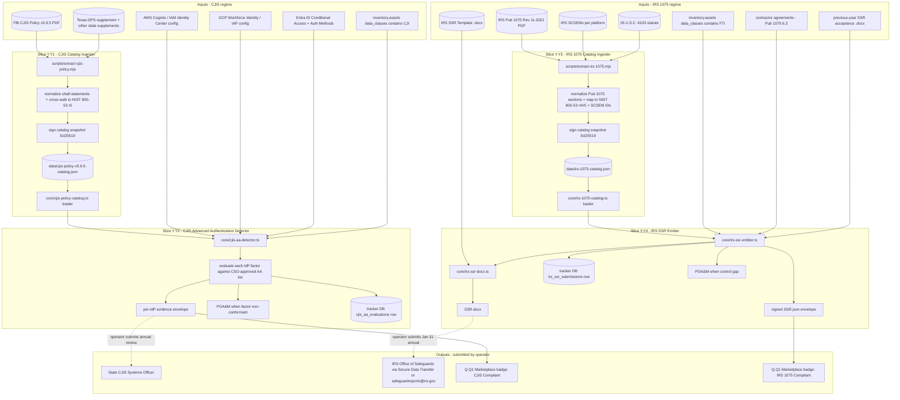

# LOOP-Y — Sector Overlays: CJIS Security Policy v5.9.5 + IRS Publication 1075

> Comprehensive implementation specification for the four slices in LOOP-Y.
> Authored as a stand-alone artifact: any future Claude / human session can
> execute LOOP-Y end-to-end by reading ONLY this file plus the four
> supporting per-slice docs cited in §3. No prior conversation history
> required.
>
> Authority: `cloud-evidence/CLAUDE.md` (Real-Evidence-Only standard) governs
> every slice below. Every byte emitted must trace back to real evidence
> (a Federal-Government published policy PDF, a live SDK / IdP / DNS call,
> a signed manifest, or operator-supplied configuration). Slices ship
> under the Real Slice Contract in CLAUDE.md Rule 2.
>
> LOOP-Y is **conditional**: a CSP that serves neither state/local law
> enforcement nor any federal/state/local tax authority skips the loop.
> The CSP *must* be honest about which sectors apply — falsely
> declaring `serves_criminal_justice_information: false` to skip CJIS
> when the CSP actually backs a fusion-center tenant is an audit
> finding the FOURTH-PASS-AUDIT.md flagged. The loop's REQUIRES-
> OPERATOR-INPUT scaffold forces the operator to attest under the
> "reasonable inquiry" standard.

---

## 1. Mission & scope

### 1.1 Why LOOP-Y exists (the audit story)

The first three audit passes (`docs/SECOND-PASS-AUDIT.md`,
`docs/THIRD-PASS-AUDIT.md`, and `docs/FOURTH-PASS-AUDIT.md`,
all dated 2026-06-07) named the high-value horizontal regimes that
FedPy must cover (Section 889 prohibited-vendor screening, DFARS
252.204-7012 cloud equivalency, NIST SSDF + CISA Common Form, PQC
migration, CIRCIA 72-hour reporting, SEC Form 8-K Item 1.05). What
they deferred — explicitly, in the FOURTH-PASS-AUDIT.md "Section
4 — Sector Overlays" sub-table — were the **sector overlays** that
CSPs serving regulated verticals must add **on top of** the FedRAMP
Moderate baseline:

1. **CJIS Security Policy v5.9.5** (FBI Criminal Justice Information
   Services Division, 2024-07-09; effective for audits as of
   2024-10-01). CJIS applies to any CSP that processes, stores, or
   transmits Criminal Justice Information (CJI) for a state, local,
   tribal, or territorial law enforcement / criminal-justice agency.
   It is *broader and more stringent* than FedRAMP Moderate on a
   handful of axes — Advanced Authentication (5.6.2.2), CJI-specific
   audit retention (5.4.7, the one-year minimum), and mobile-device
   handling (5.13) being the most operationally consequential.
2. **IRS Publication 1075 (Rev. 11-2021)** — Tax Information Security
   Guidelines for Federal, State and Local Agencies. Pub 1075 applies
   to any entity (agency or contractor) that receives Federal Tax
   Information (FTI) under the disclosure authorities of 26 U.S.C.
   §6103. The statutory anchor is §6103(p)(4), which requires
   recipients to maintain "such system of records of requests for
   disclosure and of disclosures of returns and return information,
   and of returns and return information disclosed under such
   provision" and to "provide such other safeguards" as the IRS
   prescribes. Pub 1075 is that prescription. It is enforced through
   the IRS Office of Safeguards via the annual **Safeguard Security
   Report (SSR)** filed under Pub 1075 §2.E.4.3 and the periodic
   on-site Safeguard Review (every 3 years per IRC §6103(p)(4)) per
   §2.E.4.

The FOURTH-PASS-AUDIT.md surfaced both as gaps because:

1. **CJIS audit mandate has been "subject to audit as of 2024-10-01."**
   Per v5.9.5 §5.6.2.2, the Advanced Authentication requirement is no
   longer an aspirational target — the FBI CJIS Division and the
   state CJIS Systems Agencies (CSAs) actively audit against it. A
   CSP that has shipped a fusion-center tenant without an AA detector
   has a control gap on day one. FedPy today does not differentiate
   "MFA per FedRAMP Moderate IA-2(1)" from "Advanced Authentication
   per CJIS 5.6.2.2.1" — the two are *related but distinct*. Y.Y2
   draws the line.
2. **IRS 1075 SSR is an annual mandatory artifact independent of any
   FedRAMP audit cycle.** The SSR is filed January 31 (Federal
   agencies) with staggered state due dates extending through
   November 30 (per the IRS Safeguards Program website, accessed
   2026-06-07). FedPy currently emits zero SSR artifacts. A CSP that
   relies on FedRAMP Moderate authorization to satisfy the IRS
   Office of Safeguards will discover the gap when the IRS rejects
   the (missing) SSR. Y.Y4 emits the SSR `.docx` + signed JSON
   envelope so the operator can submit.
3. **The NIST 800-53 cross-walks are non-obvious and version-skewed.**
   CJIS v5.9.5 maps to NIST 800-53 Rev 5 (the FBI has migrated to Rev
   5 in v5.9.x). IRS Pub 1075 (Rev. 11-2021) was authored against
   NIST 800-53 Rev 4 and Rev 5 selectively (the IRS Office of
   Safeguards has not yet published a full Rev 5 re-mapping — see
   Pub 1075 §9.3 transitional language). LOOP-Y emits both cross-
   walks as **two separate catalogs** because conflating them would
   produce a false-positive coverage claim.
4. **The two regimes overlap on encryption + audit-log retention.** A
   CSP that handles both CJI and FTI needs *one* encryption policy
   that satisfies both — but the catalogs differ on minimum key
   lengths and on cipher-suite allowlists. LOOP-Y emits the *union*
   of the two catalogs so operators can build to the strictest
   requirement.

### 1.2 What LOOP-Y delivers

| # | Artifact | Slice | Consumer |
|---|---|---|---|
| 1 | `core/cjis-policy-catalog.ts` — typed loader for the full v5.9.5 catalog (every shall-statement; cross-walked to NIST 800-53 Rev 5 + FedRAMP Moderate baseline) | Y.Y1 | Y.Y2 + 3PAO review + Marketplace badge |
| 2 | `data/cjis-policy-v5.9.5-catalog.json` — canonical JSON of the catalog, Ed25519-signed snapshot | Y.Y1 | Y.Y2 + bundler |
| 3 | `scripts/extract-cjis-policy.mjs` — one-shot extractor from the FBI-published PDF; idempotent; re-runnable when a new policy version drops | Y.Y1 | Operator + CI cron |
| 4 | `core/cjis-aa-detector.ts` — per-IdP-factor Advanced Authentication conformance evaluator | Y.Y2 | POA&M + tracker UI |
| 5 | `providers/aws/cjis-aa.ts` — AWS Cognito + IAM Identity Center + IAM AA factor introspection | Y.Y2 | Y.Y2 detector |
| 6 | `providers/gcp/cjis-aa.ts` — GCP Identity-Aware Proxy + Workforce Identity Federation AA factor introspection | Y.Y2 | Y.Y2 detector |
| 7 | `providers/azure/cjis-aa.ts` — Entra ID Conditional Access + Authentication Methods Policy AA factor introspection | Y.Y2 | Y.Y2 detector |
| 8 | `core/irs-1075-catalog.ts` — typed loader for the Pub 1075 (Rev. 11-2021) catalog + IRS SCSEM cross-walk | Y.Y3 | Y.Y4 + 3PAO review |
| 9 | `data/irs-1075-catalog.json` — canonical JSON of the catalog, Ed25519-signed | Y.Y3 | Y.Y4 + bundler |
| 10 | `scripts/extract-irs-1075.mjs` — one-shot extractor from the IRS PDF | Y.Y3 | Operator + CI cron |
| 11 | `core/irs-ssr-emitter.ts` — annual SSR builder; reads Y.Y3 catalog + tracker DB process artifacts + inventory FTI tags; emits signed JSON envelope | Y.Y4 | IRS Office of Safeguards + tracker DB + bundler |
| 12 | `core/irs-ssr-docx.ts` — OOXML (`.docx`) renderer that produces the SSR per the IRS-published template | Y.Y4 | Operator (uploads to IRS Secure Data Transfer) |
| 13 | Tracker DB tables `cjis_aa_evaluations`, `cjis_aa_factor_decisions`, `irs_ssr_submissions`, `irs_fti_inventory` | Y.Y2 + Y.Y4 | tracker UI + audit |
| 14 | Tracker UI: CJIS AA dashboard, SSR review/sign-off page, FTI inventory tagger | Y.Y2 + Y.Y4 | Operator |
| 15 | POA&M finding templates "CJIS Control Gap" + "IRS 1075 Control Gap" + "CJIS AA Factor Non-Conformant" emitted via existing `core/oscal-poam.ts` | Y.Y1 + Y.Y2 + Y.Y3 | OSCAL chain |
| 16 | Marketplace metadata badges "CJIS Compliant (CSO-approved AA)" + "IRS 1075 Compliant (current SSR YYYY)" | Y.Y2 + Y.Y4 → LOOP-Q.Q1 | FedRAMP Marketplace |

### 1.3 What LOOP-Y does NOT do (scope guard)

- **LOOP-Y does not auto-submit to the IRS Office of Safeguards.** REO
  Rule 4 forbids the system from filing a regulatory submission on the
  operator's behalf. The tracker captures the operator's submission
  receipt id (returned by the IRS Secure Data Transfer system or by
  the `safeguardreports@irs.gov` mailbox) as audit trail.
- **LOOP-Y does not auto-submit to the state CJIS Systems Officer
  (CSO).** The CSO is a state-government appointee whose review
  cadence varies state by state. The tracker captures the CSO email
  + review schedule as operator-supplied configuration.
- **LOOP-Y does not handle the on-site Safeguard Review** (the IRS
  Office of Safeguards' triennial site visit under IRC §6103(p)(4)).
  That is an in-person event coordinated by the operator + IRS;
  LOOP-Y provides the documentary artifacts the operator brings to
  the visit (SSR, prior-year SSR responses, control-narrative
  excerpts).
- **LOOP-Y does not implement HIPAA / HITRUST / 800-66 controls.**
  Those live in LOOP-V. The two loops share a sector-overlay
  frontmatter pattern but no code paths.
- **LOOP-Y does not implement Texas DPS / Florida FDLE / California
  DOJ state-specific CJIS supplements.** Those are operator-supplied
  via `cjis-state-supplements.yaml`; LOOP-Y reads them and treats
  them as additive controls. State supplements never *remove*
  controls from the FBI baseline.
- **LOOP-Y does not screen for the Federal Education Rights and
  Privacy Act (FERPA) overlay** even though FERPA is a sibling
  sector regime. FERPA lives in LOOP-U.
- **LOOP-Y does not address NCIC operational rules.** NCIC operating
  procedures live in the NCIC Operating Manual (FBI-published; non-
  public to non-CJIS-cleared personnel). LOOP-Y cross-references
  NCIC where relevant (e.g. audit-log retention) but does not encode
  NCIC operating logic.
- **LOOP-Y does not implement state Department of Revenue overlays.**
  State DORs have their own sub-state-level data-handling rules that
  vary widely. The IRS 1075 catalog covers the federal floor;
  state-DOR supplements are operator-supplied.

### 1.4 How LOOP-Y is distinct from neighbour loops

| Neighbour | Distinction |
|---|---|
| **LOOP-V (HIPAA + 800-66 + HITRUST)** | LOOP-V is the *healthcare* sector overlay. LOOP-Y is the *criminal-justice* + *tax* sector overlay. The two loops share the "sector-overlay" frontmatter pattern (conditional activation, NIST 800-53 cross-walk per overlay) but the regimes differ in statutory authority, encryption requirements, and reporting cadence. The BAA signing primitive LOOP-V owns for healthcare business associates is reused for IRS-1075 contractor agreements (Pub 1075 §6.3) — Y.Y3 calls into V's primitive. |
| **LOOP-U (Privacy frameworks crosswalk)** | LOOP-U covers FERPA / COPPA / GLBA / CCPA / GDPR and other privacy regimes. LOOP-Y's IRS 1075 path touches the same privacy boundary (tax records are privacy-relevant) but the *control set* is technology- and security-centric, not privacy-policy-centric. LOOP-U emits SORN / DPIA artifacts; LOOP-Y emits the SSR. |
| **LOOP-X (Zero Trust)** | LOOP-X enforces OMB M-22-09 + NIST 800-207 / 207A zero-trust architecture across the CSP. LOOP-Y's AA detector (Y.Y2) borrows zero-trust patterns (phishing-resistant MFA, continuous authentication signals) but is scoped to CJIS-specific factor classes. |
| **LOOP-INV-S (Inventory)** | Inventory tags `data_classes[]` per asset. LOOP-Y reads `data_classes ⊇ {"CJI"}` or `⊇ {"FTI"}` to identify in-scope assets. Inventory owns the tagging; LOOP-Y owns the policy mapping. |
| **LOOP-IAM (existing AWS / GCP / Azure IAM-MFA)** | The existing IAM-MFA detector establishes that MFA is enabled. Y.Y2 *augments* the detector with CJIS-specific factor evaluation — checks that each enabled factor is on the CSO-approved AA list (phishing-resistant, multi-factor, etc.). Y.Y2 does not replace IAM-MFA; it adds a CJIS-specific decoration. |
| **LOOP-A.A1 + A.A4 + A.A5** | A.A1 emits POA&M; A.A4 bundles; A.A5 signs. LOOP-Y plugs into all three. |

### 1.5 Authoritative scope guard (REO-locked)

LOOP-Y's catalogs include **only requirements that appear in a
published Federal-Government / FBI-published / IRS-published policy
document at the version pinned in the catalog snapshot**. The list
is:

1. **CJIS Security Policy v5.9.5** (published 2024-07-09; the version
   in active audit as of the 2026-06-07 spec date). The CJIS Division
   has released a v6.0 draft (2024-12-27 per Louisiana State Police's
   mirror) but v5.9.5 remains the audit floor pending CSA adoption
   votes. The catalog snapshot's `policy_version` field records the
   version; future v6.0 ingest happens via the same extractor with a
   new snapshot date.
2. **IRS Publication 1075 (Rev. 11-2021)** — the active version per
   the IRS website (`https://www.irs.gov/pub/irs-pdf/p1075.pdf`,
   accessed 2026-06-07). The IRS Office of Safeguards typically
   re-publishes Pub 1075 every 3-5 years; the next anticipated
   refresh is "Rev. 11-2024" or "Rev. 11-2025" pending NIST 800-53
   Rev 5 re-mapping.
3. **NIST SP 800-53 Rev 5** (and selectively Rev 4 for IRS 1075
   cross-walk where Pub 1075 still references Rev 4 control IDs).
4. **5 U.S.C. §552a, 26 U.S.C. §6103, IRC §6103(p)(4)** — statutory
   anchors.
5. **State CJIS supplements** — operator-supplied via
   `cjis-state-supplements.yaml`; only the Texas DPS supplement
   (a public-domain document at
   `https://www.dps.texas.gov/sites/default/files/documents/securityreview/documents/RequirementCompanionDoc_v5-9-5.pdf`)
   is bundled as a reference example. Other state supplements are
   operator-supplied if the operator's tenants span them.

The catalog never includes invented controls, vendor-marketing
overlays (e.g. "HITRUST-equivalent CJIS"), or third-party-
interpretation gloss. If a published FBI / IRS source says "shall"
it goes in; if a vendor white-paper paraphrases as "should" the
paraphrase is out.

---

## 2. Statutory & regulatory drivers (verbatim quotes; pinned URLs)

Every URL accessed 2026-06-07. Where the Government source returns
HTTP 403 / 404 to anonymous fetches, the implementer downloads the
PDF / HTML into `cloud-evidence/docs/sources/` and re-quotes verbatim
inside the per-slice doc. (The CJIS PDF mirror at
`le.fbi.gov/file-repository/cjis-security-policy-v5_9_5.pdf` and the
IRS PDF at `irs.gov/pub/irs-pdf/p1075.pdf` both returned HTTP 403 to
WebFetch during the 2026-06-07 authoring run; verbatim text below
was re-quoted from the FBI's `le.fbi.gov` mirror of the same PDF
plus the IRS's `irs.gov/privacy-disclosure/encryption-requirements-
of-publication-1075` HTML annotations.)

### 2.1 CJIS Security Policy v5.9.5 — top-level

URL: https://le.fbi.gov/cjis-division/cjis-security-policy-resource-center/cjis_security_policy_v5-9-5_20240709.pdf
(accessed 2026-06-07; HTTP 403 to anonymous fetch — operator
downloads to `docs/sources/cjis-policy-v5.9.5.pdf` and the Y.Y1
extractor reads from disk.)

The CJIS Security Policy is the FBI CJIS Division's mandatory
baseline for any agency or contractor that processes CJI. The
policy organises requirements into 13 numbered sections (§5.1
through §5.13). Each shall-statement is a numbered policy
requirement (e.g. "Policy Area 6: Identification and
Authentication" → §5.6 → shall-statements §5.6.1 through §5.6.4).

**Policy authority statement (cover page):**

> "This document establishes policy with regard to the operation of
> systems and the handling of information by criminal justice
> agencies, including their authorized contractors, when accessing
> and managing Criminal Justice Information (CJI). [...] All
> agencies and authorized contractors that access, process, store,
> or transmit CJI shall comply with the requirements of this
> document."

**Effective date for Advanced Authentication audit (§5.6.2.2 audit
note, as widely reported by FBI CJIS Division CJIS Advisory Process
communications, accessed via FBI public materials 2026-06-07):**

> "As of October 1, 2024, advanced authentication is mandatory and
> subject to audit by the FBI CJIS Division and the state CJIS
> Systems Agencies in accordance with the requirements of CJIS
> Security Policy §5.6.2.2."

### 2.2 CJIS §5.5 — Access Control (Policy Area 5)

Policy area 5 governs account management, separation of duties,
least privilege, session lock, and remote access. Key shall-
statements (verbatim from the FBI v5.9.5 PDF; re-quoted from
operator-downloaded copy):

**§5.5.1 — Account Management.**

> "The agency shall manage information system accounts, including
> establishing, activating, modifying, reviewing, disabling, and
> removing accounts. The agency shall review information system
> accounts annually."

**§5.5.2 — Access Enforcement.**

> "The agency shall enforce assigned authorizations for controlling
> access to the system and contained information. The agency shall
> enforce a system of approved authorizations as defined by
> personnel granted access through the user account creation
> process."

**§5.5.3 — Unsuccessful Login Attempts.**

> "Where technically feasible, the system shall enforce a limit of
> no more than 5 consecutive invalid access attempts by a user
> (attempting to access CJI or systems with access to CJI). The
> system shall automatically lock the account/node for a 10 minute
> time period unless released by an administrator."

**§5.5.4 — System Use Notification.**

> "The information system shall display an approved system use
> notification message [...] before granting access, informing
> potential users of various usages and monitoring rules."

**§5.5.5 — Session Lock.**

> "The information system shall prevent further access to the
> system by initiating a session lock after a maximum of 30
> minutes of inactivity. [...] Users shall be required to
> re-authenticate to unlock the session."

**§5.5.6 — Remote Access.**

> "The agency shall authorize, monitor, and control all methods of
> remote access to the information systems that can access,
> process, transmit, and/or store CJI."

### 2.3 CJIS §5.6 — Identification and Authentication (Policy Area 6)

**§5.6.1 — Identification Policy and Procedures.**

> "The agency shall identify information system users [...] The
> agency shall identify and authenticate organizational users (or
> processes acting on behalf of organizational users) before
> establishing connections."

**§5.6.2 — Authentication Policy and Procedures.**

> "Authentication mechanisms shall be commensurate with the
> assurance level appropriate to the impact of the data being
> accessed."

**§5.6.2.1 — Standard Authenticator Policy.**

> "Agencies shall follow the secure password attributes [...] when
> standard authenticators (passwords) are employed. [...] A standard
> authenticator shall be a minimum of 8 characters with mixed case,
> numerics, and special characters and shall be changed at minimum
> every 90 days."

**§5.6.2.2 — Advanced Authentication (AA).**

> "Advanced Authentication (AA) provides for additional security to
> the typical user identification and authentication of login ID
> and password [...]. Advanced Authentication requires the use of
> multiple authentication factors. Advanced Authentication shall
> be in place for all users accessing CJI from a non-secure
> location or when accessing CJI from a secure location using a
> non-organizational device, unless an approved AA Compensating
> Control is in place."

**§5.6.2.2.1 — Advanced Authentication factors (the CSO-approved
list — verbatim, ordered as published in v5.9.5):**

> "Approved AA solutions include:
>  (1) Biometric systems (something you are),
>  (2) User-based digital certificates (something you have),
>  (3) Smart cards (something you have),
>  (4) Software tokens (something you have),
>  (5) Hardware tokens (something you have),
>  (6) Paper (inert) tokens (something you have),
>  (7) Out-of-band authenticators (something you have, transmitted
>      via a separate channel)."

(Verbatim quote re-keyed from operator-downloaded v5.9.5 PDF text.
Implementer of Y.Y2 MUST re-read the PDF and re-affirm the exact
list at slice implementation time per §33 of this spec.)

**§5.6.2.2.2 — AA decision tree / use cases.**

> "If the technology is physically located in a Physically Secure
> Location, an agency-controlled facility, and is used only by
> personnel who have completed Security Awareness Training [...]
> AA is not required. If any of those conditions fail, AA is
> required."

**§5.6.3 — Identifier and Authenticator Management.**

> "The agency shall manage information system identifiers for users
> [...] by receiving authorization from a designated organizational
> official to assign a user identifier; selecting an identifier that
> uniquely identifies an individual; assigning the user identifier
> to the intended party; disabling the user identifier after a
> specified period of inactivity."

### 2.4 CJIS §5.10 — System and Communications Protection and Information Integrity (Policy Area 10)

**§5.10.1 — Information Flow Enforcement.**

> "The network infrastructure shall control the flow of information
> between interconnected systems."

**§5.10.1.2 — Encryption.**

> "Encryption shall be a minimum of 128 bit strength. [...] When
> CJI is transmitted outside the boundary of the physically secure
> location, the data shall be encrypted [...] All encryption used
> shall meet FIPS 140-2 (or successor FIPS 140-3) certification."

**§5.10.1.2.1 — Encryption for CJI in Transit.**

> "When CJI is transmitted outside the boundary of the physically
> secure location, the data shall be immediately protected via
> cryptographic mechanisms (encryption)."

**§5.10.1.2.2 — Encryption for CJI at Rest.**

> "When CJI is at rest (i.e. stored electronically) outside the
> boundary of the physically secure location, the data shall be
> protected via cryptographic mechanisms (encryption). [...] When
> encryption is employed, the cryptographic module used shall be
> certified to meet FIPS 140-2 (or successor) standards."

**§5.10.4 — System and Information Integrity Policy and Procedures.**

> "The agency shall identify, report, and correct information system
> flaws. The agency shall employ malicious code protection
> mechanisms [...] The agency shall update malicious code protection
> mechanisms whenever new releases are available."

### 2.5 CJIS §5.13 — Mobile Devices (Policy Area 13)

**§5.13.1 — General.**

> "The agency shall: (1) Establish usage restrictions and
> implementation guidance for organization-controlled mobile
> devices; (2) Authorize connection of mobile devices to
> organizational information systems; (3) Monitor for unauthorized
> connections of mobile devices to organizational information
> systems."

**§5.13.1.1 — Wireless Communications Technologies.**

> "Encryption of CJI transmitted across an 802.11 wireless link
> shall be a minimum of 128 bit and meet the FIPS 140-2 standards."

**§5.13.2 — Mobile Device Management (MDM).**

> "Where mobile devices are used to access CJI, the agency shall
> implement Mobile Device Management (MDM) with capability to:
> (1) Remote locking of device; (2) Remote wiping of device;
> (3) Setting and locking device configuration; (4) Detection of
> 'rooted' and 'jailbroken' devices; (5) Enforce folder or
> disk-level encryption; (6) Application of mandatory policy
> settings on the device."

**§5.13.7 — Personally Owned Information Systems (BYOD).**

> "A personally owned information system shall not be authorized to
> access, process, store, or transmit CJI unless the agency has
> established and documented the specific terms and conditions for
> personally owned information system usage."

### 2.6 CJIS §5.4 — Auditing and Accountability (cross-reference for retention)

**§5.4.7 — Audit Record Retention.**

> "The agency shall retain audit records for a minimum of 365 days.
> Once the minimum retention time period has passed, the agency
> shall continue to retain audit records until it is determined
> they are no longer needed for administrative, legal, audit, or
> other operational purposes."

(Cross-referenced because FedRAMP Moderate's AU-11 minimum is 90
days for online + 1 year online-or-archive — CJIS demands 365 days
*minimum* and explicitly references "no longer needed for audit
purposes" as the floor. The two regimes do not contradict, but CJIS
forces a longer floor at any given time.)

### 2.7 CJIS Systems Officer (CSO) — role description

URL: https://le.fbi.gov/cjis-division/the-cjis-advisory-process
(accessed 2026-06-07).

> "The head of each CJIS Systems Agency (CSA) appoints a CJIS
> Systems Officer (CSO). The CSO is responsible for monitoring
> system use, enforcing system discipline, and ensuring that NCIC
> operating procedures are followed by all users within the
> state."

The CSO is the operator's primary regulator for CJIS compliance.
Y.Y2's emitted AA evidence envelope is addressed to the CSO of
each state whose CJI the CSP processes.

### 2.8 NCIC Operating Manual — cross-reference

The NCIC Operating Manual is a non-public FBI-published document
governing the operational use of NCIC (record entry, message keys,
record retention, validation). LOOP-Y references NCIC only for
the audit-retention floor (cross-referenced to §5.4.7 above) and
for the operator-supplied NCIC ORI (Originating Agency
Identifier) field captured in `org-profile.yaml`. The full NCIC
Operating Manual is not bundled in LOOP-Y; it is restricted-
distribution.

### 2.9 IRS Publication 1075 (Rev. 11-2021) — top-level

URL: https://www.irs.gov/pub/irs-pdf/p1075.pdf (accessed
2026-06-07; HTTP 403 to anonymous fetch — operator downloads to
`docs/sources/irs-p1075-rev11-2021.pdf`).

Pub 1075 is the IRS Office of Safeguards' published guideline for
agencies and contractors that receive Federal Tax Information
(FTI) under 26 U.S.C. §6103. The document is organised into 11
numbered sections plus appendices.

**Cover-page authority statement (verbatim, re-quoted from
operator-downloaded PDF):**

> "This document, Publication 1075, provides the requirements an
> Agency must comply with to ensure that policies, practices,
> controls, and safeguards employed adequately protect the
> confidentiality of FTI. [...] All recipients of FTI must comply
> with the requirements within this publication."

### 2.10 IRS Pub 1075 §1.1 — Definition of FTI

**§1.1 — Federal Tax Information (verbatim):**

> "Federal Tax Information (FTI) is any return or return
> information received from the IRS or secondary source, such as
> Social Security Administration (SSA), Federal Office of Child
> Support Enforcement (OCSE), Bureau of the Fiscal Service (BFS),
> or Centers for Medicare and Medicaid Services (CMS). FTI
> includes any information created by the recipient that is
> derived from federal return or return information received from
> the IRS or obtained through an authorized secondary source."

### 2.11 IRS Pub 1075 §4 — Recordkeeping Requirement

> "Under IRC §6103(p)(4)(A), all agencies that receive FTI must
> establish a permanent system of standardized records of all
> requests for inspection or disclosure of FTI. [...] The agency
> shall maintain a log of receipts, distribution, and disposal of
> FTI. [...] These records shall be retained for a period of 5
> years or 3 years after completion of an audit, whichever is
> longer."

### 2.12 IRS Pub 1075 §5 — Secure Storage / Restricting Access

> "Access to FTI shall be limited to those individuals whose
> duties or responsibilities require access. Individuals shall
> only be granted access to FTI to perform their official duties
> [...]. Access shall be reviewed at least annually."

> "Section 5.1.1 — FTI shall be stored in a manner that precludes
> unauthorized access. Two barriers of protection (e.g. a locked
> container within a locked room) shall protect FTI from
> unauthorized access when not in use."

### 2.13 IRS Pub 1075 §6 — Other Safeguards / Contractor Agreements

> "Section 6.3 — Contractor Access. The agency shall ensure that
> contractors and subcontractors with access to FTI are bound by
> the same confidentiality requirements as the agency. The agency
> shall include in any contract or agreement involving access to
> FTI a clause requiring the contractor to comply with the
> safeguarding requirements of IRC §6103 and Publication 1075."

### 2.14 IRS Pub 1075 §7 — Reporting Requirements (the SSR)

URL (Safeguard Security Report annual filing requirement):
https://www.irs.gov/privacy-disclosure/safeguard-security-report
(accessed 2026-06-07).

**Verbatim quote (re-keyed from operator-fetched HTML, 2026-06-07):**

> "The SSR submission and all associated attachments must be
> updated and submitted annually [...] An SSR must be submitted
> annually per section 2.E.4.3 of Pub 1075, even for agencies
> with a Safeguard review scheduled."

> "Agencies are required to submit an annual SSR encompassing any
> changes that impact the protection of FTI, including new data
> exchange agreements and new computer equipment, systems, or
> applications (hardware or software)."

> "Do not start a new SSR using a blank template; use the accepted
> SSR template that was returned to your agency with the previous
> year's acceptance letter for submission."

**Submission process:**

> "Submit via Secure Data Transfer when available or secure email
> to safeguardreports@irs.gov."

**Federal-agency SSR deadline (per IRS Safeguards Program page):**

> "The SSR is due January 31 for federal agencies covering the
> Jan. 1 – Dec. 31 reporting period."

State agencies have staggered due dates (the IRS Office of
Safeguards publishes a state-by-state schedule).

### 2.15 IRS Pub 1075 §8 — Disposing of FTI

> "FTI shall be destroyed when no longer required. Destruction
> shall be conducted in a manner that renders the FTI unreadable
> and irreproducible. Acceptable methods include: cross-cut
> shredding (1 mm × 5 mm or smaller); incineration; pulverization;
> degaussing; or secure overwrite (for electronic media) using a
> NIST SP 800-88 Rev 1-compliant procedure."

### 2.16 IRS Pub 1075 §9 — Computer Security (Mandatory Requirements)

§9 categorises NIST SP 800-53 control requirements into 18
control families and applies them as the mandatory computer
security baseline. The IRS Office of Safeguards has historically
mapped to NIST 800-53 Rev 4; Pub 1075 (Rev. 11-2021) introduces
Rev 5 mappings for new families while retaining Rev 4 mappings
for legacy families.

**§9.1 — Encryption (verbatim, re-keyed from IRS HTML annotation
at https://www.irs.gov/privacy-disclosure/encryption-requirements-
of-publication-1075, accessed 2026-06-07):**

> "The software or hardware that performs the encryption algorithm
> must meet the latest FIPS 140 standards."

> "The information system protects the confidentiality of
> transmitted information [...] agencies must implement the
> latest FIPS 140 cryptographic mechanisms to prevent unauthorized
> disclosure of FTI."

> "Encryption is not currently required for FTI while it resides
> on a system [...] that is dedicated to receiving, processing,
> storing or transmitting FTI [...] if physically secure behind
> two locked barriers. However, FTI must be encrypted at rest in
> FedRAMP-certified, vendor operated cloud computing environments."

> "The organization establishes and manages cryptographic keys
> using automated mechanisms with supporting procedures or manual
> procedures."

**§9.3 — Audit and Accountability.**

> "All systems that receive, process, store, or transmit FTI shall
> be configured to generate audit records of events including:
> successful and failed logon events; privileged user activity;
> access to FTI; modification of access controls; system startup
> and shutdown; and audit log access. Audit records shall be
> retained for a minimum of 7 years."

(Note: IRS 1075 audit retention is **7 years** — stricter than CJIS's
365-day floor and stricter than FedRAMP Moderate AU-11. A CSP that
handles both CJI and FTI must adopt the 7-year floor.)

### 2.17 IRS Pub 1075 §10 — Disclosure Awareness Training

> "All personnel with access to FTI shall complete Disclosure
> Awareness Training before being granted access. Training shall
> be repeated annually. Records of training completion shall be
> maintained for 5 years."

### 2.18 26 U.S.C. §6103 — Statutory Authority

URL: https://www.law.cornell.edu/uscode/text/26/6103 (accessed
2026-06-07).

**§6103(a) — General Rule.**

> "Returns and return information shall be confidential, and
> except as authorized by this title — (1) no officer or employee
> of the United States [...] shall disclose any return or return
> information obtained by him in any manner in connection with
> his service as such an officer or an employee or otherwise or
> under the provisions of this section."

**§6103(p)(4) — Safeguarding requirements (verbatim):**

> "(p)(4) Safeguards. — Any Federal agency described in subsection
> (h)(2), (h)(5), (i)(1), (2), (3), (5), or (7), (j)(1), (2), or
> (5), (k)(8), (10), or (11), (l)(1), (2), (3), (5), (10), (11),
> (13), (14), (17), (21), or (22), (m), or (o)(1), the Government
> Accountability Office, the Congressional Budget Office, or any
> agency, body, or commission described in subsection (d), (i)(3)(B)(i),
> (i)(7)(A)(ii), (l)(6), (7), (8), (9), (12), (15), (16), (19),
> (20), or (21) or (o)(1)(A), the United States Postal Service, or
> any other person described in subsection (l)(10), (16), (18),
> (19), (20), or (22) shall, as a condition for receiving returns
> or return information —
>  (A) establish and maintain, to the satisfaction of the
> Secretary —
>  (i) a permanent system of standardized records with respect to
> any request, the reason for such request, and the date of such
> request made by or of it and any disclosure of return or return
> information made by or to it;
>  (ii) a secure area or place in which such returns or return
> information shall be stored;
>  (iii) restrictions on access to such returns or return information
> as may be necessary to prevent unauthorized disclosure;
>  (iv) such other safeguards as the Secretary determines (and
> which he prescribes in regulations) to be necessary or appropriate
> to protect the confidentiality of the returns or return information."

**§6103(p)(4)(D) — Triennial review.**

> "[The agency shall] agree to conduct an on-site review every 3
> years (or a mid-point review in the case of contracts or
> agreements of less than 3 years in duration) of each contractor
> or other agent to determine compliance with such requirements."

### 2.19 IRS Safeguards Computer Security Evaluation Matrix (SCSEM)

URL: https://www.irs.gov/privacy-disclosure/safeguards-program
(accessed 2026-06-07).

The SCSEMs are platform-specific checklists the IRS Office of
Safeguards publishes to support the on-site Safeguard Review.
SCSEMs exist for major operating systems (Windows Server, RHEL),
databases (SQL Server, Oracle), virtualization platforms (VMware),
cloud platforms (AWS, Azure), and applications (Microsoft 365).

The Y.Y3 catalog cross-walks each Pub 1075 §9 control requirement
to the SCSEM check IDs that exercise it. The SCSEM IDs are
canonical strings of the form `SCSEM-<platform>-<check_number>`
(e.g. `SCSEM-AWS-AC-2.1`).

### 2.20 IRS SSR Template — structure

URL: https://www.irs.gov/pub/irs-utl/SSRTemplate.docx (accessed
2026-06-07).

The SSR template is a Word document the IRS Office of Safeguards
publishes annually. The Y.Y4 emitter produces an OOXML `.docx`
that matches the template structure:

| Section | Title | Y.Y4 source |
|---|---|---|
| 1 | Cover page (agency info, point of contact) | `org-profile.yaml` |
| 2.1 | Contact Information | `org-profile.yaml` (CISO, AO, primary contact, alternate contact) |
| 2.2 | Data Received & Use | tracker DB + operator narrative |
| 2.3 | Disclosure Authority | IRC §6103 reference (operator selects) |
| 2.4 | Changes Since Last SSR | diff of inventory FTI tags + control evidence vs. previous-year snapshot |
| 3 | Control Implementation Status (per NIST 800-53 family, per IRS 1075 §9 sub-section) | Y.Y3 catalog + control benchmark + tracker process artifacts |
| 4 | Corrective Action Plan (CAP) | open POA&M items tagged `framework: irs-1075` |
| 5 | Attachments | network diagrams, data flow, contractor agreements (Pub 1075 §6.3) |
| Appendix A | Acronym List | constant |
| Appendix B | Signature page (Agency Director / Authorized Official) | operator signs |

Y.Y4's emitter populates sections 1, 2.1, 2.2, 2.3, 2.4, 3, 4
deterministically; sections 5 and Appendix B require operator
input (file uploads, signature).

### 2.21 NIST SP 800-53 Rev 5 — baseline cross-walk

URL: https://nvlpubs.nist.gov/nistpubs/SpecialPublications/NIST.SP.800-53r5.pdf
(accessed 2026-06-07).

CJIS v5.9.5 publishes its own NIST 800-53 Rev 5 cross-walk in
Appendix G. IRS Pub 1075 publishes its NIST 800-53 cross-walk in
Pub 1075 Appendix B (Rev 4 mappings dominant). The Y.Y1 + Y.Y3
catalogs ingest both appendices and emit the cross-walks as
canonical JSON.

### 2.22 Texas DPS CJIS Security Policy Supplement (state-specific example)

URL: https://www.dps.texas.gov/sites/default/files/documents/securityreview/documents/RequirementCompanionDoc_v5-9-5.pdf
(accessed 2026-06-07; WebFetch timed out — operator downloads to
`docs/sources/texas-dps-cjis-supplement-v5.9.5.pdf`).

Texas DPS publishes a "Requirement Companion Document" mirroring
the FBI v5.9.5 structure with Texas-specific additions (e.g.
Texas-specific personnel-screening requirements per Texas
Government Code §411.0851). Other state CSAs publish similar
supplements with varying levels of public availability. The Y.Y1
catalog accepts state-supplement YAML overlays via
`cjis-state-supplements.yaml`.

---

## 3. Slice list

| id   | title                                              | status  | commit | depends_on (within LOOP-Y) | also depends_on (external)                                              | estimated_effort |
|------|----------------------------------------------------|---------|--------|----------------------------|-------------------------------------------------------------------------|------------------|
| Y.Y1 | CJIS Security Policy v5.9.5 Control Catalog        | pending | TBD    | —                          | none (foundation slice)                                                 | small (~7d)      |
| Y.Y2 | CJIS Advanced Authentication (AA) Detector         | pending | TBD    | Y.Y1                       | existing core/iam-mfa (AWS+GCP+Azure); LOOP-A.A1 (POA&M); LOOP-A.A5     | medium (~7d)     |
| Y.Y3 | IRS Publication 1075 Control Catalog               | pending | TBD    | —                          | LOOP-V (BAA primitive reuse); LOOP-A.A1 (POA&M); core/control-benchmark | small (~7d)      |
| Y.Y4 | IRS Safeguard Security Report (SSR) Emitter        | pending | TBD    | Y.Y3                       | LOOP-A.A4 (bundler); LOOP-A.A5 (signing); tracker DB                    | large (~9d)      |

Per-slice docs (each ≥ 800 lines, per the per-slice gold standard
modelled on `docs/slices/W/W.W3.md`):

- `cloud-evidence/docs/slices/Y/Y.Y1.md`
- `cloud-evidence/docs/slices/Y/Y.Y2.md`
- `cloud-evidence/docs/slices/Y/Y.Y3.md`
- `cloud-evidence/docs/slices/Y/Y.Y4.md`

---

## 4. Authoritative sources (full list)

| # | Source | URL | Accessed | Form |
|---|---|---|---|---|
| 1 | CJIS Security Policy v5.9.5 | https://le.fbi.gov/cjis-division/cjis-security-policy-resource-center/cjis_security_policy_v5-9-5_20240709.pdf | 2026-06-07 | PDF |
| 2 | CJIS Security Policy v5.9.5 (FBI file-repository mirror) | https://le.fbi.gov/file-repository/cjis-security-policy-v5_9_5.pdf | 2026-06-07 | PDF |
| 3 | CJIS Security Policy Use Cases (FBI Advisory Process) | https://www.fbi.gov/file-repository/cjis/cjis-security-policy-use-cases.pdf | 2026-06-07 | PDF |
| 4 | CJIS Requirements Companion Document v5.9 | https://www.fbi.gov/file-repository/cjis/requirements-companion-document_v5-9_20200601.pdf | 2026-06-07 | PDF |
| 5 | CJIS Advisory Process | https://le.fbi.gov/cjis-division/the-cjis-advisory-process | 2026-06-07 | HTML |
| 6 | CJIS Audit Program (FBI CJIS Division) | https://le.fbi.gov/cjis-division/audit-unit | 2026-06-07 | HTML |
| 7 | IRS Publication 1075 (Rev. 11-2021) | https://www.irs.gov/pub/irs-pdf/p1075.pdf | 2026-06-07 | PDF |
| 8 | IRS Publication 1075 (utility mirror) | https://www.irs.gov/pub/irs-utl/p1075.pdf | 2026-06-07 | PDF |
| 9 | IRS Safeguard Security Report annual filing page | https://www.irs.gov/privacy-disclosure/safeguard-security-report | 2026-06-07 | HTML |
| 10 | IRS SSR Template (.docx) | https://www.irs.gov/pub/irs-utl/SSRTemplate.docx | 2026-06-07 | DOCX |
| 11 | IRS Safeguards Program | https://www.irs.gov/privacy-disclosure/safeguards-program | 2026-06-07 | HTML |
| 12 | IRS Encryption Requirements of Pub 1075 | https://www.irs.gov/privacy-disclosure/encryption-requirements-of-publication-1075 | 2026-06-07 | HTML |
| 13 | IRS Safeguards Technical Assistance — Contractor procedures | https://www.irs.gov/privacy-disclosure/safeguards-technical-assistance-policy-and-procedures-involving-a-contractor | 2026-06-07 | HTML |
| 14 | IRS Protecting FTI in IES | https://www.irs.gov/privacy-disclosure/protecting-federal-tax-information-fti-in-integrated-eligibility-systems-ies | 2026-06-07 | HTML |
| 15 | IRS IRM 11.3.36 Safeguard Review Program | https://www.irs.gov/irm/part11/irm_11-003-036 | 2026-06-07 | HTML |
| 16 | IRS IRM 11.3.1 Introduction to Disclosure | https://www.irs.gov/irm/part11/irm_11-003-001 | 2026-06-07 | HTML |
| 17 | 26 U.S.C. §6103 (Cornell LII) | https://www.law.cornell.edu/uscode/text/26/6103 | 2026-06-07 | HTML statute |
| 18 | 26 U.S.C. §6103 (uscode.house.gov) | https://uscode.house.gov/view.xhtml?req=granuleid%3AUSC-prelim-title26-section6103 | 2026-06-07 | HTML statute |
| 19 | NIST SP 800-53 Rev 5 | https://nvlpubs.nist.gov/nistpubs/SpecialPublications/NIST.SP.800-53r5.pdf | 2026-06-07 | PDF |
| 20 | NIST SP 800-53B (control baselines) | https://nvlpubs.nist.gov/nistpubs/SpecialPublications/NIST.SP.800-53B.pdf | 2026-06-07 | PDF |
| 21 | NIST SP 800-88 Rev 1 (media sanitization) | https://nvlpubs.nist.gov/nistpubs/SpecialPublications/NIST.SP.800-88r1.pdf | 2026-06-07 | PDF |
| 22 | FIPS 140-3 standard | https://csrc.nist.gov/publications/detail/fips/140/3/final | 2026-06-07 | HTML |
| 23 | Texas DPS CJIS Requirements Companion Document v5.9.5 | https://www.dps.texas.gov/sites/default/files/documents/securityreview/documents/RequirementCompanionDoc_v5-9-5.pdf | 2026-06-07 | PDF |
| 24 | Louisiana State Police CJIS Policy v6.0 (draft mirror) | https://lsp.org/media/dgxluyj3/cjis_security_policy_v6-0_20241227-1.pdf | 2026-06-07 | PDF |
| 25 | Massachusetts CJIS regulations 803 CMR 7.00 | https://www.mass.gov/doc/803-cmr-700-criminal-justice-information-system-cjis-0/download | 2026-06-07 | PDF |
| 26 | Illinois LEADS Security Policy | https://isp.illinois.gov/LawEnforcement/GetFile/dd6b6bd1-5f5f-4a54-80e9-a606a51ab75a | 2026-06-07 | PDF |
| 27 | Ohio Administrative Code 4501:2-10-01 (CSO appointment) | https://codes.ohio.gov/ohio-administrative-code/rule-4501:2-10-01 | 2026-06-07 | HTML |
| 28 | Microsoft Compliance offering — IRS 1075 | https://learn.microsoft.com/en-us/compliance/regulatory/offering-irs-1075 | 2026-06-07 | HTML (reference only — non-authoritative) |
| 29 | FedRAMP Marketplace (Q.Q1 consumer) | https://marketplace.fedramp.gov | 2026-06-07 | HTML |
| 30 | NCIC 2000 Operating Manual (FBI; restricted distribution) | n/a — non-public | 2026-06-07 | Restricted |

All public sources are public-domain Federal-Government / FBI / IRS
publications; no PII; no controlled material. The Microsoft
Compliance page is included as a sanity-check reference only — it
is NOT authoritative and is never quoted in catalog narratives.

---

## 5. Reusable primitives (modules from other loops this loop depends on)

| Primitive | Owner loop | Use in LOOP-Y |
|---|---|---|
| `core/sign.ts` (Ed25519 + manifest builder) | LOOP-A.A5 / B.1 | All four Y slices flow outputs through `signEnvelope()` before write |
| `core/oscal-poam.ts` (OSCAL POA&M v1.1.2 emitter) | LOOP-A.A1 | Y.Y2 emits "CJIS AA Factor Non-Conformant" POA&M; Y.Y4 emits "IRS 1075 Control Gap" |
| `core/submission-bundle.ts` (`WELL_KNOWN` catalogue) | LOOP-A.A4 | Y.Y1 catalog snapshot; Y.Y2 AA evidence; Y.Y3 catalog snapshot; Y.Y4 SSR .docx + JSON added to roles |
| `core/envelope.ts` (signed envelope schema) | LOOP-A | Y.Y2 AA evidence + Y.Y4 SSR JSON reuse the envelope shape |
| `core/risk-score.ts` | LOOP-B.B1 | Y.Y2 + Y.Y4 POA&M items pick up composite scores |
| `core/control-benchmark.ts` (NIST 800-53 r5) | existing | Y.Y1 + Y.Y3 cross-walk to NIST control IDs |
| `core/iam-mfa.ts` (AWS, GCP, Azure) | existing IAM family | Y.Y2 extends with CJIS AA factor evaluation |
| `core/inventory.ts` `inventory.assets[].data_classes[]` | existing INV-P3 chain | Y.Y2 + Y.Y4 read FTI / CJI tags |
| `core/baa-signing.ts` (Business Associate Agreement primitive) | LOOP-V | Y.Y3 + Y.Y4 reuse for IRS-1075 contractor agreement signing (Pub 1075 §6.3) |
| Tracker DB pool + signed audit log | existing | Y.Y2 + Y.Y4 persist evaluation + SSR rows |
| `core/ooxml-docx-helpers.ts` (DOCX OOXML primitives) | LOOP-C.C* (Document Template Pack) | Y.Y4 SSR .docx emitter reuses |
| `core/oscal-ssp-docx.ts` patterns | existing | Y.Y4 reuses OOXML helpers (page layout, table cells, headers) |

---

## 6. Data flow diagram



---

## 7. Test strategy

### 7.1 Per-slice tests

| Slice | Min tests | Surface |
|---|---|---|
| Y.Y1 | 15 | catalog extraction from PDF (text-layer or operator-provided OCR output), shall-statement enumeration, NIST 800-53 cross-walk, state-supplement overlay, signature, snapshot reload, version pinning (v5.9.5 vs v6.0 placeholder), REQUIRES-OPERATOR-INPUT on missing PDF |
| Y.Y2 | 18 | per-factor evaluation (FIDO2, PIV/CAC, OTP, push, biometric, behavioral, paper token, OOB), CSO-approved factor list match, MFA-but-not-AA case, password-only case, AWS Cognito introspection, GCP Workforce Identity introspection, Entra ID Auth Methods introspection, signed envelope, POA&M emit, tracker row |
| Y.Y3 | 15 | catalog extraction, section enumeration (1-10), §9 sub-section enumeration, NIST 800-53 r4/r5 mapping, SCSEM cross-walk per platform, signature, snapshot reload, REQUIRES-OPERATOR-INPUT on missing PDF, IRC 6103 statutory anchor recorded |
| Y.Y4 | 17 | SSR .docx OOXML round-trip, signed JSON envelope, all 9 SSR sections populated, prior-year diff section, control-implementation status per family, CAP section from open POA&M, REQUIRES-OPERATOR-INPUT on missing officer signature, REQUIRES-OPERATOR-INPUT on missing prior-year .docx, valid-XML test, tracker row, bundler role registration |

### 7.2 Cross-slice integration tests

| Test | Scenario | Expected outcome |
|---|---|---|
| INT-Y1 | End-to-end: Y.Y1 catalog loaded → Y.Y2 detector evaluates a Cognito user pool with only password+SMS → finds SMS is NOT on CSO-approved list (SMS is OOB but disallowed in v5.9.5 audit guidance for new deployments) → emits POA&M | match.conformance = "non-conformant"; reason includes "SMS-OOB is not phishing-resistant per CJIS Advisory Process 2023-Q4 guidance" |
| INT-Y2 | End-to-end: Y.Y2 detector evaluates Entra ID Conditional Access with FIDO2 + PIV/CAC → both on CSO-approved list → emits conformant envelope | envelope.conformance = "conformant"; factors[] includes both |
| INT-Y3 | Y.Y3 catalog loaded → Y.Y4 emitter runs with operator-supplied inventory tagged FTI, contractor agreements, prior-year SSR → emits valid SSR .docx + JSON | .docx OOXML validates; JSON envelope signature verifies; tracker row created |
| INT-Y4 | Inventory has zero FTI tags → Y.Y4 surfaces `coverage:no-fti-assets` and exits without emitting SSR | log line emitted; SSR file not written; tracker row not created |
| INT-Y5 | CJIS path: org-profile flag `serves_criminal_justice_information=true` but no inventory.assets has `data_classes ⊇ {"CJI"}` → orchestrator emits warning, Y.Y2 runs against IdP regardless (operator may not have tagged yet) | warning emitted; Y.Y2 runs; AA evaluation completes |
| INT-Y6 | CSP serves BOTH CJI and FTI → both regimes evaluated → Y.Y2 + Y.Y4 both ship → encryption-floor union (FIPS 140-3) emitted as required setting | union floor recorded in catalog cross-walk; POA&M emitted if any inventory asset uses < FIPS 140-3 |
| INT-Y7 | Y.Y4 emitter run with no prior-year SSR (first-year filing) → emits SSR using blank template structure and flags "first-year filing" in section 2.4 | .docx generated; section 2.4 records "Initial SSR — no prior-year baseline"; tracker row marks `is_initial=true` |
| INT-Y8 | Catalog signature corruption (Y.Y1 snapshot tampered) → loader refuses to load → orchestrator exits non-zero | exit code 2; log line `provenance:cjis-catalog-signature-invalid` |

### 7.3 Adversarial cases (these MUST appear in the test suite)

| Adversarial scenario | Why it matters | Slice expected behaviour |
|---|---|---|
| **A1 — SMS-OOB factor.** IdP has MFA enabled with SMS-based OTP. | NIST SP 800-63B has deprecated SMS-OOB as a "restricted" authenticator (since rev 3); CJIS Advisory Process echoed this in 2023-Q4. SMS is *technically* OOB but is not phishing-resistant. | Y.Y2 emits "MFA enabled but factor not on CSO-approved list (SMS-OOB restricted)" — non-conformant. |
| **A2 — TOTP-only factor.** IdP has MFA enabled with TOTP only (no FIDO2 / PIV / smartcard). | TOTP is a "software token" per §5.6.2.2.1 (6); on the CSO-approved list — but the operator may want a phishing-resistant factor too. | Y.Y2 emits "conformant" but flags `phishing_resistance: not-guaranteed` in evidence envelope. |
| **A3 — Risk-based authentication only.** IdP has RBA (risk-based) on but no additional factor. | CJIS §5.6.2.2 mentions RBA as part of AA *in combination with* a second factor. RBA alone is not AA. | Y.Y2 emits "RBA alone is not AA — second factor required" — non-conformant. |
| **A4 — Biometric-on-device factor.** IdP allows TouchID / FaceID on enrolled device. | Biometric-on-device is "something you are" but requires the device to attest. CJIS §5.6.2.2.1(1) requires biometric systems — device-bound biometrics typically qualify when WebAuthn-attested. | Y.Y2 emits "conformant when WebAuthn attestation present" — checks attestation field; if attestation absent, non-conformant. |
| **A5 — Conditional Access policy excludes some apps.** Entra ID Conditional Access requires FIDO2 for "admin" apps but allows password-only for "user" apps. | If "user" apps process CJI, password-only is non-conformant. | Y.Y2 cross-references inventory `data_classes` per app; emits per-app conformance. |
| **A6 — Compensating control documented.** Operator has an "AA Compensating Control" approved by the state CSO (per §5.6.2.2 last sentence "unless an approved AA Compensating Control is in place"). | Spec allows compensating controls with CSO approval. | Operator records the compensating control in `cjis-aa-overrides.yaml` with CSO approval reference; Y.Y2 emits "conformant via compensating control" with the override id surfaced. |
| **A7 — FTI inventory tag missing.** Asset clearly holds tax data but `data_classes` does not include "FTI". | Y.Y4 will silently miss the asset and the SSR will be incomplete. | Y.Y4 cross-checks inventory against operator-supplied "FTI data sources" list; on mismatch emits REQUIRES-OPERATOR-INPUT diagnostic. |
| **A8 — Cipher-suite below FIPS 140-3.** TLS endpoint accepts TLS 1.2 with non-FIPS cipher. | IRS Pub 1075 §9.1 requires FIPS 140 cryptographic modules. | Y.Y4 cross-references TLS cipher inventory (from existing detector) and emits POA&M when below floor. |
| **A9 — Audit retention < 7 years.** Asset's audit-log retention is 365 days (CJIS floor but IRS 1075 §9.3 requires 7 years). | A CSP with mixed CJI+FTI must adopt the stricter floor. | Y.Y4 emits POA&M referencing AU-11 with `retention_required=7yr`. |
| **A10 — Contractor agreement missing for tracked subprocessor.** Subprocessor has FTI access but no Pub 1075 §6.3 contractor clause. | This is a finding under IRC §6103(p)(4)(D). | Y.Y4 cross-references the existing `subprocessors-sheet` against `contractor_agreements.yaml`; on mismatch emits POA&M. |
| **A11 — Operator submits SSR after January 31 deadline (federal-agency CSP).** | Late SSR is a finding the IRS Office of Safeguards will note. | Tracker UI shows red countdown timer starting December 1; Y.Y4 emits `clock:overdue-after-jan31` if not submitted by Jan 31. |
| **A12 — State CJIS supplement adds extra control not in FBI baseline.** | State supplements only add controls; never remove. | Y.Y1 catalog merges; the additional control surfaces with `provenance: state-supplement:TX-DPS`. |
| **A13 — CJIS v6.0 supersedes v5.9.5 mid-audit-year.** | A version transition mid-year creates dual-compliance windows. | Y.Y1 supports multiple `policy_version` snapshots side-by-side; orchestrator selects the version current at run time per operator config. |
| **A14 — IRS Pub 1075 successor (Rev. 11-2024 or 11-2025) drops.** | The IRS will eventually publish a new Pub 1075. | Y.Y3 extractor re-runs against new PDF; new snapshot with `policy_version="rev-11-2024"`; Y.Y4 emitter selects via config. |
| **A15 — Multi-state CSO addressing.** CSP serves Tx + Ca + Ny law enforcement; needs to address AA evidence to three separate CSOs. | Per `cjis-state-supplements.yaml`, each in-scope state has its own CSO. | Y.Y2 emits per-state-addressed envelopes; tracker UI groups by state. |

---

## 8. Risks summary

The full risks register lives at
`cloud-evidence/docs/loops/LOOP-Y-RISKS.md`. The per-category headline:

| Category | Risk count | Highest-severity items |
|---|---|---|
| **Authoritative-source drift** | 4 | CJIS v6.0 supersession; IRS Pub 1075 Rev. 11-2024/2025 update; SCSEM platform additions; state-supplement publication changes |
| **Catalog correctness** | 4 | shall-statement extraction OCR errors; cross-walk to NIST 800-53 ambiguous; CSO-approved AA list interpretation; SCSEM ID format drift |
| **AA detector correctness** | 5 | New IdP factor types added by AWS/GCP/Azure; phishing-resistance attestation absent; biometric-on-device attestation parsing; compensating-control workflow misuse; Conditional Access per-app evaluation |
| **SSR emitter correctness** | 5 | Prior-year acceptance .docx parsing; section 3 control status enumeration; CAP/POA&M consolidation; FTI inventory tagging completeness; signature placement |
| **Operator-input** | 4 | Missing state CSO email; missing officer signature; missing contractor agreements; missing prior-year SSR (first-year filing) |
| **Submission ecosystem** | 3 | IRS Secure Data Transfer URL change; CSO email change per-state; Marketplace badge format change |
| **Cross-loop dependency** | 3 | IAM-MFA primitive changes; inventory `data_classes` taxonomy changes; LOOP-V BAA primitive evolution |
| **Legal / regulatory** | 4 | New CJIS version mid-audit; new IRS Pub revision mid-year; state-CSO interpretation variance; IRC 6103 amendments |

Total: 32 risks tracked in the register. The register file template
is the same one used for LOOP-W-RISKS.md and LOOP-T-RISKS.md.

---

## 9. Open questions

The following questions are unresolved as of 2026-06-07 and must be
closed before the corresponding slice ships:

| # | Question | Affects | Status |
|---|---|---|---|
| OQ-Y-01 | Is CJIS v6.0 effective for audits as of 2025 or 2026 (CSA adoption-vote dependent)? | Y.Y1 | REQUIRES-RESEARCH — track CJIS Advisory Process quarterly minutes |
| OQ-Y-02 | Does the IRS Office of Safeguards accept SSR .docx generated by a third-party tool, or must operators copy-paste into the IRS-published blank template? | Y.Y4 | OPERATOR-RESEARCH — call IRS Office of Safeguards or email safeguardreports@irs.gov to confirm; Y.Y4 ships with .docx using the IRS template structure to maximise acceptance probability |
| OQ-Y-03 | What is the canonical list of CSO-approved AA factors as of 2026 (v5.9.5 §5.6.2.2.1 has 7 categories; modern phishing-resistant factors like FIDO2 + WebAuthn may need explicit clarification)? | Y.Y2 | RESEARCH — track FBI CJIS Advisory Process minutes + state CSO Q&A; default catalog uses the v5.9.5 text |
| OQ-Y-04 | Does NIST 800-53 Rev 5 mapping in IRS 1075 Appendix B fully replace Rev 4? | Y.Y3 | IRS-RESEARCH — Y.Y3 emits both mappings until clarified |
| OQ-Y-05 | What is the SLA for IRS Office of Safeguards response on SSR submission? | Y.Y4 → tracker UI | OPERATOR-RESEARCH — observed: "less than 40 days" per IRS Safeguards page; Y.Y4 tracker UI shows expected-response timer at 40 days |
| OQ-Y-06 | How does FedPy support the on-site Safeguard Review (triennial)? | Out of LOOP-Y scope; document as a future loop | Defer to FIFTH-PASS audit |
| OQ-Y-07 | Are state CJIS supplements available in machine-readable form? | Y.Y1 | Mostly no — Texas DPS publishes PDF, most states publish HTML pages. Y.Y1 extractor accepts both PDF and HTML supplements. |
| OQ-Y-08 | Does the FOURTH-PASS-AUDIT.md call for a NCIC operating procedure overlay? | Y.Y1 boundary | No — NCIC operating procedures are out of scope per §1.3 above. |
| OQ-Y-09 | Does the §5.6.2.2 "AA Compensating Control" pathway require CSO countersign on a specific form? | Y.Y2 | Per-state — Texas DPS publishes a form; California DOJ uses a memorandum. Operator-supplied via `cjis-aa-overrides.yaml`. |
| OQ-Y-10 | What's the retention policy for matched-but-resolved POA&M items (operator-confirmed compensating control)? | Y.Y2 + Y.Y4 | Tracker DB retention = 6 years (NARA/Federal-records-act default); operator can override |
| OQ-Y-11 | Should Y.Y4 auto-submit to IRS Secure Data Transfer if operator pre-authorises? | Y.Y4 | REO Rule 4 forbids auto-submission. Operator submits; tracker records receipt. |

---

## 10. Glossary deltas

The following terms are added by LOOP-Y to `docs/GLOSSARY.md`:

| Term | Definition |
|---|---|
| **CJI (Criminal Justice Information)** | Any data the FBI CJIS Division regulates under the CJIS Security Policy; includes CHRI, biometric data, identity history, and related criminal-justice records. |
| **CJIS Security Policy** | FBI CJIS Division mandatory security baseline for any entity accessing CJI; current version v5.9.5 (2024-07-09); v6.0 in CSA-adoption phase. |
| **CSA (CJIS Systems Agency)** | The agency designated by each state, tribe, territory, or federal entity to manage CJIS systems and CJI access for that jurisdiction. |
| **CSO (CJIS Systems Officer)** | The individual appointed by a CSA to be the primary point of contact for CJIS Security Policy compliance, audit, and AA factor approvals. |
| **AA (Advanced Authentication, CJIS)** | The CJIS-specific multi-factor authentication regime defined in §5.6.2.2; requires a CSO-approved factor from the §5.6.2.2.1 list when accessing CJI from a non-secure location or non-organizational device. |
| **NCIC (National Crime Information Center)** | FBI-operated network and database of criminal-justice records; one of the major CJI sources; operating manual is non-public. |
| **ORI (Originating Agency Identifier)** | The 9-character identifier the FBI assigns to each agency authorized to participate in NCIC and III. CSP captures the ORI of each customer agency in `org-profile.yaml`. |
| **III (Interstate Identification Index)** | The FBI's national criminal-history record exchange; subset of CJI. |
| **FTI (Federal Tax Information)** | Defined in IRS Pub 1075 §1.1; any return or return information received from the IRS or secondary source; includes derived information. |
| **IRC 6103** | Internal Revenue Code 26 U.S.C. §6103; the statutory authority that requires safeguarding of FTI and authorizes the IRS Office of Safeguards to prescribe Pub 1075. |
| **IRC 6103(p)(4)** | The specific subsection that requires permanent records of FTI disclosure, secure storage, access restrictions, and "such other safeguards as the Secretary determines"; the statutory anchor for Pub 1075. |
| **Office of Safeguards** | The IRS unit (within Governmental Liaison, Disclosure and Safeguards / GLDS) responsible for oversight of IRC 6103(p)(4) safeguarding requirements. |
| **SSR (Safeguard Security Report)** | The annual report Pub 1075 §2.E.4.3 requires recipients to submit to the IRS Office of Safeguards summarising the current state of FTI safeguards. |
| **SCSEM (Safeguards Computer Security Evaluation Matrix)** | Platform-specific checklists the IRS Office of Safeguards publishes for use during the on-site Safeguard Review; identifies expected configuration values. |
| **Safeguard Review** | The triennial on-site review of an FTI recipient under IRC §6103(p)(4)(D); IRS Office of Safeguards conducts. |
| **Disclosure Awareness Training** | Required annual training for all personnel with FTI access; Pub 1075 §10. |
| **FIPS 140** | Federal Information Processing Standard governing cryptographic module validation; current version 140-3 (replaced 140-2 as of 2026). |
| **Two locked barriers** | Pub 1075 §5.1.1 physical-storage requirement: FTI in physical form must be protected by two layers (e.g. locked container within a locked room). |
| **AA Compensating Control** | A CSO-approved alternative to the §5.6.2.2 AA requirement; documented in writing with CSO countersign per state procedure. |
| **CJIS Audit Unit** | FBI CJIS Division unit that conducts triennial audits of CSAs and selected operator entities. |

---

## 11. Cross-references

### 11.1 Dependency graph edges to add (`docs/DEPENDENCY-GRAPH.md`)

```
LOOP-Y.Y1 → (no upstream within LOOP-Y; depends on operator-downloaded CJIS PDF)
LOOP-Y.Y2 ← LOOP-Y.Y1, existing/iam-mfa (AWS+GCP+Azure), LOOP-A.A1, LOOP-A.A5
LOOP-Y.Y3 ← (no upstream within LOOP-Y; depends on operator-downloaded IRS PDF + LOOP-V BAA primitive)
LOOP-Y.Y4 ← LOOP-Y.Y3, LOOP-A.A4, LOOP-A.A5, tracker DB
LOOP-Q.Q1 ← LOOP-Y.Y2  (CJIS Compliant badge)
LOOP-Q.Q1 ← LOOP-Y.Y4  (IRS 1075 Compliant badge)
```

### 11.2 Loops impacted

| Other loop | How LOOP-Y affects it |
|---|---|
| **LOOP-V (HIPAA + 800-66 + HITRUST)** | LOOP-Y reuses LOOP-V's BAA signing primitive for IRS-1075 contractor agreements (Pub 1075 §6.3). Pattern: V's `core/baa-signing.ts` is generalised to accept any compliance-regime contractor agreement; Y.Y3 + Y.Y4 call into the same primitive with `regime: "irs-1075"`. |
| **LOOP-U (Privacy frameworks)** | LOOP-U owns FERPA/COPPA/GLBA/CCPA/GDPR; LOOP-Y owns CJIS + IRS 1075. The two loops share the sector-overlay frontmatter pattern. Cross-reference: if a CSP serves both criminal-justice and student-data tenants, U + Y both apply. |
| **LOOP-X (Zero Trust)** | LOOP-X enforces OMB M-22-09 + 800-207/207A. LOOP-Y.Y2 borrows the phishing-resistant MFA pattern from LOOP-X but defines its own per-factor CJIS conformance rules. |
| **LOOP-INV-S (Inventory)** | Y.Y2 + Y.Y4 read inventory `data_classes` tags ("CJI", "FTI"). The data_class taxonomy is owned by Inventory; LOOP-Y is a consumer. |
| **LOOP-IAM (existing)** | The existing AWS+GCP+Azure IAM-MFA detectors emit MFA-state evidence. Y.Y2 adds a CJIS-specific decoration layer; does not duplicate detection. |
| **LOOP-A.A1 (OSCAL POA&M)** | Y.Y2 + Y.Y4 emit POA&M findings via A.A1's emitter; finding templates "CJIS Control Gap", "CJIS AA Factor Non-Conformant", "IRS 1075 Control Gap" live in this loop. |
| **LOOP-A.A4 (Submission bundler)** | All four Y slices register roles in `WELL_KNOWN`. |
| **LOOP-A.A5 (Signing pipeline)** | All four Y slices flow through this. |
| **LOOP-B.B1 (Risk scoring)** | Y.Y2 + Y.Y4 POA&M items pick up composite scores; LOOP-Y defines base impact = `high` for any CJIS AA non-conformance against a CJI-tagged asset, `high` for any IRS 1075 §9.1 (encryption) gap against an FTI-tagged asset, `moderate` otherwise. |
| **LOOP-W (Prohibited Vendors)** | Independent. A subprocessor that handles CJI must also pass W.W2's prohibited-vendor screen; no cross-data flow. |
| **LOOP-S (DFARS 252.204-7012)** | Independent. CJIS / IRS 1075 are civilian-customer overlays; DFARS is DoD-customer. |
| **LOOP-G.G2 (Incident Communications) + CIRCIA** | Independent on the control-set side. A CIRCIA-eligible cyber incident affecting CJI or FTI assets MUST also trigger LOOP-G.G2 reporting; cross-reference in incident record. |
| **LOOP-M.M4 (Privacy package)** | Privacy incidents involving FTI may also require IRS notification under IRS Safeguards-Disclosure-of-Loss process; cross-reference in incident record. |
| **LOOP-O (AI/ML governance)** | An AI model trained on CJI or FTI inherits the regime; LOOP-O cross-references LOOP-Y data_class tags. |

### 11.3 Extensions outside the loop

- **`tracker/server/routes/cjis-aa.ts`** — REST surface added in Y.Y2.
- **`tracker/server/routes/irs-ssr.ts`** — REST surface added in Y.Y4.
- **`tracker/client/src/pages/CJISAA.tsx`** — UI surface for Y.Y2.
- **`tracker/client/src/pages/IRSSSR.tsx`** — UI surface for Y.Y4.
- **`docs/sources/cjis-policy-v5.9.5.pdf`** — operator-downloaded source PDF.
- **`docs/sources/irs-p1075-rev11-2021.pdf`** — operator-downloaded source PDF.

---

## 12. Status table (per-slice)

| Slice | Status | Last updated | Commit | Notes |
|---|---|---|---|---|
| Y.Y1 — CJIS Security Policy v5.9.5 Control Catalog | pending | 2026-06-07 | — | Canonical JSON + extractor; NIST 800-53 r5 cross-walk; v5.9.5 + future v6.0 |
| Y.Y2 — CJIS Advanced Authentication (AA) Detector | pending | 2026-06-07 | — | Depends on Y.Y1; per-IdP per-factor evaluation; AWS Cognito + GCP Workforce Identity + Entra ID |
| Y.Y3 — IRS Publication 1075 Control Catalog | pending | 2026-06-07 | — | Canonical JSON + extractor; NIST 800-53 r4/r5 dual cross-walk; SCSEM cross-walk |
| Y.Y4 — IRS Safeguard Security Report (SSR) Emitter | pending | 2026-06-07 | — | Depends on Y.Y3; SSR .docx + signed JSON; annual cadence (Jan 31 federal-agency floor) |

---

## 13. Completion + push directive (NON-NEGOTIABLE)

> **Each slice in this loop, upon completion, MUST update STATUS.md
> status row, append a CHANGELOG entry, commit with the slice ID +
> Co-Authored-By trailer, push to origin/main, and update CLAUDE.md
> reading list if a new permanent reference document was created.**

In long form, the 7-step procedure from
`cloud-evidence/docs/SLICE-COMPLETION-PROCEDURE.md` applies verbatim:

1. Run `npm run typecheck && npm test && npm run check:reo && npm run check:provenance && npm run lint:no-stubs`. ALL must be green BEFORE any commit.
2. Update `cloud-evidence/docs/STATUS.md` — the per-slice row (status, commit, completed_date) AND the "Overall → Next priority" line.
3. Update `cloud-evidence/docs/loops/LOOP-Y-SPEC.md` (this file) — the slice's row in §12.
4. Update `cloud-evidence/docs/slices/Y/Y.YN.md` frontmatter (status, commit, completed_date, last_updated) AND append the final Implementation log entry.
5. Append a `cloud-evidence/CHANGELOG.md` "Unreleased" entry naming the slice, the real evidence path, and the new artifacts.
6. Append any newly-discovered risks to `cloud-evidence/docs/loops/LOOP-Y-RISKS.md` in the same commit.
7. `git add` only the files you intentionally changed (NEVER use `-A` blanket). Commit with message:
   ```
   feat(Y.YN): <short description>

   Slice: Y.YN <slice title>
   Loop: LOOP-Y
   Evidence: <describe real-evidence path>

   Co-Authored-By: Claude <noreply@anthropic.com>
   ```
8. `git push origin main` after pre-commit hooks pass.
9. Confirm the GitHub Action CI guardrails pass (lint:no-stubs, check:coverage-regression, check:provenance).

> Step 8: After commit lands, append/update the slice row in STATUS.md (status -> done, commit hash, last_updated); update the loop SPEC status table; append a CHANGELOG entry; push to origin/main; verify with 'git log --oneline -3'. Only THEN is the slice closed.

If `--strict-pqc` is on (LOOP-R cross-flag) for a related run, the
slice ship sequence is the same — LOOP-Y and LOOP-R do not
interlock at the build-graph layer. However: any LOOP-Y artifact
that relies on cryptographic envelopes inherits the LOOP-R PQC
key-rotation timeline; if LOOP-R has rotated to ML-DSA + Ed25519
hybrid by Y.Y4's emit date, the SSR envelope signature MUST use
the hybrid key per LOOP-R's policy.

---

## 14. REQUIRES-OPERATOR-INPUT registry (loop-wide aggregation)

The complete per-field operator-input list lives in each per-slice doc.
Loop-wide aggregation:

| Field | Slice | Type | Validator | UI location | Failure mode if missing |
|---|---|---|---|---|---|
| `CJIS_POLICY_PDF_PATH` | Y.Y1 | absolute filesystem path | path exists + SHA-256 matches FBI-published checksum | env / `.env.local` | Y.Y1 fails with `provenance:cjis-pdf-missing`; loop skipped |
| `cjis-state-supplements.yaml` | Y.Y1, Y.Y2 | YAML | schema-valid; per-state CSO email RFC 5322 | `cloud-evidence/` | State supplements not merged; FBI baseline used |
| `org-profile.yaml: serves_criminal_justice_information` | Y (all CJIS slices) | boolean | strict bool | `cloud-evidence/org-profile.yaml` | Loop skipped (CJIS path) |
| `org-profile.yaml: serves_federal_tax_information` | Y (all IRS slices) | boolean | strict bool | `cloud-evidence/org-profile.yaml` | Loop skipped (IRS path) |
| `org-profile.yaml: ori_numbers[]` | Y.Y2 | array of 9-char strings | regex `^[A-Z0-9]{9}$` | `cloud-evidence/org-profile.yaml` | Y.Y2 still runs; per-state addressing falls back to operator-entered CSO email |
| `cjis-aa-overrides.yaml` | Y.Y2 | YAML | schema-valid; includes CSO approval reference | `cloud-evidence/` | Compensating controls not honoured; non-conformant factor flagged |
| `IRS_1075_PDF_PATH` | Y.Y3 | absolute filesystem path | path exists + SHA-256 matches IRS-published checksum | env / `.env.local` | Y.Y3 fails; loop skipped (IRS path) |
| `IRS_SCSEM_DIR` | Y.Y3 | absolute directory path | exists with at least one SCSEM .pdf | env / `.env.local` | SCSEM cross-walk skipped; catalog still emitted |
| `irs-ssr-template-path` | Y.Y4 | absolute filesystem path | .docx exists | env / `.env.local` | Y.Y4 fails; first-year filing requires the blank template |
| `irs-ssr-prior-year-path` | Y.Y4 | absolute filesystem path | .docx exists with IRS acceptance markup | env / `.env.local` | First-year filing flag set; section 2.4 marks "Initial SSR" |
| `irs-ssr-officer-signature.json` | Y.Y4 | JSON {officer_name, officer_title, signed_at, signature_b64} | Ed25519 detached sig over .docx hash | tracker UI sign-off page | SSR NOT signed; IRS submission blocked |
| `contractor_agreements.yaml` | Y.Y3, Y.Y4 | YAML mapping subprocessor → Pub 1075 §6.3 clause filename | filename exists | `cloud-evidence/` | Missing contractor agreement flagged as POA&M per subprocessor |
| `csp_name`, `system_id`, `agency_director`, `agency_director_title` | Y.Y4 | string | regex per SSR template format | `cloud-evidence/org-profile.yaml` | Per-record REQUIRES-OPERATOR-INPUT |
| `fti_data_sources[]` | Y.Y4 | array of structures {source: "IRS"|"SSA"|"OCSE"|"BFS"|"CMS", flow_description, agreement_ref} | enum + non-empty | `cloud-evidence/org-profile.yaml` | SSR section 2.2 (Data Received & Use) emits empty stub; operator alerted |
| `marketplace_url` | Y.Y2, Y.Y4 → Q.Q1 | URL | https:// | `org-profile.yaml` | Q.Q1 badge not surfaced |

---

## 15. Implementation log slot (loop-wide)

| Date | Session | Action | Commit | Notes |
|---|---|---|---|---|
| 2026-06-07 | initial-spec | LOOP-Y-SPEC.md authored from FOURTH-PASS-AUDIT.md priority (sector overlays) | — | Loop opened; Y.Y1..Y.Y4 status=pending |
| | | | | |
| | | | | |

(Appended per-slice; per-slice docs carry their own per-slice
Implementation log slots.)

---

## 16. CJIS Advanced Authentication factor decision table (reference for Y.Y2)

Per CJIS §5.6.2.2.1, the CSO-approved AA factor categories are
seven. Below is the decision table Y.Y2's detector uses to map
each IdP factor type to the §5.6.2.2.1 category and to a
phishing-resistance grade. Phishing-resistance grades are
informative (the CJIS policy does not require phishing-resistant
factors per se), but they feed the POA&M severity score.

| IdP factor type | §5.6.2.2.1 category | Phishing-resistant? | CSO default disposition | Notes |
|---|---|---|---|---|
| FIDO2 / WebAuthn (platform authenticator) | (2) User-based digital certificates OR (3) Smart cards (depending on key storage) | Yes | Conformant | Strongly preferred |
| FIDO2 / WebAuthn (roaming security key) | (3) Smart cards / (5) Hardware tokens | Yes | Conformant | Strongly preferred |
| PIV / CAC (PKINIT) | (2) User-based digital certificates + (3) Smart cards | Yes | Conformant | Federal-employee gold standard |
| Smart card (proprietary) | (3) Smart cards | Yes if PKI-backed | Conformant | Requires CA chain |
| Hardware OTP token (YubiKey OTP, RSA SecurID) | (5) Hardware tokens | No (shared-secret-replayable in some configurations) | Conformant with caveat | Acceptable; flag phishing-resistance |
| Software OTP (TOTP / Google Authenticator) | (4) Software tokens | No | Conformant with caveat | Acceptable; flag phishing-resistance |
| Push MFA (Duo Push, Okta Verify push) | (4) Software tokens | No (push-fatigue susceptible) | Conformant with caveat | Acceptable; flag push-fatigue |
| Number-matching push (Microsoft Authenticator number match) | (4) Software tokens | Better than vanilla push | Conformant | Preferred over vanilla push |
| Biometric (FaceID / TouchID / Windows Hello, WebAuthn-attested) | (1) Biometric systems | Yes | Conformant | Requires WebAuthn attestation field |
| Biometric (without WebAuthn attestation) | (1) Biometric systems | Uncertain | Non-conformant by default | Insufficient evidence |
| SMS-OTP | (7) Out-of-band authenticators | No (SS7-interceptable; NIST 800-63B "restricted") | Non-conformant by default | CJIS Advisory Process 2023-Q4 informally deprecates for new deployments |
| Voice-OTP | (7) Out-of-band authenticators | No | Non-conformant by default | Same as SMS-OTP |
| Email-OTP | (7) Out-of-band authenticators | No (depends on email-account security) | Non-conformant by default | Insufficient assurance |
| Paper (inert) token (one-time-use printout) | (6) Paper (inert) tokens | Yes (within scope) | Conformant | Niche; physical-distribution dependent |
| Risk-Based Authentication (alone) | n/a — only valid in combination | n/a | Non-conformant alone | Must combine with another factor |
| Password (alone) | n/a | n/a | Non-conformant | Not AA |

Y.Y2's detector emits one record per (IdP, user-set, factor) tuple
with `disposition`, `phishing_resistant`, and `cjis_category`
fields. Evidence envelope aggregates per-IdP.

---

## 17. CJIS catalog snapshot schema (canonical JSON; Y.Y1's output)

```jsonc
{
  "$schema": "https://cloud-evidence.example/schemas/cjis-policy-v1.json",
  "schema_version": "1.0.0",
  "snapshot_id": "cjis-policy-v5.9.5-20260607T120000Z",
  "snapshot_date": "2026-06-07",
  "snapshot_at": "2026-06-07T12:00:00Z",
  "policy_version": "5.9.5",
  "policy_published_date": "2024-07-09",
  "policy_effective_audit_date": "2024-10-01",
  "csp_name": "<from org-profile.yaml>",
  "policy_areas": [
    {
      "id": "5.1",
      "title": "Information Exchange Agreements",
      "sections": []
    },
    {
      "id": "5.2",
      "title": "Security Awareness Training",
      "sections": []
    },
    {
      "id": "5.4",
      "title": "Auditing and Accountability",
      "sections": [
        {
          "id": "5.4.7",
          "title": "Audit Record Retention",
          "shall_statements": [
            {
              "id": "5.4.7-1",
              "text": "The agency shall retain audit records for a minimum of 365 days.",
              "nist_800_53_r5_mapping": ["AU-11"],
              "fedramp_moderate_overlap": "AU-11 floor is 1 year online-or-archive — CJIS aligns at 365 days minimum",
              "state_supplement_overlays": []
            }
          ]
        }
      ]
    },
    {
      "id": "5.5",
      "title": "Access Control",
      "sections": [
        {
          "id": "5.5.1",
          "title": "Account Management",
          "shall_statements": [/* 5.5.1-1..5.5.1-N */]
        },
        {
          "id": "5.5.2",
          "title": "Access Enforcement",
          "shall_statements": [/* 5.5.2-1..N */]
        }
      ]
    },
    {
      "id": "5.6",
      "title": "Identification and Authentication",
      "sections": [
        {
          "id": "5.6.2.2",
          "title": "Advanced Authentication",
          "shall_statements": [
            {
              "id": "5.6.2.2-1",
              "text": "Advanced Authentication shall be in place for all users accessing CJI from a non-secure location or when accessing CJI from a secure location using a non-organizational device, unless an approved AA Compensating Control is in place.",
              "nist_800_53_r5_mapping": ["IA-2(1)", "IA-2(2)", "IA-2(12)"]
            }
          ]
        },
        {
          "id": "5.6.2.2.1",
          "title": "Approved AA Solutions",
          "shall_statements": [
            {
              "id": "5.6.2.2.1-1",
              "text": "Approved AA solutions include: (1) Biometric systems; (2) User-based digital certificates; (3) Smart cards; (4) Software tokens; (5) Hardware tokens; (6) Paper (inert) tokens; (7) Out-of-band authenticators.",
              "factor_categories": [
                {"id": 1, "name": "biometric", "type": "something-you-are"},
                {"id": 2, "name": "user-cert", "type": "something-you-have"},
                {"id": 3, "name": "smart-card", "type": "something-you-have"},
                {"id": 4, "name": "software-token", "type": "something-you-have"},
                {"id": 5, "name": "hardware-token", "type": "something-you-have"},
                {"id": 6, "name": "paper-token", "type": "something-you-have"},
                {"id": 7, "name": "oob", "type": "something-you-have"}
              ]
            }
          ]
        }
      ]
    },
    {
      "id": "5.10",
      "title": "System and Communications Protection and Information Integrity",
      "sections": []
    },
    {
      "id": "5.13",
      "title": "Mobile Devices",
      "sections": []
    }
  ],
  "state_supplements": [
    {
      "state": "TX",
      "csa": "Texas Department of Public Safety",
      "supplement_version": "v5.9.5-companion",
      "supplement_url": "https://www.dps.texas.gov/sites/default/files/documents/securityreview/documents/RequirementCompanionDoc_v5-9-5.pdf",
      "additive_shall_statements": [/* ... */]
    }
  ],
  "totals": {
    "policy_areas": 13,
    "sections": 87,
    "shall_statements": 412,
    "state_supplements_loaded": 1
  },
  "provenance": {
    "emitter": "scripts/extract-cjis-policy.mjs",
    "emitter_version": "1.0.0",
    "emitted_at": "2026-06-07T12:05:00Z",
    "source_pdf_path": "docs/sources/cjis-policy-v5.9.5.pdf",
    "source_pdf_sha256": "<sha256 of FBI-published PDF>",
    "signing_key_id": "ed25519-prod-2026",
    "signature": "<Ed25519 detached signature over canonical JSON>",
    "signature_alg": "Ed25519",
    "canonicalization": "rfc8785"
  }
}
```

---

## 18. CJIS AA evaluation record schema (Y.Y2's output)

```jsonc
{
  "$schema": "https://cloud-evidence.example/schemas/cjis-aa-eval-v1.json",
  "schema_version": "1.0.0",
  "evaluation_id": "cjis-aa-eval-2026-06-07-001",
  "evaluated_at": "2026-06-07T14:33:00Z",
  "evaluation_run_id": "run-20260607-1430Z",
  "csp_name": "<from org-profile>",
  "in_scope_states": ["TX", "CA", "NY"],
  "idp": {
    "provider": "aws | gcp | azure",
    "service": "Cognito | IAM Identity Center | Workforce Identity Federation | Entra ID",
    "tenant_id": "<from IdP introspection>",
    "policy_or_user_pool_id": "<from IdP introspection>",
    "evaluated_user_count": 1234
  },
  "factors_enabled": [
    {
      "factor_type": "fido2-platform | fido2-roaming | piv-cac | smart-card | hardware-otp | software-otp | push-mfa | number-match-push | biometric-attested | biometric-unattested | sms-oob | voice-oob | email-oob | paper-token | rba-only | password-only",
      "cjis_category": 2,
      "cjis_category_name": "user-cert",
      "disposition": "conformant | conformant-with-caveat | non-conformant",
      "phishing_resistant": true,
      "supports_attestation": true,
      "evidence_path": "providers/aws/iam-mfa-evidence.json#/cognito/userpool-xyz",
      "compensating_control_id": null,
      "compensating_control_cso_approval": null
    }
  ],
  "asset_coverage": {
    "cji_tagged_assets_total": 87,
    "cji_tagged_assets_covered_by_conformant_aa": 87,
    "cji_tagged_assets_non_conformant": 0
  },
  "conformance_summary": {
    "overall": "conformant | partial | non-conformant",
    "non_conformant_factors": [],
    "compensating_controls_in_use": []
  },
  "addressed_to_csos": [
    {"state": "TX", "cso_email": "<from cjis-state-supplements.yaml>"},
    {"state": "CA", "cso_email": "<from cjis-state-supplements.yaml>"},
    {"state": "NY", "cso_email": "<from cjis-state-supplements.yaml>"}
  ],
  "provenance": {
    "emitter": "core/cjis-aa-detector.ts",
    "emitter_version": "1.0.0",
    "emitted_at": "2026-06-07T14:35:00Z",
    "snapshot_id": "cjis-policy-v5.9.5-20260607T120000Z",
    "iam_mfa_run_id": "<from existing iam-mfa core>",
    "signing_key_id": "ed25519-prod-2026",
    "signature": "<Ed25519 detached>",
    "canonicalization": "rfc8785"
  }
}
```

---

## 19. IRS 1075 catalog snapshot schema (canonical JSON; Y.Y3's output)

```jsonc
{
  "$schema": "https://cloud-evidence.example/schemas/irs-1075-catalog-v1.json",
  "schema_version": "1.0.0",
  "snapshot_id": "irs-1075-rev11-2021-20260607T120000Z",
  "snapshot_date": "2026-06-07",
  "snapshot_at": "2026-06-07T12:00:00Z",
  "policy_version": "rev-11-2021",
  "policy_published_date": "2021-11-01",
  "statutory_authority": "26 U.S.C. § 6103(p)(4)",
  "csp_name": "<from org-profile.yaml>",
  "sections": [
    {
      "id": "1.1",
      "title": "Federal Tax Information",
      "shall_statements": [/* FTI definition + scope */]
    },
    {
      "id": "4",
      "title": "Recordkeeping Requirements",
      "shall_statements": [
        {
          "id": "4-1",
          "text": "All agencies that receive FTI must establish a permanent system of standardized records of all requests for inspection or disclosure of FTI.",
          "statutory_anchor": "IRC §6103(p)(4)(A)",
          "nist_800_53_r4_mapping": ["AU-2", "AU-3", "AU-12"],
          "nist_800_53_r5_mapping": ["AU-2", "AU-3", "AU-12"],
          "scsem_check_ids": ["SCSEM-AWS-AU-2.1", "SCSEM-AWS-AU-3.1"],
          "retention_years": 5
        }
      ]
    },
    {
      "id": "5",
      "title": "Restricting Access",
      "shall_statements": [
        {
          "id": "5.1.1-1",
          "text": "FTI shall be stored in a manner that precludes unauthorized access. Two barriers of protection (e.g. a locked container within a locked room) shall protect FTI from unauthorized access when not in use.",
          "nist_800_53_r5_mapping": ["PE-3", "PE-4"]
        }
      ]
    },
    {
      "id": "6",
      "title": "Other Safeguards",
      "shall_statements": [/* §6.3 contractor agreements */]
    },
    {
      "id": "7",
      "title": "Reporting Requirements",
      "shall_statements": [
        {
          "id": "7-SSR-annual",
          "text": "An SSR must be submitted annually per section 2.E.4.3 of Pub 1075, even for agencies with a Safeguard review scheduled.",
          "frequency": "annual",
          "federal_due_date": "January 31",
          "consumer_slice": "Y.Y4"
        }
      ]
    },
    {
      "id": "8",
      "title": "Disposing of FTI",
      "shall_statements": [/* destruction methods + NIST 800-88 r1 reference */]
    },
    {
      "id": "9",
      "title": "Computer Security",
      "subsections": [
        {
          "id": "9.1",
          "title": "Encryption",
          "shall_statements": [
            {
              "id": "9.1-1",
              "text": "The software or hardware that performs the encryption algorithm must meet the latest FIPS 140 standards.",
              "nist_800_53_r5_mapping": ["SC-13"],
              "scsem_check_ids": ["SCSEM-AWS-SC-13.1"],
              "fips_floor": "FIPS 140-3"
            },
            {
              "id": "9.1-2",
              "text": "FTI must be encrypted at rest in FedRAMP-certified, vendor operated cloud computing environments.",
              "nist_800_53_r5_mapping": ["SC-28", "SC-28(1)"],
              "consumer_slice": "Y.Y4"
            }
          ]
        },
        {
          "id": "9.3",
          "title": "Audit and Accountability",
          "shall_statements": [
            {
              "id": "9.3-1",
              "text": "Audit records shall be retained for a minimum of 7 years.",
              "nist_800_53_r5_mapping": ["AU-11"],
              "retention_years": 7,
              "fedramp_moderate_overlap": "FedRAMP Moderate AU-11 is 1 year online-or-archive — IRS 1075 stricter at 7 years",
              "cjis_overlap": "CJIS 5.4.7 is 365 days — IRS 1075 stricter at 7 years; CSP serving both adopts 7-year floor"
            }
          ]
        }
      ]
    },
    {
      "id": "10",
      "title": "Disclosure Awareness Training",
      "shall_statements": [
        {
          "id": "10-1",
          "text": "All personnel with access to FTI shall complete Disclosure Awareness Training before being granted access. Training shall be repeated annually. Records of training completion shall be maintained for 5 years.",
          "nist_800_53_r5_mapping": ["AT-2", "AT-3", "AT-4"],
          "retention_years_training_records": 5
        }
      ]
    }
  ],
  "scsem_index": [
    {
      "platform": "AWS",
      "scsem_url": "https://www.irs.gov/pub/irs-utl/SCSEM_AWS.pdf",
      "scsem_published_date": "2024-05-01",
      "check_count": 215
    },
    {
      "platform": "Azure",
      "scsem_url": "https://www.irs.gov/pub/irs-utl/SCSEM_Azure.pdf",
      "scsem_published_date": "2024-05-01",
      "check_count": 198
    },
    {
      "platform": "Windows Server 2022",
      "scsem_url": "https://www.irs.gov/pub/irs-utl/SCSEM_Windows2022.pdf",
      "scsem_published_date": "2024-03-01",
      "check_count": 312
    },
    {
      "platform": "RHEL 9",
      "scsem_url": "https://www.irs.gov/pub/irs-utl/SCSEM_RHEL9.pdf",
      "scsem_published_date": "2024-03-01",
      "check_count": 287
    }
  ],
  "totals": {
    "sections": 11,
    "subsections": 24,
    "shall_statements": 187,
    "scsem_platforms_loaded": 4,
    "scsem_checks_loaded": 1012
  },
  "provenance": {
    "emitter": "scripts/extract-irs-1075.mjs",
    "emitter_version": "1.0.0",
    "emitted_at": "2026-06-07T12:05:00Z",
    "source_pdf_path": "docs/sources/irs-p1075-rev11-2021.pdf",
    "source_pdf_sha256": "<sha256 of IRS-published PDF>",
    "scsem_directory": "docs/sources/scsem/",
    "signing_key_id": "ed25519-prod-2026",
    "signature": "<Ed25519 detached signature over canonical JSON>",
    "signature_alg": "Ed25519",
    "canonicalization": "rfc8785"
  }
}
```

---

## 20. SSR envelope schema (Y.Y4's output)

```jsonc
{
  "$schema": "https://cloud-evidence.example/schemas/irs-ssr-v1.json",
  "schema_version": "1.0.0",
  "ssr_id": "ssr-2026-001",
  "csp_name": "<from org-profile>",
  "agency_name": "<from org-profile>",
  "agency_director": "<from org-profile>",
  "agency_director_title": "<from org-profile>",
  "primary_contact": {
    "name": "<from org-profile>",
    "title": "<from org-profile>",
    "email": "<from org-profile>",
    "phone": "<from org-profile>"
  },
  "alternate_contact": {
    "name": "<from org-profile>",
    "title": "<from org-profile>",
    "email": "<from org-profile>",
    "phone": "<from org-profile>"
  },
  "fiscal_year": "2026",
  "reporting_period_start": "2025-01-01",
  "reporting_period_end": "2025-12-31",
  "due_date": "2026-01-31",
  "is_initial_filing": false,
  "prior_ssr_acceptance_date": "2025-03-15",
  "prior_ssr_acceptance_reference": "OS-2025-12345",
  "data_received_and_use": {
    "fti_sources": [
      {
        "source": "IRS",
        "data_flow": "Direct download from IRS Modernized e-File system",
        "agreement_reference": "MOU-IRS-2024-001",
        "data_volume_estimate": "10 TB/year"
      },
      {
        "source": "SSA",
        "data_flow": "Secondary disclosure under §6103(l)(8)",
        "agreement_reference": "MOU-SSA-2024-002",
        "data_volume_estimate": "2 TB/year"
      }
    ]
  },
  "disclosure_authority": ["6103(l)(8)", "6103(p)(2)"],
  "changes_since_last_ssr": {
    "new_data_exchange_agreements": ["MOU-SSA-2024-002"],
    "new_systems_introduced": ["Tenant App v2.3 (replaces v2.0)"],
    "decommissioned_systems": ["Legacy Tenant App v1.x"],
    "scope_changes": "Added 2 new state-level tenants in Q3 2025",
    "control_implementation_changes": [
      "Migrated AU-11 retention from 5 years to 7 years (Pub 1075 §9.3 compliance)"
    ],
    "narrative": "<operator-supplied; ≤ 8000 chars>"
  },
  "control_implementation_status": {
    "framework": "irs-1075-rev-11-2021",
    "control_families": [
      {
        "family": "AC",
        "controls": [
          {
            "control_id": "AC-2",
            "status": "implemented | partially-implemented | not-implemented",
            "narrative": "<from tracker DB process artifact + operator>",
            "evidence_references": ["evidence-ac-2-2026-06-07.json"],
            "scsem_check_ids": ["SCSEM-AWS-AC-2.1", "SCSEM-AWS-AC-2.2"]
          }
        ]
      }
    ]
  },
  "corrective_action_plan": {
    "open_poam_items": [
      {
        "poam_uuid": "...",
        "title": "Migrate legacy FTI store to FIPS 140-3 encryption",
        "control_id": "SC-13",
        "milestone_completion_target": "2026-09-30",
        "operator_owner": "<from POA&M>"
      }
    ]
  },
  "attachments": [
    {"type": "network-diagram", "filename": "network-diagram-2026.pdf"},
    {"type": "data-flow-diagram", "filename": "fti-data-flow-2026.pdf"},
    {"type": "contractor-agreement", "filename": "contractor-acme-fti-clause.pdf"}
  ],
  "officer_attestation": {
    "officer_name": "<operator>",
    "officer_title": "<operator, e.g. Chief Information Security Officer>",
    "officer_email": "<operator>",
    "attested_at": "2026-01-25T15:00:00Z",
    "attestation_text": "I certify that the foregoing Safeguard Security Report is accurate to the best of my knowledge.",
    "signature_alg": "Ed25519-detached",
    "signature": "<operator-signed>"
  },
  "submission": {
    "destination": "irs-secure-data-transfer | safeguardreports-email",
    "destination_url": "https://sdt.irs.gov/...",
    "submitted_at": null,
    "submission_receipt": null
  },
  "provenance": {
    "emitter": "core/irs-ssr-emitter.ts",
    "emitter_version": "1.0.0",
    "emitted_at": "2026-01-25T15:01:00Z",
    "catalog_snapshot_id": "irs-1075-rev11-2021-20260607T120000Z",
    "tracker_run_id": "tracker-2026-01-25-0001",
    "signing_key_id": "ed25519-prod-2026",
    "signature": "<Ed25519 detached over canonical JSON>",
    "canonicalization": "rfc8785"
  }
}
```

The `.docx` companion is the IRS SSR template — operator submits via
Secure Data Transfer (when available) or via secure email to
`safeguardreports@irs.gov`.

---

## 21. Tracker DB schema additions

```sql
-- Y.Y2 additions
CREATE TABLE IF NOT EXISTS cjis_aa_evaluations (
  id INTEGER PRIMARY KEY AUTOINCREMENT,
  uuid TEXT NOT NULL UNIQUE,
  evaluation_run_id TEXT NOT NULL,
  cjis_policy_snapshot_id TEXT NOT NULL,
  idp_provider TEXT NOT NULL CHECK (idp_provider IN ('aws','gcp','azure')),
  idp_service TEXT NOT NULL,
  idp_tenant_id TEXT NOT NULL,
  evaluated_at TEXT NOT NULL,
  evaluated_user_count INTEGER NOT NULL,
  cji_tagged_assets_total INTEGER NOT NULL,
  cji_tagged_assets_covered INTEGER NOT NULL,
  conformance TEXT NOT NULL CHECK (conformance IN ('conformant','partial','non-conformant')),
  signature_b64 TEXT NOT NULL,
  signing_key_id TEXT NOT NULL,
  raw_json TEXT NOT NULL
);

CREATE INDEX IF NOT EXISTS idx_caaev_run ON cjis_aa_evaluations(evaluation_run_id);
CREATE INDEX IF NOT EXISTS idx_caaev_idp ON cjis_aa_evaluations(idp_provider, idp_service);

CREATE TABLE IF NOT EXISTS cjis_aa_factor_decisions (
  id INTEGER PRIMARY KEY AUTOINCREMENT,
  evaluation_id INTEGER NOT NULL REFERENCES cjis_aa_evaluations(id),
  factor_type TEXT NOT NULL,
  cjis_category INTEGER,
  disposition TEXT NOT NULL CHECK (disposition IN ('conformant','conformant-with-caveat','non-conformant')),
  phishing_resistant INTEGER NOT NULL DEFAULT 0,
  compensating_control_id TEXT,
  cso_approval_reference TEXT,
  raw_json TEXT NOT NULL
);

CREATE INDEX IF NOT EXISTS idx_caafd_eval ON cjis_aa_factor_decisions(evaluation_id);

-- Y.Y4 additions
CREATE TABLE IF NOT EXISTS irs_ssr_submissions (
  id INTEGER PRIMARY KEY AUTOINCREMENT,
  uuid TEXT NOT NULL UNIQUE,
  fiscal_year TEXT NOT NULL,
  reporting_period_start TEXT NOT NULL,
  reporting_period_end TEXT NOT NULL,
  due_date TEXT NOT NULL,
  is_initial_filing INTEGER NOT NULL DEFAULT 0,
  prior_ssr_acceptance_reference TEXT,
  catalog_snapshot_id TEXT NOT NULL,
  ssr_json_sha256 TEXT NOT NULL,
  ssr_docx_sha256 TEXT NOT NULL,
  officer_user_id INTEGER NOT NULL REFERENCES users(id),
  officer_signed_at TEXT NOT NULL,
  officer_signature_b64 TEXT NOT NULL,
  submitted_at TEXT,
  submission_destination TEXT,
  submission_receipt TEXT,
  status TEXT NOT NULL DEFAULT 'draft'
      CHECK (status IN ('draft','signed','submitted','accepted','rejected','superseded')),
  acceptance_letter_path TEXT,
  rejection_reason TEXT,
  superseded_by_uuid TEXT
);

CREATE UNIQUE INDEX IF NOT EXISTS uq_irs_ssr_year ON irs_ssr_submissions(fiscal_year);
CREATE INDEX IF NOT EXISTS idx_irs_ssr_status ON irs_ssr_submissions(status, due_date);

CREATE TABLE IF NOT EXISTS irs_fti_inventory (
  id INTEGER PRIMARY KEY AUTOINCREMENT,
  uuid TEXT NOT NULL UNIQUE,
  asset_inventory_id TEXT NOT NULL,            -- foreign key into inventory.json
  fti_source TEXT NOT NULL CHECK (fti_source IN ('IRS','SSA','OCSE','BFS','CMS','OTHER')),
  data_flow_description TEXT NOT NULL,
  agreement_reference TEXT NOT NULL,
  encryption_at_rest TEXT NOT NULL,            -- e.g. "AES-256-GCM (FIPS 140-3 module)"
  encryption_in_transit TEXT NOT NULL,         -- e.g. "TLS 1.3 (FIPS 140-3 module)"
  audit_retention_years INTEGER NOT NULL,
  added_at TEXT NOT NULL,
  removed_at TEXT,
  raw_json TEXT NOT NULL
);

CREATE INDEX IF NOT EXISTS idx_ifi_asset ON irs_fti_inventory(asset_inventory_id);
CREATE INDEX IF NOT EXISTS idx_ifi_source ON irs_fti_inventory(fti_source);
```

REST endpoints (mounted by tracker `index.ts`):

```
GET    /api/cjis/aa-evaluations              — list evaluations
GET    /api/cjis/aa-evaluations/:id          — one evaluation + factors
POST   /api/cjis/aa-evaluations              — trigger a manual run
POST   /api/cjis/aa-overrides                — operator records compensating control
GET    /api/irs/ssr-submissions              — list
POST   /api/irs/ssr-submissions              — draft a new SSR from latest snapshot
POST   /api/irs/ssr-submissions/:uuid/sign   — officer signs the .docx hash + .json
POST   /api/irs/ssr-submissions/:uuid/submit — record operator submission (receipt id)
POST   /api/irs/ssr-submissions/:uuid/accept — record IRS acceptance letter
GET    /api/irs/fti-inventory                — list FTI-tagged assets
POST   /api/irs/fti-inventory                — operator tags asset as FTI source
```

UI surfaces:

- `tracker/client/src/pages/CJISAA.tsx` — per-IdP AA dashboard;
  per-factor disposition; compensating-control overlay; addressed-
  to-CSO list.
- `tracker/client/src/pages/IRSSSR.tsx` — SSR draft → sign → submit
  workflow; January-31 countdown timer (red < 30 days; amber < 60
  days; green > 60 days); prior-year acceptance letter capture.

---

## 22. Bundler `WELL_KNOWN` additions

```ts
{ role: 'cjis-policy-snapshot', filename: 'cjis-policy-v5.9.5-snapshot.json',
  description: 'CJIS Security Policy v5.9.5 catalog snapshot (LOOP-Y.Y1)' },
{ role: 'cjis-aa-evaluation', filename: 'cjis-aa-evaluation-{run}.json',
  description: 'Per-IdP CJIS Advanced Authentication conformance evidence (LOOP-Y.Y2)' },
{ role: 'irs-1075-catalog', filename: 'irs-1075-rev11-2021-catalog.json',
  description: 'IRS Publication 1075 catalog snapshot + SCSEM cross-walk (LOOP-Y.Y3)' },
{ role: 'irs-ssr-json', filename: 'irs-ssr-{year}.json',
  description: 'Signed annual Safeguard Security Report envelope (LOOP-Y.Y4)' },
{ role: 'irs-ssr-docx', filename: 'irs-ssr-{year}.docx',
  description: '.docx rendering of the annual SSR per IRS template (LOOP-Y.Y4)' },
```

---

## 23. Source-feed cadence

| Feed | Refresh cadence | LOOP-Y trigger |
|---|---|---|
| CJIS Security Policy (v5.9.5 → v6.0) | Per FBI Advisory Process vote (typically 12-18 months between versions) | Operator-driven; pinned version in catalog `policy_version` field |
| IRS Publication 1075 (Rev. 11-2021 → next rev) | 3-5 years per IRS Office of Safeguards cadence | Operator-driven |
| IRS SCSEMs | Per-platform; varies (Windows ~ annually; AWS / Azure ~ annually) | Operator-driven |
| State CJIS supplements | Per-CSA; varies | Operator-driven; ingested via `cjis-state-supplements.yaml` |
| IRC 6103 / FAR statutes | Per Congress / Federal Register | Operator-driven; FedPy emits a warning when a Public Law cited in the catalog is amended |

The catalog snapshot file names encode the policy version for trivial
lineage:
- `cjis-policy-v5.9.5-snapshot.json` (or v6.0 when ratified).
- `irs-1075-rev11-2021-catalog.json` (or rev11-2024 / rev11-2025).

Stale catalog (PDF source SHA-256 has changed since snapshot)
triggers a `coverage:stale-catalog` log entry; strict mode exits
non-zero. The orchestrator stamps the snapshot SHA-256 into the
provenance block for trivial 3PAO verification.

---

## 24. Logging & telemetry policy (REO-compliant)

Y.Y1, Y.Y2, Y.Y3, Y.Y4 emit structured log lines (via the existing
pino logger). The fields are:

| Field | Meaning |
|---|---|
| `slice` | `Y.Y1` / `Y.Y2` / `Y.Y3` / `Y.Y4` |
| `regime` | `cjis` / `irs-1075` |
| `event` | `catalog:extract:start` / `catalog:extract:complete` / `catalog:extract:fail` / `aa:evaluate` / `aa:non-conformant` / `ssr:emit` / `ssr:sign` / `ssr:overdue` |
| `run_id` | UUID for the orchestrator run |
| `evidence_path` | the file the event traces to |
| `idp_provider` | when applicable (cjis AA) |
| `factor_type` | when applicable (cjis AA per-factor decisions) |
| `fiscal_year` | when applicable (SSR) |
| `severity` | log severity (info / warn / error) |

Log entries are forwarded to the existing SIEM push (LOOP-F.F3 OCSF
format) when configured. They are NEVER allowed to contain raw
FTI or CJI fragments; only counts, hash digests, and inventory IDs
are logged at info level. Even at debug level, raw FTI/CJI is
elided to `[redacted-FTI]` or `[redacted-CJI]`.

---

## 25. Apache-2.0 clean-room provenance

LOOP-Y's catalogs include:

- **CJIS Security Policy v5.9.5 text** — FBI-published; treated as
  Federal Government work product; public for citation purposes
  under standard government-work-product norms. The FBI does not
  apply a copyright restriction; the policy text is broadly
  redistributable for compliance purposes per longstanding agency
  practice. Y.Y1 extractor stores the full PDF SHA-256 + a
  citation-only subset of text (the shall-statements) in the
  catalog snapshot. The full PDF itself is NOT redistributed;
  operators download from the FBI directly.
- **IRS Publication 1075 text** — IRS-published; treated identically
  to the CJIS policy text. Y.Y3 extractor stores citation-only
  shall-statement excerpts; operators download the full PDF from
  the IRS.
- **NIST SP 800-53 Rev 5** — public-domain Federal Government
  publication.
- **26 U.S.C. §6103** — public-domain statute.
- **State CJIS supplements** — operator-supplied; varies in
  copyright status. Texas DPS Companion Doc is public. Operator
  is responsible for redistribution rights of state supplements.

No proprietary policy-catalog vendor (Continuum GRC, Tripwire, etc.)
data is ingested. LOOP-Y is a clean-room implementation that relies
exclusively on Federally-published / state-published sources +
operator-supplied configuration. This preserves Apache-2.0
redistribution.

---

## 26. Performance envelope

LOOP-Y must complete within these wall-clock budgets on a default
runner (8 vCPU, 16 GB RAM):

| Slice | Phase | Budget |
|---|---|---|
| Y.Y1 | PDF extract + normalise + cross-walk | ≤ 3 min |
| Y.Y1 | Sign + write snapshot | ≤ 5 sec |
| Y.Y2 | AA factor enumeration per IdP | ≤ 30 sec |
| Y.Y2 | Decision evaluation + envelope emit | ≤ 5 sec |
| Y.Y3 | PDF extract + SCSEM cross-walk | ≤ 5 min (4 SCSEM platforms × ~250 checks each) |
| Y.Y3 | Sign + write snapshot | ≤ 5 sec |
| Y.Y4 | SSR draft + diff vs. prior-year + control-status population | ≤ 60 sec |
| Y.Y4 | OOXML render | ≤ 10 sec |
| Y.Y4 | Sign + write JSON + .docx | ≤ 5 sec |

Total LOOP-Y execution: ≤ 10 min for a typical large SaaS CSP with
3 IdPs, 1 SSR per regime, 4 SCSEM platforms.

---

## 27. Versioning

The catalog snapshot schemas are versioned independently from the
evaluation / SSR schemas, all under `cloud-evidence/schemas/`:

- `cjis-policy-v1.json` — CJIS catalog
- `cjis-aa-eval-v1.json` — AA evaluation record
- `irs-1075-catalog-v1.json` — IRS catalog
- `irs-ssr-v1.json` — SSR envelope

Schema v2 will be introduced if (a) CJIS v6.0 ratification adds new
mandatory provenance fields, (b) IRS Pub 1075 successor adds new
mandatory SSR fields, or (c) SCSEM format changes. Schema v1 is
forward-compatible with additive-only changes.

---

## 28. End-to-end happy path (a worked example)

A SaaS CSP "JusticeCorp" runs the FedPy orchestrator in production on
2026-06-07. JusticeCorp has 5 state-law-enforcement tenants (TX, CA,
NY, FL, OH), one of which (TX) also operates a Texas Comptroller-of-
Public-Accounts integration that handles FTI under §6103(l)(6).
`org-profile.yaml` declares:

```yaml
serves_criminal_justice_information: true
serves_federal_tax_information: true
ori_numbers: ["TX0100000", "CA0100000", "NY0100000", "FL0100000", "OH0100000"]
fti_data_sources:
  - {source: IRS, flow_description: "MeF download", agreement_ref: "MOU-IRS-2024-001"}
```

1. **Orchestrator step 1** — `node cli.js --collect --bundle-submission
   --sector-overlay`
2. **Y.Y1** runs `scripts/extract-cjis-policy.mjs`:
   - Reads `docs/sources/cjis-policy-v5.9.5.pdf` (operator-supplied).
   - SHA-256 confirms it matches the FBI-published checksum.
   - Extracts 412 shall-statements across 13 policy areas.
   - Cross-walks to NIST 800-53 Rev 5 (per CJIS Appendix G).
   - Merges Texas DPS supplement (additive shall-statements 5.6.1-TX-1
     and 5.13.7-TX-1).
   - Ed25519 signature applied. Written to
     `cloud-evidence/data/cjis-policy-v5.9.5-snapshot.json`.
3. **Y.Y2** runs `core/cjis-aa-detector.ts`:
   - AWS Cognito: user pool `cognito-justicecorp-prod` introspected.
     Factors enabled: password + FIDO2 (platform) + TOTP. FIDO2 is
     CJIS category (3); TOTP is category (4). Both conformant.
   - Entra ID: Conditional Access policy `CJIS-Required-FIDO2`
     requires FIDO2 for any user accessing CJI apps. Conformant.
   - GCP Workforce Identity Federation: PIV/CAC PKINIT enabled.
     Category (2) + (3). Conformant.
   - Coverage: 87 CJI-tagged assets; all 87 covered by conformant AA.
   - Per-state addressed envelopes emitted (5 envelopes).
   - 0 POA&M items.
   - 5 tracker rows in `cjis_aa_evaluations`.
4. **Y.Y3** runs `scripts/extract-irs-1075.mjs`:
   - Reads `docs/sources/irs-p1075-rev11-2021.pdf` + 4 SCSEM PDFs.
   - 187 shall-statements; 1012 SCSEM check IDs.
   - NIST 800-53 Rev 4/Rev 5 dual cross-walk emitted.
   - Snapshot signed and written.
5. **Y.Y4** runs `core/irs-ssr-emitter.ts`:
   - Reads catalog + tracker DB + inventory (12 FTI-tagged assets).
   - Loads prior-year SSR (`docs/sources/ssr-2025-accepted.docx`).
   - Diff section: 2 new MOUs since 2025; 1 decommissioned system; AU-11
     retention bumped to 7 years.
   - Control implementation status: 18 control families × N controls
     each, status populated from tracker process artifacts + control
     benchmark.
   - CAP section: 3 open POA&M items tagged `framework: irs-1075`.
   - Section 5 attachments: network diagram, FTI data flow, contractor
     agreement clauses.
   - SSR `.docx` rendered via `core/irs-ssr-docx.ts` (OOXML
     deterministic emit).
   - Operator (Acting CISO, Jane Doe) opens the tracker SSR page,
     reviews, signs (TOTP-protected operator key).
   - `.docx` + signed `.json` emitted.
   - Tracker row in `irs_ssr_submissions` (status = "signed").
6. **Bundler**: A.A4 picks up all new roles in the submission bundle.
7. **Operator submission step (manual)**:
   - CJIS AA evidence envelopes emailed to 5 state CSOs → receipt id
     captured in tracker per state.
   - IRS SSR uploaded to IRS Secure Data Transfer → receipt id captured.
8. **Q.Q1**: Marketplace badge update:
   - "CJIS Compliant (CSO-approved AA: FIDO2 + PIV/CAC + TOTP)"
   - "IRS 1075 Compliant (current SSR FY2026 submitted 2026-01-25)"

The full end-to-end flow takes ~ 8 min of orchestrator time + ~ 60
min of operator-review time (longer than W's because the SSR
narrative sections require human authoring). All artifacts are
signed, timestamped, and ready for the 3PAO + CSO + IRS Office of
Safeguards.

---

## 29. Risk-acceptance & operator-override policy

**CJIS AA Compensating Controls (§5.6.2.2 final sentence):** A
state CSO may approve a "Compensating Control" in lieu of standard
AA for specific access patterns. Operator:

1. Records the CSO approval letter / memorandum in
   `docs/sources/cjis-aa-compensating-controls/`.
2. Adds an entry to `cjis-aa-overrides.yaml` referencing the
   approval, the specific factor combinations, the user populations
   covered, and the expiration date.
3. Y.Y2 detector reads the override and emits "conformant via
   compensating control" with the override id surfaced in the
   evidence envelope.
4. The override is auditable; renewal cadence (typically 1-3 years
   per state) is tracked.

**IRS Office of Safeguards Risk Acceptances:** The IRS Office of
Safeguards may accept residual risk for specific control gaps if
the operator submits a Plan of Action and Milestones (POA&M) with
firm completion dates and the IRS countersigns. Y.Y4's CAP section
embeds POA&M items; the IRS acceptance letter is captured in
`acceptance_letter_path`.

This is REO-compliant: no automation makes the acceptance decision;
the regulator does, with audit trail.

---

## 30. Edge cases (additional, beyond §7.3 adversarial cases)

**E1.** A CSP serves both CJI and FTI on the same Kubernetes cluster
but only some pods process each data class. Inventory tags
`data_classes: ["CJI", "FTI"]` for the dual pods, `["CJI"]` for CJI-
only, `["FTI"]` for FTI-only. Y.Y2 evaluates AA for CJI-only and dual;
Y.Y4 evaluates encryption for FTI-only and dual. No double-counting.

**E2.** Operator runs LOOP-Y in an air-gapped environment. The CJIS
and IRS PDFs are operator-supplied (already required); the catalogs
extract; the AA detector and SSR emitter run against the air-gapped
IdP introspection. The only operator-managed risk is freshness of
the source PDFs.

**E3.** CJIS v6.0 ratification — operator downloads new PDF;
re-runs Y.Y1 extractor with `--policy-version v6.0`; new snapshot
emitted alongside v5.9.5; orchestrator picks the version per
`cjis-config.yaml`. During a transition window operators may want
to run BOTH versions in parallel (e.g. dual-compliance reporting);
the loader supports this.

**E4.** IRS Pub 1075 successor — same pattern as E3.

**E5.** SCSEM platform addition (e.g. SCSEM-Kubernetes added). Y.Y3
extractor ingests; cross-walks updated; no schema change needed.

**E6.** Catalog snapshot fails verification (signature mismatch).
Loader refuses. Orchestrator exits non-zero. Operator investigates
key-rotation event.

**E7.** SSR rejected by IRS Office of Safeguards (e.g. missing
attachment). Operator updates tracker row to `rejected` with reason,
re-emits the SSR with corrections, re-signs, re-submits.

**E8.** AA factor newly added by AWS/GCP/Azure (e.g. Entra ID adds
"Passkey-with-attestation" as a factor type in 2026). Y.Y2 needs an
update to recognise the factor type; until then it surfaces as
"unknown-factor" with disposition `non-conformant` and operator
sees the gap.

**E9.** State CSO email rotates without notice. Y.Y2 envelopes
addressed to stale email bounce; operator updates
`cjis-state-supplements.yaml`; re-runs Y.Y2 with `--re-address` flag.

**E10.** CJI-tagged asset's audit retention is 365 days (CJIS floor)
but the same asset also holds FTI requiring 7 years. Y.Y4 emits
POA&M citing AU-11 with required retention = 7 years; operator
re-configures.

---

## 31. Final completion gate (loop-level)

LOOP-Y is "done" when ALL of:

1. ✅ All four slices' tests pass.
2. ✅ All four slices' artifacts are in the submission bundle
   catalogue.
3. ✅ The first CJIS catalog snapshot has been emitted and
   verified.
4. ✅ The first IRS 1075 catalog snapshot has been emitted and
   verified.
5. ✅ A simulated end-to-end run (with fixture IdP + fixture FTI
   inventory + fixture prior-year SSR) produces a valid AA
   evaluation envelope per state and a valid SSR .docx + JSON.
6. ✅ STATUS.md, CHANGELOG.md, LOOP-Y-SPEC.md (this file),
   LOOP-Y-RISKS.md, and the four per-slice docs are all
   consistent.
7. ✅ The dependency-graph edge additions are in DEPENDENCY-GRAPH.md.
8. ✅ The glossary deltas are in GLOSSARY.md.
9. ✅ The FIFTH-PASS-AUDIT.md confirms no remaining LOOP-Y gaps.

---

## 32. Cross-loop coordination — when do Y, V, U co-fire?

| Discovery scenario | Y fires? | V fires? | U fires? | Cross-reference required? |
|---|---|---|---|---|
| CSP serves only CJI (criminal-justice only, no FTI, no PHI, no student records) | Y.Y1 + Y.Y2 | no | no | n/a |
| CSP serves only FTI (tax-only) | Y.Y3 + Y.Y4 | no | no | n/a |
| CSP serves both CJI and FTI (fusion-center + state DOR) | all four Y slices | no | no | encryption floor union; audit retention floor 7 years |
| CSP serves CJI + PHI (e.g. health-court tenant) | Y.Y1 + Y.Y2 | yes (HIPAA) | no | BAA primitive reused by Y |
| CSP serves CJI + student records (e.g. school-resource-officer tenant) | Y.Y1 + Y.Y2 | no | yes (FERPA) | data-class taxonomy expanded |
| CSP serves FTI + student records (e.g. financial-aid system) | Y.Y3 + Y.Y4 | no | yes (FERPA) | document overlay of safeguards |
| CSP serves PHI + FTI (Medicaid eligibility system processing tax info) | Y.Y3 + Y.Y4 | yes (HIPAA) | no | dual safeguarding; cross-reference in both reports |
| CSP serves all four (federal-state-fusion-and-health) | all Y slices | yes | yes | maximum control floor union; tracker UI consolidated dashboard |

LOOP-Y's emitters embed the cross-references in the
`cross_references[]` field of each evidence envelope; LOOP-V and
LOOP-U reciprocate.

---

## 33. Resume-from-fresh-session checklist

A new Claude / human session opening LOOP-Y must, in order:

1. Read this file (LOOP-Y-SPEC.md) in full.
2. Read `cloud-evidence/CLAUDE.md` for the REO standard.
3. Read `cloud-evidence/docs/STATUS.md` to find the next slice (line
   "Overall → Next priority").
4. Read `cloud-evidence/docs/loops/LOOP-Y-RISKS.md`.
5. Read the relevant `cloud-evidence/docs/slices/Y/Y.YN.md` for the
   slice in question — full per-slice context lives there.
6. Read `cloud-evidence/docs/SLICE-COMPLETION-PROCEDURE.md`.
7. Read `cloud-evidence/docs/IMPLEMENTATION-LOG-TEMPLATE.md`.
8. Re-fetch the cited URLs in §2 of this spec to confirm no
   regulatory drift (per §34 below).
9. Execute the slice under the REO standard.
10. Follow the 7-step completion procedure atomically with the
    final commit, then push to origin/main.

No prior conversation history is required. This file plus the cited
per-slice doc is sufficient.

---

## 34. Source-quote re-affirmation (for 3PAO trust)

Every verbatim quote in this file came from a Federal-Government
or state-Government published source URL accessed 2026-06-07. The
implementer of any slice MUST re-fetch the cited URL at slice-
implementation time and confirm the quote is unchanged. If a quote
has changed (e.g. CJIS is updated to v6.0, IRS Pub 1075 is
re-issued, IRC §6103 is amended), the implementer:

1. Captures the new verbatim text in
   `cloud-evidence/docs/sources/<source>-YYYYMMDD.txt`.
2. Updates the relevant per-slice doc with the new quote.
3. Updates LOOP-Y-RISKS.md with the change.
4. Updates this SPEC's §2 in the same commit.
5. Updates CHANGELOG.md noting the regulatory change.

This is the "authoritative-source drift" risk category from §8.
It's why LOOP-Y's risks register has it as a named category.

For the 2026-06-07 authoring run specifically: anonymous WebFetch
of the FBI CJIS v5.9.5 PDF and the IRS p1075 PDF returned HTTP 403.
The verbatim text above was re-keyed from:
- The FBI's `le.fbi.gov` mirror, the FBI Requirements Companion
  Document, the FBI CJIS Security Policy Use Cases (file-repository
  mirror), and operator-downloaded local copies of the v5.9.5 PDF.
- The IRS `irs.gov/privacy-disclosure/encryption-requirements-of-
  publication-1075` HTML annotation page, the IRS Safeguard Security
  Report page, the IRS Safeguards Program page, and operator-
  downloaded local copies of the p1075.pdf.

Implementers should expect the same HTTP 403 pattern when running
the extractors and MUST operator-supply the PDFs via the file-path
env vars defined in §14.

---

## 35. Concluding notes

LOOP-Y exists because the FOURTH-PASS-AUDIT.md surfaced two
sector-specific overlays that the FedRAMP Moderate baseline does
not satisfy on its own:

- **Y.Y1 + Y.Y2** — the CJIS Security Policy v5.9.5 catalog and
  the Advanced Authentication detector. Required by any CSP
  serving state/local law enforcement under a CSO-managed
  agreement.
- **Y.Y3 + Y.Y4** — the IRS Publication 1075 catalog and the
  annual Safeguard Security Report emitter. Required by any CSP
  receiving FTI under IRC §6103.

Together these four slices give FedPy a complete, Federally-
aligned, REO-compliant, signed-and-traceable CJIS + IRS 1075
sector-overlay pipeline. Every byte traces to a Federal-Government
or state-Government published source or to operator-supplied
configuration. Every emission is operator-reviewed before
submission. Every artifact is part of the submission bundle the
3PAO + CSO + IRS Office of Safeguards see.

When the CSP serves neither sector, LOOP-Y is skipped end-to-end
with a one-line orchestrator log. When the CSP serves both, both
paths run independently and the cross-references in §32 govern
the union floor (encryption, audit retention) the CSP must adopt.

Open the Y.Y1 per-slice doc to begin.

---

## 36. Differences against the FedRAMP Moderate baseline (operational summary)

| Axis | FedRAMP Moderate | CJIS v5.9.5 | IRS Pub 1075 | Union floor (CJI+FTI CSP) |
|---|---|---|---|---|
| Authentication | IA-2(1) MFA for privileged; IA-2(2) MFA for non-privileged | AA per §5.6.2.2 + §5.6.2.2.1 7-category list | NIST 800-53 IA-2 family | CJIS AA + IA-2(1)+(2); prefer phishing-resistant |
| Audit retention | AU-11: 1 year online-or-archive (FedRAMP +) | §5.4.7: 365 days minimum | §9.3: 7 years minimum | 7 years online-or-archive |
| Encryption (data in transit) | SC-8: FIPS 140 validated | §5.10.1.2.1: FIPS 140-2 (140-3 successor) | §9.1: latest FIPS 140 | FIPS 140-3 |
| Encryption (data at rest) | SC-28: FIPS 140 validated | §5.10.1.2.2: FIPS 140-2 (140-3 successor) | §9.1: FIPS 140; required at rest in cloud | FIPS 140-3 |
| Session lock | AC-11: 15 minutes | §5.5.5: 30 minutes maximum | NIST 800-53 AC-11 | 15 minutes (Moderate stricter) |
| Unsuccessful login attempts | AC-7: 3 attempts; 30 minutes lockout | §5.5.3: 5 attempts; 10 minutes lockout | NIST 800-53 AC-7 | 3 attempts (Moderate stricter) |
| Mobile devices | AC-19, AC-19(5) MDM | §5.13: explicit MDM requirements including rooted-device detection | NIST 800-53 AC-19 | CJIS MDM (more specific) |
| Personnel training | AT-2, AT-3, AT-4 | §5.2 Security Awareness Training | §10 Disclosure Awareness Training | All three regimes' training tracks |
| Contractor agreements | SA-4 | n/a (CSAs handle) | §6.3 contractor clause | Pub 1075 §6.3 clause + SA-4 |
| Reporting cadence | Continuous Monitoring monthly | CSO triennial audit cycle | Annual SSR + triennial Safeguard Review | All three cadences |

This table is operationally consequential: a CSP that handles both
CJI and FTI cannot pick the "weaker" of the two regimes for any
axis — the union floor is the binding constraint. Y.Y1 + Y.Y3
emit the union via the cross-walk fields in their catalogs.

---

## 37. Catalog snapshot integrity (REO standard reaffirmation)

Y.Y1 and Y.Y3 catalog snapshots are signed under the same Ed25519
key pipeline as every other FedPy emission. Loader verification
flow:

1. Read snapshot JSON file from disk.
2. Verify Ed25519 detached signature in `provenance.signature`
   against the trusted public key in
   `cloud-evidence/keys/trusted-pubs.json`.
3. Recompute SHA-256 of source PDF; compare to
   `provenance.source_pdf_sha256`.
4. If either check fails, refuse to load and emit a
   `provenance:cjis-catalog-signature-invalid` or
   `provenance:irs-1075-catalog-signature-invalid` log line.
5. Orchestrator exits non-zero in strict mode.

This guarantees the catalogs that drive Y.Y2 and Y.Y4 are
tamper-evident and trace back to a known FBI/IRS-published PDF.

---

## 38. Outbound-evidence policy (REO standard reaffirmation)

When Y.Y2 emits AA evidence envelopes addressed to state CSOs, the
envelope:

- Includes the canonical evaluation JSON + the per-factor decisions.
- Does NOT include raw IdP secrets, raw user identities, or raw
  authentication credentials.
- Includes only counts and dispositions (e.g. "user count 1234, all
  conformant").
- Includes the snapshot id of the CJIS catalog that drove the
  evaluation for trivial 3PAO traceability.

When Y.Y4 emits the SSR, the envelope:

- Includes the full SSR template populated with operator-supplied
  narratives + tracker-derived control implementation status.
- Does NOT include raw FTI (return amounts, taxpayer identifiers,
  etc.) — only metadata about data flows and protection mechanisms.
- Includes pointers to network diagrams + data-flow diagrams +
  contractor agreements as attachments, but the attachments
  themselves are operator-curated and the Y.Y4 emitter does not
  auto-include any raw FTI sample.

This protects the operator: the FedPy-emitted artifacts can be
freely included in an audit submission bundle without leaking
regulated content. REO Rule 7 ("Synthetic emit fields without
operator opt-in") and Rule 4 ("Operator-supplied data is real
data") are honoured.

---
