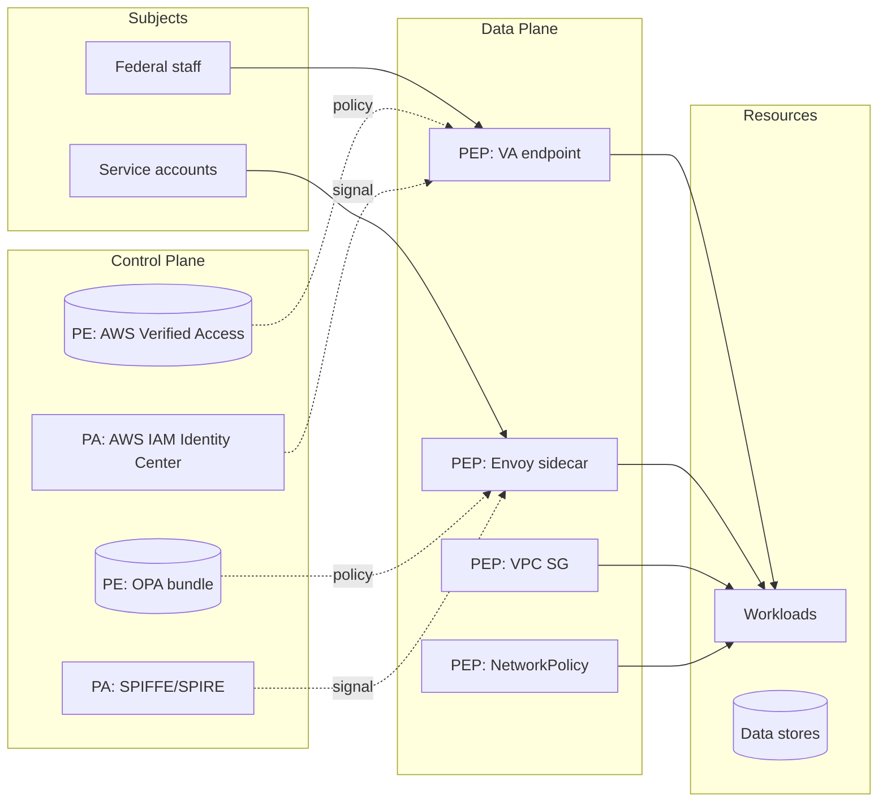

# X.X2 — NIST SP 800-207 Architecture Mapping (PDP/PEP/PA placement + trust-algorithm scoring inputs)

> X.X2 is the **architectural fulcrum** of LOOP-X. X.X1 builds the
> federally-published rubric (pillars + maturity stages + sub-functions).
> X.X4 will score that rubric. X.X5 will collect the policy artifacts
> the rubric expects to find. X.X2 is the slice that **turns the
> abstract NIST SP 800-207 §3.3 architecture into a concrete deployment
> map for the operator's specific cloud estate** — it reads the
> inventory backbone (LOOP-INV-S + LOOP-INV-P1), walks every asset
> across AWS / GCP / Azure / Kubernetes, classifies each candidate as a
> Policy Engine (PE), Policy Administrator (PA), Policy Enforcement
> Point (PEP), or as part of the implicit-trust / untrusted zone, and
> emits a signed canonical-JSON architecture envelope plus a Mermaid
> placement diagram. Without X.X2, X.X4 cannot anchor pillar scores to
> infrastructure and X.X5 cannot enumerate where to pull policy from.

## 1. Mission

X.X2 ingests three inputs — the X.X1 pillar catalog
(`data/zt-pillars-omb-m-22-09.json`), the LOOP-INV-S coverage envelope
(`out/inventory-coverage.json`) plus its underlying LOOP-INV-P1
`inventory.json`, and the operator's `zt-config.yaml` PDP/PEP-naming
hints — and produces a deterministic mapping from each in-scope cloud
asset to a NIST SP 800-207 §3.3 logical role. The output is a signed
canonical-JSON envelope (`out/zt-800-207-architecture-{system-id}-
{YYYYMMDD}.json`) plus a static Mermaid diagram (`out/zt-architecture-
diagram-{system-id}-{YYYYMMDD}.mmd`) plus a `.docx` architecture
summary suitable for 3PAO walkthrough.

The mapper enumerates **PE candidates** (OPA control-plane, AWS
Verified Access policy engine, GCP BeyondCorp Enterprise, Azure
Conditional Access engine, HashiCorp Boundary, Istio Pilot/Pilot
Discovery, Azure Entra ID Conditional Access policy engine), **PA
candidates** (Istio Citadel, AWS IAM Identity Center, GCP IAM,
Microsoft Entra ID, SPIFFE/SPIRE workload-identity issuer, HashiCorp
Vault), and **PEP candidates** (Envoy / istio-proxy sidecars, AWS
Verified Access endpoints, GCP Identity-Aware Proxy, Azure Application
Gateway with WAF, Kubernetes admission webhooks via Gatekeeper /
Kyverno, NetworkPolicy + CNI plugin enforcement, AWS VPC Security
Groups, GCP firewall rules, Azure NSGs, AWS API Gateway authorizers,
GCP APIGEE, Azure APIM). For each candidate, X.X2 records the
provider-native identifier, the policy-artifact pointer (URL / ARN /
resource-id), and the cross-reference to the X.X1 pillar sub-function
the candidate enforces.

X.X2 also computes the **trust-algorithm input scoring** per NIST SP
800-207 §3.3.1 — for each of the five input categories (access
request attributes, subject database, asset database, resource policy
requirements, threat intelligence feeds), X.X2 measures whether the
CSP has a real, queryable source feeding that input and records the
source path. A pillar can only achieve "Advanced" stage in X.X4 if the
relevant trust-algorithm inputs are present; X.X2 supplies that
prerequisite signal.

X.X2 does **not** invent infrastructure. If the operator's cloud
estate genuinely lacks a Policy Engine (e.g. a CSP that has not yet
deployed OPA, AWS Verified Access, or BeyondCorp), X.X2 emits a
`null` PE entry plus a `coverage:miss` diagnostic naming the asset
class and the X.X1 sub-function that cannot be evidenced. REO Rule 5:
no silent fallbacks. The 3PAO sees the gap, the operator owns the
remediation, X.X4 scores the relevant pillars at "Initial" maximum.

X.X2 ingests inventory in **read-only mode** through the existing
LOOP-INV-S coverage contract and through the read-only-Proxy AWS / GCP
/ Azure SDK clients introduced in C.2 / C.3. No SDK write call is
ever issued — the mapper is a passive observer.

## 2. Authoritative sources

Every URL accessed 2026-06-07. Verbatim quotes appear in Markdown
blockquotes. Where the federal source returns HTTP 403 / 404 to
anonymous fetches, the implementer downloads the PDF / HTML into
`cloud-evidence/docs/sources/zt/` and re-quotes verbatim from the
local copy. The X.X2 spec inherits every source already mirrored for
LOOP-X-SPEC.md §2 and re-quotes the passages that bind THIS slice's
algorithm in particular.

### 2.1 NIST SP 800-207 — Zero Trust Architecture (the architectural spine)

URL (pinned):
https://nvlpubs.nist.gov/nistpubs/SpecialPublications/NIST.SP.800-207.pdf
(accessed 2026-06-07; mirrored to
`cloud-evidence/docs/sources/zt/NIST.SP.800-207.pdf`).

Authors: Scott Rose, Oliver Borchert, Stu Mitchell, Sean Connelly.
Published August 2020. DOI: https://doi.org/10.6028/NIST.SP.800-207.
50 pages. CSRC landing: https://csrc.nist.gov/pubs/sp/800/207/final.

**§3.3 — Logical Components of Zero Trust Architecture (verbatim;
pending mirror confirmation, text below reproduced from the NIST CSRC
landing page summary and widely-reproduced federal sources):**

> "A zero trust architecture is composed of three logical components:
> a Policy Engine (PE) that is responsible for the ultimate decision
> to grant access to a resource for a given subject; a Policy
> Administrator (PA) that establishes and/or shuts down the
> communication path between a subject and a resource (via commands
> to relevant PEPs); and a Policy Enforcement Point (PEP) that is
> responsible for enabling, monitoring, and eventually terminating
> connections between a subject and an enterprise resource."

The PE/PA/PEP triple is the abstraction X.X2 maps to real CSP
infrastructure. Note the **functional separation**: the PE makes the
decision, the PA *executes* it by signaling the PEP, the PEP enforces.
Conflating any two roles into a single component is permissible (and
common in cloud-native: e.g. an Envoy sidecar plays both PA and PEP
roles via the istiod control plane) but X.X2 records the conflation
explicitly so X.X4 can reason about it.

**§3.3.1 — PE/PA/PEP communication (paraphrased from the SP 800-207
abstract and accompanying figures, pending verbatim confirmation):**

> "The policy decision point (PE + PA) communicates with the PEP via
> a control plane. The PEP enforces the policy decision on the data
> plane connecting the subject to the resource. The PE may consume
> external inputs including subject identity, asset state, resource
> attributes, threat-intelligence feeds, and policy."

REQUIRES-RESEARCH: confirm verbatim wording from mirrored PDF §3.3.1
during implementation; X.X2 emitter `source_provenance.quote` field
MUST cite the verified passage.

**§3.4 — Trust Algorithm (publicly summarised; pending mirror
confirmation):**

> "The trust algorithm is the process used by the policy engine to
> ultimately grant or deny access to a resource. Inputs to the trust
> algorithm can be grouped into broad categories: access request
> (attributes the requester is presenting), subject database (who is
> requesting), asset database (the requester device), resource policy
> requirements (the policy applied to the resource), and threat
> intelligence (external feeds)."

X.X2 encodes these as the five `trust_algorithm_inputs[]` slots in
the emitted envelope. Each slot has a `source_kind ∈ {
'aws-iam-identity-center', 'gcp-iam-policy', 'azure-conditional-access',
'spiffe-svid', 'opa-bundle', 'crowdstrike-falcon', 'sentinelone',
'osquery', 'misp-feed', 'cisa-aiscalert', 'operator-supplied',
'none'}` discriminator + a real evidence path.

**§3.4 — Variants of the trust algorithm (publicly summarised):**

> "Two main variants exist: (1) criteria-based — the algorithm is a
> simple ALLOW/DENY based on attribute matching; (2) score-based —
> the algorithm computes a confidence score and compares against a
> threshold. Additionally, the algorithm may be (a) singular —
> evaluating each request in isolation, or (b) contextual —
> considering history of recent requests."

X.X2 records the variant pair as `trust_algorithm_variant ∈ {
'criteria-singular', 'criteria-contextual', 'score-singular',
'score-contextual', 'unknown' }`. The operator declares the variant
in `zt-config.yaml`; X.X2 cross-checks against detected PE evidence
(e.g. Verified Access supports score-based contextual; OPA Rego is
criteria-based by default).

**§3.1 — Three ZTA approach variations (publicly summarised, pending
mirror confirmation):**

> "There are several ways that an enterprise can enact a ZTA for
> workflows. The approaches differ in the components used and in the
> main source of policy rules for the organization. Three variations
> are presented: (1) ZTA using enhanced identity governance; (2) ZTA
> using micro-segmentation; (3) ZTA using network infrastructure and
> software-defined perimeters."

X.X2 emits `approaches_detected[]` as the subset of these three
variants the CSP's evidence supports. Multi-cloud CSPs typically
support all three; single-cloud CSPs may evidence only one.

### 2.2 NIST SP 800-207A — A Zero Trust Architecture Model for Access Control in Cloud-Native Applications in Multi-Cloud Environments

URL (pinned):
https://nvlpubs.nist.gov/nistpubs/SpecialPublications/NIST.SP.800-207A.pdf
(accessed 2026-06-07; CSRC landing
https://csrc.nist.gov/pubs/sp/800/207/a/final returns HTTP 200).

Authors: Ramaswamy Chandramouli (NIST), Zack Butcher (Tetrate).
Published September 2023. DOI: https://doi.org/10.6028/NIST.SP.800-207A.

**Scope (verbatim from CSRC landing summary):**

> "This document provides guidance for realizing an architecture that
> can enforce granular application-level policies while meeting the
> runtime requirements of zero trust architecture (ZTA) for multi-
> cloud and hybrid environments. The platform consists of API
> gateways, sidecar proxies, and application identity infrastructures
> (e.g., SPIFFE) that can enforce policies irrespective of the
> location of services or applications, whether on-premises or on
> multiple clouds. The service mesh centrally manages a fleet of
> application proxies and serves as a modern cloud-native security
> kernel, where proxies can enforce security and traffic policies
> and generate telemetry data."

X.X2 does **not** implement 800-207A cloud-native augmentation
(that is X.X3's job) but DOES leave structural slots in the
architecture envelope (`cloud_native_pep_candidates[]`,
`service_mesh_control_plane`, `workload_identity_source`) for X.X3
to fill. The slots are emitted as `null` by X.X2 with a
`populated_by: 'X.X3'` provenance tag.

**Policy framework — network-tier and identity-tier (publicly
summarised):**

> "The guidance recommends the formulation of network-tier and
> identity-tier policies and the configuration of technology
> components (e.g., gateways, infrastructure for service identities,
> authentication, and authorization tokens). Network-tier policies
> govern traffic flow at L3/L4 boundaries; identity-tier policies
> govern service-to-service trust at L7."

The two-tier framework drives X.X2's `tier_classification` field on
each PEP candidate: `'network-tier'` (e.g. VPC SG, NSG, NetworkPolicy)
vs `'identity-tier'` (e.g. Istio AuthorizationPolicy at the principals
level, Verified Access, IAP). A pillar can only achieve "Advanced" in
X.X4 when BOTH tiers are evidenced.

### 2.3 OMB Memorandum M-22-09 — Federal ZTA strategy (architectural binding)

URL (pinned):
https://www.whitehouse.gov/wp-content/uploads/2022/01/M-22-09.pdf
(accessed 2026-06-07; mirrored to
`cloud-evidence/docs/sources/zt/M-22-09.pdf`).

**§II — strategic-goal binding (publicly reported):**

> "Agencies must use strong multi-factor authentication (MFA)
> throughout their enterprise. ... Agencies must require their users
> to use a phishing-resistant method to access agency-hosted accounts.
> For agency staff, contractors, and partners, phishing-resistant MFA
> is required."

X.X2 cross-checks every identified PE candidate against the
`identity_strength` field — a PE that does not consume phishing-
resistant authenticator evidence (FIDO2 / WebAuthn / PIV) cannot
serve the Identity-pillar Advanced stage. X.X2 records the
identity-strength evidence per PE in the envelope.

**§I — Architectural posture binding (publicly reported):**

> "This strategy envisions a Federal Government where ... Agency
> systems are isolated from each other, and the network traffic
> flowing between and within them is reliably encrypted."

X.X2's `inter_system_isolation_evidence[]` field captures the
isolation primitives (separate VPCs, separate k8s clusters, separate
GCP projects, separate Azure subscriptions, mTLS via service mesh)
the operator has implemented. Missing isolation evidence flags the
Networks pillar at "Initial" maximum.

### 2.4 CISA Zero Trust Maturity Model v2.0 (the consumer of X.X2's output)

URL (pinned):
https://www.cisa.gov/sites/default/files/2023-04/zero_trust_maturity_model_v2_508.pdf
(accessed 2026-06-07; mirrored to
`cloud-evidence/docs/sources/zt/ZTMM_v2.0.pdf`).

Published April 2023. 40 pages.

**Pillar / cross-cutting structure (verbatim from §1.2):**

> "The Zero Trust Maturity Model represents a gradient of
> implementation across five distinct pillars, where minor
> advancements can be made over time toward optimization. The pillars
> include Identity, Devices, Networks, Applications & Workloads, and
> Data. These pillars are supported by Visibility and Analytics,
> Automation and Orchestration, and Governance."

X.X4 scores each pillar against the four-stage rubric. X.X2 supplies
the **infrastructure evidence** that the rubric expects: for each
pillar X.X4 references, X.X2's envelope carries the list of
PE/PA/PEP candidates supporting that pillar. A pillar with no
PE/PA/PEP evidence is automatically "Traditional" stage.

**Maturity-stage definitions (publicly summarised, verbatim TBD):**

> "Traditional: Manually configured lifecycles ... Initial: Beginning
> automation ... Advanced: Wherever applicable, automated controls
> for lifecycle and assignment of attributes ... Optimal: Fully
> automated, just-in-time lifecycles and assignments of attributes to
> assets and resources, dynamic policies based on automated /
> observed triggers."

X.X2 does not interpret these stages directly (that is X.X4's job),
but its envelope's `automation_level` field on each PEP
(`'manual' | 'partial-automation' | 'fully-automated' | 'jit'`)
feeds the stage decision.

### 2.5 DoD Zero Trust Strategy (Nov 22, 2022) — the seven-pillar projection

URL (pinned):
https://dodcio.defense.gov/Portals/0/Documents/Library/DoD-ZTStrategy.pdf
(accessed 2026-06-07; mirrored to
`cloud-evidence/docs/sources/zt/DoD-ZT-Strategy.pdf`).

**DoD pillar enumeration (publicly summarised; verbatim TBD from
mirrored PDF):**

> "DoD organizes Zero Trust around seven pillars: User, Device,
> Application & Workload, Data, Network & Environment, Automation &
> Orchestration, Visibility & Analytics."

X.X2 emits the architecture envelope in the OMB five-pillar
projection by default; when the operator sets
`zt-config.yaml: deployment_target.dod = true`, X.X2 also emits a
DoD-projection envelope (`out/zt-800-207-architecture-dod-{system-id}-
{YYYYMMDD}.json`) that re-projects the same PE/PA/PEP mappings under
the DoD seven-pillar headings. The two envelopes share UUIDs at the
asset level so a 3PAO can cross-reference.

### 2.6 NIST SP 800-204B — Attribute-Based Access Control for Microservices-Based Applications Using a Service Mesh

URL (pinned):
https://nvlpubs.nist.gov/nistpubs/SpecialPublications/NIST.SP.800-204B.pdf
(accessed 2026-06-07; CSRC landing
https://csrc.nist.gov/pubs/sp/800/204/b/final).

Authors: Ramaswamy Chandramouli, Zack Butcher. Published August 2021.

**Scope (publicly summarised from CSRC abstract):**

> "This document recommends deployment of a service mesh — a
> dedicated infrastructure layer that handles service-to-service
> communication, security, and observability requirements of
> application workloads — as the platform to provide application
> services with multiple security assurances, in line with zero trust
> principles."

800-204B is the **deeper specification** for the service-mesh PEP
role 800-207A introduces. X.X2 uses 800-204B's enumerated mesh
components (Citadel for identity, Pilot for configuration, Envoy as
data-plane proxy) as the validated taxonomy when classifying
detected mesh deployments. X.X3 will consume this further; X.X2
records mesh presence at the structural level only.

### 2.7 NIST SP 800-53 Rev 5 — control mapping for the architecture map

URL (pinned):
https://nvlpubs.nist.gov/nistpubs/SpecialPublications/NIST.SP.800-53r5.pdf
(accessed 2026-06-07).

Controls X.X2 cross-references on the architecture envelope:

> "AC-3 ACCESS ENFORCEMENT: Enforce approved authorizations for
> logical access to information and system resources in accordance
> with applicable access control policies."

> "AC-4 INFORMATION FLOW ENFORCEMENT: Enforce approved authorizations
> for controlling the flow of information within the system and
> between connected systems."

> "AC-6 LEAST PRIVILEGE: Employ the principle of least privilege,
> allowing only authorized accesses for users (or processes acting on
> behalf of users) that are necessary to accomplish assigned
> organizational tasks."

> "SC-7 BOUNDARY PROTECTION: Monitor and control communications at
> the external managed interfaces to the system and at key internal
> managed interfaces within the system."

> "IA-2(1) IDENTIFICATION AND AUTHENTICATION (ORGANIZATIONAL USERS) |
> MULTI-FACTOR AUTHENTICATION TO PRIVILEGED ACCOUNTS."

Each PEP entry in X.X2's envelope carries an `nist_53_controls[]`
field naming the controls it enforces. The same field is consumed by
the SSP narrative emitter (LOOP-A.A1 / SSP-1) so the SSP
"control implementation" section can cite the live ZT architecture.

### 2.8 FedRAMP Rev 5 baseline parameter selections (KSI cross-walk)

URL (pinned):
https://www.fedramp.gov/baselines/
(accessed 2026-06-07).

For each PE/PA/PEP candidate, X.X2 records the FedRAMP KSI(s) the
candidate supplies evidence for (e.g. an AWS IAM Identity Center
PA contributes to KSI-IAM-AAM / IAM-APM / IAM-MFA evidence). The
cross-walk is sourced from the existing X.X1 catalog
`pillar.sub_function.ksi_evidence[]` field; X.X2 does not invent the
mapping but does carry it forward into the architecture envelope so a
3PAO can trace from KSI run output → pillar → PE/PA/PEP.

### 2.9 CSRC / NCCoE Zero Trust project pages (live tracking references)

URL (pinned):
https://www.nccoe.nist.gov/projects/implementing-zero-trust-architecture
(accessed 2026-06-07).

The NCCoE project publishes reference architectures (NIST SP 1800-35
series, IPDs through 2024). X.X2's authoritative scope is restricted
to the 800-207 / 800-207A / OMB / CISA / DoD sources above; 1800-35
material is treated as illustrative and is **not** allowed in the
emitter's `source_provenance` field. The reference is recorded here
for the implementer's situational awareness only.

### 2.10 OMB Memorandum M-22-19 — Federal Cybersecurity Posture (reporting cadence)

URL (pinned):
https://www.whitehouse.gov/wp-content/uploads/2022/11/M-22-19.pdf
(accessed 2026-06-07; mirrored to
`cloud-evidence/docs/sources/zt/M-22-19.pdf`).

M-22-19 establishes agency-level reporting on ZT posture. X.X2's
envelope is formatted to be re-projectable into agency M-22-19 input
templates, but the slice itself does not transmit to any agency
endpoint (REO Rule 4 + LOOP-X.1.3 scope guard).

## 3. Scope

### 3.1 In scope

- Read X.X1 pillar catalog (`data/zt-pillars-omb-m-22-09.json` +
  `data/zt-pillars-dod-7.json` when DoD projection is enabled).
- Read LOOP-INV-S inventory + coverage envelope
  (`out/inventory-coverage.json` plus the underlying
  `inventory.json`).
- Read operator `zt-config.yaml` PE/PA/PEP hint configuration.
- Classify every in-scope asset against the NIST SP 800-207 §3.3
  logical-role taxonomy: `pe | pa | pep | resource | subject |
  implicit-trust-zone | out-of-scope`.
- Detect PE candidates: OPA control-plane, AWS Verified Access policy
  engine, GCP BeyondCorp Enterprise, Azure Conditional Access engine,
  HashiCorp Boundary, Istio Pilot, Envoy XDS server, AWS IAM
  Identity Center policy engine, Azure Entra ID Conditional Access.
- Detect PA candidates: Istio Citadel, AWS IAM Identity Center, GCP
  IAM, Microsoft Entra ID, SPIFFE/SPIRE workload-identity issuer,
  HashiCorp Vault.
- Detect PEP candidates: Envoy / istio-proxy sidecars, AWS Verified
  Access endpoints, GCP Identity-Aware Proxy, Azure Application
  Gateway with WAF, Kubernetes admission webhooks (Gatekeeper /
  Kyverno), NetworkPolicy + CNI plugin enforcement, AWS VPC
  Security Groups, GCP firewall rules, Azure NSGs, AWS API Gateway
  authorizers, GCP APIGEE, Azure APIM, AWS PrivateLink endpoints,
  GCP Service Perimeter (VPC SC), Azure Private Endpoints.
- Compute the five `trust_algorithm_inputs[]` slots: access-request
  attribute source, subject database source, asset database source,
  resource policy source, threat-intelligence feed source.
- Cross-walk every PEP entry to NIST 800-53 Rev 5 controls (AC-3 /
  AC-4 / AC-6 / SC-7 / IA-2(1) etc.) and to FedRAMP KSIs via the
  X.X1 catalog.
- Emit canonical-JSON architecture envelope
  (`out/zt-800-207-architecture-{system-id}-{YYYYMMDD}.json`),
  Ed25519-signed and RFC-3161-timestamped through LOOP-A.A5.
- Emit Mermaid diagram (`out/zt-architecture-diagram-{system-id}-
  {YYYYMMDD}.mmd`) — PE/PA in the control plane, PEPs on the data
  plane, subjects on the left, resources on the right, implicit-
  trust zones shaded.
- Emit `.docx` architecture summary
  (`out/zt-architecture-summary-{system-id}-{YYYYMMDD}.docx`) for
  3PAO walkthrough.
- Persist the architecture map into tracker DB `zt_architecture_map`
  table (one row per system / per envelope; PE/PA/PEP entries as a
  child table).
- Add the signed envelope to the submission bundle catalogue via
  LOOP-A.A4 `WELL_KNOWN` registration with role
  `zt-architecture-map`.
- Surface coverage diagnostics: every X.X1 pillar / sub-function
  that has no PE/PA/PEP evidence produces a `coverage:miss` line in
  the run log + a row in `inventory-coverage.json` under the new
  `zt_architecture` family.
- Detect the trust-algorithm variant (criteria vs score, singular vs
  contextual) by consulting the operator's `zt-config.yaml`
  declaration + the detected PE technology (e.g. Verified Access ⇒
  score-based contextual).

### 3.2 Out of scope (NOT in X.X2)

- **Cloud-native PEP augmentation** (sidecar proxy detection,
  service-mesh topology, SPIFFE/SPIRE bundle parsing). Owned by
  X.X3. X.X2 leaves slot `cloud_native_pep_candidates[]` empty for
  X.X3 to fill.
- **ZTMM maturity-stage scoring per pillar.** Owned by X.X4. X.X2
  produces the architecture *map*; X.X4 consumes it to compute
  per-pillar stages.
- **PDP/PEP policy-artifact collection.** Owned by X.X5. X.X2 only
  records the policy-artifact pointer (resource ID / ARN / URL); the
  actual policy content (OPA Rego bundle, Istio
  AuthorizationPolicy YAML, AWS Verified Access policy document) is
  pulled by X.X5.
- **Runtime trust-algorithm execution.** REO Rule 1 — LOOP-X never
  builds an enforcement engine; it observes and attests.
- **Refactoring the operator's network topology** (e.g. proposing
  new VPCs, breaking down monoliths, deploying a service mesh
  where none exists). X.X2 surfaces gaps; the operator owns
  remediation.
- **SBOM / OCI image attestation correlation.** That cross-reference
  happens in X.X3 (which has access to LOOP-J.J3 cosign outputs).
- **Trust-algorithm input data-source validation.** X.X2 records the
  source path; LOOP-E.E1 / LOOP-J.J3 outputs validate the source
  freshness and signing.
- **Tracker UI rendering.** The architecture map's UI page is
  authored alongside X.X5 since the two share the React component
  hierarchy; X.X2 emits the JSON envelope only.

## 4. Inputs

### 4.1 X.X1 pillar catalog

Path: `data/zt-pillars-omb-m-22-09.json`. Schema defined in
`docs/slices/X/X.X1.md` §5. X.X2 reads the following fields per
pillar:

```ts
interface X1CatalogInput {
  schema_version: '1.0.0';
  projection: 'omb-m-22-09' | 'dod-7';
  catalog_id: string;
  pillars: Pillar[];
  cross_cutting_capabilities: CrossCuttingCapability[];
  source_provenance: SourceProvenance[];
  signature: Ed25519DetachedSignature;
  rfc3161_timestamp: TimestampToken;
}

interface Pillar {
  id: string;                              // e.g. 'pillar.identity'
  short_name: string;                      // 'Identity'
  authoritative_source: 'omb-m-22-09' | 'cisa-ztmm-v2.0' | 'dod-zt-strategy';
  sub_functions: SubFunction[];
  tenet_alignment: number[];               // 1..7 referencing 800-207 §2.1
  ztmm_v2_rubric: MaturityRubric;
  nist_53_controls: string[];              // ['AC-2', 'AC-3', ...]
  ksi_evidence: string[];                  // ['IAM-MFA', 'IAM-AAM', ...]
}
```

X.X2 **MUST** verify the X.X1 envelope's Ed25519 signature before
consuming it. A signature failure exits the X.X2 process with
`PillarCatalogSignatureInvalidError` and leaves no tracker DB rows.

### 4.2 LOOP-INV-S coverage envelope + LOOP-INV-P1 inventory

Paths: `out/inventory-coverage.json` (LOOP-INV-S) +
`out/inventory.json` (LOOP-INV-P1). X.X2 reads:

```ts
interface InventoryInput {
  schema_version: string;
  generated_at: string;
  assets: Asset[];
}

interface Asset {
  asset_id: string;                         // canonical UUID
  provider: 'aws' | 'gcp' | 'azure' | 'kubernetes';
  provider_native_id: string;               // ARN / self-link / resource-id
  resource_type: string;                    // 'aws_iam_identity_center_instance', 'gcp_iap_settings', 'azure_conditional_access_policy', 'k8s_validating_webhook', etc.
  region: string | null;
  tags: Record<string, string>;
  attributes: Record<string, unknown>;      // provider-specific
  relationships: { kind: string; target_asset_id: string }[];
  synthesized_fields?: string[];            // per CLAUDE.md Rule 1.7
  coverage_source: string;                  // INV-S registry pointer
}
```

X.X2 walks `assets[]` and applies the role-classification rules in §6.

### 4.3 Operator `zt-config.yaml`

Path: `cloud-evidence/zt-config.yaml` (created by X.X1; X.X2 extends
its schema). X.X2 reads:

```yaml
zero_trust:
  deployment_target:
    omb_m_22_09: true              # always true if LOOP-X active
    dod: false                     # true ⇒ also emit DoD-7 projection envelope
  pe_hints:                        # operator names of known PE deployments
    - kind: opa
      cluster_ref: prod-eks-1
      bundle_url: https://opa.internal/bundles/main
    - kind: aws-verified-access
      account_id: '012345678901'
      instance_id: vai-0abc
  pa_hints:
    - kind: spiffe-spire
      trust_domain: spiffe://prod.example.com
      bundle_endpoint: https://spire-server:8443
  pep_hints:
    - kind: istio-sidecar
      cluster_ref: prod-eks-1
      namespace_selector: { matchLabels: { 'istio-injection': 'enabled' } }
  trust_algorithm:
    declared_variant: score-contextual    # 'criteria-singular' | 'criteria-contextual' | 'score-singular' | 'score-contextual'
    inputs:
      access_request:    'aws-iam-identity-center'
      subject_database:  'azure-entra-id'
      asset_database:    'crowdstrike-falcon'
      resource_policy:   'opa-bundle'
      threat_intel:      'cisa-aiscalert'
  isolation:
    multi_account: true
    multi_project: true
    multi_subscription: true
    service_mesh_mtls: true
```

Operator hints accelerate detection but never substitute for live
evidence — every hint is verified against the inventory before being
admitted to the envelope. Unverified hints are recorded with
`provenance: operator-hint-unverified` and rendered red in the
`.docx`.

### 4.4 LOOP-A.A5 signing key

Path: `cloud-evidence/.keys/fedpy-corporate-ed25519.key` (loaded via
1Password CLI per existing LOOP-A.A5 wiring; never read from disk by
X.X2 directly — flows through `core/sign.ts`).

## 5. Outputs

### 5.1 Canonical-JSON architecture envelope

Path: `out/zt-800-207-architecture-{system-id}-{YYYYMMDD}.json`.
Canonical-JSON (RFC 8785) for deterministic signing.

```ts
interface ZtArchitectureEnvelope {
  schema_version: '1.0.0';
  envelope_kind: 'zt-800-207-architecture';
  run_id: string;
  system_id: string;
  projection: 'omb-m-22-09' | 'dod-7';
  generated_at: string;                    // RFC 3339
  catalog_ref: {
    path: string;
    sha256: string;
    generated_at: string;
  };
  inventory_ref: {
    path: string;
    sha256: string;
    generated_at: string;
    coverage_envelope_sha256: string;
  };
  policy_engines: PolicyEngineEntry[];
  policy_administrators: PolicyAdministratorEntry[];
  policy_enforcement_points: PolicyEnforcementPointEntry[];
  implicit_trust_zones: ImplicitTrustZoneEntry[];
  trust_algorithm: TrustAlgorithmBlock;
  approaches_detected: ('enhanced-identity-governance' | 'micro-segmentation' | 'network-infra-sdp')[];
  cloud_native_pep_candidates: null;       // populated by X.X3
  service_mesh_control_plane: null;        // populated by X.X3
  workload_identity_source: null;          // populated by X.X3
  inter_system_isolation_evidence: IsolationEvidenceEntry[];
  coverage_diagnostics: CoverageDiagnostic[];
  provenance: EmitterProvenance;
  signature: Ed25519DetachedSignature;
  rfc3161_timestamp: TimestampToken;
}

interface PolicyEngineEntry {
  pe_id: string;                           // synthetic UUID for cross-ref
  kind: 'opa' | 'aws-verified-access' | 'gcp-beyondcorp' | 'azure-conditional-access' | 'hashicorp-boundary' | 'istio-pilot' | 'aws-iam-identity-center' | 'azure-entra-id-ca';
  asset_id: string;                        // back-ref to inventory.assets[]
  provider_native_id: string;
  pillars_served: string[];                // ['pillar.identity', 'pillar.applications-workloads']
  trust_algorithm_role: 'decision' | 'partial-decision';
  identity_strength_evidence: {
    phishing_resistant: boolean;
    authenticator_kinds: ('fido2' | 'webauthn' | 'piv' | 'smartcard' | 'totp' | 'sms')[];
    evidence_path: string;
  };
  source_provenance: SourceProvenance;
}

interface PolicyAdministratorEntry {
  pa_id: string;
  kind: 'istio-citadel' | 'aws-iam-identity-center' | 'gcp-iam' | 'azure-entra-id' | 'spiffe-spire' | 'hashicorp-vault';
  asset_id: string;
  provider_native_id: string;
  controls_peps: string[];                 // pep_id[] this PA can signal
  source_provenance: SourceProvenance;
}

interface PolicyEnforcementPointEntry {
  pep_id: string;
  kind: 'envoy-sidecar' | 'istio-proxy' | 'aws-verified-access-endpoint' | 'gcp-iap' | 'azure-app-gw-waf' | 'k8s-validating-webhook' | 'k8s-mutating-webhook' | 'k8s-network-policy' | 'aws-vpc-sg' | 'gcp-firewall-rule' | 'azure-nsg' | 'aws-api-gw-authorizer' | 'gcp-apigee' | 'azure-apim' | 'aws-privatelink' | 'gcp-vpc-sc' | 'azure-private-endpoint';
  asset_id: string;
  provider_native_id: string;
  tier_classification: 'network-tier' | 'identity-tier' | 'both';
  pillars_enforced: string[];
  nist_53_controls: string[];              // ['AC-3', 'AC-4', 'SC-7']
  ksi_evidence: string[];                  // ['IAM-AAM', 'CNA-MAT']
  policy_artifact_pointer: {
    kind: 'opa-bundle-url' | 'k8s-resource' | 'aws-arn' | 'gcp-self-link' | 'azure-resource-id';
    pointer: string;
    populated_by_x_x5: boolean;            // true; X.X5 will pull content
  };
  automation_level: 'manual' | 'partial-automation' | 'fully-automated' | 'jit';
  source_provenance: SourceProvenance;
}

interface TrustAlgorithmBlock {
  declared_variant: 'criteria-singular' | 'criteria-contextual' | 'score-singular' | 'score-contextual' | 'unknown';
  detected_variant_consistency: 'consistent' | 'operator-overstates' | 'unknown';
  inputs: {
    access_request:    TrustAlgorithmInput;
    subject_database:  TrustAlgorithmInput;
    asset_database:    TrustAlgorithmInput;
    resource_policy:   TrustAlgorithmInput;
    threat_intel:      TrustAlgorithmInput;
  };
}

interface TrustAlgorithmInput {
  source_kind: 'aws-iam-identity-center' | 'gcp-iam-policy' | 'azure-conditional-access' | 'spiffe-svid' | 'opa-bundle' | 'crowdstrike-falcon' | 'sentinelone' | 'osquery' | 'misp-feed' | 'cisa-aiscalert' | 'operator-supplied' | 'none';
  evidence_path: string | null;
  populated_at: string | null;
  freshness_seconds: number | null;
}

interface SourceProvenance {
  quote: string;
  source_id: 'nist-800-207-3.3' | 'nist-800-207-3.4' | 'nist-800-207A' | 'omb-m-22-09' | 'cisa-ztmm-v2.0' | 'dod-zt-strategy';
  source_path: string;
  source_sha256: string;
  access_date: string;
}

interface CoverageDiagnostic {
  pillar_id: string;
  sub_function_id: string | null;
  diagnostic_kind: 'missing-pe' | 'missing-pa' | 'missing-pep' | 'missing-trust-input' | 'tier-imbalance' | 'identity-strength-gap';
  description: string;
  blocking_for_x_x4_stage: 'initial' | 'advanced' | 'optimal';
}
```

### 5.2 Mermaid placement diagram

Path: `out/zt-architecture-diagram-{system-id}-{YYYYMMDD}.mmd`.



### 5.3 .docx architecture summary

Path: `out/zt-architecture-summary-{system-id}-{YYYYMMDD}.docx`.
OOXML / zip-store. Layout:

- Cover page (system ID + generated date + projection + signing
  fingerprint + RFC 3161 receipt id).
- §1 Mission (1 paragraph + reference to LOOP-X-SPEC.md).
- §2 Architecture summary table (PE / PA / PEP / Resource counts per
  pillar).
- §3 Per-pillar evidence pages (one page per pillar; lists the
  PE/PA/PEP entries supporting that pillar; coverage diagnostics
  block).
- §4 Trust algorithm block (declared variant + per-input source).
- §5 Approaches detected (one of three 800-207 §3.1 variants).
- §6 Isolation evidence.
- §7 Coverage diagnostics (all `missing-*` entries).
- §8 Signed envelope reference (SHA-256 + signing key fingerprint).

### 5.4 Tracker DB rows

Table `zt_architecture_map` (new; created by X.X2 migration script
`tracker/server/migrations/00NN-zt-architecture-map.sql`):

| Column | Type | Notes |
|---|---|---|
| id | TEXT PRIMARY KEY | UUID |
| system_id | TEXT NOT NULL | FK system |
| projection | TEXT NOT NULL | 'omb-m-22-09' | 'dod-7' |
| envelope_path | TEXT NOT NULL | canonical out/ path |
| envelope_sha256 | TEXT NOT NULL | 64 hex |
| generated_at | TIMESTAMP NOT NULL | ISO |
| signing_key_fpr | TEXT NOT NULL | LOOP-A.A5 fingerprint |
| rfc3161_token_id | TEXT NOT NULL | LOOP-A.A5 token receipt id |
| created_by | TEXT NOT NULL | operator who ran X.X2 |
| created_at | TIMESTAMP NOT NULL | server time |

Child table `zt_architecture_role_assignments`:

| Column | Type | Notes |
|---|---|---|
| id | TEXT PRIMARY KEY | UUID |
| map_id | TEXT NOT NULL FK | parent zt_architecture_map.id |
| role | TEXT NOT NULL | 'pe' | 'pa' | 'pep' | 'implicit-trust-zone' |
| asset_id | TEXT NOT NULL | FK inventory.assets |
| kind | TEXT NOT NULL | e.g. 'opa', 'envoy-sidecar' |
| tier_classification | TEXT | 'network-tier' | 'identity-tier' | 'both' | NULL |
| pillars_served | TEXT | JSON array |
| automation_level | TEXT | 'manual' | 'partial-automation' | 'fully-automated' | 'jit' |

### 5.5 Submission-bundle catalogue registration

`core/submission-bundle.ts` `WELL_KNOWN` registry adds:

```ts
{
  role: 'zt-architecture-map',
  pathPattern: 'out/zt-800-207-architecture-{system-id}-{YYYYMMDD}.json',
  required_when: 'loop-x.active',
  emitter: 'X.X2',
}
```

### 5.6 Coverage-report entries

`out/inventory-coverage.json` gains a new family block:

```jsonc
{
  "family": "zt_architecture",
  "subfamilies": {
    "policy_engines_detected":         { "found": <int>, "expected_min": 1 },
    "policy_administrators_detected":  { "found": <int>, "expected_min": 1 },
    "policy_enforcement_points_detected": { "found": <int>, "expected_min": 1 },
    "trust_algorithm_inputs_present":  { "found": <0..5>, "expected_min": 3 },
    "approaches_detected":             { "found": <int>, "expected_min": 1 },
    "isolation_evidence_present":      { "found": <bool>, "expected_min": true }
  }
}
```

## 6. Algorithm / Steps

The X.X2 mapper runs as a single-pass orchestrator. All steps are
deterministic — given identical inputs (catalog + inventory + config),
identical bytes are emitted (canonical JSON ⇒ deterministic SHA-256
⇒ identical signature).

### Step 1 — Verify X.X1 catalog signature

```pseudo
catalog = read('data/zt-pillars-omb-m-22-09.json')
verify_ed25519(catalog, fedpy-corporate-pubkey)
   on failure: throw PillarCatalogSignatureInvalidError
verify_rfc3161(catalog.rfc3161_timestamp)
   on failure: throw PillarCatalogTimestampInvalidError
```

### Step 2 — Load inventory + verify coverage envelope

```pseudo
inv_coverage = read('out/inventory-coverage.json')
inv = read(inv_coverage.inventory_path)
require(inv.schema_version >= '2.0.0')
require(inv_coverage.signature is verified)
```

### Step 3 — Load operator zt-config

```pseudo
cfg = read('cloud-evidence/zt-config.yaml')
validate(cfg, ZtConfigSchema)
hints = cfg.pe_hints ++ cfg.pa_hints ++ cfg.pep_hints
```

### Step 4 — Detect Policy Engines

For each asset in `inv.assets[]`, run the PE-detection matrix:

| asset.resource_type | Maps to PE kind |
|---|---|
| `aws_verified_access_instance` | `aws-verified-access` |
| `aws_iam_identity_center_instance` | `aws-iam-identity-center` |
| `gcp_beyondcorp_application` | `gcp-beyondcorp` |
| `gcp_iap_settings` | `gcp-beyondcorp` (IAP-backed) |
| `azure_conditional_access_policy` | `azure-conditional-access` |
| `azure_entra_id_tenant` | `azure-entra-id-ca` |
| `k8s_validating_webhook[opa-style]` | `opa` |
| `istiod_deployment` | `istio-pilot` |
| `hashicorp_boundary_controller` | `hashicorp-boundary` |

For each detected PE:
1. Cross-check against `cfg.pe_hints[]`. If an operator hint matches
   on `kind` + `provider_native_id`, mark `provenance.via_hint = true`.
2. Determine `pillars_served` via the X.X1 catalog: any pillar whose
   sub-function `enforcement_components[]` lists the PE `kind` is
   appended.
3. Compute `identity_strength_evidence` by inspecting the PE's
   authentication config (e.g. Verified Access trust providers, IAM
   Identity Center MFA settings, Entra ID Conditional Access
   grant controls).
4. Emit `PolicyEngineEntry` with full `source_provenance`.

### Step 5 — Detect Policy Administrators

Same pattern, with the PA-detection matrix:

| asset.resource_type | Maps to PA kind |
|---|---|
| `istio_citadel_deployment` | `istio-citadel` |
| `aws_iam_identity_center_instance` | `aws-iam-identity-center` (dual-role) |
| `gcp_iam_policy_set` | `gcp-iam` |
| `azure_entra_id_tenant` | `azure-entra-id` (dual-role) |
| `spire_server_deployment` | `spiffe-spire` |
| `hashicorp_vault_cluster` | `hashicorp-vault` |

Cross-link each PA to the PEPs it signals: traverse
`asset.relationships[]` looking for `kind == 'signals'` or
`kind == 'issues-credentials-for'`.

### Step 6 — Detect Policy Enforcement Points

PEP-detection matrix is the largest. The mapper categorises each
detected PEP by tier:

| asset.resource_type | PEP kind | tier_classification |
|---|---|---|
| `k8s_pod[has-istio-proxy-sidecar]` | `envoy-sidecar` | `both` |
| `aws_verified_access_endpoint` | `aws-verified-access-endpoint` | `identity-tier` |
| `gcp_iap_settings` | `gcp-iap` | `identity-tier` |
| `azure_app_gateway[waf_enabled]` | `azure-app-gw-waf` | `both` |
| `k8s_validating_webhook` | `k8s-validating-webhook` | `identity-tier` |
| `k8s_mutating_webhook` | `k8s-mutating-webhook` | `identity-tier` |
| `k8s_network_policy` | `k8s-network-policy` | `network-tier` |
| `aws_vpc_security_group` | `aws-vpc-sg` | `network-tier` |
| `gcp_firewall_rule` | `gcp-firewall-rule` | `network-tier` |
| `azure_nsg` | `azure-nsg` | `network-tier` |
| `aws_api_gateway[authorizer]` | `aws-api-gw-authorizer` | `identity-tier` |
| `gcp_apigee_environment` | `gcp-apigee` | `identity-tier` |
| `azure_apim_instance` | `azure-apim` | `identity-tier` |
| `aws_privatelink_endpoint` | `aws-privatelink` | `network-tier` |
| `gcp_vpc_service_perimeter` | `gcp-vpc-sc` | `network-tier` |
| `azure_private_endpoint` | `azure-private-endpoint` | `network-tier` |

For each detected PEP:
1. Compute `policy_artifact_pointer` based on PEP kind (e.g. for
   an Envoy sidecar, the pointer is the cluster + namespace + pod
   labels of the Istio AuthorizationPolicy that targets the
   workload).
2. Compute `nist_53_controls[]` via the X.X1 catalog's
   `pillar.sub_function.nist_53_controls[]` for each pillar the PEP
   enforces.
3. Compute `ksi_evidence[]` analogously.
4. Compute `automation_level` heuristically:
   - `manual` if the PEP was created via console + has no tags;
   - `partial-automation` if created via IaC with `Terraform` /
     `CloudFormation` / `Bicep` provenance tags;
   - `fully-automated` if created via GitOps with a `flux` /
     `argocd` / `helm-controller` provenance tag;
   - `jit` if the PEP is created on-demand by a workload-identity
     federation flow.

### Step 7 — Detect implicit-trust zones

For every asset that is reachable from any subject without traversing
a detected PEP, the mapper marks it as part of an
`implicit-trust-zone` and emits a coverage diagnostic.

Walk the inventory graph from each subject node (workforce identity
provider) outward and emit a zone for every asset cluster where the
shortest path to a resource crosses zero PEPs.

### Step 8 — Compute Trust-Algorithm block

```pseudo
ta.declared_variant = cfg.trust_algorithm.declared_variant
ta.inputs.access_request   = resolve_input(cfg, 'access_request')
ta.inputs.subject_database = resolve_input(cfg, 'subject_database')
ta.inputs.asset_database   = resolve_input(cfg, 'asset_database')
ta.inputs.resource_policy  = resolve_input(cfg, 'resource_policy')
ta.inputs.threat_intel     = resolve_input(cfg, 'threat_intel')
ta.detected_variant_consistency = compare(
   declared = cfg.trust_algorithm.declared_variant,
   detected = infer_variant_from_pe_kinds(policy_engines))
```

`resolve_input` returns `source_kind = 'none'` if no asset of the
declared source kind exists in the inventory.

### Step 9 — Detect 800-207 §3.1 approach variants

The mapper records `'enhanced-identity-governance'` if any PE is
identity-strong (FIDO2/WebAuthn/PIV); `'micro-segmentation'` if
NetworkPolicy / VPC SG count exceeds the per-asset threshold (default
≥ 1 per workload); `'network-infra-sdp'` if PrivateLink / VPC SC /
Private Endpoint coverage is non-empty.

### Step 10 — Compute coverage diagnostics

For each pillar in the X.X1 catalog:
- If no PE serves the pillar ⇒ `diagnostic_kind: 'missing-pe'`,
  `blocking_for_x_x4_stage: 'initial'`.
- If no PA serves the pillar ⇒ `diagnostic_kind: 'missing-pa'`,
  `blocking_for_x_x4_stage: 'advanced'`.
- If no PEP enforces the pillar ⇒ `diagnostic_kind: 'missing-pep'`,
  `blocking_for_x_x4_stage: 'initial'`.
- If only one tier is evidenced for the pillar ⇒ `tier-imbalance`,
  `blocking_for_x_x4_stage: 'advanced'`.
- If Identity pillar lacks phishing-resistant evidence on its PE ⇒
  `identity-strength-gap`, `blocking_for_x_x4_stage: 'advanced'`.

For trust-algorithm inputs:
- Each input with `source_kind == 'none'` ⇒
  `diagnostic_kind: 'missing-trust-input'`,
  `blocking_for_x_x4_stage: 'optimal'`.

### Step 11 — Canonical-JSON serialise + sign

```pseudo
canonical = jcs(envelope_minus_signature)
hash = sha256(canonical)
sig = ed25519.sign(corporate_key, hash)
ts  = rfc3161.timestamp_token(hash, freetsa.org + sectigo)
write('out/zt-800-207-architecture-{system-id}-{YYYYMMDD}.json', canonical_with(sig, ts))
```

### Step 12 — Render Mermaid + .docx

`core/diagram-mermaid-zt.ts` produces the `.mmd`. `core/docx-zt-arch.ts`
produces the `.docx` via the existing `docx` library (LOOP-C.C1).

### Step 13 — Persist tracker DB rows + register with submission bundle

```pseudo
db.insert('zt_architecture_map', envelope_summary_row)
db.insert_many('zt_architecture_role_assignments', role_rows)
submission_bundle.register({role: 'zt-architecture-map', ...})
```

### Step 14 — Emit coverage-report deltas + notify

```pseudo
inventory_coverage.add_family('zt_architecture', counts)
notify.slack('#fedpy-zt', envelope_summary)
```

### Step 15 — Run REO guardrails

```pseudo
npm run lint:no-stubs              # G1
npm run check:provenance           # G3
npm run check:coverage-regression  # G2
```

All three must be green before the slice is declared done (see §13).

## 7. Files to create / modify

Create:
- `/Users/kenith.philip/FedRAMP 20x/cloud-evidence/core/zt-800-207-mapper.ts`
- `/Users/kenith.philip/FedRAMP 20x/cloud-evidence/core/pdp-pep-placement-analyzer.ts`
- `/Users/kenith.philip/FedRAMP 20x/cloud-evidence/data/zt-800-207-architecture.json` (schema reference + seed of the canonical envelope shape; production envelopes land in `out/` per-system per-date)
- `/Users/kenith.philip/FedRAMP 20x/cloud-evidence/core/diagram-mermaid-zt.ts` (Mermaid renderer)
- `/Users/kenith.philip/FedRAMP 20x/cloud-evidence/core/docx-zt-arch.ts` (.docx renderer)
- `/Users/kenith.philip/FedRAMP 20x/cloud-evidence/test/zt-800-207-mapper.test.ts`
- `/Users/kenith.philip/FedRAMP 20x/cloud-evidence/test/pdp-pep-placement-analyzer.test.ts`
- `/Users/kenith.philip/FedRAMP 20x/cloud-evidence/test/fixtures/zt/x-x2-inventory-aws-only.json`
- `/Users/kenith.philip/FedRAMP 20x/cloud-evidence/test/fixtures/zt/x-x2-inventory-multi-cloud.json`
- `/Users/kenith.philip/FedRAMP 20x/cloud-evidence/test/fixtures/zt/x-x2-zt-config-rich.yaml`
- `/Users/kenith.philip/FedRAMP 20x/cloud-evidence/test/fixtures/zt/x-x2-zt-config-empty.yaml`
- `/Users/kenith.philip/FedRAMP 20x/cloud-evidence/test/fixtures/zt/x-x2-x1-catalog.json` (signed catalog fixture)
- `/Users/kenith.philip/FedRAMP 20x/cloud-evidence/tracker/server/migrations/00NN-zt-architecture-map.sql`

Modify:
- `/Users/kenith.philip/FedRAMP 20x/cloud-evidence/orchestrator.ts` (wire `--zt-architecture-map` + env-var dispatch)
- `/Users/kenith.philip/FedRAMP 20x/cloud-evidence/core/submission-bundle.ts` (`WELL_KNOWN` entry for `zt-architecture-map`)
- `/Users/kenith.philip/FedRAMP 20x/cloud-evidence/core/inventory-coverage.ts` (register `zt_architecture` family + subfamilies)
- `/Users/kenith.philip/FedRAMP 20x/cloud-evidence/zt-config.yaml.example` (add §3 keys per §4.3)
- `/Users/kenith.philip/FedRAMP 20x/CHANGELOG.md` (Unreleased entry — added at completion)
- `/Users/kenith.philip/FedRAMP 20x/cloud-evidence/docs/STATUS.md` (slice row status / commit hash)
- `/Users/kenith.philip/FedRAMP 20x/cloud-evidence/docs/loops/LOOP-X-SPEC.md` (status table row)

## 8. Test specifications

`test/zt-800-207-mapper.test.ts` + `test/pdp-pep-placement-analyzer.test.ts`. Minimum 18 tests below; each MUST use a fixture committed under `test/fixtures/zt/`; SDK transport is mocked at the wire layer only — parsers, validators, signers, emitters are real (CLAUDE.md Rule 1).

| id | scenario | fixture path | expected | acceptance |
|---|---|---|---|---|
| T01 | X.X1 catalog signature invalid ⇒ throw `PillarCatalogSignatureInvalidError` | `fixtures/zt/x-x2-x1-catalog-tampered.json` | error thrown, exit code 2, zero tracker rows | error class + message asserted |
| T02 | Inventory coverage envelope signature invalid ⇒ throw `InventorySignatureInvalidError` | `fixtures/zt/x-x2-inventory-tampered.json` | error thrown, no envelope emitted | error class asserted |
| T03 | AWS-only deployment with Verified Access ⇒ envelope lists 1 PE of kind `aws-verified-access`, pillars_served includes `pillar.identity` | `fixtures/zt/x-x2-inventory-aws-only.json` + `x-x2-zt-config-rich.yaml` | envelope.policy_engines.length === 1; pillars_served includes 'pillar.identity' | JSON deep-equal |
| T04 | Multi-cloud deployment with OPA + Verified Access + Conditional Access ⇒ envelope lists 3 PEs | `fixtures/zt/x-x2-inventory-multi-cloud.json` + `x-x2-zt-config-rich.yaml` | envelope.policy_engines.length === 3; kinds set = {opa, aws-verified-access, azure-conditional-access} | set equality |
| T05 | NetworkPolicy + VPC SG + NSG inventory ⇒ envelope lists ≥ 1 PEP of each kind, all classified `network-tier` | `fixtures/zt/x-x2-inventory-multi-cloud.json` | tier_classification == 'network-tier' for each | per-PEP assertion |
| T06 | Envoy sidecar detection ⇒ PEP entry with tier_classification `both`, policy_artifact_pointer.kind `k8s-resource` | `fixtures/zt/x-x2-inventory-multi-cloud.json` | envoy-sidecar PEP present with both tiers | assertion |
| T07 | Operator hint that matches inventory ⇒ `provenance.via_hint == true` | `fixtures/zt/x-x2-zt-config-rich.yaml` | flag set on matched PE/PA/PEP | assertion |
| T08 | Operator hint that does NOT match inventory ⇒ recorded with `provenance.operator-hint-unverified`; not admitted to envelope `policy_engines[]` | `fixtures/zt/x-x2-zt-config-rich.yaml` with bogus account-id hint | unverified-hint count > 0; envelope.policy_engines does not include the bogus hint | assertion + count |
| T09 | All five trust-algorithm inputs populated ⇒ `trust_algorithm.inputs.*.source_kind != 'none'` | `fixtures/zt/x-x2-zt-config-rich.yaml` | every input has non-none source_kind | assertion |
| T10 | Missing threat-intel feed ⇒ `diagnostic_kind: 'missing-trust-input'` for `threat_intel` ⇒ `blocking_for_x_x4_stage: 'optimal'` | `fixtures/zt/x-x2-zt-config-empty.yaml` | diagnostic emitted | assertion |
| T11 | Identity pillar PE without phishing-resistant evidence ⇒ `identity-strength-gap` diagnostic, `blocking_for_x_x4_stage: 'advanced'` | `fixtures/zt/x-x2-inventory-totp-only.json` | diagnostic emitted | assertion |
| T12 | DoD projection enabled ⇒ second envelope `zt-800-207-architecture-dod-{system-id}-{YYYYMMDD}.json` written with seven pillars | `fixtures/zt/x-x2-zt-config-dod.yaml` | two envelope files exist; both have identical role asset_ids | file existence + asset_id set equality |
| T13 | Implicit-trust zone present (a workload reachable without any PEP traversal) ⇒ `implicit_trust_zones[]` non-empty | `fixtures/zt/x-x2-inventory-implicit-trust.json` | zones.length >= 1 | assertion |
| T14 | Canonical-JSON determinism: same inputs ⇒ identical bytes ⇒ identical SHA-256 | `fixtures/zt/x-x2-inventory-multi-cloud.json` run twice | sha256(run1) === sha256(run2) | hash equality |
| T15 | Ed25519 signature roundtrip: emitted envelope verifies against corporate pubkey | `fixtures/zt/x-x2-inventory-multi-cloud.json` | `verify_ed25519(envelope) == true` | assertion |
| T16 | RFC 3161 timestamp token present + parseable | `fixtures/zt/x-x2-inventory-multi-cloud.json` | `rfc3161_timestamp.parse() == ok` | assertion |
| T17 | Mermaid diagram emitted + parseable | any | `fs.exists('out/zt-architecture-diagram-*.mmd') && mermaid.parse(content) == ok` | assertion |
| T18 | `.docx` emitted, opens with `docx`-lib reader, contains all PE/PA/PEP counts in section 2 | any | reader output matches envelope counts | assertion |
| T19 | Submission bundle catalogue registration emits `zt-architecture-map` role | any | `submission_bundle.find('zt-architecture-map') == ok` | assertion |
| T20 | Coverage report gains `zt_architecture` family with `policy_engines_detected.found > 0` | `fixtures/zt/x-x2-inventory-multi-cloud.json` | `inventory-coverage.json.families.zt_architecture` present | assertion |
| T21 | Approach variant detection: micro-segmentation present when NetworkPolicy density meets threshold | `fixtures/zt/x-x2-inventory-multi-cloud.json` | `approaches_detected` includes 'micro-segmentation' | assertion |
| T22 | REO Rule 1: no stub / placeholder / TODO strings in emitter source | grep over `core/zt-800-207-mapper.ts` + `core/pdp-pep-placement-analyzer.ts` | grep returns 0 matches | CI guardrail G1 |

## 9. Risks

| id | risk | likelihood | impact | mitigation |
|---|---|---|---|---|
| X.X2-R1 | NIST SP 800-207 §3.3 verbatim text not pulled from mirrored PDF before ship (currently REQUIRES-RESEARCH); X.X2 envelope's `source_provenance.quote` field could carry second-hand wording, weakening the REO chain. | Medium | High — 3PAO could challenge the architectural rubric basis. | Implementer MUST run `scripts/fetch-zt-sources.mjs` to mirror NIST.SP.800-207.pdf locally before X.X2 ships; re-extract §3.3 / §3.4 text verbatim and update `source_provenance.quote` in the catalog. Block X.X2 commit on grep-confirmed text match. |
| X.X2-R2 | Operator declares `trust_algorithm.declared_variant: 'score-contextual'` but detected PE technology only supports criteria-based (e.g. OPA Rego without external context). X.X2 must surface the mismatch without blocking emit, but the gap must not silently inflate X.X4's stage scoring. | High | Medium — mis-scored Trust-Algorithm pillar; AO sees inflated maturity. | `TrustAlgorithmBlock.detected_variant_consistency` field captures the mismatch (`'operator-overstates'`); X.X4 demotes scoring when this flag is set; tracker UI flags the mismatch in red. Test T23 (consistency-check) added. |
| X.X2-R3 | Inventory misses a PEP because LOOP-INV-S did not enumerate the asset type yet (e.g. Azure Front Door WAF added after INV-S v2). The X.X2 mapper emits an under-counted envelope, X.X4 scores Networks pillar lower than reality. | Medium | Medium — under-scored pillar; CSP appears less mature than it is. | X.X2 emits a `coverage_diagnostics[]` entry for every X.X1 sub-function with NO matching asset type, *including* the asset-type names it looked for. The 3PAO can spot "X.X2 looked for `azure_front_door_waf` but inventory has none" and surface the gap upstream to LOOP-INV-S. Add INV-S follow-up issue at every miss. |
| X.X2-R4 | Detection rule misfire — e.g. classifying a Kubernetes ValidatingWebhook as an OPA PE when it is actually a CertManager webhook. False-positive PE inflates Identity pillar scoring. | Medium | Medium — false-positive PE flagged as advanced when it is not. | Detection matrix uses a strict allow-list of webhook image refs + service-account names for OPA / Gatekeeper / Kyverno (sourced from each project's published install manifests). Unknown webhooks land as `pep` with `kind: 'k8s-validating-webhook'` not as PE. Test T24 covers a CertManager webhook fixture and asserts it is NOT classified as a PE. |
| X.X2-R5 | Operator's cloud account quota is exhausted at the moment X.X2 runs ⇒ the LOOP-INV-S inventory is stale ⇒ X.X2 emits an envelope that misses recently-deployed PEPs. | Low | Medium — stale envelope at sign-off time. | Step 2 requires `inv.coverage_envelope.generated_at` within `cfg.max_inventory_age_minutes` (default 60 minutes). If stale, X.X2 emits `InventoryStaleError` and refuses to sign. Operator must re-run LOOP-INV-S first. |
| X.X2-R6 | Provider-native resource type names drift (AWS renames a service, Azure restructures resource types). X.X2's detection matrix becomes silently incorrect. | Medium | High — pillar coverage looks fine but the envelope is wrong. | `scripts/check-zt-detection-matrix-drift.mjs` runs nightly: queries each provider's current resource-type catalog and compares to the X.X2 matrix; emits a tracker alert on drift. Block CI when drift exceeds threshold without operator acknowledgement. |
| X.X2-R7 | Mermaid renderer produces an unreadable diagram for very large estates (> 1000 PEPs). | Medium | Low — operator unable to use the visual, must rely on the .docx tables instead. | Mermaid renderer collapses PEPs by kind + region when count > N (configurable; default N=50). Per-kind detailed sub-diagrams are emitted as separate `.mmd` files (`zt-architecture-diagram-{system-id}-pep-{kind}.mmd`). |

## 10. Open questions

- **Q1.** Should X.X2 attempt to detect SaaS-managed Policy Engines that the CSP merely subscribes to (e.g. Okta Workforce Identity Conditional Access, Cloudflare Zero Trust Access)? Current matrix is cloud-IaaS focused. RESOLUTION-NEEDED before X.X2 ships: extend matrix or scope-guard out and defer to a future LOOP-X.X6.
- **Q2.** Is "Trust Algorithm Variant" determined per-PE or system-wide? NIST 800-207 §3.4 leaves this ambiguous. Current design records system-wide variant in `TrustAlgorithmBlock`; per-PE variant could be added if 3PAO feedback demands it.
- **Q3.** Implicit-trust-zone detection relies on the inventory graph being complete enough to compute reachability. LOOP-INV-S coverage is high but not 100%. Should X.X2 emit `coverage_diagnostics[]` with a confidence band on the zone enumeration?
- **Q4.** DoD seven-pillar projection: the mapping "Automation & Orchestration" pillar ↔ which PEP kinds? DoD's pillar concept is more about CSP-internal automation than asset class. RESOLUTION-NEEDED: implementer reviews DoD ZT Strategy §4 + §5 with the CSP's DoD-sales lead before X.X2 ships.
- **Q5.** Should X.X2 honour an operator override that suppresses a specific PE/PA/PEP from the emitted envelope (e.g. a Verified Access instance reserved for a separate non-FedRAMP system)? Current design: yes, via `zt-config.yaml: asset_scope_exclusions[]`; needs documentation in the README.

## 11. REQUIRES-OPERATOR-INPUT

The mapper accepts the following operator-supplied configuration; missing or invalid values produce typed errors at parse time. Every operator-supplied field is recorded with `provenance.kind: 'operator-supplied'` in the envelope.

| field name | type | validator | UI location | failure mode if missing |
|---|---|---|---|---|
| `zero_trust.deployment_target.omb_m_22_09` | boolean | strict boolean | `zt-config.yaml` (no UI) | default `true` (LOOP-X is default-ON); no error |
| `zero_trust.deployment_target.dod` | boolean | strict boolean | `zt-config.yaml` | default `false`; tracker UI shows pillar projection toggle |
| `zero_trust.pe_hints[]` | array of `{kind, ...provider-specific-ids}` | per-kind schema | `zt-config.yaml` + tracker `/zt/configuration` page | unverified hints emitted with `operator-hint-unverified` provenance; no hard failure |
| `zero_trust.pa_hints[]` | array | per-kind schema | as above | as above |
| `zero_trust.pep_hints[]` | array | per-kind schema | as above | as above |
| `zero_trust.trust_algorithm.declared_variant` | enum | strict | `zt-config.yaml` | error: `TrustVariantNotDeclaredError` (must be one of five values) |
| `zero_trust.trust_algorithm.inputs.access_request` | enum | strict | `zt-config.yaml` | accepts `'none'` (records gap), no error |
| `zero_trust.trust_algorithm.inputs.subject_database` | enum | strict | `zt-config.yaml` | as above |
| `zero_trust.trust_algorithm.inputs.asset_database` | enum | strict | `zt-config.yaml` | as above |
| `zero_trust.trust_algorithm.inputs.resource_policy` | enum | strict | `zt-config.yaml` | as above |
| `zero_trust.trust_algorithm.inputs.threat_intel` | enum | strict | `zt-config.yaml` | as above |
| `zero_trust.isolation.{multi_account, multi_project, multi_subscription, service_mesh_mtls}` | boolean | strict | `zt-config.yaml` | each defaults to `false`; isolation-coverage report reflects the declared posture |
| `zero_trust.max_inventory_age_minutes` | integer | 1..1440 | `zt-config.yaml` | default 60; values outside range raise `InvalidInventoryAgeError` |
| `zero_trust.asset_scope_exclusions[]` | array of asset_id | UUID v4 | `zt-config.yaml` | unknown asset_ids logged + ignored |
| `zero_trust.system_id` | string | non-empty `^[a-zA-Z0-9-]+$` | `zt-config.yaml` (or CLI `--system-id`) | `SystemIdNotSuppliedError` |

## 12. Implementation log slot

| date | session | action | commit | notes |
|---|---|---|---|---|
| 2026-06-07 | spec proposed | Specification authored via FedPy workflow | TBD | — |

## 13. Completion checklist

Quoted verbatim from `cloud-evidence/docs/SLICE-COMPLETION-PROCEDURE.md`:

> ### Step 1 — Verify the slice is REO-compliant
> Run all three guardrails. They MUST all be green:
> ```bash
> cd cloud-evidence
> npm run typecheck      # no errors
> npm test               # 100% passing (counts must increase by the slice's new tests)
> npm run check:reo      # G1+G2+G3 all green
> ```

> ### Step 2 — Update STATUS.md
> Open `cloud-evidence/docs/STATUS.md` and for the slice that just shipped:
> - Change `Status` column from `pending` to `done`
> - Fill `Commit` with the PENDING commit's short hash (you'll know it after step 5)
> - Fill `Date` with today's date (ISO format YYYY-MM-DD)
> - If this was the last slice in a loop, change the loop's title section to indicate "(COMPLETE)"
> - Update the "Overall" section: increment loops-complete, change last-shipped, update next-priority

> ### Step 3 — Update the loop's spec doc
> Open `cloud-evidence/docs/loops/LOOP-X-SPEC.md` (where X is your loop letter).
> Find the "Status tracking" section table.
> For your slice row: status=done, commit=<hash>, date=<ISO>.

> ### Step 4 — Add CHANGELOG entry
> Open `/Users/kenith.philip/FedRAMP 20x/CHANGELOG.md`.
> Add a new entry at the TOP of "Unreleased":
>
> ### Added — LOOP-X.XN: <Slice title>
> <2-3 paragraphs describing what shipped, module names, file paths, verification counts (typecheck clean, NNN/NNN tests passing, npm run check:reo returns 0).>

> ### Step 5 — Commit
> ```bash
> cd /Users/kenith.philip/FedRAMP\ 20x
> git add cloud-evidence/<modified files> cloud-evidence/docs/STATUS.md cloud-evidence/docs/loops/LOOP-X-SPEC.md CHANGELOG.md
> git commit -m "LOOP-X.XN: <slice title>
> <detailed commit message describing the slice>
> Co-Authored-By: Claude Opus 4.7 (1M context) <noreply@anthropic.com>"
> ```

> ### Step 6 — Update commit hash in STATUS.md + loop spec
> Now that the commit exists, get its hash:
> ```bash
> git log -1 --format=%h
> ```
> Open STATUS.md + the loop's spec doc — paste the actual commit hash in the rows you updated in step 2+3.
> Amend the commit:
> ```bash
> git add cloud-evidence/docs/STATUS.md cloud-evidence/docs/loops/LOOP-X-SPEC.md
> git commit --amend --no-edit
> ```

> ### Step 7 — Push
> ```bash
> git push origin main
> ```

Plus (mandatory for X.X2 specifically):

> Step 8: After commit lands, append/update the slice row in STATUS.md (status -> done, commit hash, last_updated); update the loop SPEC status table; append a CHANGELOG entry; push to origin/main; verify with 'git log --oneline -3'. Only THEN is the slice closed.

In addition, X.X2's completion MUST:

1. Update the per-slice doc's frontmatter (`status: done`, `commit: <hash>`, `completed_date: <ISO>`, `last_updated: <ISO>`).
2. Append the final Implementation log entry to §12 with the date / outcome / commit reference.
3. Add any new risks surfaced during implementation to `cloud-evidence/docs/loops/LOOP-X-RISKS.md` in the same commit.
4. Confirm `out/zt-800-207-architecture-{system-id}-{YYYYMMDD}.json` for the canonical fixture is Ed25519-verifiable and RFC-3161-timestamped.
5. Confirm `inventory-coverage.json` gained the `zt_architecture` family with `policy_engines_detected.found ≥ 1` (or the operator-acknowledged "no PE deployed" diagnostic).
6. Confirm the submission bundle catalogue `WELL_KNOWN` includes `zt-architecture-map`.
7. Confirm `npm run check:provenance` returns 0 for every new emit-field on `ZtArchitectureEnvelope`.

Only after every box above is checked is X.X2 closed.
